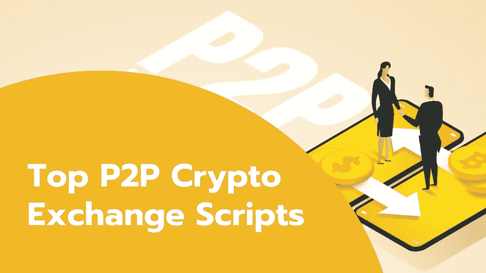

# 顶级 P2P 加密货币交易脚本，适合您的加密交易业务

> 原文：<https://medium.com/geekculture/top-p2p-cryptocurrency-exchange-scripts-for-your-crypto-exchange-business-dd866e7fb1d7?source=collection_archive---------9----------------------->

## 顶级 p2p 比特币交易所脚本，在短短 10 天内启动您的 P2P 加密交易所！

Check out the best P2P Crypto Exchange Scripts

“比特币”和“加密货币”这些术语对这一代人来说并不陌生。它们以高度不稳定的特性而闻名。是的，加密货币的价格经常波动。你知道吗，在许多地方，加密货币被接受作为支付手段，而不是法定货币。随着加密货币成为金融领域的一部分，人们开始购买加密货币。为了购买这些加密货币，交易者更喜欢点对点的加密货币交易所。因为 p2p 加密支付是以分散的方式发生的，没有任何第三方的干预。

无论如何，必须有一个中间人来验证交易成功完成，以避免任何骗局。点对点加密货币交易所完成这项工作，许多加密交易商依赖 p2p 加密货币交易所进行交易。它以集中的 CEX 和分散的 DEX 两种方式出现。与其他密码交易所相比，它们更受全球密码交易商的青睐。

点对点加密货币交易所有一些显著的特征，它们是

*   不收取额外费用
*   基于 P2P 的支付
*   高效
*   高度私密
*   没有第三方干预

由于 p2p 加密交易受到许多加密交易者的青睐，p2p 加密货币交易所的用户和交易者迅速增加。因此，许多企业家都对启动一个新的 p2p 加密货币交易平台感兴趣。通过使用预先开发的 p2p 加密货币交易所脚本，企业家可以启动 p2p 加密交易所。

许多企业家对开始 p2p 加密交换业务感兴趣，如果你是他们中的一员并且不知道 p2p 加密交换脚本，你可以参考这篇文章来了解 p2p 加密交换开发的全部内容。

# **P2p 加密交换脚本，是什么？**

P2p 加密交换脚本是一个预先开发的软件，具有 p2p 加密交换中存在的所有功能。它充满了通常出现在基于 p2p 的加密交换中的特征。您可以使用这个功能丰富的交换脚本来启动 p2p 加密交换。不限于提供交易功能，它还包括所有的安全功能，抵御任何黑客和骗子的攻击。嗯，简单地说，p2p 加密交换是一个宝藏，充满了许多隐藏的好处。

P2p 加密交换脚本是最受欢迎的脚本之一，因为它们已经过预先开发、设计、测试和部署。通过定制这个 p2p 加密交换脚本，您可以实现实现您的业务需求所需的任何新的交易功能或模块。这就是为什么许多人对获得他们的 p2p 加密交换脚本感兴趣的原因。

让我们看看加密市场中一些最畅销的 p2p 加密货币交换脚本。

# 热门 P2P 加密交换脚本

给你，一份帮助你开始 p2p 比特币交易所业务的畅销 p2p 加密交易所克隆脚本列表。

*   币安 P2p 克隆脚本
*   本地比特币克隆脚本
*   雷米塔诺克隆脚本
*   Paxful 克隆脚本
*   Wazirx 克隆脚本

这些都是顶级的 p2p 加密交换脚本。是什么让它们独一无二？让我们简单了解一下。

# **币安 p2p 克隆脚本**

币安交易所是一家受欢迎的 p2p 加密货币交易所，拥有 9000 万注册用户和大约 2100 万活跃用户。它的交易量约为 760 亿美元。你知道币安交易所的交易费吗？很低，0.1%。是的，它是。币安的商业模式独树一帜，并在稳步增长。

你可以用一个 [**币安克隆脚本**](https://coinsqueens.com/binance-clone-script?utm_source=binance-top-p2p&utm_medium=medium&utm_campaign=kartz) 启动一个像币安一样的密码交易所。币安克隆脚本具有币安 p2p 加密交换的所有功能和安全选项。您还可以定制币安 p2p 克隆脚本，以实现任何新功能和高级选项。币安克隆脚本中的多级安全选项可以保护您的加密交换免受黑客攻击。

# **本地比特币克隆脚本**

Localbitcoins exchange 是一个众所周知的 p2p 加密交换平台。它允许交易者交易比特币和其他加密货币。由于其基于 ads 的加密交易特征，它是一种加密货币交易所。它的工作原理是卖家和买家通过买/卖广告相互交流。

有一个争议管理系统来解决交易者的冲突，它由本地比特币交易所的管理员管理。要启动类似 Localbitcoins 的加密交易，您可以使用预先开发的 [**Localbitcoins 克隆脚本**](https://coinsqueens.com/localbitcoins-clone-script?utm_source=localbitcoins-top-p2p&utm_medium=medium&utm_campaign=kartz) 。你可以在短短 15 天内建立一个基于托管的交易平台。Localbitcoins 克隆脚本包含了 localbitcoins 的所有特性和安全选项。最棒的是它有基于广告的交易功能，比如本地比特币。

# **雷米塔诺克隆脚本**

在没有任何第三方干预的情况下，加密交易员可以通过基于托管的流程在 remitano 加密交易所交易加密货币。比特币和 altcoins 被锁定，直到卖家确认付款。凭借平台中包含的各种安全功能，Remitano 仍然是加密领域中重要的加密货币交易所之一。密码交易员更喜欢这种加密货币交易所来买卖各种类型的虚拟货币。

你可以使用一个预先开发、预先设计、预先存储的 [**Remitano 克隆脚本**](https://coinsqueens.com/remitano-clone-script?utm_source=remitano-top-p2p&utm_medium=medium&utm_campaign=kartz) 来启动一个类似 Remitano 的新 p2p 加密交易所。它几乎拥有 Remitano 的所有交易功能和安全选项。通过定制克隆脚本，您的类似 remitano 的加密交换就可以部署了。

# **Paxful 克隆人脚本**

Paxful 是一个流行的点对点加密货币交易平台，以其高效的加密交易流程而闻名。凭借其极具吸引力的商业模式，它拥有超过 900 万活跃的加密交易用户。用户可以在 paxful 中毫无困难地在世界任何地方交易加密货币。它还以多种支付方式而闻名。是的，他们提供 300 多种付款方式。是不是很神奇？

密码创业者可以使用预先开发的 [**Paxful 克隆脚本**](https://coinsqueens.com/paxful-clone-script?utm_source=paxful-top-p2p&utm_medium=medium&utm_campaign=kartz) 以经济高效的方式发起基于 p2p 托管的密码交换。Paxful 克隆脚本具有与 paxful 相似的特性和安全选项。它包括一个托管钱包，一般数据保护条例 GDPR 投诉选项，和 24x7 现场支持系统，以提高用户体验的 paxful-like-crypto 交换。

# **WazirX 克隆脚本**

对于文化丰富的印度，一个基于订单簿的加密货币交易所，WazirX 对加密行业产生了影响。Wazirx 交易所是全球著名的加密货币交易所之一，市场上有超过 1000 万活跃的加密交易商。它提供各种各样的加密交易，如菲亚特到密码，反之亦然。类似 wazirX 的加密交易商业模式有巨大的用户基础。

您可以使用现成的 [**WazirX 克隆脚本**](https://coinsqueens.com/wazirx-clone-script?utm_source=wazirx-top-p2p&utm_medium=medium&utm_campaign=kartz) 启动类似 WazirX 的加密交换。它包含了 WazirX 的基本功能，如果你愿意，你可以添加或删除任何功能。Wazirx 克隆脚本已经过全面测试，没有任何错误。如果你愿意，你也可以添加任何集成。

这些是你可以选择的顶级 p2p 加密货币交换脚本。现在你会有一个问题，你在哪里可以得到这些克隆脚本？

# **从哪里获取功能丰富的 p2p 加密货币兑换脚本？**

市场上有各种各样的加密交换克隆脚本提供商，但说到最好的加密货币交换脚本提供商，是 Coinsqueens。

## 你可能会问，为什么要用硬币？

Coinsqueens 是市场上著名的 p2p 加密货币交换脚本提供商之一。他们已经在市场上呆了几年，在提供市场上最好的 p2p 加密交换脚本方面表现出色。他们以功能丰富的脚本而闻名。他们提供各种各样的比特币交易脚本，其中包含高端功能和安全选项。

你可以依靠他们的 p2p 加密交换脚本，并开始着手启动你的 p2p 加密交换业务。他们的克隆脚本高效、安全、100%可定制，并且完全没有 bug。通过使用这个 p2p 加密交换脚本，您可以毫无困难地启动您的 p2p 加密交换脚本。

在开始使用它们之前，您可以在这里免费获得 [**p2p 加密货币兑换脚本**](https://coinsqueens.com/?utm_source=top-p2p&utm_medium=medium&utm_campaign=kartz) 的演示。