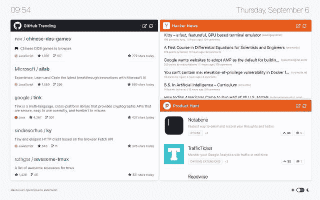
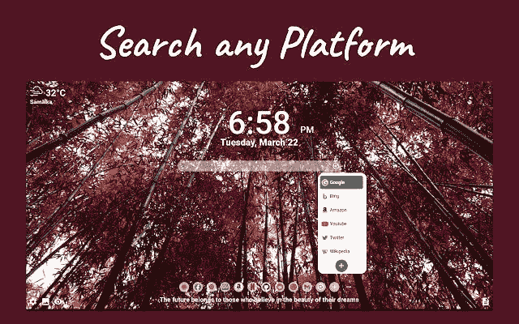
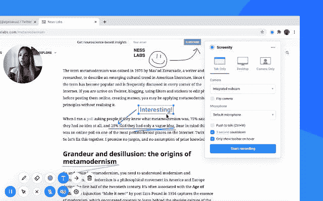

# 我每天使用的顶级生产力 chrome 扩展

> 原文：<https://medium.com/geekculture/top-productivity-chrome-extensions-i-use-every-day-b7ebbe6aac98?source=collection_archive---------20----------------------->

作为一名开发人员，我用来提高工作效率的三大工具

嗯，作为一名程序员或任何专业人士，你只是没有完成你的任务或完成你的工作。

你必须考虑许多其他因素，比如效率、速度、维护以及你自己和你的工作的可管理性。

我们每个人都想提高自己的生产率，作为一名开发人员，我非常想提高生产率。

以下是我在日常生活中每天使用的一些生产力工具。

# 1.铬 devo

Devo 是一个 chrome 扩展，可以在每个新标签上显示 GitHub 趋势、黑客新闻、产品搜索和许多不同平台的首页，不需要登录。

你可以改变卡片的位置，以不同的顺序显示你想要的任何平台。

这有助于我找到新的 GitHub 项目、产品搜索上的新产品和黑客新闻。我喜欢这个扩展，尤其是它的黑暗主题。

链接:[https://chrome . Google . com/web store/detail/devo/elkhalpmbmbaeoemecpcfdcoekmpgmdm？hl=en](https://chrome.google.com/webstore/detail/devo/elkhalpmbmbaeoemecpcfdcoekmpgmdm?hl=en)

# 2.米瓦纳

Meavana 是最可定制的个人仪表板。
Mevlana 通过美丽的日常背景视觉、简化的数字桌面基础和深入持久的功能，提供丰富而简化的体验。

它有助于为眼睛提供舒适的浏览体验，以及许多功能，如每日新闻，谷歌，亚马逊，必应等的不同搜索栏，待办事项功能，笔记，酷书签，秒表，天气等。

对我来说，这是我能得到的最好的浏览器扩展，所以检查一下，并确保尝试一下。

链接:[https://chrome . Google . com/web store/detail/me avana-customize-your-ne/kgbcoelgfffkmkpfnldemdinmcpjlaa](https://chrome.google.com/webstore/detail/meavana-customize-your-ne/kgbcoelgfffkmkpfnldemdinmcbpjlaa)

# 3.放映性

Screenity 帮助你记录和注释你的屏幕。

为工作、教育等制作更好的录音，为您的学生提供上下文反馈、详细解释，或者只是向潜在客户展示您的产品。

它允许你下载不同格式录音，包括 mp4。

已经用了就行，链接:[https://chrome . Google . com/web store/detail/screenity-screen-recorder/kbbdabhdfibnancpjfhlkhafgdilcnji？hl=en](https://chrome.google.com/webstore/detail/screenity-screen-recorder/kbbdabhdfibnancpjfhlkhafgdilcnji?hl=en)

