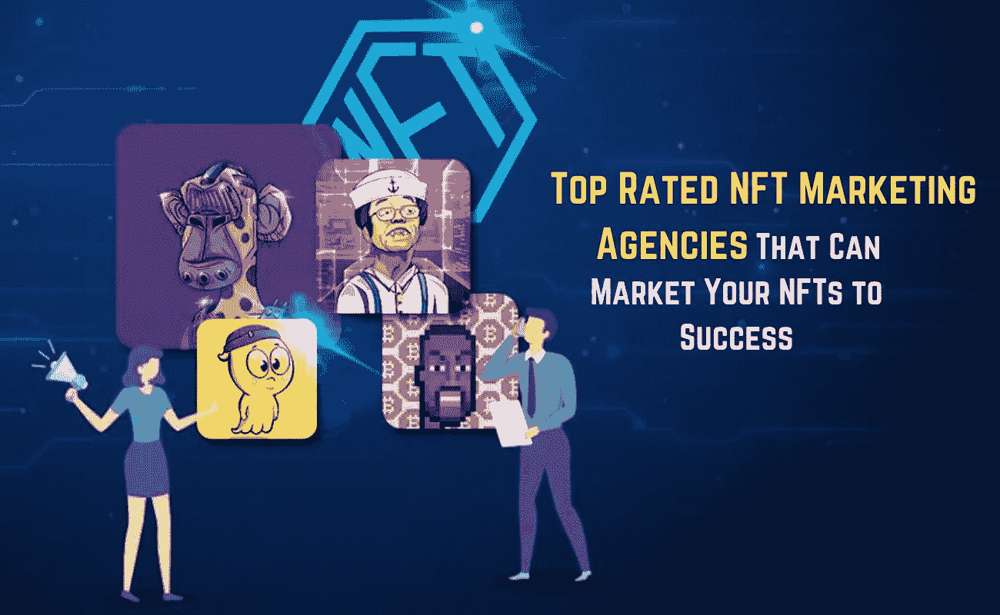
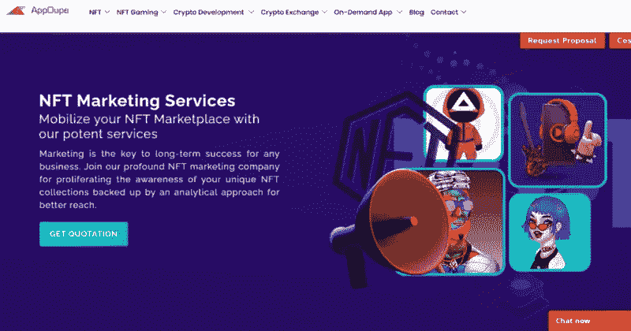
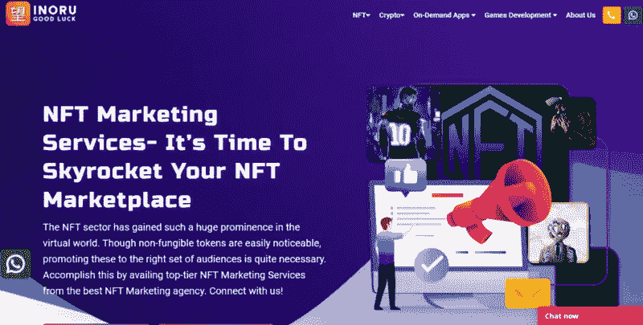
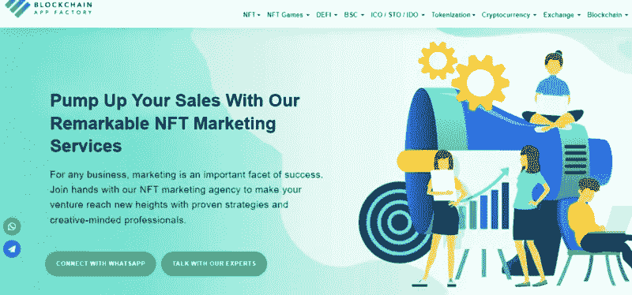
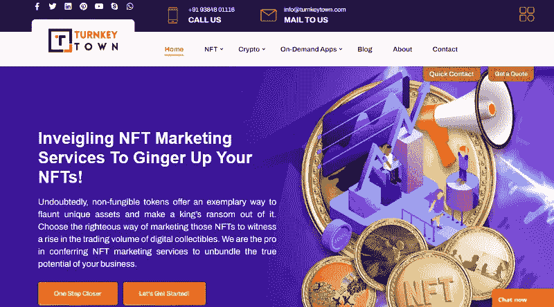
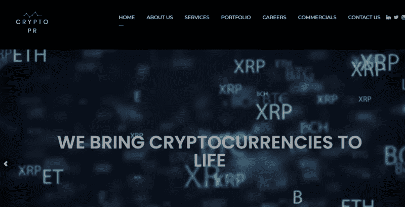
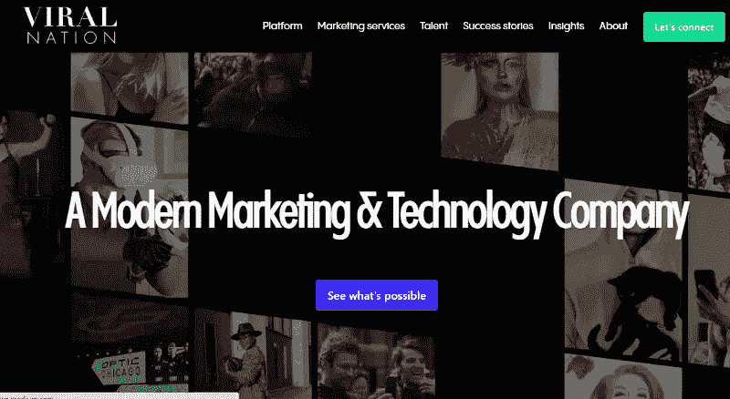
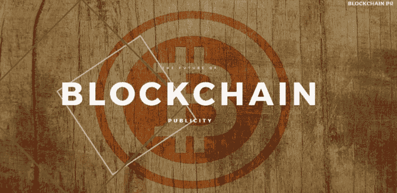

# 七大 NFT 营销机构可以成功营销你的非专利技术

> 原文：<https://medium.com/geekculture/top-rated-nft-marketing-agencies-that-can-market-your-nfts-to-success-f9014ce37320?source=collection_archive---------17----------------------->

拥有 NFT 系列，许多艺术家努力从 NFT 爱好者那里获得他们应得的关注。他们中的许多人都在努力通过社交媒体和其他常规方式传播消息。随着越来越多的人开始意识到 NFT 并进入这一新的有利可图的技术，艺术家们将越来越难以合理的价格出售他们的数字艺术 NFT。

这就是营销的用武之地，因为它对 NFT 的销售有重大影响，并有助于增加价值。如果你是一个努力让你的 NFT 收藏品成为焦点的艺术家，这里有一个你应该留意的顶级 NFT 收藏品营销机构的列表。

# 为什么选择 NFT 营销机构？

当谈到营销 NFT 系列时，传统的数字营销可能不会在接触大量观众方面产生预期的效果。因为对许多潜在投资者来说，非功能性交易仍然是一个新概念，所以这种方法有局限性。当你进入区块链和加密货币社区时，它可能会更好地工作。

在开始营销活动之前，更好地了解目标受众是很重要的。像动荡的加密市场一样，NFT 买家也有自己的兴趣，这些兴趣会随着时间的推移而变化。重要的是要看到几个因素，而营销他们。当你接手一家传统的营销机构时，他们试图在不了解目标市场行为的情况下捕捉更大的视角。

这就是为什么艺术家们现在会考虑选择一家对区块链、其趋势和 NFT 市场行为有着特别理解的 NFT 收藏品营销机构。他们提供各种定制的策略，这将导致在蓬勃发展的 NFT 系列中获得关注。这可能包括通过加密影响者、Telegram 和 Discord 社区以及社交媒体(尤其是 Twitter)进行有针对性的营销。

你知道吗？选择一家专业的 NFT 营销机构可以给你带来压倒性的结果，即使 NFT 的整体销售额很低。有很多经过验证的案例支持这种说法。他们都是由该领域最好的营销机构带来的。其中一些供你考虑。

# 您可以信赖的 7 大 NFT 营销机构

## 1. [Appdupe](https://www.appdupe.com/nft-collections-marketing)

Appdupe 是一家屡获殊荣的加密和 NFT 营销机构，为 NFT 收藏品提供完美的营销服务。它根据项目提供定制的营销策略，将给出明确的结果。凭借在区块链领域的多年经验，他们拥有一支专业的营销团队，是营销方面的专家，迄今为止已经为几个 NFT 项目带来了成功。他们提供进行基本目标市场研究的服务，并帮助您通过有针对性的营销方法有效地进入市场。他们提供的各种营销策略包括影响者营销、社交媒体营销、内容营销、公关、不和谐营销等等。他们将帮助你建立自己的社区，并帮助你管理它，以带出你的 NFT 收藏最好的。

## 2. [Inoru](https://www.inoru.com/)

Inoru 是区块链的一家营销代理公司，提供营销服务。他们提供各种营销服务，从 IDO 营销，ICO 营销，NFT 营销等。他们擅长为你的 NFT 收藏品建立一个社区，并开展有针对性的营销活动。他们还提供各种策略，包括电子邮件营销、内容营销、不和谐营销、社交媒体营销等等。他们还会对性能进行仔细的分析，并相应地改进策略，从而为您的非功能性测试带来最佳效果。

## 3.[区块链 App 工厂](https://www.blockchainappfactory.com/)

区块链应用工厂是一家领先的区块链开发商，每年都成功推出许多区块链平台和项目。他们也是 NFT 代币开发商，帮助艺术家和设计师推出他们自己的 NFT 收藏品。因为他们从开发开始，他们也从营销结束，慢慢地出现了一个强大的营销团队。他们提供各种策略和服务，将为您的 NFT 收藏品创造奇迹。他们的独家营销团队将提供各种策略，如社交媒体营销、公关营销、影响者营销、通过 discord 或 telegram 进行社区建设和管理、内容营销等。

## 4.[土耳其小镇](https://turnkeytown.com/)

通过各种渠道推广 NFTs 以产生最佳效果是交钥匙城镇的特色之一。这是一个营销机构，提供专门的研究和目标分析，并提供有针对性的营销活动，也帮助你达到更广泛的受众。它提供了高效的数字营销解决方案，有助于吸引对非功能性技术感兴趣的技术人员。

## 5.[加密公关](https://crypto-pr.io/)

Crypto PR 是另一家 NFT 营销机构，拥有一支训练有素的营销团队，将帮助您将 NFT 系列推向公众。他们擅长公共关系、影响力营销、品牌风险投资和社交媒体活动。他们可以通过一系列适合你的定制策略，为你的 NFT 收藏品推出最好的产品。

## 6.[病毒国度](https://www.viralnation.com/)

Viral Nation 是一家专门从事影响者营销、内容营销和社交媒体营销的营销公司。他们提供了许多其他的营销策略，这将为你的 NFT 系列带来更多的流量。凭借强大的影响者营销策略，他们可以帮助您接触到更广泛的加密社区受众，帮助您获得应有的关注。

## 7.[区块链公关](https://blockchainpr.io/)

区块链公关是一家营销机构，提供各种数字营销解决方案。他们提供最好的社交媒体营销，并在创建社区方面提供最好的服务。这是一个理想的营销机构，它将为您提供一流的社交媒体营销服务，提供定制的策略和重复的分析。

# 外卖食品

你可以主动联系这些机构，与他们聊聊天，讨论你的营销目标。查看他们提供的营销策略，记住越多越好。几个 NFT 收藏品营销机构正在兴起，所以检查他们在这个领域的经验是很重要的。

同样重要的是，要有一系列的营销活动来检查结果和线索，以便更好地改进策略。也请记住，你越早开始你的营销活动，你会得到更好的结果在推出你的 NFT 收藏品。