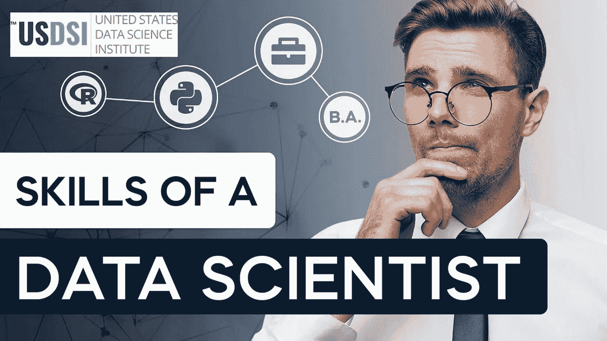
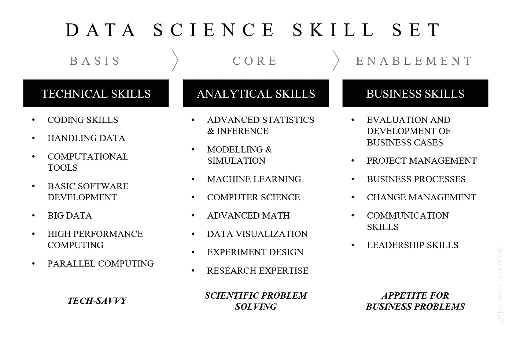

# 成为终极数据科学家的顶级技能

> 原文：<https://medium.com/geekculture/top-skills-to-become-the-ultimate-data-scientist-71c76ba017aa?source=collection_archive---------14----------------------->

自 2000 年以来，人工智能和数据科学已被证明是新兴产业，吸引了具有数学天赋、热爱数字和数据解释技能的年轻人才。数据科学是一个跨学科领域，它使用科学方法、流程、算法和系统从嘈杂的结构化和非结构化数据中提取知识和见解，并在广泛的应用领域中应用来自数据的知识和可操作的见解。数据科学专业知识非常受欢迎，因为它能带来切实、可衡量的业务成果。

> 正如在*《哈佛商业评论》*、*中所述，“在使用数据驱动决策方面，行业排名前三分之一的公司比其竞争对手平均多 5%的生产力和 6%的利润。”*

对数据科学家的角色有许多解释，有时会与大数据工程师职业混淆。数据科学家或工程师可能是 X%的科学家，Y%的软件工程师和 Z%的黑客，这就是为什么工作角色的定义变得错综复杂。实际比例因所需技能和工作类型而异。数据科学家的职责通常包括在公司内部创建各种基于机器学习的工具或流程，如推荐引擎或自动线索评分系统。这个部门的人必须能够进行统计分析。他们必须是面向数据的人，具有良好的脚本和编程技能&熟练使用查询语言，如 SQL、Hive、Pig 和数据可视化工具，如 D3.js、GGplot 等。

数据科学领域有着陡峭的学习曲线。数据科学家需要掌握重要的编程语言&统计计算，以及强大的沟通和人际交往技能。数据科学中最常见的研究领域是数学、统计学、计算机科学和工程。数据科学家通常依靠实际项目和组合工作向雇主表明他们的价值。像 USDSI 这样的在线数据科学认证提供了更多的学习经验，专注于为员工培养实用的 [**数据科学技能**](https://www.usdsi.org/data-science-insights/data-science-skills-vs-tools-what-matters-the-most-for-data-scientists) 。有许多技术和非技术技能对于建立一个非凡的数据科学至关重要。

数据科学家的七项基本**技能**是:

**Python** 编程

r 编程

Hadoop 平台

SQL 数据库

机器学习和人工智能

数据可视化

除了是一个技术极客之外，一个最优秀的数据科学家还必须具备这些**人际交往的非技术技能**来有效地完成他们的工作:

有效沟通

神入

讲故事的技巧

专业协作技能

随时准备学习新技术和框架

商业头脑

不言而喻，数据科学家必须具备先进的技术和分析能力。但是这些并不是成功所需的唯一技能。随着人工智能处理人们在现实世界中挣扎的问题，许多软技能对于帮助数据科学家获得新的想法、见解和思维方式至关重要。如果数据科学家想要利用他们的实质性硬技能&帮助企业领导人理解数据，软技能对他们来说是有价值的。数据科学家工作的领域通常不为高管所完全理解。随着数据科学成为许多组织的核心组成部分，这些软技能将变得更有价值。虽然硬技能方面的专业知识是工作的核心，但软技能可以将数据科学家的角色提升到一个新的水平。

数据科学家使用数字和信息做出真实世界的决策，并翻译业务需求。如果你正试图提高或重新提高你的**数据科学技能** &从竞争中脱颖而出，这里有你快速提高的路线图。

# 以下步骤将帮助您实现梦想中的数据科学角色:

# **第一步:参加在线数据科学课程**

从一名有抱负的数据科学家转变为一名全面发展的六位数专业人士最困难的部分是掌握实现这一目标所需的技能。如果你想进入这个行业，最好的开始方式是熟悉最新的行业工具和实践。网上有许多开源和免费的数据科学课程，但最好的课程是由行业专家领导的，他们曾经和你一样。你可以通过注册来自*谷歌、USDSI、IBM、麻省理工学院、斯坦福*和其他机构的可信**数据科学认证**，在你的数据科学职业生涯中取得领先。

# **步骤 2:读取，读取&读取**

网上有许多教育资源和免费的电子书，学生/专业人士可以通过它们来掌握基础知识。

# **步骤 3:成为数据科学社区的积极贡献者**

不要忽视成为数据科学社区的积极成员，参加数据科学活动，亲自露面与同行交流。永远不要停止成长&分享是我们的口头禅。LinkedIn 是一个很棒的网站，学习者可以在这里与数据科学专家联系，并了解最新的行业趋势。

# **第四步:参与开源项目**

成为开源项目的一部分，因为新来者可以获得比其他人更大的优势。你也可以浏览网站&建立你自己的数据集，你还会发现 GitHub 上潜伏的大部分机会，通过探索和实验来挖掘更深的内容。

# **第五步:掌握技术技能**

高手前五的工具——R，Tableau， **Python** ，SQL&Hadoop；随着线性代数&的强大知识，多变量微积分推荐给那些认为自己是未来 [**数据科学专业人士**](https://www.usdsi.org/data-science-certifications/certified-data-science-professional) 的人。

# **第六步:提升你的软技能游戏**

不仅仅是构建和设计应用程序，还要确保它们符合品牌的愿景。与行业特定的关键绩效指标(KPI)保持一致、了解业务的痛点、微调工作流以及帮助团队加快业务决策流程是 ace 数据科学家的主要职责。

毫无疑问，拥有这些属性将有助于引领你向上爬，来自***USDSI****、谷歌、麻省理工、斯坦福、哈佛*等的可信 [**认证在数据科学** **中的关键作用。不可忽视，因为技术是数据科学家未来发展的基础。这些认证让你在行业中有一个很好的学习和表现曲线，同时让你在行业中扮演重要的角色。毫无疑问，成为一名数据科学家是一份回报丰厚的职业，但专业人士必须保持领先才能获益。解决现实世界的问题&定期捕获大量数据有助于获取商业决策所需的洞察力，这是一位才华横溢的数据科学家的标志。**](https://www.usdsi.org/data-science-certifications)