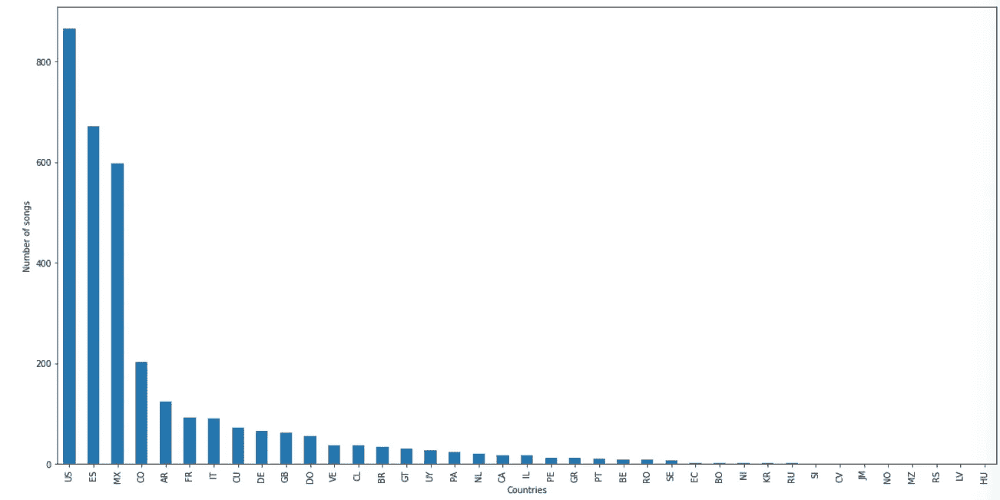
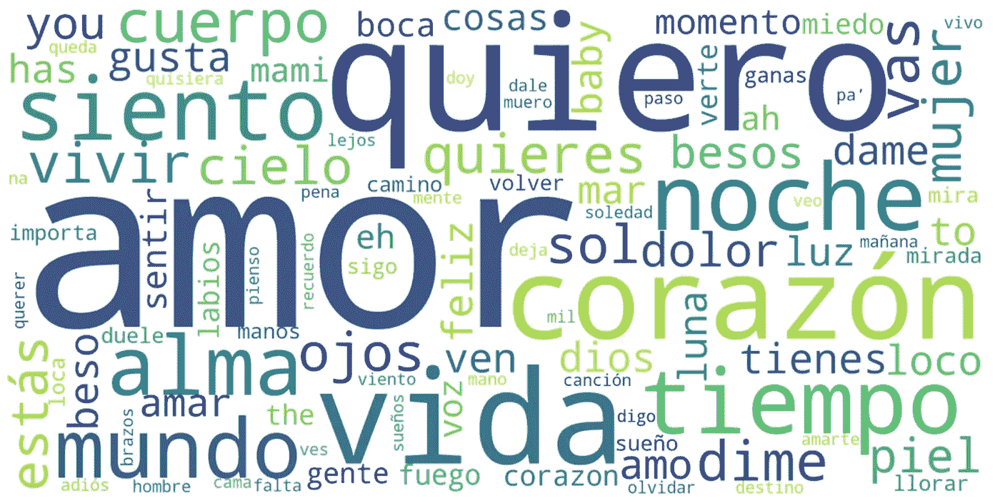
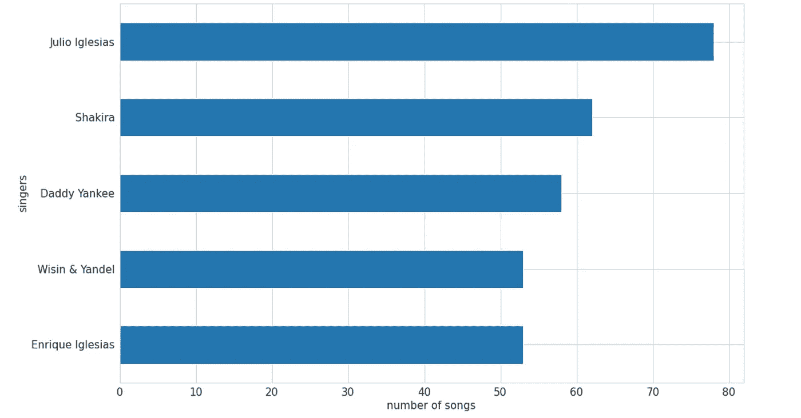
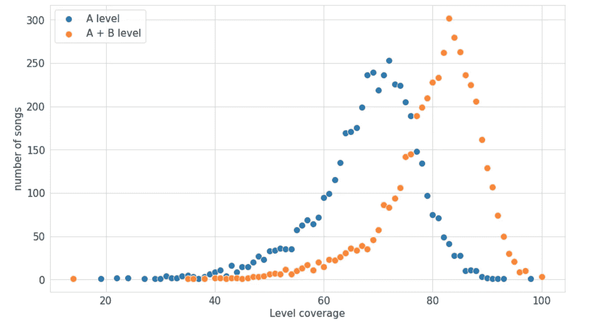

# 根据数据科学，学习西班牙语的热门歌曲

> 原文：<https://medium.com/geekculture/top-songs-to-learn-spanish-according-to-data-science-7575e61ec38c?source=collection_archive---------13----------------------->

在我写了上一篇关于学习法语的最佳歌曲的文章后，许多人回来找我做同样的练习，但用的是另一种语言。所以我想试试西班牙语。

顺便说一下，如果你对最简单的法语歌曲感兴趣，我的文章可以在这里找到:

 [## NLP 如何帮助法语学习者找到符合自己目前水平的歌曲？

### 这些年来，我教过很多学生法语，我自己也曾多次站在初学者的角度…

medium.com](/geekculture/how-can-nlp-help-french-learners-find-songs-that-match-their-current-level-a1efdc4dc8fb) 

我或多或少地遵循了相同的过程，因此我不会过多地讨论有问题的代码，而是讨论结果。不过也有一些新功能:我使用了 MusiXmatch API 来查找音乐的类型，并获取歌手的国籍。通过点击[链接](https://developer.musixmatch.com/)，可以获得注册 API 密钥的程序。

# **探索性数据**分析

我的数据框架包括来自 38 个不同国家的艺术家的 4582 首歌曲。最具代表性的流派是流行(1139 首)、拉丁(505 首)和拉丁城市流派(275 首)。

Photo by [Ibrahim Rifath](https://unsplash.com/@photoripey?utm_source=medium&utm_medium=referral) on [Unsplash](https://unsplash.com?utm_source=medium&utm_medium=referral)

如前所述，本分析的新颖之处在于增加了国籍。尽管大量数据缺失，我们仍然可以看到美国(862 首歌)、西班牙(671 首歌)和墨西哥(596 首歌)的前三名。

与法语歌曲一样，这些词汇仍然与爱(“amor”、“amar”)、生活(“vida”)和欲望/爱(“quiero”)联系在一起。与法语歌词相比，我确实有这样的印象，这些歌曲中的**更加强调身体**，经常出现“labios”(“lips”)、“besos”(“kisses”)、“piel”(“skin”)、“sentir”(“feel”)、“boca”(“mouth”)、“cuer po”(“body”)等术语。

歌曲最多的艺人分别是[胡里奥·伊格莱西亚斯](https://www.youtube.com/channel/UC5jcyfv-J8R1RGlapR_x1Cg) (78 首)[夏奇拉](https://www.youtube.com/channel/UCYLNGLIzMhRTi6ZOLjAPSmw) (62 首)[美国佬老爹](https://www.youtube.com/channel/UC9TO_oo4c_LrOiKNaY6aysA) (58 首)[维辛和扬德尔](https://www.youtube.com/channel/UCwR_LqB7g3-_J7p1nscCbEA) (53 首)[安立奎·伊格莱希亚斯](https://www.youtube.com/channel/UC-6czyMkxDi8E8akPl0c7_w) (53 首)。

# **分类**

这一次，我使用了 Real Academia Espanola 提供的词频列表。西班牙语语料库。[http://www . RAE . es](http://www.rae.es/)【2022 年 6 月 22 日】)。这个列表与法语中使用的列表的主要区别在于，它不仅包含单词的基本形式，还包含根据出现频率分类的所有形式。因此，我们发现“soy”(“I am”)以及“fuimos”(“we was”)或“ser”(“to be”)，而我之前的列表仅限于不定式动词(这里应该是“ser”)。

为了估计每一级我应该包括多少单词，我以这篇[文章](https://universeofmemory.com/how-many-words-you-should-know)为基础。这样，我再次创建了四个单词列表，分为 A1、A2、B1 和 B2。在其他方面，这个过程与[法语歌曲](/geekculture/how-can-nlp-help-french-learners-find-songs-that-match-their-current-level-a1efdc4dc8fb)完全相同(用 CountVectorizer 创建一个矩阵，在这个相同的矩阵中插入每个单词的级别，创建一个包含每首歌曲每个级别的单词百分比的字典……)

# **结果**

这是分析的结果。首先，你可以在这里看到一个图表，显示了歌曲按照词汇范围的分布:要么是 A (A1 到 A2)，要么是 A + B (A1 到 B2)。

最后这里是三个歌曲列表:一个是 A1 级别的已知单词百分比最高的，然后是 A2 级别的，最后是 B2 级别的。

## A1 级别的前 10 首歌曲

*   吉普赛国王的 sueo de Noche(流派=拉丁语)
*   很好！【热狗舞】(拉丁西班牙语)米老鼠俱乐部会所(OST)(流派=儿童音乐)
*   夏奇拉的《沙漠》(流派=民谣)
*   OV7(流派=流行)
*   米莉·克萨达的《我的生活》
*   多 NDE·埃斯坦，科拉松？安立奎·伊格莱希亚斯(流派=流行)
*   维克多·马努埃尔的《女人的故事》(体裁=拉丁语)
*   妮莉·费塔朵的 Más(流派=流行)
*   曼吕·乔的 5 首拉宗舞曲(流派=世界)
*   纳达尼纳迪由大豆月亮(OST)

我又创建了一个 [Spotify 播放列表](https://open.spotify.com/playlist/2TqdGBVVLP32c0pVhPMyny?si=fefcaa78d56344c9)，里面有一些来自语料库的 A1 级别的歌曲(差不多 3 个小时的歌曲)。

## A2 级的前 10 首歌曲

*   赫苏斯·阿德里安·罗梅罗(流派=基督教和福音)
*   阿拉卡兰的《反射德卢纳》
*   Eres tú by Mocedades(流派=流行)
*   Banda MS 的一首主打歌(流派=流行)
*   安德·托马斯的《我的爱》
*   哈·阿什(流派=流行音乐)
*   亚斯明·利维的《我的世界》
*   极限运动(风格=萨尔萨舞和热带)
*   Zion & Lennox 的 Amor Genuino(流派=拉丁都市)
*   基督教赞美诗和歌曲(流派=基督教和福音)

这里是 A2 级的[播放列表。](https://open.spotify.com/playlist/5VP5hsAnPHRzF0VSbdblwC?si=693b1e0a66e8486d)

## B2 级别的前 10 首歌曲

*   亚斯明·利维的《Porque》
*   格洛亚的《你的男人》
*   德恩弗的《青少年》(流派=流行)
*   路易斯·米格尔的小说(流派=流行)
*   马尔克斯的《vayamos compaeros 》(流派=流行)
*   梅赛德斯·索萨的作品(体裁=拉丁语)
*   胡里奥·伊格莱西亚斯的爱情，爱情，爱情
*   你是我的藏身之处
*   穆尼卡的 Vai (LLP 混音)
*   罗伯托·卡洛斯的《殷虹婷·阿曼特》(流派=巴西)

最后，B2 关卡的[播放列表。](https://open.spotify.com/playlist/27q5AbHsGX2ENCtCFv5wGK?si=e05b866582294476)

如果你更想根据自己的喜好自己搜索，**你可以使用下表浏览整个语料库**。你可以按艺术家、标题、流派或国籍进行搜索。你也可以根据词汇范围对列表进行分类:A1-A2 或 A1-B2。

To see the table in full screen follow this link: [https://datawrapper.dwcdn.net/D8Xul/1/](https://datawrapper.dwcdn.net/D8Xul/1/)

如果你对完整的代码感兴趣，这里有 [GitHub 库](https://github.com/StMaCre/Song_level_analysis)。非常感谢您的阅读！