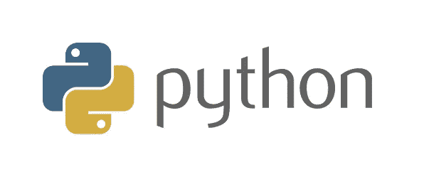
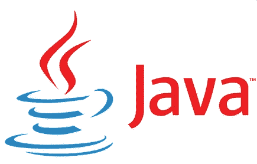
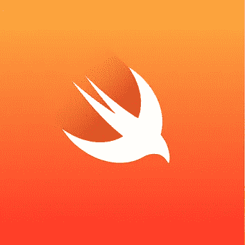
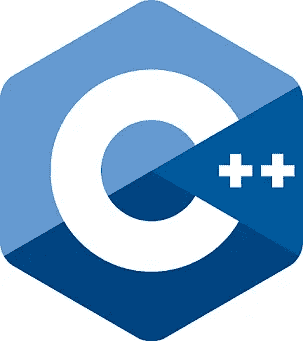

# 2021 年要掌握的热门编程语言

> 原文：<https://medium.com/geekculture/top-trending-programming-languages-to-master-in-2021-7adc3196dceb?source=collection_archive---------68----------------------->

## 值得你花时间去学习和掌握的最好的编程语言

Photo by [Markus Winkler](https://unsplash.com/@markuswinkler?utm_source=medium&utm_medium=referral) on [Unsplash](https://unsplash.com?utm_source=medium&utm_medium=referral)

虽然我们大多数人因为疫情而被困在家里，但定期学习新东西或培养新爱好来消除无聊已经成为一种习惯。尽管大多数领域在过去的一年里都有所下降，但是软件工程领域仍然在以相当快的速度增长和发展。由于这个原因，越来越多的软件开发人员，从初学者到专业人员，都把重点放在学习新的语言和框架上，他们觉得这些语言和框架对他们将来会有好处。但是，也有另一群人，包括我自己，他们没有一个特定的目标编程语言，他们打算学习和掌握。这篇文章将会是一个特别的指南，为那些选择语言学习的人，也为那些希望了解软件开发领域最新趋势的人。

有许多不同的方法来获得流行编程语言的排序列表，例如基于 GitHub 拉/推请求、Google 搜索查询、npm 下载等。但在这里，我也在考虑对未来有益的语言。因此，这个有序列表是在对当前和预期的未来趋势做了一些研究之后制定的。以下是 2021 年值得花时间学习的顶级编程语言:

# 1.计算机编程语言

Python 被认为是当今发展最快的开源高级编程语言。Python 也被认为是最用户友好的编程语言，因为它的语法简单，更接近自然英语。

Python 在最近几年获得了巨大的普及，这主要是由于 Python 在人工智能、机器学习和数据科学领域的技术进步。此外，根据 Stack Overflow 的[调查，它是开发人员不知道但想学习的主要编程语言。Python 语言价值高的另一个原因是，它可以与 Django 和 Flask 等框架一起用于全栈 web 开发。Spotify 和 Instagram 网站的服务器端都是用 Python 搭建的。](https://insights.stackoverflow.com/survey/2020#technology-most-loved-dreaded-and-wanted-languages-wanted)

将 Python 放在列表的第一位没有什么好犹豫的:它拥有最多的工作职位和所有语言中最大的积极搜索趋势。将 Python 加入你的储备，你的职业生涯不会出错。

# 2.Java Script 语言

**为什么要学 JavaScript？**简单来说，JavaScript 是 web 的标准编程语言。这意味着您可以单独使用 JavaScript 框架和库来开发完整的软件！

当你打开浏览器开始浏览时，95%的网站都有 JavaScript！

JavaScript 通常缩写为“JS”，是一种支持事件驱动、函数式和命令式编程风格的高级多范式语言。JS 无疑是最流行的 web 开发语言，也被普遍称为*“web 开发人员的语言”*。因为 JavaScript 具有宽容、灵活的语法，并且可以在所有主流浏览器上工作，所以它也是对初学者最友好的编程语言之一。各种各样的附加组件也扩展了 JavaScript 的功能。

从脸书和 Twitter 到 Gmail 和 YouTube，大多数最受欢迎的网站都依赖 JavaScript 来创建交互式网页并向用户动态显示内容。

学习 JavaScript 是一项更广泛的任务，因为它包含许多前端和后端开发的竞争性框架。如果你打算学习 JavaScript，我推荐这些最流行的框架:

*   前端 web 开发— React、Angular、Vue
*   后端 web 开发— Express、Nest、Next

# 3.Java 语言(一种计算机语言，尤用于创建网站)

是的，你没看错！Java 作为最古老的编程语言之一，仍然在遗留 web 应用程序中占有很大份额，这些应用程序需要开发人员来维护和增强它们。Java 存在的一个主要原因是其平台无关的*“一次编写，随处运行”*本性。

Java 是最常与客户机-服务器应用程序开发联系在一起的编程语言，它被世界各地的大型企业所使用。其强大的功能包括强大的内存管理、高性能、向后兼容和顶级的安全性。Java 的新框架，如 Spring、Struts 和 Hibernate，已经出现在近**30 亿台设备中，并且变得非常流行。**

Java 受到企业的青睐，大约 90%的财富 500 强公司使用 Java 来构建应用程序和后端系统，这使得 Java 出现在这个列表的第三位

# 4.迅速发生的

如果你对苹果产品和移动应用程序开发感兴趣，Swift 是一个不错的起点。Swift 是苹果为 Mac 电脑和苹果移动设备开发应用程序的语言，旨在取代 Objective-C，后者自 20 世纪 80 年代以来没有得到任何重大改进。Swift 还具有高度用户友好的语法，运行代码速度快，可用于客户端和服务器端开发。

到目前为止，Objective-C 仍然比 Swift 有更多的工作机会，但 Objective-C 缺乏现代功能，这使得它更有可能在不久的将来被 Swift 超越，因此，我相信支持这种趋势，Swift 将是一种很好的编程语言，掌握它可以获得巨大的机会。

# 5.C++

C++是一种通用编程语言，是 C 编程语言的扩展。它也可以被称为现代世界最常用的编程语言的先驱和其他编程语言(如 C#、Java 和 JavaScript)的根源。

C++主要用于游戏开发、脚本、移动应用，尤其是性能密集型任务，这是 2021 年及以后学习 C++的主要原因之一。有大量用 C++编写的任务关键型软件不能被另一种语言所取代，这种语言提供了相同水平的速度和对系统资源的控制。

增强现实和虚拟现实这两个近年来获得巨大认可的技术领域是一些必须使用 C++的核心开发领域。此外，C++还用于构建操作系统、库和其他编程语言。在开发人员短缺的游戏开发中广泛使用。汽车、航空航天、银行行业的大部分公司都在找 C++开发人员。这些都是 2021 年学习 C++的重要原因。

## 一些可敬的提及…

C#、Go、R、Ruby 是我遇到的其他一些诱人的语言，它们几乎都在列表中。在我看来，截至目前，列表中提到的语言比荣誉提及的语言具有更高的潜力。但是我确信可能有很多人有不同的观点，我尊重每个人的意见。

## 总结…

当决定学习哪种编程语言时，重要的是不要陷入浮华的趋势和流行竞赛中。虽然计算机编程领域变化很快，但我上面提到的语言在相当长的一段时间内有很强的持久力。

但是最重要的是，把你最喜欢做的事情放在第一位。如果你有兴趣成为一名 iOS 开发者，那就去选择 Swift 吧！如果您对前端开发感兴趣，JavaScript 可能是您想要开始的地方。机器学习？Python 是你的语言。

感谢您花时间阅读这篇文章，祝您编码愉快！注意安全！