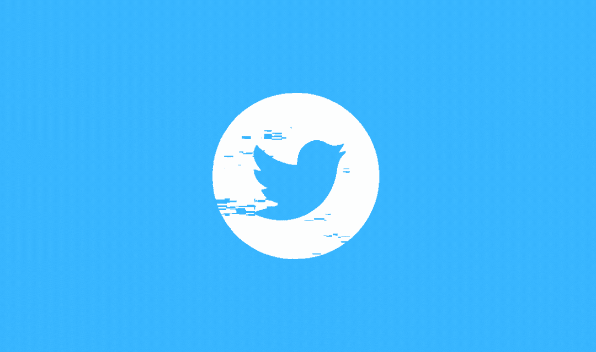
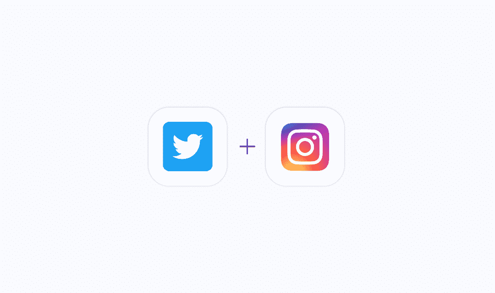
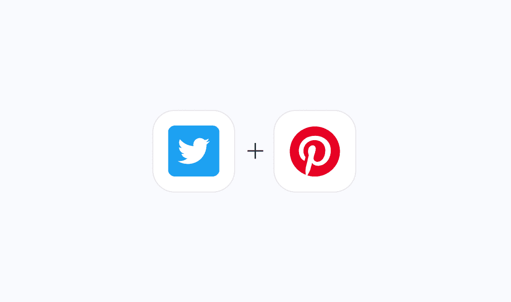
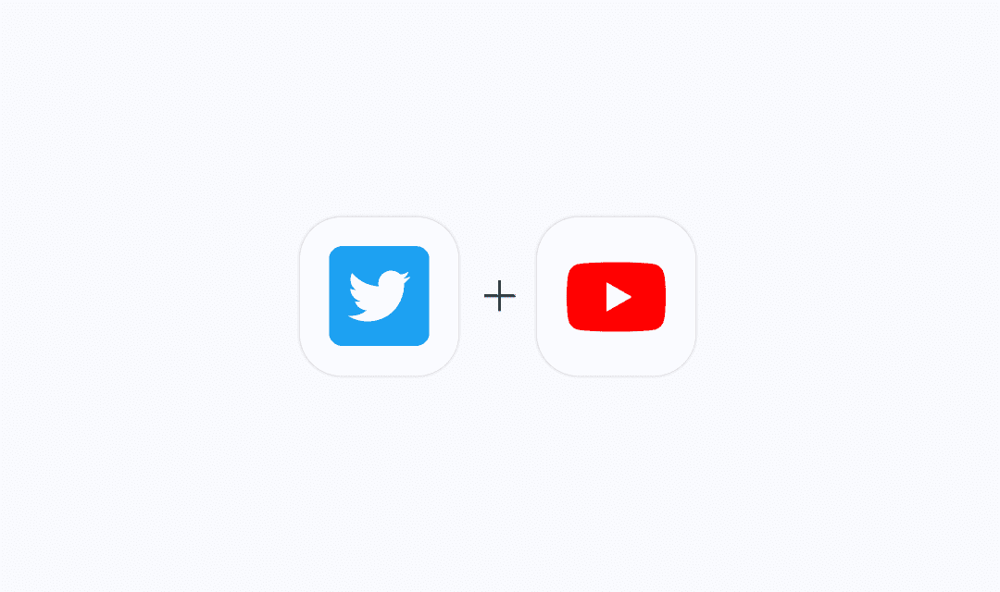

# 2022 年最热门的 Twitter 工作流

> 原文：<https://medium.com/geekculture/top-twitter-workflows-of-2022-325abe5c35a?source=collection_archive---------17----------------------->

Twitter 是一项让朋友、家人和同事能够通过频繁交换简短信息来互动和保持联系的服务。人们发出推文，可以包括照片、视频、链接和文本。这些消息会保存到您的个人资料中，通过电子邮件发送给您的关注者，并且可以在 Twitter 上搜索到。

Twitter 允许用户找到关于当今最重要的新闻和事件的故事，关注发布他们想要消费的信息的个人或公司，或者只是与朋友互动。此外，公共关系和营销团队可以利用 Twitter 来提高品牌认知度，取悦他们的目标受众。

**Twitter-insta gram 整合**

***自动分享 Instagram 照片到推特***

如果您使用此连接，新的 Instagram 帖子也会被推送到您的 Twitter 帐户。

***用 Instagram 上的新帖子发推文。***

*它从你的 Twitter 账户发布推文，并复制你的 Instagram 媒体更新。*

**Twitter-Pinterest 集成**

***用新的 Pinterest 图钉发布图片。***

*您添加到 Pinterest 的每个新 pin 都会自动触发这一整合。它的图像和注释将会被传送到 Twitter，在那里会发送一条图像推文，这样你的所有关注者就可以很容易地跟上你的发现。*

Pinterest 应该用来分享新的 Twitter 帖子。

使用这种自动化，你可以复制你的帖子。这将随着你在 Twitter 上写的每一条新推文自动触发，将信息发送到 Pinterest 并固定在你选择的板上。

**Twitter 和 Youtube 的整合**

来自 YouTube 频道的新视频在推特上发布。

这个集成将为你处理一些费力的工作，为你频道上的每一个新的 YouTube 视频发送一条推文。

***发新的 YouTube 视频。***

*另一方面，每当某个频道发布新的 YouTube 视频时，这种自动化会通过向您的 Twitter 帐户发送新的图片推文来为您处理这一问题。自动在 Twitter 上分享 YouTube 内容，无需输入新的推文！*

既然你知道 Twitter 营销值得进一步探索，为什么不花几分钟时间使用 [Quickwork](https://zurl.co/rape) 创建你最喜欢的 Twitter 工作流程来帮助你更好地了解你的营销工作呢？