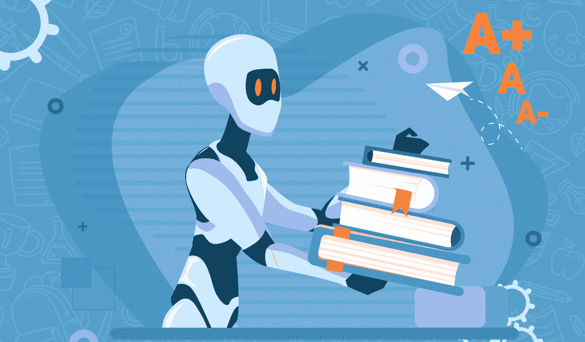
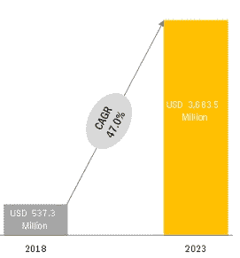
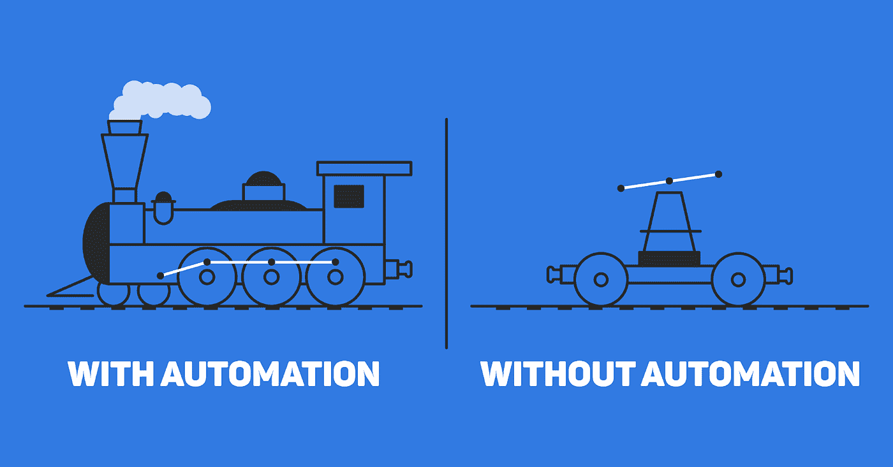
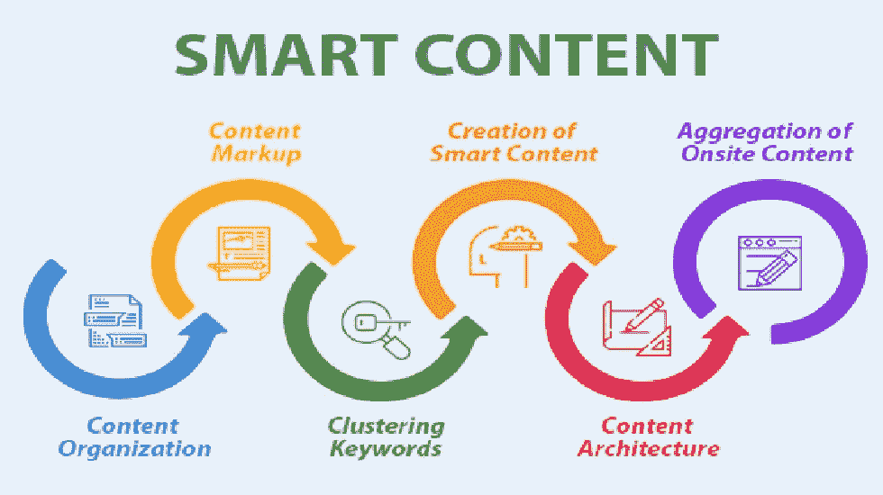
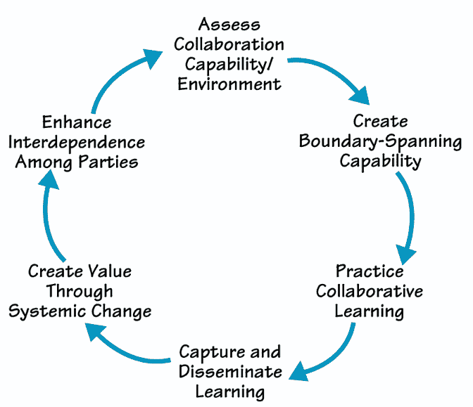

# 人工智能在教育中的应用:人工智能如何改变学习的未来

> 原文：<https://medium.com/geekculture/top-ways-artificial-intelligence-can-be-used-in-education-how-ai-is-changing-the-future-of-f37434b3ee49?source=collection_archive---------9----------------------->

[source](https://www.geeksforgeeks.org/6-ways-artificial-intelligence-will-change-education-in-the-2020s/)

在当今世界，人工智能(AI)已经渗透到几乎每个行业和领域，从教育到医疗保健和金融。

然而，人工智能在教育领域最近获得了最多的关注，谷歌等领先组织投资于教育技术，这些技术使用机器学习和其他基于数据的策略来个性化学习，使每个人都更容易获得学习。

此外，人工智能(AI)是一个最近被抛出很多的术语，但它实际上是什么意思呢？嗯，人工智能是机器自己学习和工作的能力。

人工智能可以在教育中使用许多方式，从帮助学生更轻松地学习新科目到协助教师评分和教室管理。

根据一份[报告](https://www.marketsandmarkets.com/Market-Reports/ai-in-education-market-200371366.html)，到 2023 年，全球教育市场的人工智能预计将增长约 37 亿美元，CAGR 为 47%。

在这篇博文中，我们将讨论人工智能改变未来学习的一些方式。我们还将探索人工智能可以为学生和教育工作者带来的一些好处！

开始了。

# 找出人工智能在教育中的最佳应用方式

*   **任务自动化**

你可以训练一个人工智能(AI)程序来处理许多琐碎的任务，例如批改论文和安排会议。像这样的任务非常适合自动化，因为它们有清晰的规则和模式，但是一个人一个接一个地做这些任务很费时间。

随着这些程序在处理这类工作方面变得越来越好，我们将有更多的时间来帮助最需要的学生——而不是把我们的时间花在无关紧要的事情上。

例如，未来的教师可以从擅长教学但在如何对待学生或课外活动方面不是很好的榜样的计算机那里学习。

他们也可以花更多的时间和那些需要额外关注和照顾的学生在一起。这样，教育中的人工智能可以为提高学生的知识培养更好的结果。你也可以联系任何人工智能开发公司，在教育应用中利用人工智能技术。

*   **个性化学习**

人工智能开始影响教育的主要方式之一是个性化学习。这使用了像机器学习这样的技术来给学生一对一的关注，这在几年前可能是不可能的。

事实上，这已经发生在一些学区，尤其是那些学生在标准化考试中落后的学区。虽然这些地区的学生比全国的同龄人更容易落后，但他们在考试成绩和毕业率方面确实取得了更好的成绩。

个性化学习的很大一部分包括将每个学生的实时数据整合到课程和活动中。

例如，如果一个老师知道一个学生的功课落后了，她可以调整当天的教学计划来帮助她跟上进度。

这也意味着老师可以对不同的学生使用不同的方法:如果一种方法对一个特定的学生不起作用，那么她可以尝试其他方法，直到她找到有效的方法。

现在有了所有这些工具，教师能够提供比以往任何时候都更加个性化的教学，个性化学习已经成为美国许多高科技学校的重要组成部分。

这样，人们可以理解人工智能在教育中的前景是光明的，这对教师和学生来说都将是富有成效的。

*   **通用接入**

教育中的人工智能具有真正的潜力，通过将计算机化的教师带入教室或让学生和教师获得计算机辅助的帮助，使教育变得更加容易。

对于那些由于社会经济状况而无法接触到传统学习环境的学生来说尤其如此。

此外，机器人和虚拟助理也可以作为帮助自闭症儿童以最适合他们的方式学习的伟大工具。例如，患有自闭症的孩子通常受益于结构化的学习环境和持续的重复。

人工智能既提供了一致性，也提供了根据学生学习新概念的情况进行个性化教学的机会。

例如，一些孩子需要视觉解释，而另一些需要听觉解释；有些人需要大量的练习，而有些人可能需要较少的练习时间，但需要更多的休息时间。

*   **智能内容创作**

智能内容创作是一个有望继续发展的趋势。通过使用人工智能和机器学习，教师可以为一门课程创建自己的课程。

他们制作的材料将为每个学生量身定制，以使他们的体验更加个性化。

例如，如果学生在理解概念或满足最后期限方面有问题，人工智能程序可以指出接下来需要采取什么步骤来改进。如果做得好，这些计划可以帮助学生按照自己的进度学习，同时确保他们在学习过程中达到所有课程目标。

随着时间的推移，人工智能创造的课程可能会成为日常生活的一部分。不难想象未来每个学生都从人工智能而不是传统的课堂教学中学习。

*   **教老师**

在识别模式和诊断问题方面，计算机比老师更擅长。这可以改善残疾学生的教育，并为普通教室提供更多个性化的学习机会。

例如，如果你想学法语，你的笔记本电脑将能够根据你与其他学习者相比的独特优势和劣势来教你。同样，如果你在教那些没有受过训练的老师的孩子语言技能，一种算法可以被用于教学。

*   **发现课堂弱点**

教师和大学管理人员花大量时间思考在他们的教室里什么可行，什么不可行。通常，我们没有确凿的证据来支持我们的直觉。

解决办法？使用人工智能来自动收集数据。因此，如果你预感到学生不理解某个概念，或者他们似乎对家庭作业感到厌倦，你可以在课堂上使用平板电脑快速测试他们，而不会干扰教学。

你可能会惊讶地发现，学生们在参加非正式投票时比被动倾听时更积极主动。

你也可以通过使用 Cleveria 这样的自动化问题生成工具，每次随机创建新的选择题，来查看学生是否掌握了某些概念。

这样，你可以测试你的学生以前没有看过的内容。如果他们做对了，那么你知道他们理解了。

*   **加强协作学习**

给人们一个讨论项目的渠道是很重要的。毕竟，如果他们不能互相分享他们的想法，他们怎么知道什么是有效的呢？人工智能为教师提供了一种简单的方法，通过使用虚拟白板等智能工具，将协作纳入课程计划。

例如，教师可以提出多项选择问题，帮助指导学生讨论和分享他们对某个主题的想法，而不是只给学生一项作业。

在教育中使用人工智能不仅仅是问答环节；它实际上促进了儿童的社会发展，使他们能够相互学习，也能够向老师学习。

毕竟，孩子参与课堂讨论越多，他们就越有信心表达自己——无论是面对面还是在网上。

# 提高教育成果

人工智能系统通过评估学生的能力、寻找趋势和识别处于风险中的个人，在帮助改善教育成果方面显示出巨大的潜力。

例如，一项研究发现，人工智能系统能够以 70%的准确率识别出可能考试不及格的学生。对于教师和管理人员来说，这是很有价值的信息，他们可以将它作为一种针对个性化教学或提供额外支持的方式。

# 24/7 全天候援助

人工智能还可以帮助那些努力跟上学业的学生。这项技术提供来自导师和教师的 24/7 全天候帮助，帮助学生以更有效的方式学习和理解新概念。

学生也可以按照自己的进度工作，有效地利用他们的时间。通过接收对作业的即时反馈，学生不会在繁忙的工作或不会提高他们的知识基础的作业上浪费时间。

人工智能还通过在最需要的时候提供学习技巧、笔记能力和个人鼓励来帮助降低压力水平。所有这些特性都使人工智能成为那些希望取得更好成绩而又不想在平凡任务上浪费时间的人的一个有前途的工具。通过利用[人工智能开发服务](https://www.valuecoders.com/ai-ml-development-services-company?utm_source=Guest_blog%28AI+Educaton%29&utm_medium=ANU_B11&utm_id=Artificial+Intelligence)，你也可以开发一个高效的教育应用。

# 总结一下！

在教育中使用人工智能有大量潜在的好处，从帮助教师评估学生的能力到促进社会发展。

人工智能还可以通过评估学生的能力和识别有风险的个人来帮助改善教育成果。

此外，我相信，由于其许多潜在的好处，人工智能在教育中的使用将继续受到欢迎。

那么为什么现在要推迟呢？联系一家[人工智能 app 开发公司](https://www.valuecoders.com/ai-ml-development-services-company?utm_source=Guest_blog%28AI+Educaton%29&utm_medium=ANU_B11&utm_id=Artificial+Intelligence)，开发一款高效的教育 app。