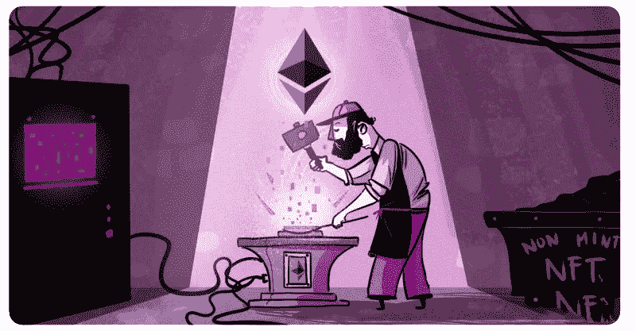
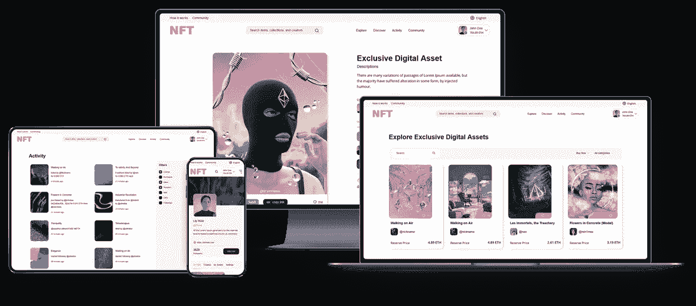
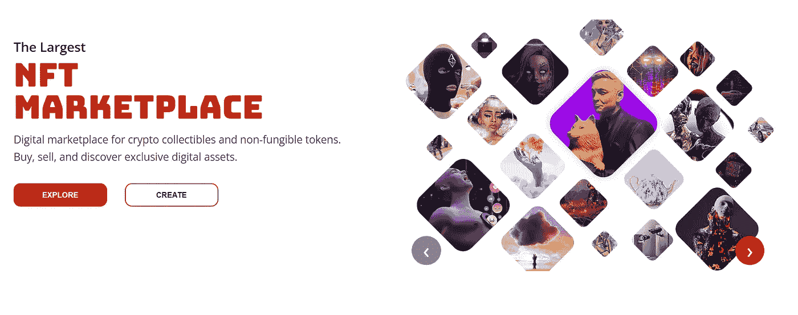
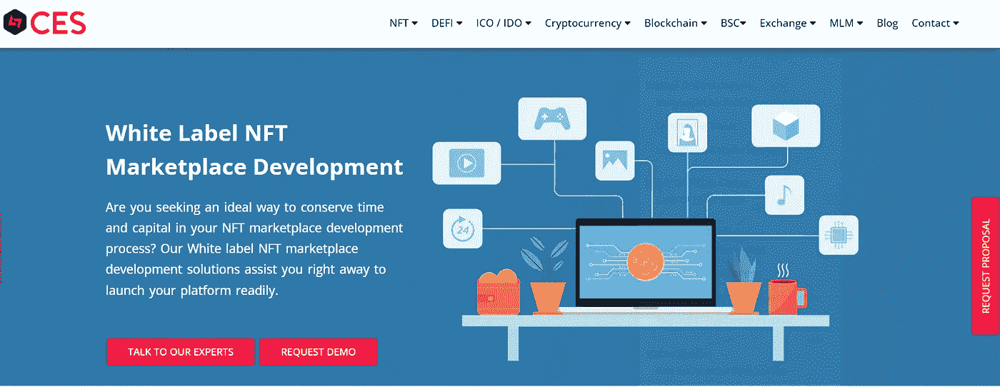
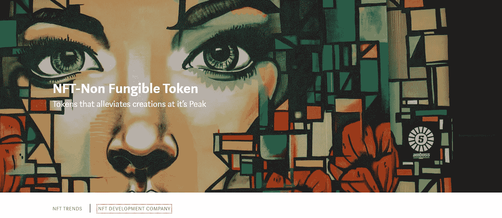

# 顶级白色标签 NFT 市场解决方案提供商！

> 原文：<https://medium.com/geekculture/top-white-label-nft-marketplace-solution-providers-8cdab36e8b79?source=collection_archive---------14----------------------->

出售由不可替代代币支持的资产的市场一直是 2021 年 NFT 繁荣背后的驱动力。这些 NFT 市场平台在 NFT 繁荣时期产生的利润远远超出了它们在推出之前的想象。需要注意的是，今天的许多大市场已经存在很长时间了(是的！2.3 年在密码世界里是一段很长的时间！).基于此类业务的成功，多家公司开发了可快速部署的 NFT 市场平台，只需稍加定制，即可用于首次涉足加密领域的有抱负的企业家。在这篇博客中，我们将看到提供顶级白牌 NFT 市场解决方案的前五家公司。

## 区块链 App 工厂

区块链应用工厂为平台提供广泛的 [**白标解决方案**](https://www.blockchainappfactory.com/white-label-nft-marketplace?utm_source=Medium&utm_medium=Guest+Blog+-+28%2F04%2F2022&utm_campaign=vignesh) ，如 *DeFi、NFT Marketplaces、Exchange、Launchpads 和 P2E 游戏平台*用于即时业务开发。该公司通过其完美的白标解决方案掌握了创建定制市场的艺术。该公司提供的专业服务和支持确保最终产品获得巨大成功。需要注意的是，区块链应用工厂的专家提供的[白标 NFT 市场解决方案](https://www.blockchainappfactory.com/white-label-nft-marketplace?utm_source=Medium&utm_medium=Guest+Blog+-+28%2F04%2F2022&utm_campaign=vignesh)不会损害你的银行账户。同时，该平台将在短时间内部署到您的服务器上。该公司的其他能力包括 ICO/IDO 开发、NFT/DeFi 应用开发、加密货币交易所开发和区块链营销服务。

**查看演示** - [点击](https://www.blockchainappfactory.com/white-label-nft-marketplace?utm_source=Medium&utm_medium=Guest+Blog+-+28%2F04%2F2022&utm_campaign=vignesh#viewdemo)👈🏻

………………………………………………..

## Chaincella

作为一家专门提供与 [**NFT 应用开发**](https://www.chaincella.com/?utm_source=Medium&utm_medium=Guest+Blog+-+28%2F04%2F2022&utm_campaign=vignesh) 相关的服务的公司，Chaincella 拥有大量客户，他们的 NFT 市场都是由该公司创建的。该公司有丰富的经验，开发白标 NFT 市场门户网站，因为它有一个专门的开发人员团队，他们总是专注于超越自己的重量。他们的理念是不断改进他们拥有的方法和草案平台，以便新企业获得更好的产品。Chaincella 还为不同的区块链和不同的利基市场提供其他种类的 NFT 市场开发服务，以及创新的 NFT 营销服务。

**联系 Chaincella-** [点击](https://www.chaincella.com/contact-us?utm_source=Medium&utm_medium=Guest+Blog+-+28%2F04%2F2022&utm_campaign=vignesh)👈🏻

………………………………………………..

## 无限块技术

另一家在同一屋檐下提供各种区块链相关服务的公司[**Infinite Block Tech**](https://www.infiniteblocktech.com/white-label-nft?utm_source=Medium&utm_medium=Guest+Blog+-+28%2F04%2F2022&utm_campaign=vignesh)，是致力于可定制白牌 NFT 市场软件的领导者之一。该公司的专业人员在区块链技术方面经验丰富，这使得他们的全球客户非常满意。总的来说，他们的白标解决方案是该领域中最好的，这种软件对 NFT 市场也不例外。除此之外，Infinite Block Tech 还擅长开发基于 ICO、IDO、STO、NFT、DeFi 和加密货币的应用程序。

**获取报价** - [点击](https://www.infiniteblocktech.com/contact-us?utm_source=Medium&utm_medium=Guest+Blog+-+28%2F04%2F2022&utm_campaign=vignesh)👈🏻

………………………………………………..

## 加密货币交换脚本(CES)

即使公司的名字可能会在众目睽睽之下愚弄你，也不要上当。**Cryptocurrency Exchange Script(CES)【】是一家在最近一段时间里慢慢展示其全部潜力的公司，因为他们探索创建除同名应用程序之外的更新应用程序。为 NFT 市场提供的白标解决方案是建立其声誉的成功应用之一。许多小规模的 NFT 市场已经从该公司的平价白标产品中受益匪浅。除了加密交易所之外，加密货币交易所脚本(CES)开发的其他产品包括分散金融(DeFi)、NFTs、初始硬币发行(ICOs)和初始 dex 发行(IDOs)的应用程序。**

****请求演示** - [点击](https://www.cryptocurrencyexchangescript.com/contact?utm_source=Medium&utm_medium=Guest+Blog+-+28%2F04%2F2022&utm_campaign=vignesh)👈🏻**

**………………………………………………..**

## **NFTs**

****

**假设您想知道在提供白标 NFT 市场的公司列表中，不可替代的令牌在做什么。在这种情况下，您需要知道 [**NFTs 是区块链开发世界中的新来者**](https://medium.com/nft-non-fungible-token) 。作为一家广泛致力于开发与不可替代令牌相关的应用程序的公司，它已经因其 supreme Whitelabel NFT 市场解决方案而闻名。该公司的开发人员在区块链有丰富的经验，因此享有盛誉。该公司为基于 NFT 的应用程序提供各种服务，包括开发、营销和咨询。**

**………………………………………………..**

## **一些总结性的建议**

**因此，我们可以说，鉴于每天都有新的密码企业家到来，基于 NFT 市场平台开始创业是一个极好的选择。他们中的大多数人将针对 NFT 市场的白标解决方案视为首选，因为这些平台可以在短时间内准备就绪，同时带来 [**更低的开发成本**](https://www.blockchainappfactory.com/white-label-nft-marketplace#pricing-tabs) 。有了这样的平台，很容易在早期获得利润，如果你足够幸运，你可能会发现你的企业成为下一个 NFT 繁荣期的中心。如果你有一个在 NFT 市场做生意的想法，那么不要犹豫，去找这篇博客中提到的五大 NFT 市场发展公司之一。**