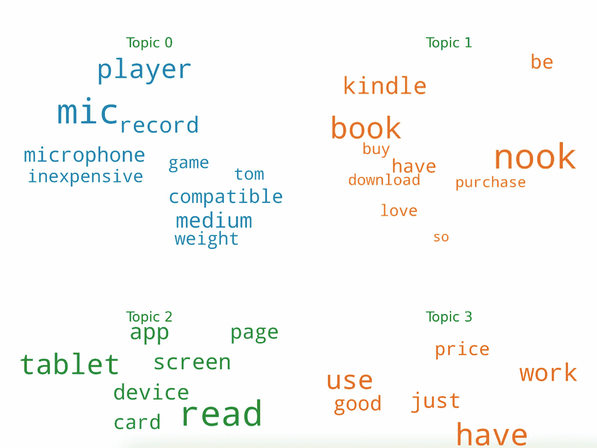

# 亚马逊评论的主题建模

> 原文：<https://medium.com/geekculture/topic-modelling-for-amazon-review-9a06327f105a?source=collection_archive---------8----------------------->

**简介:**

对于人脑来说，浏览一篇文章并找出其主题是一件相对容易的事情；但对机器来说不是。对于机器来说，它需要一些清理过程和算法。在这种情况下，我们利用一种叫做潜在狄利克雷分配的算法，通常简称为 **LDA。**

## **什么是 LDA？**