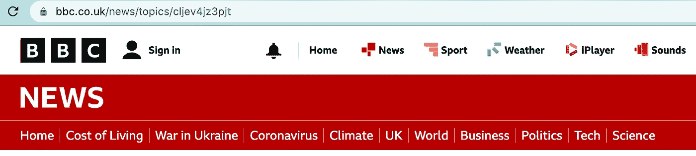
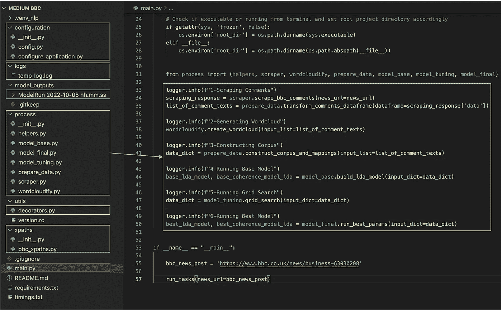
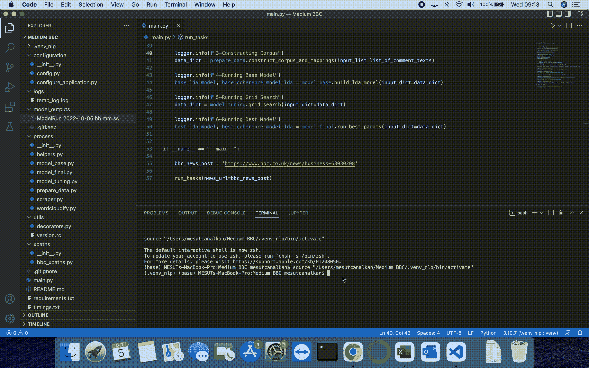
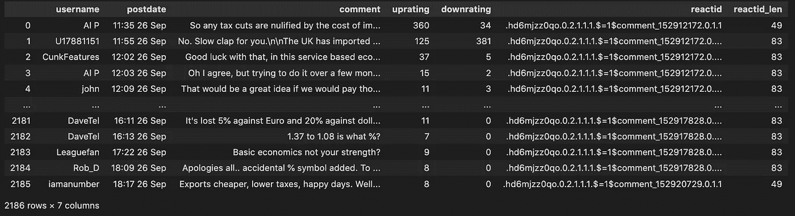
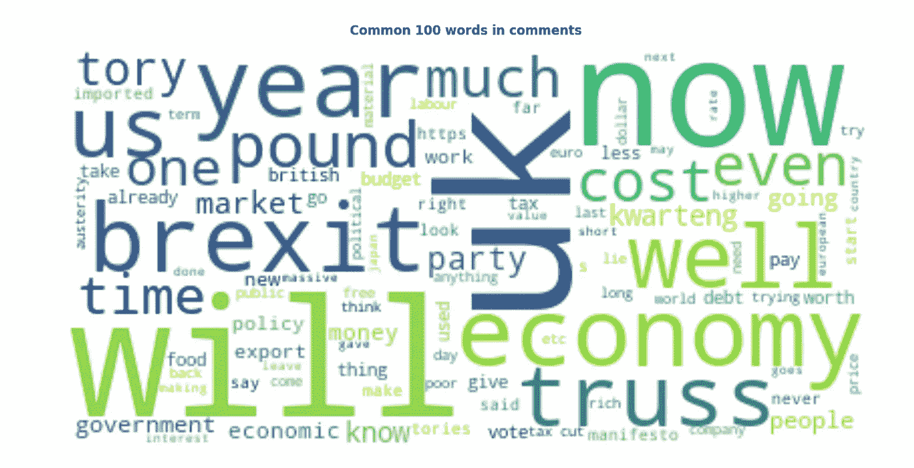
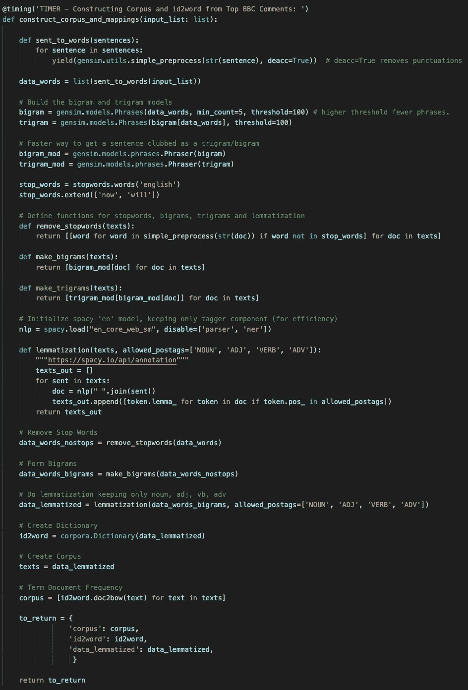
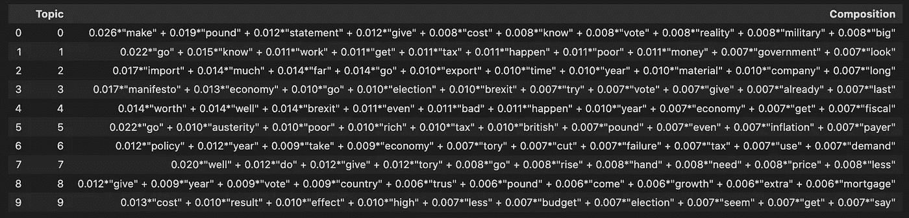
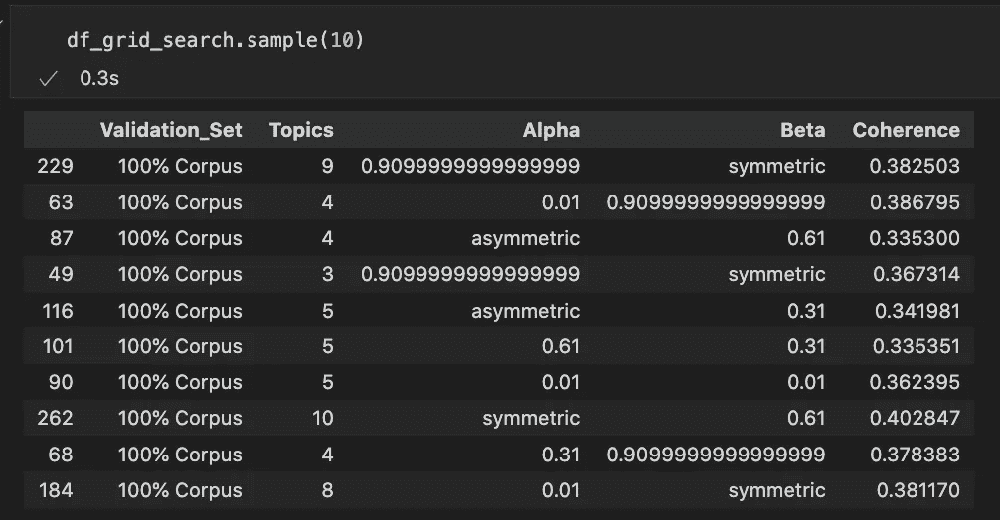
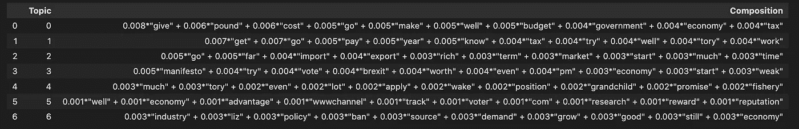
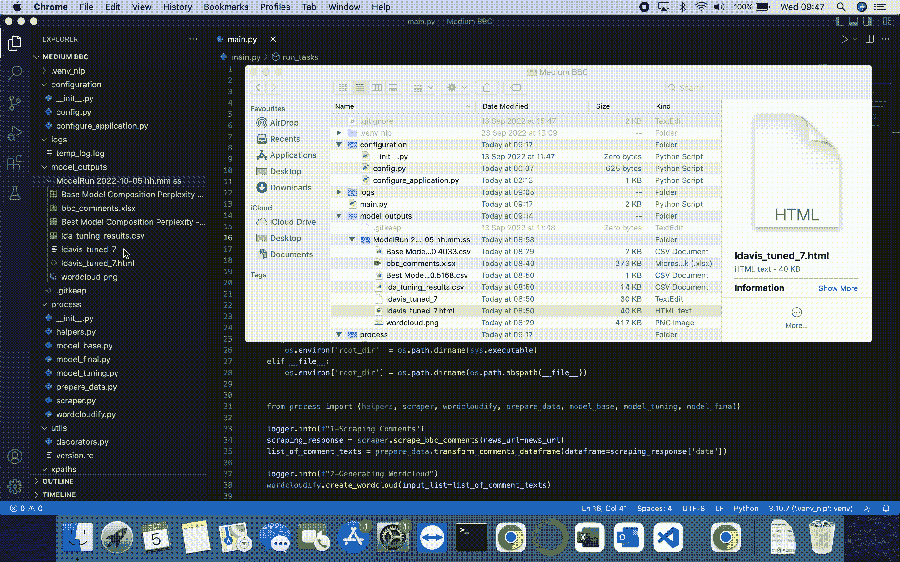

# 英国生活费用评论的主题模型

> 原文：<https://medium.com/geekculture/topic-modelling-on-the-uks-cost-of-living-comments-e7fbf43b30ef?source=collection_archive---------12----------------------->

## 根据英国广播公司的新闻数据

随着 2022 年欧洲能源费用的上涨，**生活成本(CoL)** 已经成为媒体关注的焦点话题之一。它有自己的 BBC 新闻栏目，读者可以在该栏目下对许多新闻发表评论。

partial screenshot of bbc.co.uk/news

在我看到一篇有用的文章(请见下文)从“主题建模”的角度介绍了 NLP 之后，我决定实验一下分析英国公众的热烈评论部分会产生什么结果。

 [## 用 Gensim (Python)进行主题建模

### 主题建模是一种从大量文本中理解和提取隐藏主题的技术。潜在的狄利克雷…

www.machinelearningplus.com](https://www.machinelearningplus.com/nlp/topic-modeling-gensim-python/) 

为了做到这一点，我选择了下面这篇 BBC 新闻文章，这篇文章在评论上吸引了大量愤怒和失望的在线用户。

 [## 减税计划后英镑创历史新低

### 随着市场对英国 50 年来最大规模的减税做出反应，英镑兑美元汇率跌至创纪录低点…

www.bbc.co.uk](https://www.bbc.co.uk/news/business-63030208) 

> 声明:这篇文章是关于主题建模和潜在的狄利克雷分配 **(LDA)** 在一个新的数据集上的采用，使用了其他作者的文章中解释的领域已知的函数，并且假设你已经理解了这些主题。如果没有，可以通过[ [1](https://towardsdatascience.com/topic-modeling-and-latent-dirichlet-allocation-in-python-9bf156893c24) 、[ [2](https://towardsdatascience.com/topic-modeling-with-lsa-plsa-lda-nmf-bertopic-top2vec-a-comparison-5e6ce4b1e4a5) 、[ [3](https://github.com/kapadias/mediumposts/blob/master/natural_language_processing/topic_modeling/notebooks/Evaluate%20Topic%20Models.ipynb) ]这样的刊物来提升自己的知识。

本帖使用的代码，请 [**点击此处**](https://github.com/mesutcanalkan/Medium-BBC_NLP) 。

## **造型结构和流程**

该模型需要一个到 BBC 新闻的 URL 链接来运行任务。按顺序，脚本:

*   配置环境变量，
*   创建与模型应用程序相关的文件夹(即“ModelRun YYYY-MM-DD hh:mm:ss”格式的日志和模型输出文件夹)
*   借助 Python 的 selenium 模块访问 BBC 新闻网站
*   点击更多评论和更多回复按钮(由 HTML 元素 XPATHs 引导),直到没有更多按钮可点击
*   抓取评论以及用户名，喜欢，不喜欢的数量等。
*   转换此评论数据框以保留评分最高(喜欢或不喜欢)的评论文本的样本
*   生成单词云
*   从评论中构建语料库和关键映射变量
*   运行基本 LDA 模型
*   通过迭代参数列表运行多个 LDA 模型(网格搜索)
*   找到产生最高一致性分数的最佳参数集
*   最后保存来自最高性能模型的主题可视化的 HTML 版本。

Model Folder Structure, image by author

如上所述，运行脚本有 6 个主要步骤(在琥珀色矩形中突出显示)。其余的文件用于支持流程文件夹中编码的任务。

## 抓取评论

在 Selenium 的帮助下，该脚本创建了一个 chrome 浏览器，反复点击(首先)更多的评论按钮和(然后)更多的回复按钮，直到没有什么可点击的。

Comment Scraping, gif by author

经过几个小时的运行，终于收集到了评论:

image by author

## 生成单词云

Worcloud 是从部分处理的评论中产生的。

image by author

## 构建语料库

对评论执行一些文本预处理(停用词去除、词条化、形成二元模型)。

image by author

## **运行基础模型**

基础模型有 10 个主题，困惑度为-7.3810，连贯性得分为 0.4033。我们试图提高这个一致性分数。

image by author

## **寻找最佳模特**

基于不同数量的主题以及 alpha 和 beta 参数，执行了网格搜索。

image by author

## 可视化最佳模型

最佳模型有 7 个主题，困惑度为-7.0584，连贯性得分为 0.5168。

image by author

正如下面的 gif 图所示，两个主题构成了文档中讨论的主题的最大部分，占总令牌的 69.4%(分别为 37.9%和 31.5%)。虽然第一个是更多的成本，英镑和预算，第二个是更多的税收和紧缩政策。其余的话题重叠，是关于英国退出欧盟、政治家、进出口等。

model visual, gif by author

## 吸取的教训

通过分析新闻评论进行话题建模，可以洞察在线用户认为哪些话题是重要的，以及他们对这些话题的感受。然而，我相信，如果新闻是关于一个更两极分化的主题，如选举、英国退出欧盟或疫苗犹豫，结果会更具解释性，主题会更有特色(较少重叠)。让我们希望 BBC 也允许人们在其他新闻栏目发表评论来表达他们的观点。