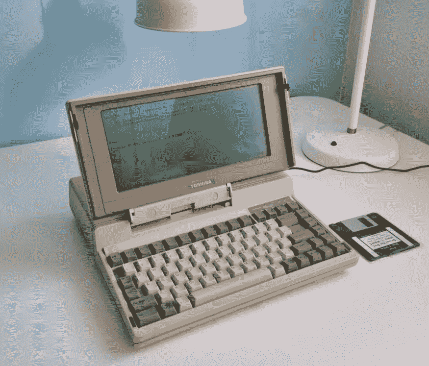

# 东芝 T1100 —为什么不带硬盘的笔记本电脑被评为 IEEE 电子工程里程碑？

> 原文：<https://medium.com/geekculture/toshiba-t1100-why-a-laptop-without-a-hard-drive-was-named-an-ieee-milestone-of-electronic-574a8f71b5ec?source=collection_archive---------1----------------------->

1985 年，一台笔记本电脑,“面向移动专业人士”,电池续航时间长达 8 小时，售价 1899 美元。怎么可能呢？这是这个故事的主人公，东芝 T1100 Plus:

让我们来看看它是如何工作的。

# 规范