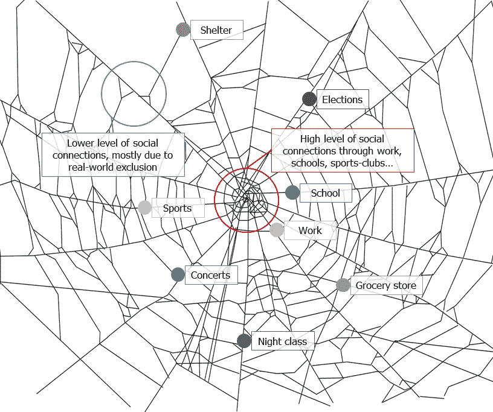

# 走向分权社会

> 原文：<https://medium.com/geekculture/towards-a-decentralized-society-3a644762d573?source=collection_archive---------7----------------------->

## “灵魂绑定”令牌可以通过关注现实世界的社会联系来修复加密

NFT 被广泛鄙视，这是理所当然的。他们倾向于[促进过度资本主义的行为](https://www.thepourquoipas.com/post/nfts-are-just-another-way-for-the-rich-to-get-richer)，[他们破坏环境，他们来自中央集权的实体，这些实体经常公然谎报他们的价值](https://www.thepourquoipas.com/post/why-nfts-are-dumb) …不胜枚举。然而，每年都有数十亿投资在这项技术上。而[的很多](https://www.thepourquoipas.com/post/why-the-tokenization-of-carbon-credits-is-a-terrible-idea) …