# 走向 Meta RL

> 原文：<https://medium.com/geekculture/towards-meta-rl-b80586019292?source=collection_archive---------6----------------------->

一个机器学习模型一般需要大量样本来训练。

另一方面，人类能够更有效地学习技能和概念。例如，一个只见过几次猫和狗的孩子能够很快区分它们。

即使你只看过一个样品，你也能认出同一台机器，即使一个像素接一个像素完全不同。

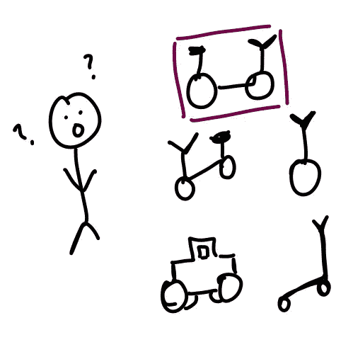

知道如何打网球的人可以相当容易地学会如何打乒乓球。元学习提出了这样一种观点，即机器模型有可能被设计成具有类似的能力——就像只用几个训练样本进行学习一样。

元学习解决了当今构建机器学习模型的两个关键挑战:

1.  样本效率:为了识别手写数字，我们通常每个数字读取 6000 个样本
2.  可移植性差:机器学习模型无法从以前的经验或知识中学习。

一个好的元学习模型能够很好地适应或概括以前没有见过的新任务。元学习也被称为模型学习。

# 元学习问题

最佳元学习模型是在各种学习任务上训练的，并针对这些任务中的一些任务的最佳性能进行优化。每个任务都与包含特征向量和真实标签的数据集 *D* 相关联。

在这种情况下，最佳模型参数为:

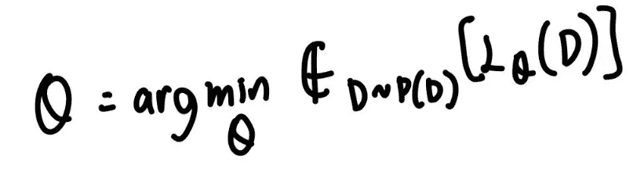

除了使用一个数据集作为一个数据样本之外，它与普通的学习任务是一样的。

**元监督学习:**

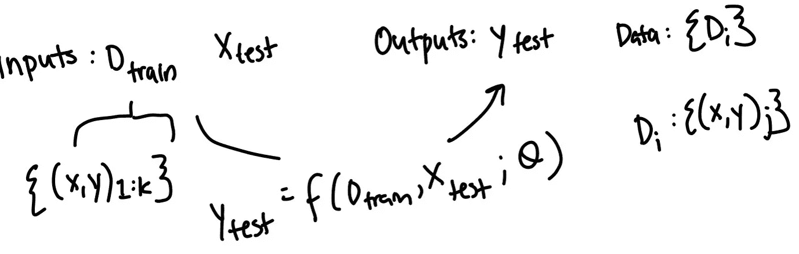

着手学习或训练这种学习过程(f 可以被视为学习过程)的方式是具有不同数据集形式的数据。每个数据集都有许多不同的输入和输出对。

对于这些任务中的每一个，你假设你至少有 k 个 D 训练的例子，并且至少有一个例子被用来观察你的学习者是否被概括。

这种元学习的观点将问题简化为 *f* 的设计和优化。如果我们可以设计一个好的函数，它接受一些数据的输入并优化这个函数，那么我们就有了一个可以应用于新任务的学习过程。

一个流行的例子是少数镜头分类。这是给你 5 个类中的一个例子，作为你的训练数据 *D* train，目标是将新的例子分类为这 5 个类中的一个。

数据集 *D* 被分成两部分——用于学习的支持集 S 和用于训练或测试的预测集 B，D = < S，B >。

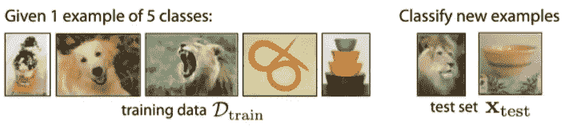

让我们说，你采取 5 个其他图像类，然后将其分为训练集和测试集，用于 5 个类的多个集合，跨这些类训练你的元学习者，并将训练数据集作为输入，并在每个任务测试集上产生正确的标签。

本质上，您正在学习如何学习底部的两个集合，这样您就可以归纳到尚未发现的数据和类。

你可能在做其他学习问题。它们不一定是分类问题。你可以尝试学习一些回归问题，或者尝试预测机器人执行不同任务的动态。

***……一切不都是元学习吗？***

随着我们解决更复杂的任务，我们对元学习的概念也在不断发展。

*   MNIST
*   IMageNet
*   少数镜头学习
*   给加说明文字

这些都是技术上的元学习例子。例如，解决图像字幕，将图像映射到解释图像的句子，也是元学习的一种形式。

我们需要问自己的问题是: ***我们能明确地从以前的经验中学习到高效的下游学习吗？***

这就是强化学习的用武之地。

RL 在人工智能领域受到了很多关注，因为它不需要带标签的数据，并且已经被证明在模拟环境和模仿“人类学习”过程方面更加有效。RL 与样本效率、概括和迁移学习作斗争。为了解决这些缺点，研究人员一直在探索 meta-RL 的思想，其中学习策略可以通过使用在具有共享结构的大量任务上获得的经验来快速适应新任务。

# 一个具体的元问题

Meta-RL 的目标是设计能够快速适应并随着经验的增加而改进的代理。

考虑像 HalfCheetah 这样的经典控制任务，由物理引擎 [MuJoCo](http://www.mujoco.org/) 引入。在这个环境中，你控制一个 2D 猎豹机器人，目标是让它尽可能快地向前跑。

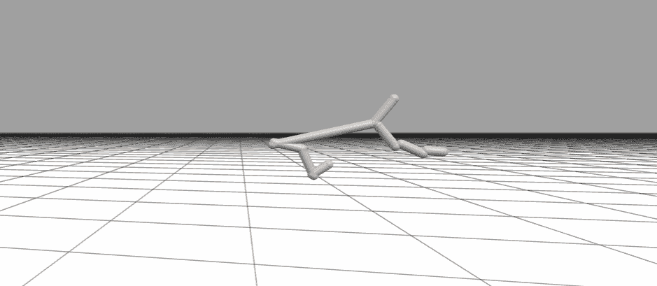

[*Brax*](https://github.com/google/brax) *HalfCheetah trained with* [*PPO [6]*](https://arxiv.org/abs/1707.06347)*.*

现在，让我们考虑对环境做一点小小的修改，包括一个目标速度。代理的目标是向前跑并达到这个速度。这个目标只能通过获得的奖励来推断。因为代理人没有任何关于运动、环境或目标的知识，它的行为就像一个未经训练的网络，观察状态向量，有时(如果幸运的话)会获得奖励。

有了目标速度 v，并使用像 PPO [6]这样的持续控制的行动者-评论家方法，代理可以学习以速度 v 向前跑。然而，想象我们现在想要考虑一个新的目标-速度 v '

正常的做法是将代理送回环境中并对其进行重新培训。问题是学习过程是不可预测的，而且很难保证代理人能多快学会一项新政策。

不过，理论上，代理人有关于运动和速度的信息。给定来自环境的良好且信息丰富的信号，我们希望代理快速适应并更新其策略以达到新的目标速度。像这样设计代理是元强化学习的主要目标。

# 元 rl 问题的定义和表述

在 MDP 的分布上训练元 RL 模型。对于测试来说，它将能够学会快速解决一项新任务。meta-RL 的目标是雄心勃勃的，朝着通用算法又前进了一步。例如，我们可以元学习强化学习任务。

首先，我认为定义关键问题和差异很重要。

**强化学习:**

对于强化学习，你用强化学习问题代替监督学习问题来代替每一行。我们的目标是学习一个策略，pi，它使用一些状态动作奖励下一个状态转换，从状态映射到动作。目标是学习圆周率，这样你就能最大化你的预期回报。

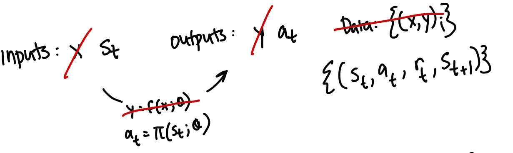

**元强化学习:**

我们可以把这变成一个元强化学习问题的方法是通过尝试从少量的数据中学习，例如从一些策略中有 k 个展开。我们希望从中学习，当给定一个新的状态时，我们可以有效地预测从该状态采取的良好行动。

因此，你也可以像某些函数或某些学习者 *f* 一样，接受它试图学习的输入(训练数据集)。它根据自己的经验和当前任务以及当前状态来预测相应的动作。我们将拥有的数据将是数据集的数据集，每个数据集对应于一个不同的任务。

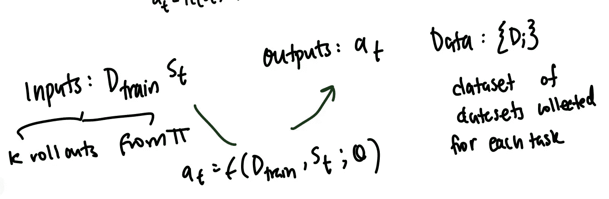

问题还在于函数 f 的设计和优化，我们需要弄清楚它实际上如何从这些数据中学习，以及我们如何优化它来从这些数据中学习。元强化学习问题的另一个重要部分是如何收集适当的数据( *D* train)，因为这是在强化学习环境中直接控制的。

这部分问题是学习探索——弄清楚你应该如何收集这种训练数据，并探索新的任务，以便数据为解决任务提供有效的信息。

本质上，这部分问题是学习探索部分，比如弄清楚应该如何收集这些训练数据，

作为一个具体的例子，我们可以做的一件事是从几个例子中找出如何解决一个迷宫。

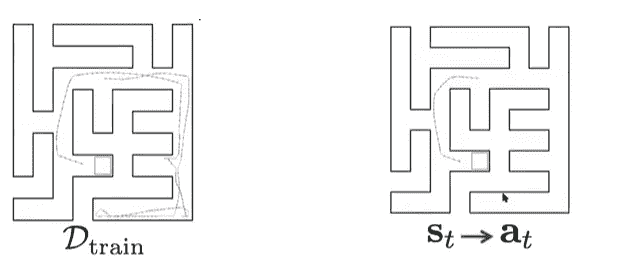

**通过学习如何学习许多其他任务:**

你学习如何学习许多其他的迷宫。你让模型在迷宫中经历不同的经历，然后训练它用少量的数据解决这个迷宫。

# 方法类

# 黑盒或基于上下文的方法

我们已经讨论过如何使用这个函数来接收训练数据集和状态，并输出相应的动作。

一个非常简单的方法就是用一个大的神经网络来参数化这个学习者。

例如，它可以是一个递归神经网络，依次输入数据并输出动作。

您可能想知道这与仅仅用递归策略进行强化学习有什么不同。

一个变化是你把奖励传递到这个政策中。通常，如果你只是应用一个循环策略，你可能不会传递奖励。最大的区别是，你的循环网络的隐藏状态实际上是在一个任务中跨集维护的。

这允许你实际上适应一个跨多集的任务，并保持关于那个任务的记忆和跨多集学习那个任务。

这个功能可以用标准的强化学习方法(例如，策略梯度)来优化

在黑盒方法中，模型用神经网络重新参数化学习者——本质上是在给定一些新信息的情况下适应学习者。这种类型的网络的一些优点是它非常普遍和富有表现力。

递归神经网络可以在相当温和的假设下近似任何函数，这让我们可以近似许多类型的学习过程。

在架构中有多种设计选择，这为您希望 it 如何实际处理数据提供了一定的灵活性。这种方法的缺点是，它是一个复杂的模型，其任务是学习非常复杂的东西，本质上是从数据中学习。它必须能够处理这些数据，并将这些数据转化成某种东西。关于任务的信息告诉它如何在不同的环境中行动。

例如，可以用神经网络重新参数化学习者。这种方法的一些好处是它非常通用，也非常有表现力。在一种相当温和的假设下，递归神经网络可以逼近任何函数。

这种方法的缺点是，它是一个复杂的模型，任务是从数据中学习复杂的东西。它必须真正能够处理这些数据，并将这些数据转化为有关任务的信息，以通知其未来的行动。

因为它必须完全从零开始学习这个复杂的任务，所以有时很难训练这些模型。有时，它们还需要大量不切实际的数据来进行有效优化。

# 优化方法

基于优化的元学习的起点就是这种微调的思想。微调的工作方式是，您有一组预训练的参数数据，并使用新任务的训练数据对这些预训练的参数运行梯度下降。例如，您可能会在 ImageNet 等数据数据集上预先训练一些神经网络参数，然后在一个规模更小的数据集上针对您关心的一些新任务微调参数，以获得一些适用于该新任务的参数文件。

我们希望能够将这一点扩展到少数机会学习环境中。现在，不幸的是，如果你在 ImageNet 这样的东西上预先训练，然后只在几个例子上微调，它可能不会工作得很好，因为模型可能会过度适应少量的样本。相反，该模型应该为一组交易前参数进行显式优化，这样微调就能很好地工作。

假设我们有一组预先训练好的参数数据。您可以在新任务中从这些参数运行一个或几个梯度下降步骤，然后针对保留数据优化这些微调参数的性能。你不仅可以对一项任务这样做，还可以对元训练集中的所有任务都这样做，这样你就有希望转移到新的任务上。

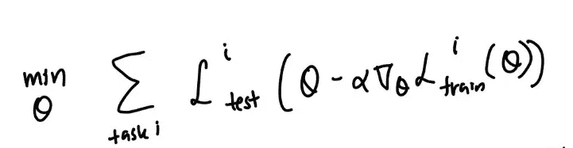

本质上，当在该元学习过程中使用分级下降时，该模型将特别针对初始预训练参数进行优化。这种想法是学习初始参数集或初始特征的关键，这些参数集或初始特征可通过少量梯度步骤和少量数据有效传递。

目测，这是什么样子的？

你可以把元学习过程看作一条细黑线。

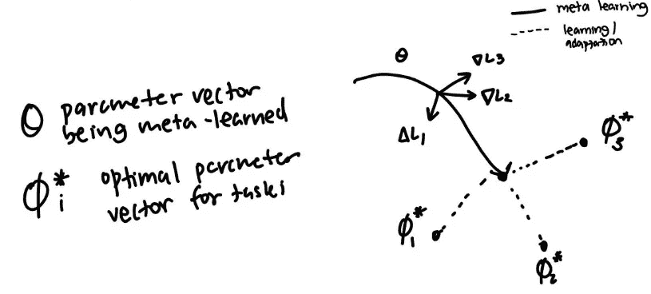

如果你处于元训练过程中的某一点，并且你从测试三开始采取一个梯度步骤，你将离测试三的最佳状态很远，这同样适用于所有其他任务。

然而，在元训练过程的最后，如果你在测试三的方向上采取梯度步骤，你就接近最优。同样的，如果你对测试一或者测试二进行梯度测试，结果也是一样的。

总之，您正在尝试在参数空间中设置一个测试，这样您就可以针对不同的测试快速调整到最佳的参数向量。

这种算法被称为模型不可知模型学习，是一种基于优化的元学习算法的例子。

还有其他方法，你可以扭曲它，例如，你可以在这里学习学习率，或者你可以使用其他内部优化，而不仅仅是梯度下降。在强化学习的背景下，这可能看起来像是试图学习一组初始特征或表示空间，在这些特征或表示空间下，强化学习非常快。

***有没有一种方法可以让我们学习一个表象，在这个表象下 RL 是快的？***

例如，您可能希望四足蚂蚁代理在不同的方向上运行。所以，你对它进行元训练，让它能跑向不同的方向。在元训练过程的最后，但在你采取梯度步骤之前，你会得到一个这样的策略。

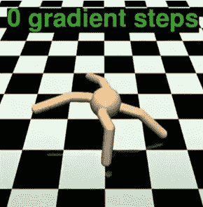

蚂蚁本质上就像原地跑步——它准备好向任何方向跑。

如果你采取一个梯度步骤，一个关于向后运行的梯度步骤，你会得到一个像这样的向后运行的策略。如果你对向前跑的任务采取一个梯度步骤，你会得到一个看起来像右边的策略。

希望这能让我们更直观地了解这种基于模型的方法为什么以及如何运作。

我们可以将这种方法与基于模型的强化学习设置相结合，我们希望能够适应环境中的不同动态。特别是，我们希望能够完全在线适应。

我们可以存储某种最近的历史，然后在学习动力学模型上使用梯度下降的一个步骤来适应那些最后的时间步骤。

然后，我们将获得更新的模型参数，并运行规划或模型预测控制(MPC)——基本上是在我们需要将其带回新环境时，使用该模型在每个时间设置进行规划。

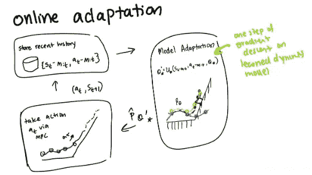

如果你从零开始，采用一个梯度步骤的模型，你不会做得很好。我们所做的是元训练这个代理能够适应不同的动态使用 MAML 或模型不可知的元学习算法。我们训练它，使它能够适应一个梯度步骤。

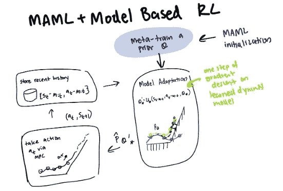

动态变化的一个例子可能是，如果你弄残了一个代理的腿，或者作为一个代理，你不得不在一些平台上跑。如果您在这些环境中运行标准的基于模型的 RL，没有任何调整，您会得到看起来不是最佳的行为。如果我们将这种次优行为与元学习方法相结合，并训练它快速在线适应动态变化，智能体可以找出如何快速进化以适应多种类型的变化，如变化的浮力或环境中的变化。

与为相同目的设计的其他模型相比，这种基于模型的 meta-RL 方法非常有效，这意味着它在真实机器人上运行实际上非常实用。

## 摘要

有两种不同的元强化学习方法。一种是这些黑盒方法，其中神经网络实现这种学习到学习的过程。其次是这些基于优化的元学习方法，其中在模型的学习过程中嵌入了梯度下降。

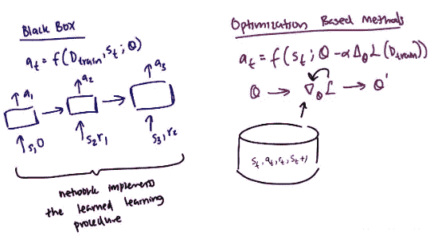

它们是非常相似的方法，但基于优化的元学习器的关键区别在于，在这个函数 f 中，有一个梯度算子，它根据训练数据集更新您的参数，而不仅仅是将训练数据吸收到神经网络中。

黑盒方法的一些好处是它非常通用和富于表现力。还有各种各样的设计选择和架构，但训练起来可能很有挑战性，而基于优化的方法通常更容易训练。

它也是模型不可知的。如果你已经有了架构，改变现有的架构是相当容易的。缺点是，有时使用强化学习方法，从强化学习方法中获得的梯度，如策略梯度或梯度，通常不能提供非常丰富的数据信息。有时，将这种方法与带有策略梯度的基于优化的方法结合起来实际上是具有挑战性的(特别是如果梯度有噪声或者具有高方差的话)

# 公开挑战

元学习领域，特别是元强化学习，提出了许多独特的挑战，限制了我们对该领域的理解和基于元的算法的实现进展。

# 适应全新的任务

我们显然可以相对容易地适应不同的动力学模型，例如不同的地形，或者适应在不同的方向或不同的迷宫中奔跑。在许多情况下，我们可能想要采用比元训练集更明显不同的东西。

我们应该遵循更广泛地应用于机器学习领域的一般原则，即元训练和元测试的任务分配是相同的。这两组数据都需要广泛的任务分配来进行元训练。如果一个模型被期望去适应一些新的东西，任务分配需要相当广泛。

我们实际上可以从哪里获得这种广泛的任务分配呢？

我们可以参考现有的 RL 基准，但是像 OpenAI Gym 或 Atari 基准这样的东西并不完全适合这些类型的问题，因为任务彼此不同，或者没有足够的任务来支持新任务的泛化。

考虑到这一点，已经开发了许多基准来研究元强化学习，如元世界基准和炼金术。

元世界有 50 个任务，来自非常不同的操纵设置，目标是以一种新的方式操纵一个对象，使其有效地研究元学习算法。

[https://meta-world.github.io/](https://meta-world.github.io/)

这个基准很有趣，因为研究人员不需要太担心 RL 在这些任务上失败——他们可以专注于不同任务之间的学习迁移。如果您实际应用元学习算法，并且现有的元学习算法应用于这个基准，它们根本不会做得很好，因为到目前为止，将方法扩展到这一点是具有挑战性的。

炼金术是元学习的另一个流行基准。这是一款 3D 视频游戏，通过一系列试玩整合成剧集。

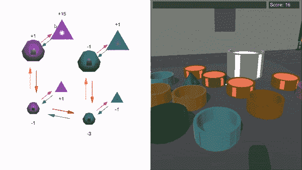

[Alchemy: Structured Task Distribution for Reinforcement Learning](https://www.deepmind.com/publications/alchemy-a-structured-task-distribution-for-meta-reinforcement-learning-f)

研究人员评估了两种强力深层强化剂(黑斑羚和 V-MPO)的炼金术环境。尽管这些代理在单任务 RL 环境中表现很好，但即使经过大量训练，它们的表现也很差。

# 采购:任务来自哪里？

需要有一种方法来为元学习定义这些任务。我们元学习算法，并假设任务是给定的，但这也意味着人类需要能够将它们提供给代理。需要设计手动定义的任务分配和相应的奖励。

理想情况下，我们会希望有算法本身的机制来为它提出要解决的任务。

从中得出的关键是，我们需要从零开始摆脱强化学习方法。Meta RL 为此提供了一种有效的方法。

**Meta-RL 有三个组成部分:**

*   一个有记忆的模型——保持一个隐藏状态+可以通过更新隐藏状态来获取和记忆关于当前任务的知识
*   元学习算法——决定我们如何更新模型权重来优化，以便在测试时快速解决一个看不见的任务。
*   MDP 的分布([马尔可夫决策过程](https://towardsdatascience.com/introduction-to-reinforcement-learning-markov-decision-process-44c533ebf8da) ) —通过暴露代理必须学习如何适应不同的 MDP。

# 论元语言的未来

Meta-RL 创新的更广泛影响令人兴奋，因为它有助于我们进行改进，并更好地理解元学习，因为它适用于一般的机器学习。研究的总趋势是避免微调模型，而是使用元学习算法来寻找最佳架构和超参数。

即使在 meta-RL 中，我们可能会看到不同的模型被测试以产生最佳结果，我们也可能会开始看到该领域的研究被应用到快速变化的环境中。

例如，强化学习的最大应用之一仍然是药物发现和分子模拟。关于我们可以在 RL 模型中模拟的这些环境，有趣的是人类生物学是多么的不同。即使开始了解环境的复杂性也是一项挑战。能够微调参数和调整环境为减少训练时间和计算能力以及创建更准确的预测和模拟提供了巨大的机会。

在更广泛的层面上，为了更好地理解人类的学习，我们可能会开始看到甚至监控学习者通过经验提高的确切点，这可以帮助我们建立更好的模型和解决更困难的问题。

> “我们应该停止试图寻找简单的方法来思考头脑的内容，例如思考空间、物体、多代理人或对称性的简单方法。所有这些都是任意的、内在复杂的外部世界的一部分。它们不是应该内置的，因为它们的复杂性是无穷无尽的；相反，我们应该只构建能够发现和捕捉这种任意复杂性的元方法。”—理查德·萨顿，《惨痛的教训》(2019 年 3 月 13 日)

## ***随时联系我*** 🔗
[Linkedin](https://linkedin.com/in/anya-singh)|[Twitter](https://twitter.com/_anyasingh)|[网站](http://anyasingh.com/) | [子栈](https://lstm.substack.com/)

👇**更多资源** [Oriol Vinyals:元学习的视角与前沿](https://www.youtube.com/watch?v=9j4iH9TPTd8)[https://lilianweng.github.io/posts/2019-06-23-meta-rl/](https://lilianweng.github.io/posts/2019-06-23-meta-rl/)
[https://www.youtube.com/watch?v=TPNs9sNNQwc](https://www.youtube.com/watch?v=TPNs9sNNQwc)