# 蟒蛇皮的河内塔

> 原文：<https://medium.com/geekculture/tower-of-hanoi-in-python-3de58db9e2b5?source=collection_archive---------1----------------------->

**河内塔是什么？**

河内塔是一个有三个塔的问题，让我们用塔 A，塔 B 和塔 c 来标记它，在塔 A 中，我们有 n 个圆盘。任务是使用塔 b 将所有磁盘从塔 A 移动到塔 C


**问题的由来-**

这个问题是法国数学家爱德华·卢卡斯(douard Lucas)在 19 世纪提出的。这个问题与印度教神话有关。这也被称为梵天之塔或卢卡斯塔。

这个问题相信是无法解决的。因为这背后是有故事的。这与神庙的祭司有关。据说在印度的 Kashi Vishwanath 寺庙里，有一堆 64 个金色的圆盘，一个放在另一个上面。牧师们正试图重新排列另一座塔上多年前的圆盘。他们曾经认为，一旦所有 64 个磁盘都被成功移动，世界就将毁灭。另一个版本的故事是关于越南的河内。金盘属于那里。

这个数学难题被认为是无法解决的。但是在递归的帮助下，这个问题变得很容易解决。

**什么是递归？就编程而言，递归是一个调用自身的函数。递归中有一个基本情况有助于终止递归。如果基本案例不存在，那么它将永远不会终止。**

**规则求解** [**汉诺塔问题**](https://www.interviewbit.com/online-python-compiler/) **—**

*   在每一步中，只允许移动一个磁盘。
*   任何磁盘都不应覆盖其较小的磁盘。这意味着，如果磁盘大小为 2，则不能放在大小为 1 的磁盘上，但可以放在比该磁盘更大的任何其他磁盘上。


因此，要将这些磁盘从塔 A 移动到塔 c，必须应用这两个条件。只有两个塔，我们无法移动磁盘。因此，我们采取了一个辅助塔(塔 B)来实现这一点。

因此，还需要满足的额外条件是，我们必须使用塔 B 来临时保存磁盘，因为我们不能将磁盘放在塔外。

**问题陈述:**

我们如何借助递归来解决这个问题呢？为了更好地理解解决方案。我们先来了解一下只有 1 个磁盘时需要遵循的步骤。因为这将是我们解决方案的基础。

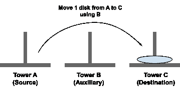

因此，只需移动 1 个磁盘，我们只需将这 1 个磁盘从源移动到目标。然后算法是这样的— **使用辅助塔**将磁盘从源移动到目标。虽然我们没有使用那个辅助塔，但是考虑一下。

那么对于两个磁盘，步骤应该是这样的-

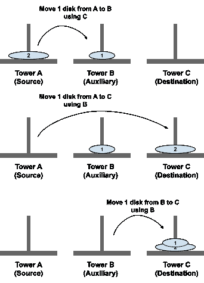

所以，移动两个磁盘的算法是-

**TOH( A，B，C，2)**

*   TOH(阿、乙、丙、1)
*   从 A 到 C 的电影盘
*   TOH

那么使用这种方法，我们可以用任意数量的磁盘来解决这个问题吗？所以我们举个例子，借助 4 个磁盘来求解。
如果我们考虑 4 个磁盘的塔，那么我们可以判断，要将这 4 个磁盘从源塔移动到目标塔，我们需要遵循一些步骤-

*   我们必须将 4 个磁盘中的 3 个从源塔(塔 A)移到辅助塔(塔 B)。

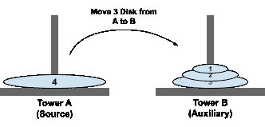

*   然后将第 4 个磁盘从源塔(塔 A)移到目标塔(塔 C)。


*   最后，将 3 个磁盘从辅助塔(塔 B)移动到目标塔(塔 C)。

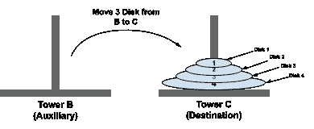

**问题解决**，只需 3 个简单的步骤就能得出问题的解决方案。但是解决这个问题的条件 1 是我们一次只需要移动一个磁盘。但是这里我们一次移动 3 个磁盘(将 3 个磁盘从 A 移动到 B，将 3 个磁盘从 B 移动到 C)。我们如何解决这个问题？

那么，为什么我们不能做一件事，在第一步，不是移动 3 个磁盘，而是让某人将 1 个磁盘从源移动到目标，然后那个人要求其他人做同样的事情，然后我们相应地继续进行？是的，这就是我们要做的递归函数，这将解决我们的问题。

**现在让我们深入探究解决这个难题的每一个步骤-**

我们总共给出了 4 个圆盘和 3 个塔‘A’、‘B’和‘C’。任务是按照河内塔的规则将这个磁盘从塔‘A’(源)移动到塔‘B’(目的地)。所以用 4 个圆盘解决汉诺塔问题的步骤是-

**给定-**

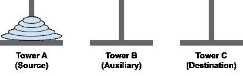

**步骤-**

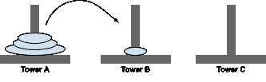

**步骤 1:使用 C 将磁盘从 A 移动到 B:**

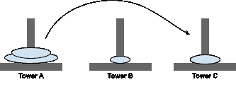

**步骤 2:使用 B 将磁盘从 A 移动到 C:**

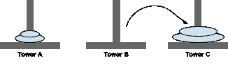

**步骤 3:使用 A 将磁盘从 B 移动到 C:**

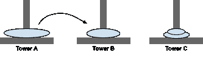

**步骤 4:使用 C 将磁盘从 A 移动到 B:**

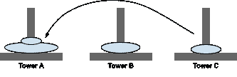

**第五步:使用 B 将磁盘从 C 移动到 A:**

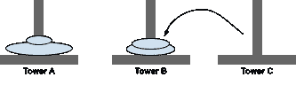

**步骤 6:使用 A 将磁盘从 C 移动到 B:**

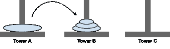

**步骤 7:使用 C 将磁盘从 A 移动到 B:**

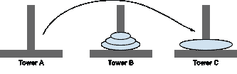

**步骤 8:使用 B 将磁盘从 A 移动到 C:**

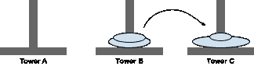

**步骤 9:使用 A 将磁盘从 B 移动到 C:**

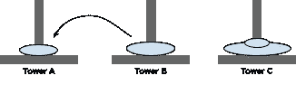

**第十步:使用 C:**
+将磁盘从 B 移动到 A

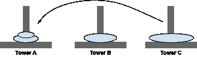

**步骤 11:使用 B 将磁盘从 C 移动到 A:**


**步骤 12:使用 A 将磁盘从 B 移动到 C:**

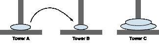

**步骤 13:使用 C 将磁盘从 A 移动到 B:**

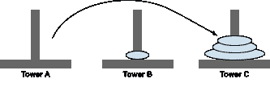

**步骤 14:使用 B 将磁盘从 A 移动到 C:**

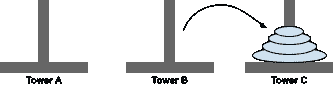

**第 15 步:使用 a 将磁盘从 B 移动到 C。**

**因此，用 4 个步骤求解汉诺塔的算法将是-**

**TOH(源，辅助，目的地，4)**

*   **TOH(** 来源，目的地，辅助，3)
*   使用辅助设备将磁盘从源移动到目标。
*   **TOH** (辅助，来源，目的，3)

**求解汉诺塔 4 盘的 Python 代码将-**

**输入— 4 个磁盘。**
**输出-**

**使用 C 将 1 个磁盘从 A 移到 B。
使用 B 将 1 个磁盘从 A 移到 C。
使用 A 将 1 个磁盘从 B 移到 C。
使用 C 将 1 个磁盘从 A 移到 B。
使用 B 将 1 个磁盘从 C 移到 A。
使用 A 将 1 个磁盘从 C 移到 B。
使用 C 将 1 个磁盘从 A 移到 B。
使用 B 将 1 个磁盘从 A 移到 C。
使用 A 将 1 个磁盘从 B 移动到 C。
使用 C 将 1 个磁盘从 B 移动到 A。
使用 B 将 1 个磁盘从 C 移动到 A。
使用 A 将 1 个磁盘从 B 移动到 C。
使用 C 将 1 个磁盘从 A 移动到 B。
使用 B 将 1 个磁盘从 A 移动到 C。
使用 A 将 1 个磁盘从 B 移动到 C。**

**现在考虑用 5 个圆盘的问题的解法——**

我们已经得到了 5 个磁盘的堆栈排列在塔' A '来源。现在我们需要按照汉诺塔规则将这个磁盘从源移动到目标塔 C。所以用 5 个圆盘解谜的步骤是-

**给定-**

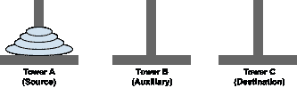

**步骤-**

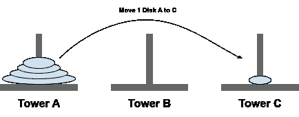

**第一步:使用 b 将一个磁盘从 A 移动到 C**

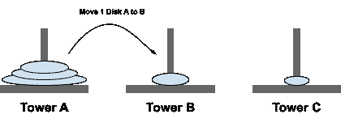

**第二步:使用 c 将一个磁盘从 A 移动到 B**

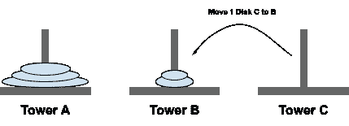

**第三步:使用 a 将一个磁盘从 C 移动到 B。**


**第四步:使用 b 将一个磁盘从 A 移动到 C。**

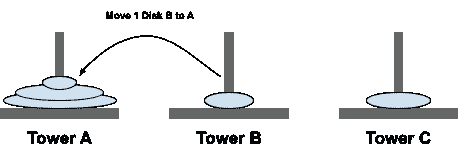

**步骤 5:使用 c 将 1 个磁盘从 B 移动到 A**

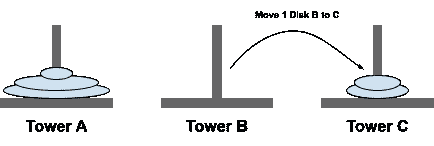

**第六步:使用 a 将一个磁盘从 B 移动到 C**

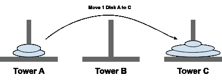

**第 7 步:使用 b 将 1 个磁盘从 A 移动到 C**

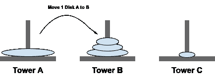

**步骤 8:使用 c 将 1 个磁盘从 A 移动到 B**

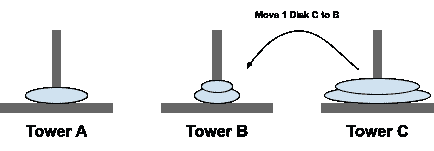

**步骤 9:使用 a 将一个磁盘从 C 移动到 B。**

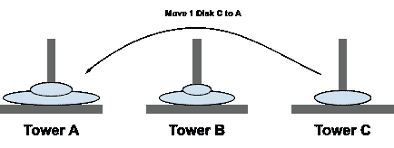

**步骤 10:使用 b 将 1 个磁盘从 C 移动到 A。**

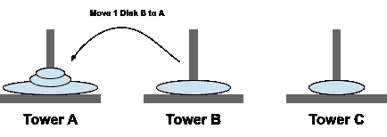

**步骤 11:使用 c 将 1 个磁盘从 B 移动到 A**

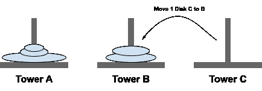

**步骤 12:使用 a 将一个磁盘从 C 移动到 B**

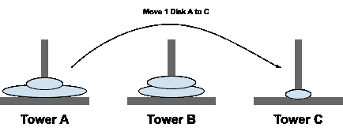

**步骤 13:使用 b 将 1 张磁盘从 A 移动到 C。**

**步骤 14:使用 c 将 1 个磁盘从 A 移动到 B**

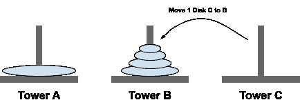

**步骤 15:使用 a 将一个磁盘从 C 移动到 B。**

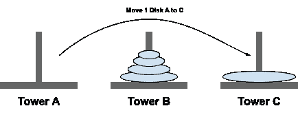

**步骤 16:使用 b 将 1 个磁盘从 A 移动到 C**

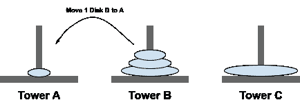

**步骤 17:使用 c 将 1 个磁盘从 B 移动到 A**

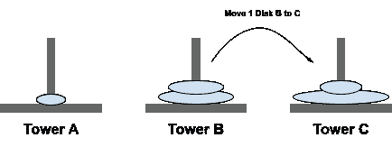

**步骤 18:使用 a 将一个磁盘从 B 移动到 C**

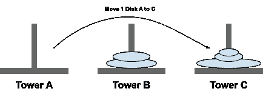

**步骤 19:使用 b 将 1 个磁盘从 A 移动到 C。**

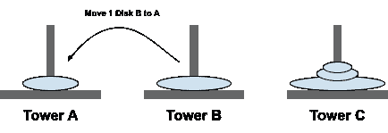

**步骤 20:使用 c 将一个磁盘从 B 移动到 A**


**步骤 21:使用 a 将一个磁盘从 C 移动到 B**

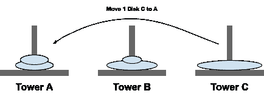

**步骤 22:使用 b 将一个磁盘从 C 移动到 A**

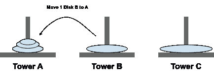

**步骤 23:使用 c 将 1 个磁盘从 B 移动到 A。**

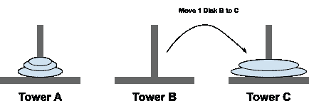

**步骤 24:使用 a 将一个磁盘从 B 移动到 C。**


**步骤 25:使用 b 将一个磁盘从 A 移动到 C**

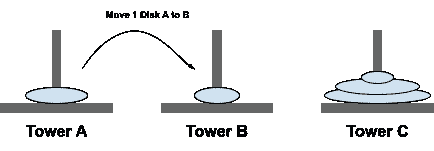

**步骤 26:使用 c 将 1 个磁盘从 A 移动到 B。**


**步骤 27:使用 a 将 1 个磁盘从 C 移动到 B。**

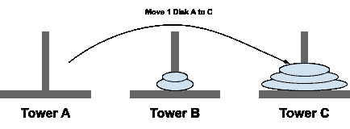

**步骤 28:使用 b 将 1 个磁盘从 A 移动到 C。**

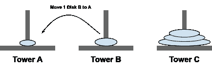

**步骤 29:使用 c 将 1 个磁盘从 B 移动到 A。**

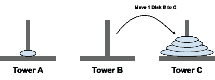

**步骤 30:使用 a 将 1 个磁盘从 B 移动到 C。**

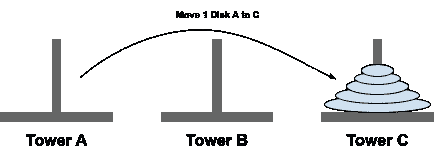

**步骤 31:使用 b 将 1 个磁盘从 A 移动到 C。**

**因此，具有 5 个圆盘的汉诺塔的解的算法将是-**

**TOH(来源，辅助，目的地，5)**

*   TOH(源、目的地、辅助，4)
*   使用辅助设备将磁盘从源移动到目标。
*   TOH(辅助，源，目的地，4)

**用 5 个圆盘求解汉诺塔的 Python 代码—**

**输入— 5 盘。
输出—使用 B 将 1 个磁盘从 A 移动到 C。
使用 C 将 1 个磁盘从 A 移动到 B。
使用 A 将 1 个磁盘从 C 移动到 B。
使用 B 将 1 个磁盘从 A 移动到 C。
使用 C 将 1 个磁盘从 B 移动到 A。
使用 A 将 1 个磁盘从 B 移动到 C。
使用 B 将 1 个磁盘从 A 移动到 C。
使用 C.
使用 A 将 1 个磁盘从 C 移动到 B .
使用 B 将 1 个磁盘从 C 移动到 A .
使用 C 将 1 个磁盘从 C 移动到 B .
使用 B 将 1 个磁盘从 A 移动到 C .
使用 C 将 1 个磁盘从 A 移动到 B .
使用 A 将 1 个磁盘从 C 移动到 B .
使用 B 将 1 个磁盘从 A 移动到 C。
使用 C 将 1 个磁盘从 B 移动到 A。
使用 A 将 1 个磁盘从 B 移动到 C。
使用 B 将 1 个磁盘从 A 移动到 C。
使用 C 将 1 个磁盘从 B 移动到 B。
使用 A 将 1 个磁盘从 C 移动到 B。
使用 B 将 1 个磁盘从 B 移动到 A。
使用 C 将 1 个磁盘从 B 移动到 A。
使用 A 将 1 个磁盘从 B 移动到 C。
使用 B 将 1 个磁盘从 A 移至 C。
使用 C 将 1 个磁盘从 A 移至 B。
使用 A 将 1 个磁盘从 C 移至 B。
使用 B 将 1 个磁盘从 A 移至 C。
使用 C 将 1 个磁盘从 B 移至 A。
使用 A 将 1 个磁盘从 B 移至 C。
使用 B 将 1 个磁盘从 A 移至 C。**

在分析了用 4 个和 5 个圆盘求解汉诺塔的这两个例子之后，n 个圆盘的算法将是-

**TOH(源、辅助、目的、磁盘)**

*   TOH(源、目标、辅助、磁盘)
*   使用辅助设备将磁盘从源移动到目标。
*   TOH(辅助，源，目标，磁盘)

**算法说明—**

就像我们上面对 4 磁盘解决方案的分析一样，

*   对于任意 n 个磁盘，首先将 n-1 个磁盘从源移动到辅助。
*   然后，第 n 个磁盘将从源塔移动到目标塔。
*   最后，n-1 个磁盘将从辅助塔移动到目标塔。

并且这 n-1 次移动被递归地调用，使得各个函数调用负责处理每次调用中的 1 次磁盘移动。

**求解汉诺塔的 Python 程序是-**

```
def TOH(source, auxiliary, destination, numOfDisk):
 #Base case of Recursion that when there is no disk to move 
 #then terminate the call.
 if numOfDisk > 0:
 #Recursively calling for moving the n-1 disk from source
 #to auxiliary using destination. 
 TOH(source, destination, auxiliary, numOfDisk-1)#Moving the disk from source to destination
 print(“Move 1 disk from {0} to {1} using {2}.”
 .format(source, destination, auxiliary))

 #Recursively asking to move remaining disk from 
 #auxiliary to destination using source.
 TOH(auxiliary, source, destination, numOfDisk-1)if __name__ == “__main__”:
 numOfDisk = int(input())
 TOH(‘A’, ‘B’, ‘C’, numOfDisk)
```

**时间复杂度分析—**

如果我们检查解决这个问题的步骤，然后我们发现，首先它是递归调用(n-1)问题，然后它是一个常数步骤。并且再次递归调用(n-1)个步骤。所以在数学术语中，我们可以把时间函数表述为— **T(n) = 2T(n-1) +1。**

所以，如果我们解这个方程，那么时间复杂度将是 O(2n)。
虽然我们可以通过不同输入的步骤数来验证时间复杂度。

对于 1 个磁盘— 1 次移动。**(2^1–1)**
对于 2 盘— 3 移动。**(2^2–1)**
为 3 盘— 7 招。**(2^3–1)**
为 4 盘— 15 步棋。**(2^4–1)**
为 5 盘— 31 招。**(2^5–1)**

所以方程 **O(2n-1)的次数是 O(2n)。**

**空间复杂度**——由于时间花费为 **O(2n)** ，我们使用递归来解决问题。所以空间复杂度也将是 **O(2n)** 。因为递归使用调用堆栈。

**结论—**

汉诺塔是法国数学家爱德华·卢卡斯发现的一个数学难题。这个谜题是基于一些神话。
考虑到神庙牧师的例子，这个问题在现实世界中似乎无法解决。但是在使用递归的编程中。很容易解决。