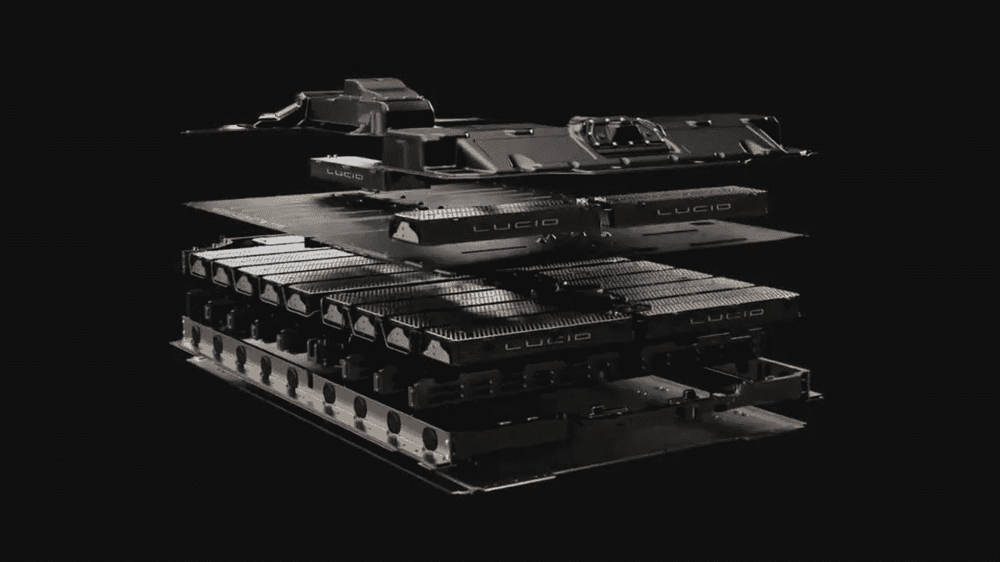
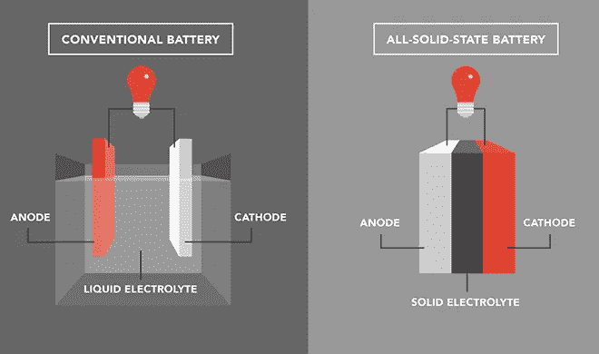
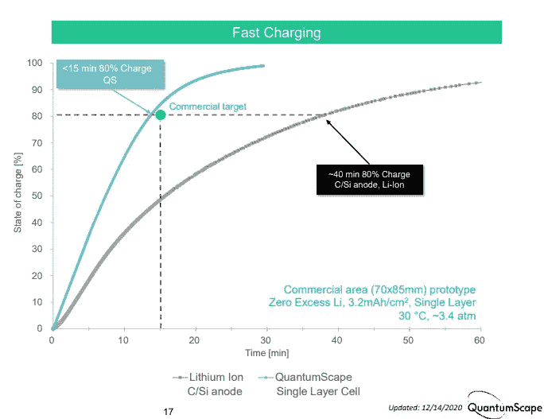
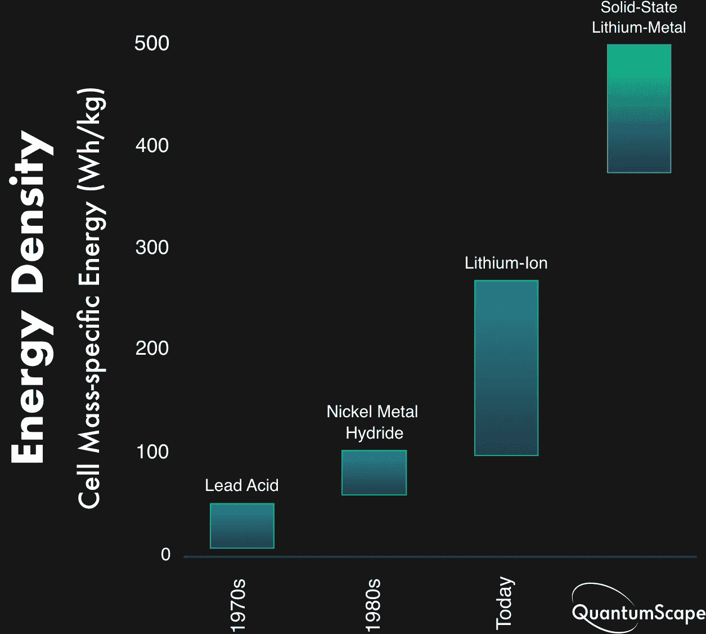
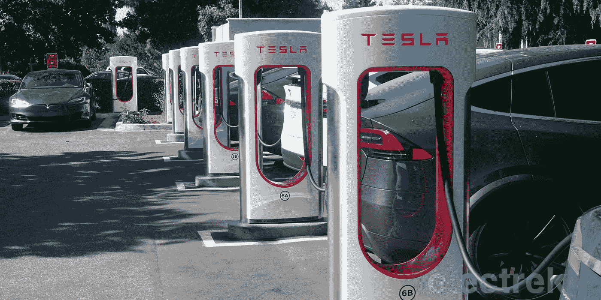

# 丰田发布了一款固态电池电动车。特斯拉会跟进吗？

> 原文：<https://medium.com/geekculture/toyota-is-releasing-a-solid-state-battery-ev-will-tesla-follow-57d4485c222a?source=collection_archive---------0----------------------->

## *什么是固态电池，为什么它会永远改变电动汽车的发展*

C 目前的电动汽车电池技术有许多不足之处，这使得它对于远程电动汽车来说并不理想。电池技术的进步增加了电动汽车的行驶里程和动力，但在便利性、成本和行驶里程方面，没有一项能与汽油车相提并论。然而，还是有希望的。固态电池技术提供了更好的解决方案。虽然不适合所有的应用，但这项新技术可能预示着电动汽车范围的改善，甚至创造一个全新的车辆类别。

# 什么是固态电池？

固态电池是一种可充电电池，其中电解液处于固态，而不是液态或气态。这意味着它们具有非常高的能量密度，可以快速放电和充电，并且没有易燃成分。

# 它们是如何工作的？

基本电池包含两个电极——被电解质隔开的阳极和阴极。当充电或放电时，电子在这两个电极之间交换，产生电流。

当产生电时，电解质将负离子(阳离子)从阴极传导到阳极，在其他时间保持它们分开。两个电极由另一种叫做隔膜的材料连接在一起。

在固态电池中，这种液体电解质被固体材料代替。这些材料具有高导电性，不能像液体电解质那样蒸发。这意味着热失控的风险大大降低，电池可以在更高的温度下使用。

# 是什么让它们优于传统的锂离子电池？

固态电池在四个关键领域优于现有电池技术:安全性、充电速度、行驶里程和能量密度。

## 安全

固态电池比传统的液体电解质电池更安全，因为没有易燃的电解质。因为电解质是固体，所以不存在可能导致热失控的点燃风险。固体材料在充电和放电时不会蒸发，因此在充电过程中不存在放热反应的风险。热失控通常发生在电池过热时，通常是由于过度充电或充电或运行期间造成的损坏。

## 充电速度

传统锂离子电池的另一个问题是难以快速充电。当电池充满时，需要时间来减缓离子的流动，当电池耗尽时，需要时间来建立电流。这使得充电时间不可预测，对车辆应用没有吸引力。

然而，固态电池可以在 15 分钟内充满 80%的电量。相比之下，现有的电池只能在 15 分钟内充电 50%。

Source: [QuantumScape](https://www.quantumscape.com/)

## 范围

固态电池可以比传统锂离子电池多充放电许多次而不会产生应变。这使得它们成为占市场大部分的远程电动汽车的理想选择。目前，锂离子电池在 1000 次循环后通常会丧失容量，而固态电池在 5000 次循环后仍能保持 90%的原始容量。

## 能量密度

电池的能量密度是每单位重量所能储存的能量。密度越高，电动车能储存的能量就越多。

固体电解质的使用意味着这些电池包含液体形式的电极，从而与传统电池相比增加了它们的能量密度。

下图表明，与其他电池技术相比，锂离子电池的能量密度很低，尤其是固态电池。

Source: [QuantumScape](https://www.quantumscape.com/)

## 车辆的其他部分呢？

目前，远程电动汽车需要大而重的电池组来实现其里程。随着更轻、更便宜和更强大的固态电池的出现，重量减轻了很多。与价格相当的锂离子技术相比，这些新电池的尺寸也可以减少三分之二。

这些因素结合起来意味着固态电池将为远程电动汽车提供无与伦比的用户体验。

# 为什么今天的电动汽车不使用固态电池？

固态电池的研究仍处于初级阶段。固态技术不适合某些应用，需要进一步开发才能大规模应用。因此，这些技术还需要一段时间才能证明它可以在价格、实际可用性、规模、耐用性和基础设施上与锂离子电池竞争。

## 费用

如果固态技术将适用于大众市场的电动汽车，成本必须下降。目前，它们每千瓦的成本是锂离子电池的 3 倍，但锂离子电池所用材料的成本仅占总成本的 20%。对廉价材料的更多研究将会降低价格，使这项技术在大众市场上可行。

## 真实世界的可用性

虽然固态电池在实验室测试时具有与锂离子电池类似的性能，但在现实条件下更难实现这种快速充电。实验室测试中的快速充电时间只有在使用实验室级材料和充电设备的情况下才有可能，因为这些材料和设备对于电动汽车来说太贵了。

## 规模

固态电池仍处于开发阶段，尚未大规模生产。然而，汽车公司、大学和开创固态电池生产的初创企业对此很感兴趣。荷兰在 2017 年 5 月宣布，作为其能源创新议程的一部分，将向固态电池投资超过 9 亿€。

## 持久性

没有第三方对固态电池的长期使用进行测试，以将其与传统的锂离子电池进行比较。这使得很难说它们是否会比电动车中的传统锂离子电池持续更长时间，传统锂离子电池需要持续 10 年或更长时间。汽车的固态电池只能和它周围的其他部件一样好。确保所有组件都兼容，并且不会出现电池过热或性能下降等问题，这对于电动汽车在未来多年内保持平稳运行至关重要。

## 充电基础设施

Tesla Supercharger infrastructure

充电站需要能够处理比传统锂离子电池快得多的充电。配备无法应对新技术的设备的充电站可能无法全速与固态电池兼容，并可能导致热失控。充电技术还需要能够处理固态电池有潜力实现的非常大的充电功率。

# 丰田投资固态电池

考虑到所有这些潜在的缺点，很高兴在这个领域看到大量的投资和 R&D。最近，丰田[宣布](https://asia.nikkei.com/Spotlight/Most-read-in-2020/Toyota-s-game-changing-solid-state-battery-en-route-for-2021-debut)一款使用固态电池的原型车，将于今年公布。鉴于他们拥有 1000 多项固态电池专利，而且日本创建了一个 190 亿美元的绿色基金，其中包括对固态技术的投资，看到他们走在前列并不奇怪。

因此，虽然固态电池可能还没有准备好广泛用于电动汽车，但投资者在未来交通技术的这一重要领域值得关注。这项技术有可能动摇电动汽车行业，创造另一项技术突破，改善世界各地人民的生活。

# 特斯拉会跟进吗？

鉴于这一切，特斯拉不积极开发这项技术令人惊讶。这肯定很符合他们的“总体规划”。然而，他们的许多专利都是围绕电池充电和充电基础设施的，这表明他们很清楚固态电池的潜力，可能只是在等待技术更加成熟，然后再采取行动。

# 概括起来

总之，固态电池可能是理想的技术，有助于为所有消费者提供负担得起、现实和真正愉快的远程电动汽车。但距离大规模实施还有一段路要走。成本必须降下来，技术需要在真实环境中测试，基础设施需要改进。一如既往，一步一个脚印。

随着如此多的资金投入到这项新技术中，它有可能在未来几年内成为现实。因此，随着产量的增加，更多的研究和固态电池价格的进一步下降只是时间问题。那么这项新技术可能很快就会进入你电动汽车。