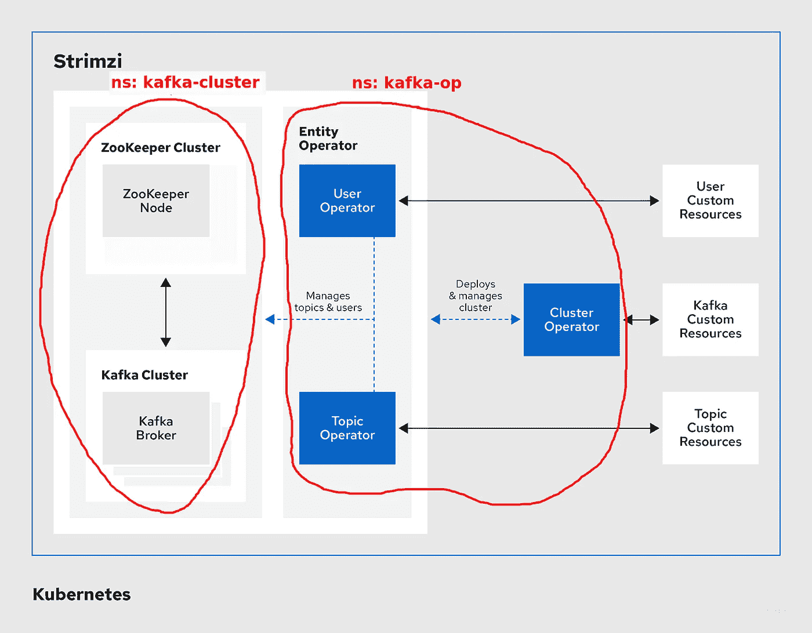
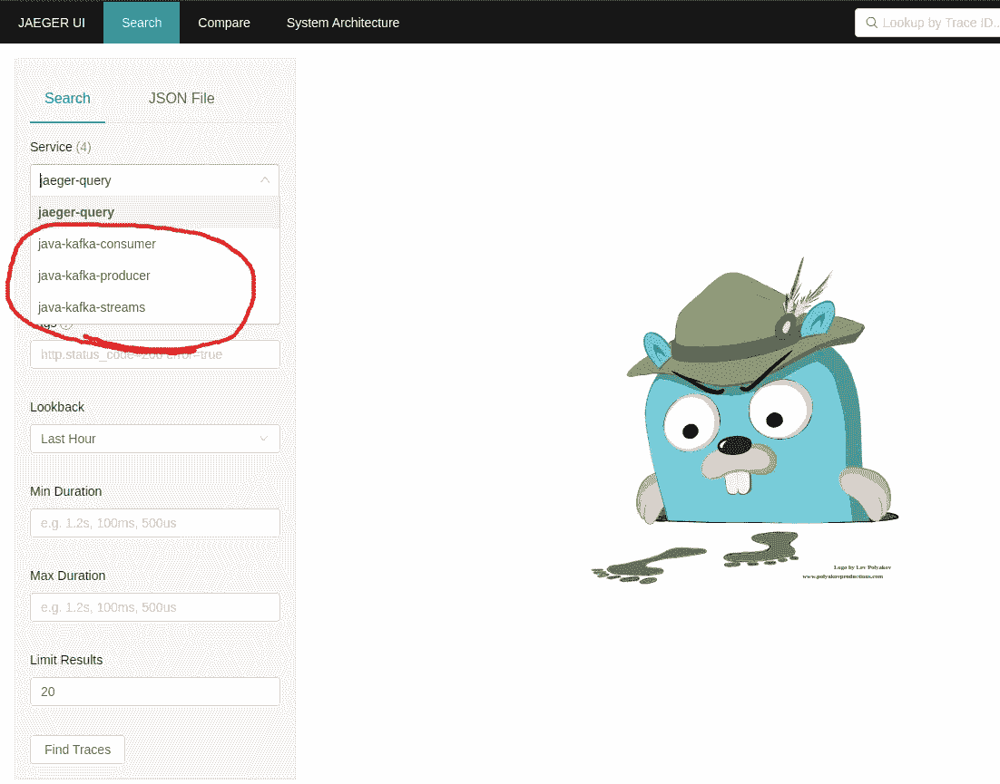
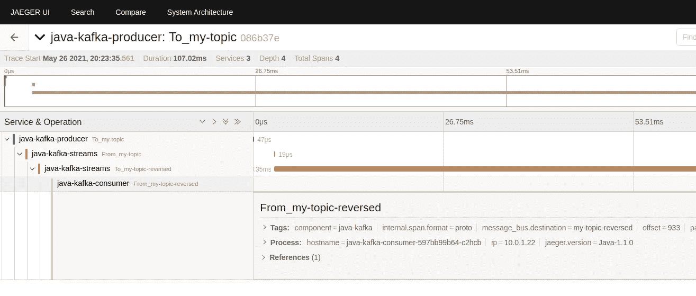

# 用 Strimzi 和 Jaeger 在 K8s 上追踪卡夫卡的信息

> 原文：<https://medium.com/geekculture/tracing-kafka-messages-on-k8s-with-strimzi-and-jaeger-5f2e737c69ea?source=collection_archive---------24----------------------->

这篇文章以及 GitHub repo 背后的[为当今 IT 行业备受关注的话题提供了一个实用的介绍:](https://github.com/gkoenig/strimzi-jaeger-eval)

*   [Kafka](https://kafka.apache.org/) :非常流行的流媒体信息平台/数据中心
*   [Kubernetes](https://kubernetes.io/) :容器编排框架，或者更好的说法:现代云原生应用的“操作系统”
*   追踪:作为可观察性的一部分，基于 [OpenTelemetry 框架](https://opentelemetry.io/)(源自 OpenTracing 和 OpenCensus)

这篇文章没有介绍所使用的工具的概念，因此，如果你不知道 Kafka 或 Kubernetes 是什么，请首先查看该文档(例如，通过上面列表中的链接)。它也没有涵盖如何实现 Kafka 生产者/消费者。
另一方面，它将提供一个快速的“演练”风格的指南，告诉你如何将不同的部分粘在一起以获得一个运行的系统并让你开始…..从系统架构/工程的角度来看；)

**！k**Udo 感谢 Strimzi 和 Flux 团队出色的文档！！！！！

# 我们将使用哪些工具/环境？

整体设置包括

*   **GKE** :我们将使用谷歌云平台来建立一个 Kubernetes 集群，但是任何其他启动 Kubernetes 集群的方式也可以。实践步骤不依赖于任何专门的 Kubernetes 提供者。
*   卡夫卡:我们将使用 [**Strimzi**](https://strimzi.io/) 在 Kubernetes 上设置卡夫卡。它提供了一种非常优雅的方式(通过操作符)来配置 Kubernetes 集群中 Kafka 生态系统的不同组件。Strimzi 中的追踪支持由 OpenTracing 和 Jaeger 提供。
*   [**耶格**](https://www.jaegertracing.io/) :收集和可视化分布式痕迹的流行工具(套)
*   可选 [**Flux v2**](https://fluxcd.io/) : GitOps 工具，通过“git push”将应用程序部署到 Kubernetes。在详细说明中，我将展示两个选项来设置 Kafka &主题。您可以选择“手动”方法，即通过 kubectl cli 应用 yaml 清单，或者使用 GitOps 方法并让 Flux 观察 Git 报告…..并让它从那里应用清单/库斯托米化模板/舵图表。在我的例子中，它将是 [Kustomize](https://kustomize.io/) 。
*   所有代码和详细的分步说明，你会发现在[这个 GitHub repo](https://github.com/gkoenig/strimzi-jaeger-eval)

# 我们想要实现什么？

简而言之，我们希望看到消息在 Kafka 主题中流动时的轨迹，显示在 Jaeger UI 中。

# 我们如何实现这一目标？

为了不重复[Git repo 的自述文件](https://github.com/gkoenig/strimzi-jaeger-eval/blob/main/Readme.md)中非常详细的说明，我将在这里描述主要的主题。希望在 GitHub 的 Readme 和这篇文章之间切换不会太混乱，但是在这里复制整个漫长的故事是没有意义的…

**在 GCP**
上启动 K8s 集群——在 GCP 创建一个新项目，名为*strim zi-and-jaeger-eval*
——[install*g cloud*CLI](https://cloud.google.com/sdk/docs/install#rpm)
——执行:

```
gcloud config configuration create strimzi-jaeger
gcloud config set project strimzi-and-jaeger-eval
gcloud auth login
gcloud container clusters create strimzi-jaeger-eval \
 --num-nodes=2 \
 --zone=europe-central2-a \
 --machine-type=e2-standard-2
```

**将 Strimzi 操作符部署到它自己的名称空间“Kafka-op”**
配置和部署操作符的说明在这里可以找到[。最后，您应该看到操作员的部署已经启动并运行:](https://github.com/gkoenig/strimzi-jaeger-eval#deploy-strimzi-operator)

```
#>kubectl get deployments -n kafka-op
NAME                    READY UP-TO-DATE AVAILABLE AGE
strimzi-cluster-operator 1/1       1         1     51s
```

非常准确地说，我们总共安装了 3 个 Strimzi 操作符(参见下一章下面的概述图):
- *集群操作符*:管理 Kafka 生态系统中的 Kafka 集群组件
- *主题操作符*:管理 Kafka 主题
- *实体操作符*:主要管理用户及其权限

**接下来，让我们设置一个 3 节点 Kafka 集群，带有一个单节点 Zookeeper** ，此时仍然需要 Zookeeper，但 Kafka 社区已经为即将推出的版本提供了一个解决方案，其中删除了 Zookeeper，因此您不再需要从 Kafka 到 Zookeeper 的依赖关系:D
Kafka 将可以通过端口 9092 访问，无需身份验证和加密，也可以通过端口 9093 tls 加密。此外，我们在端口 9094 上有一个面向外部的侦听器，它是通过节点端口服务创建的。

为了实际部署 Kafka 集群，我将提供两种不同的方法。一种方法是通过执行 *kubectl* 命令来应用普通的 yaml 清单，另一种方法是使用 GitOps-tool Flux，这样 Kafka 规范就可以在您将它们推送到 Git 时应用到 K8s 集群。

随便挑一个:
- [手动](https://github.com/gkoenig/strimzi-jaeger-eval/blob/main/Kafka-setup-manual.md)
-[GitOps 方式](https://github.com/gkoenig/strimzi-jaeger-eval/blob/main/Kafka-setup-GitOps.md)

基本上，到目前为止，我们所拥有的是一个 Strimzi 集群操作符，它正在观察要部署的 kafka 组件的名称空间“kafka-cluster”。这意味着，无论何时你为 Kafka 生态系统的其他组件编写清单，这个操作符都会起作用。只要您将它们放入正确的名称空间(在我们的例子中是“kafka-cluster”)！这是一个常见的混淆来源，例如，如果您将 Kafka-Connect 资源部署到默认名称空间中，并且您想知道为什么没有创建任何东西；)

**当前设置概述**(基本图片取自 Strimzi 文档):



为了测试 Kafka 设置，我们可以快速启动一个生产者和一个消费者来发送和接收一些消息。我们将使用主题“我的第一主题”，它是 Kafka 设置的一部分(独立于您选择的选项，手动或 GitOps)

打开终端并启动生成器:

```
kubectl run kafka-producer -ti \
--image=strimzi/kafka:latest-kafka-2.4.0 \
--rm=true — restart=Never \
--bin/kafka-console-producer.sh — broker-list strimzi-cluster-kafka-bootstrap.kafka-cluster:9092 — topic my-first-topic
```

并且在另一个终端中，启动一个消费者:

```
kubectl run kafka-consumer -ti \
--image=strimzi/kafka:latest-kafka-2.4.0 \
--rm=true — restart=Never \
--bin/kafka-console-consumer.sh — bootstrap-server strimzi-cluster-kafka-bootstrap.kafka-cluster:9092 — topic my-first-topic — from-beginning
```

现在，只需在生产者运行的终端中输入一些文本，按下<enter>后，每行文本将出现在消费者终端中</enter>

# 对于追踪部分，让我们现在设置耶格

同样，你可以在 GitHub repo 的[自述文件中找到详细的分步说明。](https://github.com/gkoenig/strimzi-jaeger-eval#deploying-jager-core-components)

出于演示的目的，我们使用 Jaeger 的一体化套件就足够了。这意味着所有 Jaeger 组件都在一个二进制文件中。对于真正的生产用例，您不希望采用这种方法，而是使用[生产策略](https://www.jaegertracing.io/docs/1.22/operator/#deployment-strategies)。
尤其是您想要为现实世界场景更改的存储后端，一体化捆绑包仅附带内存存储，并且您无法将其扩展到一个副本以上。

我们打开 Jaeger UI 吧！

由于在我们的设置中无法从 K8s 集群外部访问 Jaeger-UI(缺省端口 16686 ),所以我们只需通过 kubectl = >

```
kubectl port-forward service/my-jaeger-query 8080:16686
```

现在你可以通过打开

```
http://localhost:8080
```

我们到了= >


酷，所以**让我们创建一些包含寻人信息**的卡夫卡信息，这样我们就可以在积家界面中显示它们。

为了覆盖这一点，我们将使用 strimzi-examples 中的一个基于 Java 的场景，该场景包括
-生产者:向主题“我的主题”
生成 Kafka 消息、纯字符串；-流应用:从主题“我的主题”中读取，反转字符串并将其存储在主题“我的反转主题”
-消费者:读取反转的字符串的主题

这些应用程序是用 Java 编写的，它们使用核心 Kafka 生产者/消费者类的“拦截器”,来创建并向 Jaeger 代理发出跟踪。完整的分步说明再次出现，是在 [GitHub repo](https://github.com/gkoenig/strimzi-jaeger-eval#first-tracing-in-action) 中，再次你可以在手动设置和 GitOps 方式之间选择。

作为一个例子，生产者的配置。JAEGER_AGENT_HOST 属性需要设置为 JAEGER 代理的 servicename。JAEGER_SERVICE_NAME 的值将出现在 Jaeger-UI 中，以选择某些服务:

```
apiVersion: apps/v1
kind: Deployment
metadata:
  labels:
    app: java-kafka-producer
  name: java-kafka-producer
  namespace: kafka-cluster
spec:
  replicas: 1
  selector:
    matchLabels:
      app: java-kafka-producertemplate:
  metadata:
    labels:
      app: java-kafka-producer
  spec:
    containers:
    - name: java-kafka-producer
      image: quay.io/strimzi-examples/java-kafka-producer:latest
      env:
        - name: BOOTSTRAP_SERVERS
          value: strimzi-cluster-kafka-bootstrap.kafka-cluster:9092
        - name: TOPIC
          value: my-topic
        - name: DELAY_MS
          value: "1000"
        - name: LOG_LEVEL
          value: "INFO"
        - name: MESSAGE_COUNT
          value: "1000000"
        - name: JAEGER_SERVICE_NAME
          value: java-kafka-producer
        - name: JAEGER_AGENT_HOST
          value: my-jaeger-agent.default
        - name: JAEGER_SAMPLER_TYPE
          value: const
        - name: JAEGER_SAMPLER_PARAM
          value: "1"
```

一旦 producer+streams app+consumer 被部署，它们将开始生成消息，当然还有跟踪。

现在回到 Jaeger-UI(http://localhost:8080)，刷新页面，点击左上方的下拉框“服务”。在这里，您应该会看到 3 个附加服务，分别对应于我们部署的每个应用程序，并且名称应该与每个服务的 JAEGER_SERVICE_NAME 属性相匹配。



太棒了。！这意味着我们的应用程序向 jaeger 代理发出跟踪，然后它们被转发到 Jaeger 收集器并存储在后端(仅存储在内存中，因为我们使用了一体化 Jaeger 包)。

选择您想要的服务，然后单击“查找跟踪”按钮以显示所有跟踪。从结果列表中，您可以再次单击其中一个结果来打开该特定跟踪的详细视图。

例如，如果你打开服务“java-kafka-producer”并点击一个跟踪，你会看到类似= >



在这里，你可以跟随卡夫卡信息的不同阶段。生产者将其制作成主题“我的主题”，随后是来自流应用程序的 2 个活动，因为它必须消费(从我的主题)和生产(到我的主题反转)。最后，消费者阅读主题“我的主题反转”。如果您从链中单击您想要的步骤，您可以看到每个特定步骤的计时和附加信息。

如果你做到了这一点，非常感谢你的耐心，这是一个相当长的时间。希望我能够提高你对如何在 Kubernetes 上设置 Kafka 和在 Kafka 信息中创建痕迹的兴趣，如果这能够启动你进入这些领域的旅程，我会非常高兴。

当然，部署和配置工具的方式总是不止一种，但是**您必须以某种方式启动**。例如，您也可以通过 Helm chart 设置 Strimzi，但我只是不想将 Helm 作为此演示的附加工具，或者如果您在 AWS 上，您可以使用 X 射线而不是 Jaeger，而不是使用 Flux，还有其他工具可以提供 GitOps 风格的解决方案，等等。
对我(和这篇文章)来说，重要的是你开始使用它，并思考如何将它应用到你的用例中。如果你在最后用另一个工具代替了一个工具，就不那么重要了。你必须先消化这些概念。

我将通过在这个设置中部署 Kafka 生态系统的附加工具，主要是 Kafka-Connect，来改进这个设置，所以请继续关注即将到来的新闻。