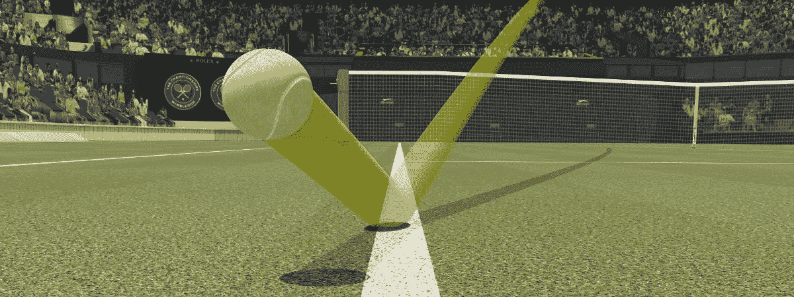
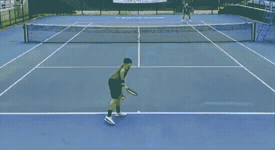
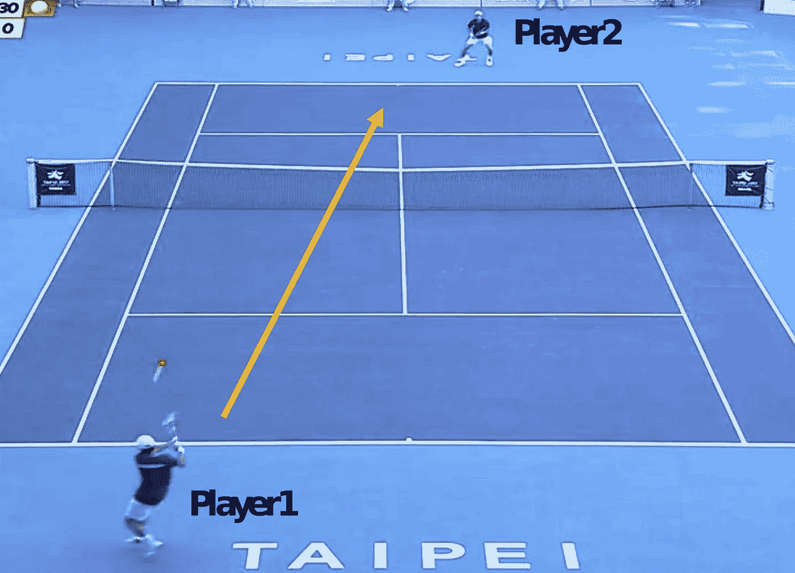
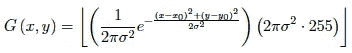
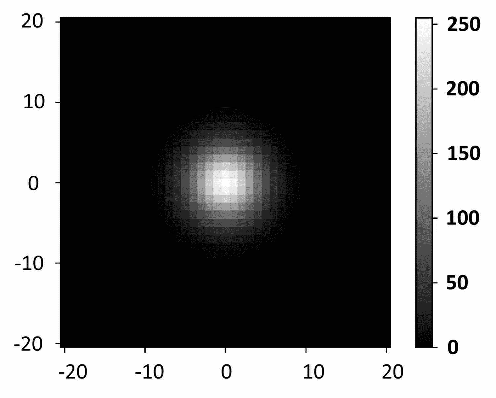
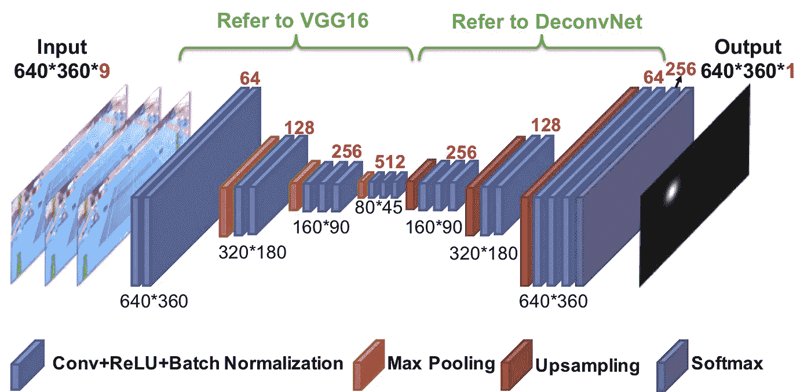
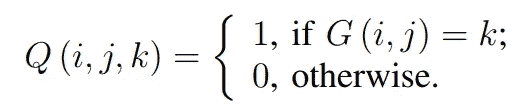
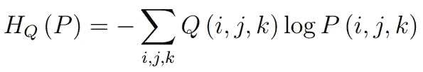
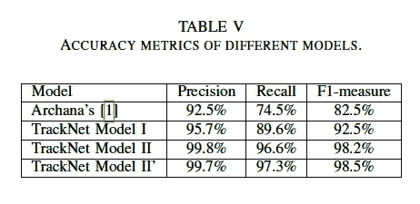
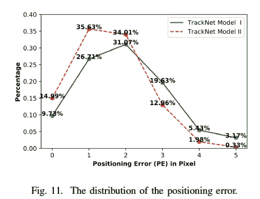

# 用跟踪网跟踪高速运动的物体

> 原文：<https://medium.com/geekculture/track-a-tennis-ball-with-computer-vision-4f8d2f9c0412?source=collection_archive---------2----------------------->

Image Source: [Hawk-Eye](https://www.hawkeyeinnovations.com/)

令人惊讶的是，如今的技术可以改变游戏的流程。球门线技术、VAR 和鹰眼都是现代技术在职业体育中应用的例子。这些技术的最终目标是防止人为失误，促进裁判的公正判罚。

计算机视觉已经走过了漫长的道路，它为球员、教练和球迷提供了各种有前途的工具来进一步改善他们的比赛。例如，**在网球比赛中，优秀选手与杰出选手的区别在于他们处理不同轨迹的能力。**

于是，看对方自动跟踪球并投射出轨迹的片子会更好。这可以让你更好地了解对手在不同情况下处理不同球的能力，并有希望在比赛中找到弱点进行攻击。

**本文介绍了跟踪高速微小物体的 CNN——TrackNet。**

就个人而言，TrackNet 是将计算机视觉融入体育运动的一个很好的例子，作者提出的方法既聪明又简单。

作为预览，下面的视频是 TrackNet[1]对我打网球的一个短片的结果。正如你所看到的，检测是相当准确的，跟踪球**即使当它被遮挡。**

Prediction of TrackNet.

# 轨道网

> 国立交通大学在 2019 年第 16 届 IEEE 高级视频和信号监控国际会议(AVSS)上介绍并发表了这篇论文

TrackNet 是一个基于热图的深度学习网络，不仅可以从单帧中识别网球，还可以从连续帧中学习飞行模式，这使得模型能够精确估计球的位置，即使球被球员或物体遮挡。

**track net 的精度、召回率和 F1-measure 分别为 99.7%、97.3%和 98.5%** ，显著高于传统的图像处理方法 Archana 算法[2]。

## 资料组

主要数据集来自 2017 年世界大学生夏季运动会网球男单决赛的转播视频。这些视频经过编辑，检索了 20，844 个与比赛相关的帧，从发球到得分。

> 向作者致敬，他们设法手工标记了超过 20，000 个帧，以从头开始训练模型。

每个框架都贴有以下标签:

1.  **帧名**:帧文件的名称。
2.  **可见性等级**:每一帧中球的可见性。0)表示球在框架外，1)表示球在框架内，2)表示球在框架内，但人眼无法定位。
3.  **(X，Y)** :网球在像素坐标中的坐标。由于网球的高移动速度，球可能会显示模糊，如图 1 所示。在这种情况下，球轨迹的最新位置被认为是位置。
4.  **轨迹模式**:球的运动类型，分为 0)飞行，1)击球，2)弹跳。

Figure 1\. The coordinate of the ball, which is at the latest position of the ball’s trace, is marked with red.

为了防止过度配合，9 个不同的网球场设置(粘土、草地、硬地等。)被记录以生成额外的 16，118 帧，并且以相同的方式被标记。这有助于模型通用化，并在许多不同的设置中执行得更好。

**事实是位于网球中心的放大 2D 高斯分布的热图**。高斯分布的方差指的是网球图像的直径，作者假设其大约为 10 个像素。高斯热图的等式可以写成:

*   第一部分表示以(x_o，y_o)为中心的具有方差的高斯分布
*   第二部分将热图缩放到范围[0，255]

图 3 显示了高斯热图的一个例子。

Figure 3\. Gaussian distribution at the center of the ball.

## **模型架构**

TrackNet 由卷积神经网络(CNN)和反卷积神经网络组成，如图 2 所示。输入是多个连续的帧。作者提出，拥有一个以上的输入帧可以通过学习轨迹模式来改进识别移动对象的模型。

Figure 2\. TrackNet Architecture.

利用 VGG16 进行特征提取，利用 DeconvNet 进行空间定位。

softmax 图层之后的输出表示网球的预测热图，其尺寸与输入图像相同，但具有 256 个通道。每个通道代表范围从[0，255]的灰度值。**预测的热图**用 softmax 激活进一步处理，以从可能的 256 个灰度值输出深度 k 的概率分布。选择概率最高的通道作为该像素的热图值。

**然后，实施阈值 128，以将灰度预测转换成二进制热图**。

最后用 ***休梯度法*** 通过检查帧内是否只有一个网球来过滤有效帧。**如果检测到一个网球，则返回该帧的中心点。**

> 这个中心点被保存，以后用于跟踪球的位置。

## 失败

Loss equation of TrackNet.

二元交叉熵 *H_Q(P)* 用于训练模型，其中

*   G(i，j)是高斯热图
*   Q(i，j，k)是高斯热图的二进制形式
*   P(i，j，k)是紧接 softmax 层之后的输出

## 结果和讨论

作者总共测试了四种模型来评估 TrackNet 的性能:

1.  **阿尔卡纳:**单帧输入+图像处理技术
2.  **TrackNet 模型一:**单帧输入+ CNN
3.  **TrackNet 模式二:**连续三帧输入+ CNN
4.  **TrackNet Model II':** 连续三帧输入+ CNN +预训练权重

TrackNet 在精度、召回率和 F1-measure 方面明显优于 Archana 的算法，分别达到 95.7%、89.6%和 92.5%。同样，很明显，使用**三个连续帧比使用单个帧**获得更高的结果。这进一步验证了作者的观点，即多帧为高速移动物体的模型提供了更多可训练的洞察力。

**定位误差**

定位误差是作者定义的另一个度量，用于测量预测误差的适当规格。作者将定位误差定义如下，

> 网球的平均直径是 5 个像素，并且球的单位尺寸内的预测误差不会引起轨迹识别的误导。
> 
> 因此，我们将定位误差(PE)规格定义为 5 个像素，以指示球是否被准确检测到。PE 大于 5 个像素的检测属于错误预测。

定位误差通过模型预测和地面实况之间的**欧几里德距离**计算。

您可以看到，总体而言，TrackNet 模型 II(多帧)比 TrackNet 模型 I(单帧)做出低定位误差预测的概率更高。

## 结论

**综上**， **TrackNet 是利用计算机视觉跟踪高速运动物体的有效方法。TrackNet 的最大优势之一是它克服了模糊和残留图像的问题，甚至可以通过学习其轨迹模式来检测被遮挡的球。**

## 资源

git 上提供了代码和论文，供您探索跟踪器并在您的视频上实现。

轨道网代码:[https://nol.cs.nctu.edu.tw:234/open-source/TrackNet](https://nol.cs.nctu.edu.tw:234/open-source/TrackNet)

论文:[https://arxiv.org/abs/1907.03698](https://arxiv.org/abs/1907.03698)

**参考文献**

[1]俞，“跟踪网络:深度学习网络从广播视频中跟踪网球”，硕士论文，由和关指导，国立交通大学，2018 年 4 月。

[2]阿尔恰纳和吉塔..(2015).广播网球视频中基于轨迹的目标检测与跟踪。计算机科学。58.225–232.10.1016/2015 . 08 . 060