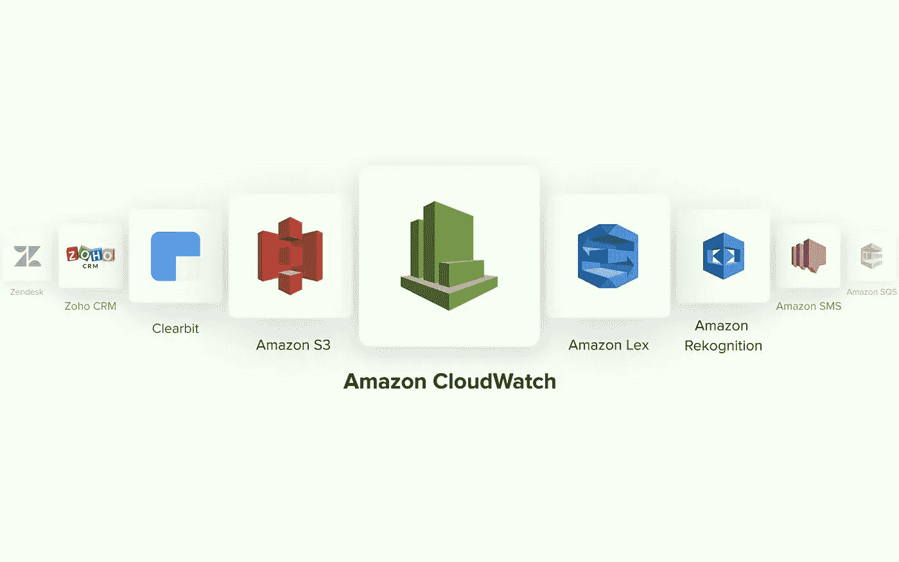

# 使用 Amazon CloudWatch 跟踪和增强应用程序的性能

> 原文：<https://medium.com/geekculture/track-and-enhance-performance-of-your-applications-with-amazon-cloudwatch-c5844fbc4ebd?source=collection_archive---------19----------------------->

您在监控全新云应用或微服务的性能方面是否面临困难？

监控对于确保通过云部署的所有服务以极高的效率平稳运行至关重要。

这就是亚马逊 CloudWatch 帮助你让事情保持正轨的地方。让我们深入了解一下亚马逊 CloudWatch 的细节。

# 亚马逊 CloudWatch 是什么？

[Amazon CloudWatch](https://www.quickwork.co/apps/amazon_cloudwatch/integrations) 是为 DevOps 工程师、IT 经理和开发人员打造的服务。它通过监控应用程序及其性能、资源利用率等来提供可靠的数据和见解。CloudWatch 以日志、事件和指标的形式收集运营数据。它提供了运行在 AWS 和本地服务器上的 AWS 资源、服务和应用程序的统一视图。

# 亚马逊 CloudWatch 功能

日志和指标是 Amazon CloudWatch 提供的两个主要服务。

日志服务提供服务和应用程序日志的存储、查看、捕获、监控和管理。指标服务包括管理和捕获资源和运营指标的整体性能。

# 特点:

# CloudWatch 日志

它使用户能够收集和存储 AWS 服务的客户日志，如 AWS CloudTrail、Lambda、API Gateway、简单通知服务和其他内部应用程序。来自 CloudWatch 日志的见解有助于快速查询和日志数据可视化。

# 指标集合

用户可以从 70 多个分布式 AWS 应用程序中收集默认指标，并从一个位置观察它们。它还有助于组织指标，并从应用程序或内部资源定制日志。

# 关于容器的见解

该特性收集和汇总容器化应用程序和微服务的指标和日志。它还有助于对 Amazon Elastic Kubernetes 服务和编排服务进行故障排除。

# 统一视图和复合警报

它使用户能够为选定的图形、应用程序和其他可视化云数据创建仪表板视图。复合警报针对来自一个通知的受同一应用程序影响的不同问题进行统一。它有助于根本原因诊断。

# 服务透镜、合成材料和公制流

该服务监控应用程序的整体性能和可用性。它通过诊断问题的根本原因来帮助解决瓶颈并识别受影响的用户。synthetics 监控应用程序端点，并提醒用户避免异常的基础架构问题。指标流使用户能够为亚马逊 S3 等应用程序创建实时指标流。

# 洞察。NET 和 SQL server

此功能有助于使用自动化仪表板和智能指标监控服务器应用程序。它还将日志中的特定模式与根本原因诊断的指标相关联。

# 亚马逊 CloudWatch 的优势

CloudWatch 为使用 AWS 资源和应用程序的组织提供了许多好处。

提供对基本功能的简单访问

提高所有 AWS 监控数据在单一界面上的可见性

有效收集 AWS 环境的指标

提高并优化 AWS 和内部资源的运营绩效。

它让您详细了解系统性能中的相关性和其他关系

提高了稳定性和可靠性

与其他 AWS 资源无缝集成。

# 不足之处

与其他第三方监控和日志工具相比，价格稍贵

不允许以一分钟为间隔的较小单位访问 AWS 资源

# 定价

CloudWatch 有免费和付费订阅两种。免费版涵盖了有限的监控指标、API 请求、仪表板、日志数据、事件和其他洞察。它提供了一种按月计费的现收现付定价结构。定价取决于指标数量、API 和使用的指标。

请参见 [AWS CloudWatch 定价页面](https://aws.amazon.com/cloudwatch/pricing/?loc=ft#Free_tier),了解带有定价计算器和定价示例的全面分类。

# 结论

你想一起探索用 [Quickwork](https://www.quickwork.co/apps/amazon_cloudwatch/integrations) 和亚马逊 CloudWatch 能做什么吗？与我们一起检验集成和自动化的可能性。