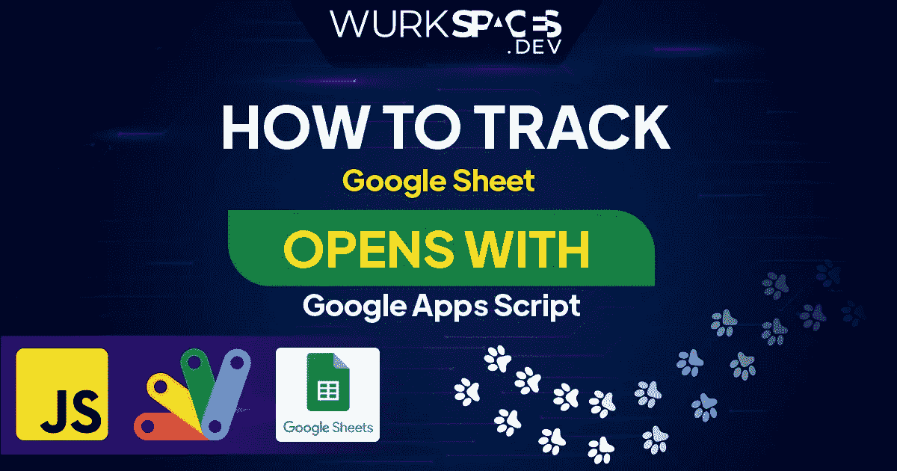

# 使用 Google Apps 脚本打开跟踪 Google 工作表

> 原文：<https://medium.com/geekculture/tracking-google-sheet-opens-with-google-apps-script-edeeb667ad7c?source=collection_archive---------9----------------------->

跟踪 Google Sheet 打开的基本原理与使用透明像素跟踪电子邮件的原理相同。在 Google Sheet 中，我们将使用`IMAGE()`函数，该函数将使用查询字符串中的一些参数调用部署的 Google Apps 脚本 web 应用程序 URL。该网络应用程序将能够做你需要的以下任何事情:记录到一个电子表格，通过一个…