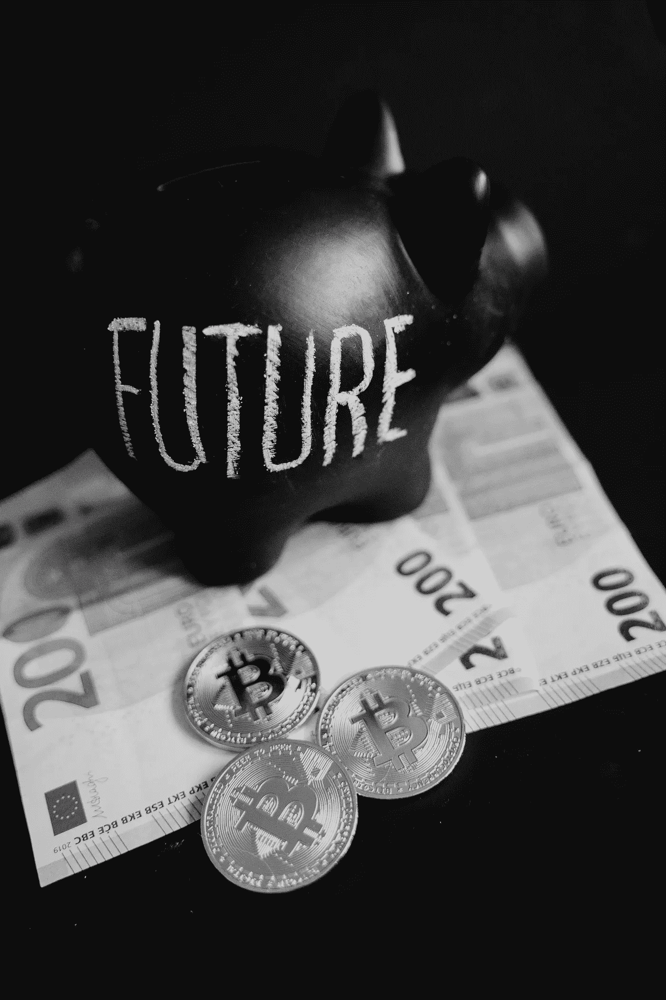

# 交易加密货币是不好的。霍德林更糟糕。伏击是最好的。

> 原文：<https://medium.com/geekculture/trading-cryptocurrencies-is-bad-hodling-is-even-worse-ambushing-is-the-best-37c8255ea5c7?source=collection_archive---------1----------------------->

## 不要跟随霍德勒的羊群。改为伏击。

Photo by [Alesia Kozik](https://www.pexels.com/@alesiakozik?utm_content=attributionCopyText&utm_medium=referral&utm_source=pexels) from [Pexels](https://www.pexels.com/photo/luck-business-money-finance-6781340/?utm_content=attributionCopyText&utm_medium=referral&utm_source=pexels) altered by Author

我不会沉迷于 HODLing 的定义，因为点击这篇文章本身就证明你已经熟悉了这个术语。