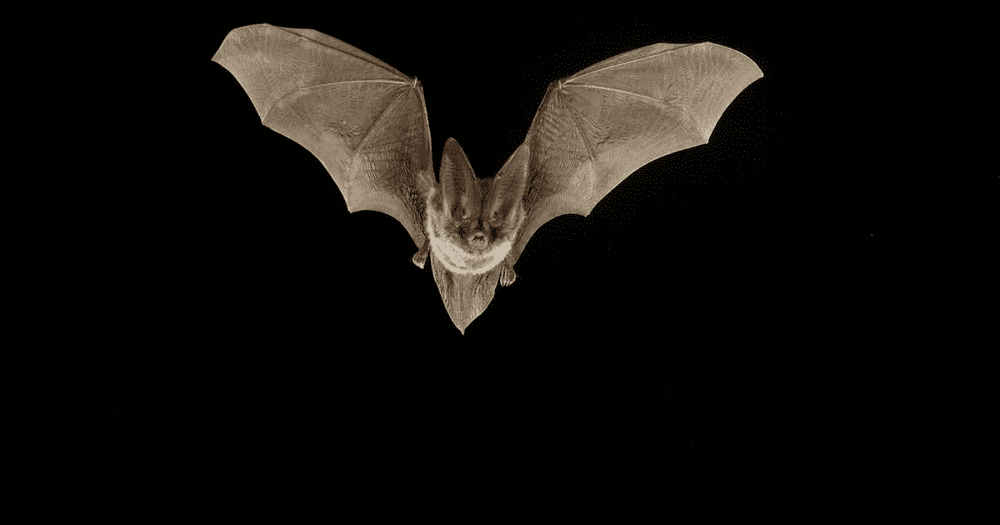

# 交易替代蝙蝠模式-完整指南。

> 原文：<https://medium.com/geekculture/trading-the-alternate-bat-pattern-the-full-guide-27ff3a125e2f?source=collection_archive---------36----------------------->

## 提出和交易交替蝙蝠和声模式。

[www.natureconservancy-h.assetsadobe.com](http://www.natureconservancy-h.assetsadobe.com)

谐波模式是一种强大的高级价格行为技术，用于检测反应。和声模式的工作原理是他们使用合流法，这意味着他们期望从由…定义的特定层次的集群中得到反应