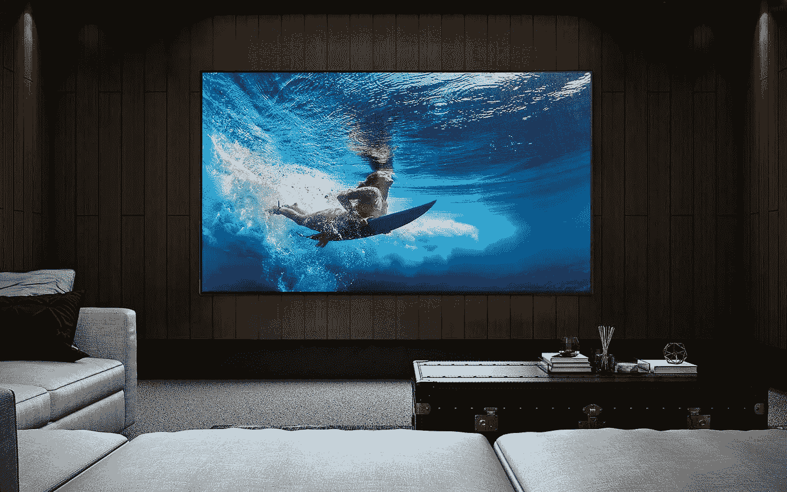

# 传统有机发光二极管电视不太可能在 2023 年进化

> 原文：<https://medium.com/geekculture/traditional-oled-tvs-unlikely-to-evolve-in-2023-c8c17964554f?source=collection_archive---------0----------------------->

## LG 在改进屏幕方面面临问题，有机发光二极管粉丝将不得不比预期更有耐心

This year’s OLED TVs were only marginally better compared to 2021’s models and 2023 models — as things stand — will not offer much more, at least in terms of picture quality. (Image: LG)

公平地说，传统有机发光二极管屏幕的工作方式——以及由此带来的显示质量——在过去三四年里已经危险地接近碰壁了…