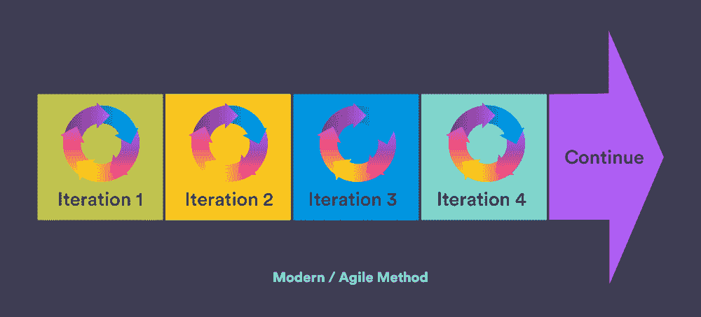
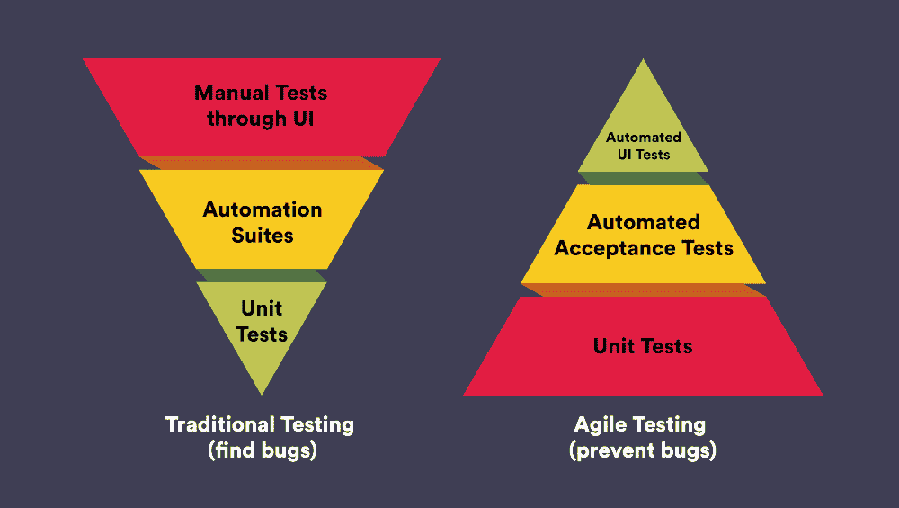

# 传统测试与敏捷测试——你应该替换旧的测试方法吗？

> 原文：<https://medium.com/geekculture/traditional-testing-vs-agile-testing-should-you-replace-the-old-testing-approach-500ba4050509?source=collection_archive---------3----------------------->

早些时候，开发团队被视为软件开发生命周期的全部，测试只占 SDLC 的一小部分。幸运的是，这种情况正在改变。现代测试方法包括开发团队和测试团队紧密合作，以提高质量和加速产品发布。为了在测试方法上做出正确的选择，让我们更好地理解传统测试和敏捷测试之间的区别。

在这里，我们更详细地探讨了传统和现代测试原理的特点、优点、缺点，以及现代测试相对于传统方法的优势。

# 什么是传统测试？

自从软件开发开始，传统的测试方法就已经存在了。它们主要基于软件测试生命周期的预先组织的阶段。在这种情况下，测试流程是单向的，从测试到维护。随着时间的推移，IT 实践发生了变化，测试方法也发生了变化，因为传统的测试通常无法满足产品的持续测试需求。

# 传统测试的特点

*   增量执行。
*   只有在软件中的所有缺陷被解决或修正后，结果才会发布。
*   完全由项目经理管理。
*   遵循自上而下的方法，即只有在前一阶段完成后才开始下一阶段的测试。
*   执行流程的预定义步骤。
*   只有在测试的初始阶段才需要客户的参与。

# 传统测试的优势

*   它有助于识别缺陷的最大数量。
*   它确保了产品的质量。

# 传统测试的缺点

*   这是一个漫长而艰难的过程。
*   由于这些变更只在测试结束时实施，产品交付速度会受到影响。
*   完整的需求集必须在初始阶段进行沟通，在项目开发开始后没有任何修改的机会。
*   这种方法在不同的软件测试人员之间的交互很少甚至没有。
*   在传统方法中，文档变得非常重要，并且创建起来非常昂贵。
*   实现可重用组件的可能性极小。

只有当需求精确时，传统的测试方法才是合适的。尽管这个过程在识别被测产品的缺陷方面非常有用，但是随着现代或者敏捷测试实践的出现，传统的测试实践已经变得不兼容了。

# 什么是现代/敏捷测试？

随着技术的快速发展和越来越多的组织进入软件测试领域，软件测试人员能够进行不同的测试过程，并通过遵循现代测试方法在多个测试级别优化这些过程。

这种现代的或者敏捷的软件测试实践是一种迭代和增量的方法。它通常涵盖所有层和所有类型的测试。整个测试团队协作寻找软件中的缺陷，同时验证其质量、性能和有效性。

在敏捷测试方法中，开发和测试任务都是协作执行的，同时确保有专门的测试人员来进行测试。

# 敏捷测试的重要属性

*   **与开发者持续互动**

敏捷或现代的测试方法确保了测试和开发过程的紧密联系。测试人员作为开发团队的一部分，报告可能影响最终用户的质量问题，并提出解决方案。

*   **与产品负责人的有效沟通**

在这种测试方法中，测试人员不断地与产品所有者互动，以建立项目期望，从而帮助软件开发人员与整个产品路线图保持一致，并满足客户需求。

*   **质量保证团队协作**

敏捷测试促进了维护 QA 的团队协作。开发人员同样是构建单元测试用例的一部分，以获得更好的测试过程，并提高审计的整体质量。此外，开发人员还遵循软件测试人员对各种测试需求和代码改进的建议。

# 现代测试的特点

*   耗时更少，需要的文档最少
*   遵循迭代模型，能够灵活应对需求的变化
*   可以使用自动化工具来执行
*   这种方法确保了与最终用户的协作

# 现代测试的优势

*   现代或敏捷测试提供了有效的风险管理
*   促进功能驱动的开发和面对面的互动
*   包括严格的规划、分析和测试
*   确保快速产品交付，同时确保最佳质量

# 现代测试的缺点

*   难以评估特定测试所需的工作量
*   由于文档有限，有时很难指定和交流大型项目的单个测试组件

# 传统和现代测试原理的主要区别

以下是区别传统测试和现代测试方法的一些参数——

# 1.哲学

传统的测试实践是基于固定的/具体的需求和解决缺陷的哲学，然后发布产品，而现代的测试方法遵循测试优先的哲学，缺陷在发布前的每个冲刺阶段被修复。

此外，在敏捷测试项目中，需求不是固定的，也就是说，可以健康地引入变更，这表明测试用例可以探索更多的考虑和定制。

# 2.方法

传统方法遵循分阶段方法的预测模型。它涉及自顶向下的方法，其中测试是一步一步执行的。

另一方面，敏捷遵循一个迭代性和适应性更强的模型，包括项目计划、风险管理、设计和开发以及测试等阶段。

# 3.功能

传统测试方法的主要功能是证明产品的质量。相比之下，现代测试原则以最少的功能确保了产品的质量和快速交付。

# 4.用户反馈

在传统的测试中，在测试完成之前没有用户反馈。敏捷方法遵循每个冲刺阶段结束时的短时间反馈周期。

# 5.自动化

当谈到测试方法时，自动化很少使用，对于开发人员来说是一种更常规的实践。另一方面，敏捷测试在测试场景中积极鼓励自动化过程。

# 6.持续改进

在传统方法中，所需的修改只在下一个版本中完成。相比之下，现代过程遵循软件测试的持续改进，在测试周期的下一个冲刺阶段完成所需的变更。现代方法将[软件测试视为一个持续改进的过程](https://marutitech.com/software-testing-improvement-ideas/)。

# 7.沟通

传统的测试方法严重依赖于所有用例的文档以及相关的测试用例准备。

然而，在敏捷测试中，文档不是 QA 的重要部分。在这种情况下，QA 测试人员以任何形式吸收他们需要的事实，而不需要太多的文档，并完成这个过程。

# 8.风险管理

虽然传统的方法是规避风险的，但是敏捷遵循及时有效的风险预防方法。

# 为什么敏捷优于传统的软件测试方法？

如今，客户期望并要求更快地实施和更新他们的软件产品。各种各样的软件公司都在不断尝试通过修复错误和识别错误来改进他们的产品或应用程序，以发布具有更好特性和功能的新版本。

为了跟上这些破坏性的趋势，并迎合新旧版本的应用程序，越来越多的组织正在敏捷环境中采用软件测试。

与传统的软件测试方法不同，在传统的软件测试方法中，开发人员和测试人员之间缺乏联系，这是由多种因素造成的，例如沟通的间隙、不正确的测试策略和不切实际的时间表，敏捷软件测试更加集中和快速。它还有助于节省时间，并通过降低在初始开发阶段修复 bug 的成本来简化整个软件开发过程。

以下是在敏捷环境中进行软件测试优于在传统环境中进行测试的一些其他原因——

# 1.透明度和持续测试

敏捷测试团队定期执行测试，以确保产品持续进步。此外，在这种情况下，测试是与开发一起完成的，以在过程中带来更大的透明度。

# 2.更快的上市时间和产品发布

敏捷或现代测试方法中使用的增量和迭代模型最大限度地减少了指定测试需求和验证结果之间的总时间。它导致更快的产品发布，没有任何延迟。

# 3.反馈范围

在敏捷测试方法中，业务团队参与每个迭代。这种持续的反馈有助于减少获得软件开发工作反馈的时间。

# 4.问责制和更紧密的协调

由于软件测试人员和开发人员团队相互协作，使他们能够共享即时反馈，敏捷测试以即时修复缺陷而闻名。它有助于引入问责制和更紧密的一致性，这进一步促进了在早期测试阶段修复错误和缺陷。

# 5.更好的协作

随着一个强大的开发人员、测试人员、架构师和编码人员团队在敏捷测试方法中紧密合作，在整个软件测试生命周期中有更多面对面的交流。它消除了冗长的文档记录过程的需要，导致更快的测试结果。

# 6.高水平的软件质量

敏捷测试方法确保团队测试软件，以使代码简洁明了。此外，软件的定期测试允许在开发的同一迭代中快速检测和修复所有问题和漏洞。

# 从传统测试实践过渡到现代测试实践的挑战

虽然自动化或敏捷测试有明显的好处，包括提高质量、加速交付和降低成本，但是从手工测试过渡到自动化测试并不是一件容易的事情。

从传统测试原则向现代测试原则过渡的主要挑战包括

*   如何自下而上地构建自动化策略？
*   出现问题时，是否有适当的行动计划？
*   如何引入一个符合您组织的特定需求的自动化测试策略？
*   衡量成功最有效的方法是什么？
*   平稳过渡需要哪些不同的工具？

# 从传统测试实践过渡到现代测试实践时需要考虑的关键点

*   确定从传统测试向敏捷测试转变的必要因素
*   包括用户在内的所有利益相关者都应该清楚导致转变的原因
*   确定项目的规模——是大还是小
*   确保整个团队对新的测试方法有很好的理解，并根据新的方法适应他们各自的角色

# 包扎

虽然没有放之四海而皆准的方法，但可以肯定地说，现代测试方法被认为比传统测试原则更适合处理各种测试挑战。如果您能够找到一种方法，在早期实现现代的或者敏捷的测试实践，您的公司可以在未来节省大量的压力和成本。

为了成功实施现代测试实践，您需要 [QA 专家](https://marutitech.com/guide-to-outsourcing-software-testing/)帮助您处理数字和传统系统，以获得无与伦比的性能。我们马鲁蒂技术实验室提供全周期的[优质工程服务](https://marutitech.com/quality-engineering-services/)，实现更快的缺陷检测和关闭、无缝协调以及更短的产品发布周转时间。为了在每个阶段都有完美的表现，请点击这里联系我们[。](https://marutitech.com/contact-us/)