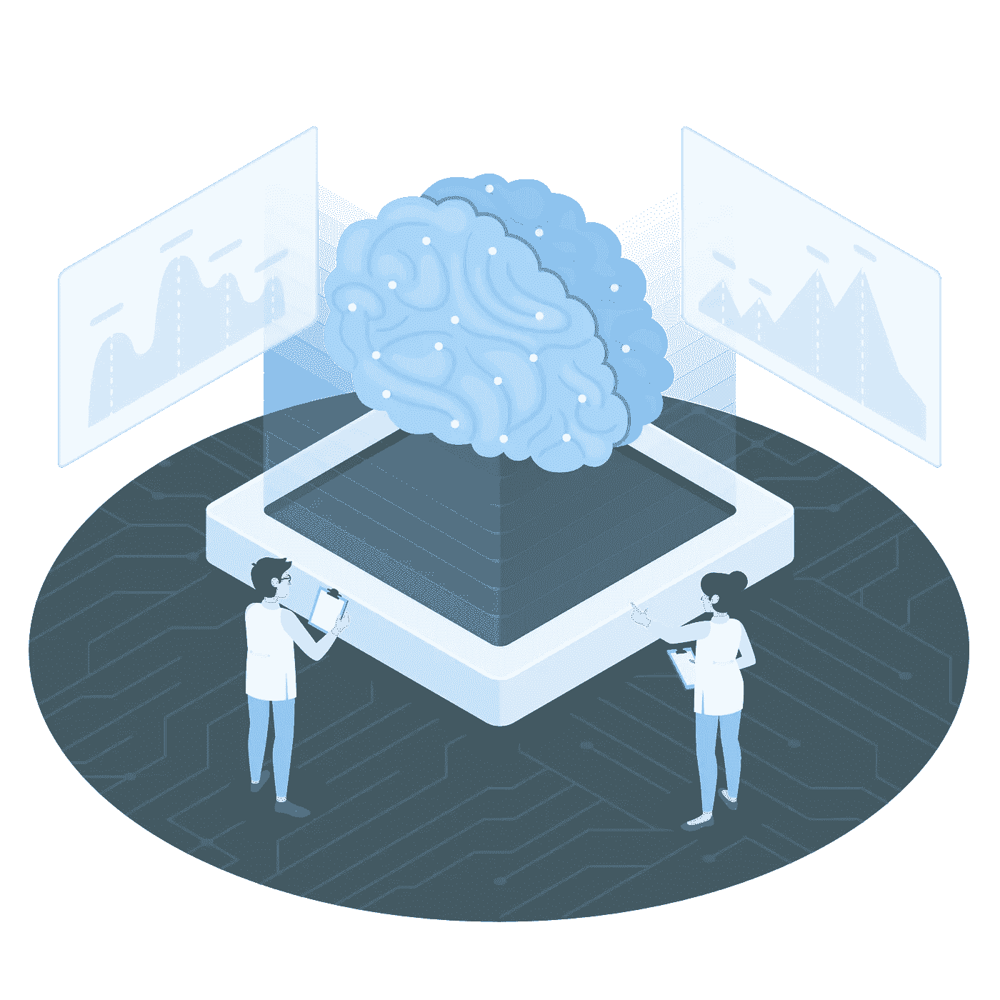

# 使用 Vertex AI 训练和部署定制的机器学习模型

> 原文：<https://medium.com/geekculture/train-and-deploy-custom-machine-learning-models-using-vertex-ai-1bd86a5737c1?source=collection_archive---------2----------------------->

学习使用 Vertex AI 训练和部署定制的机器学习模型

Technology illustrations by [Storyset](https://storyset.com/illustration/artificial-intelligence/amico#90CAF9FF&hide=&hide=complete)

Vertex AI 是一个平台，它将谷歌云的机器学习(ML)产品统一到一个环境中，用于构建和管理 ML 项目的整个生命周期。它为机器学习工作流程的每一步提供工具支持。