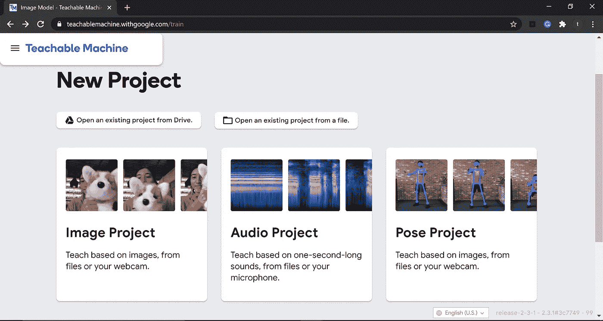
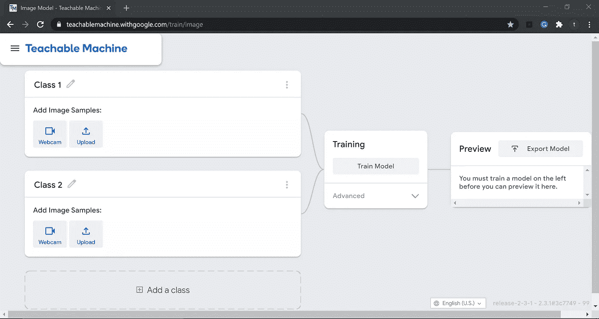
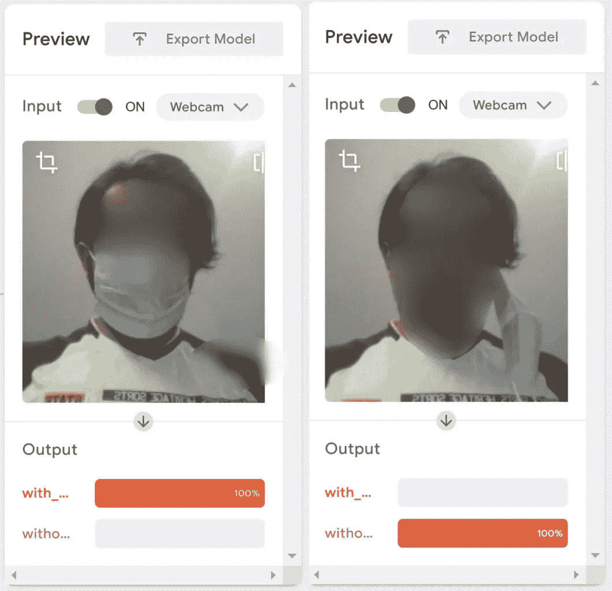
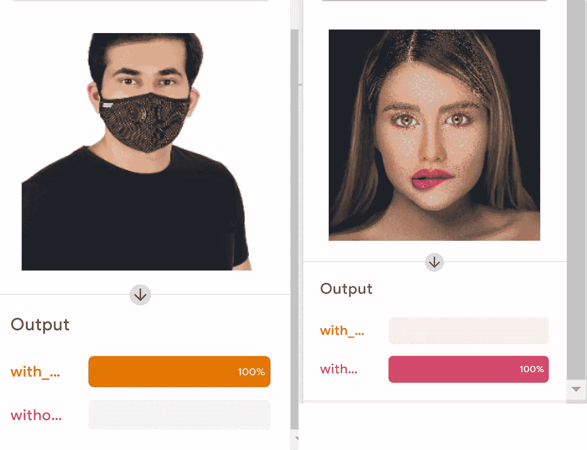
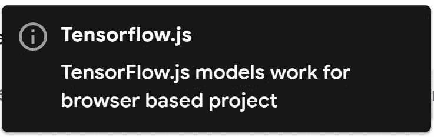
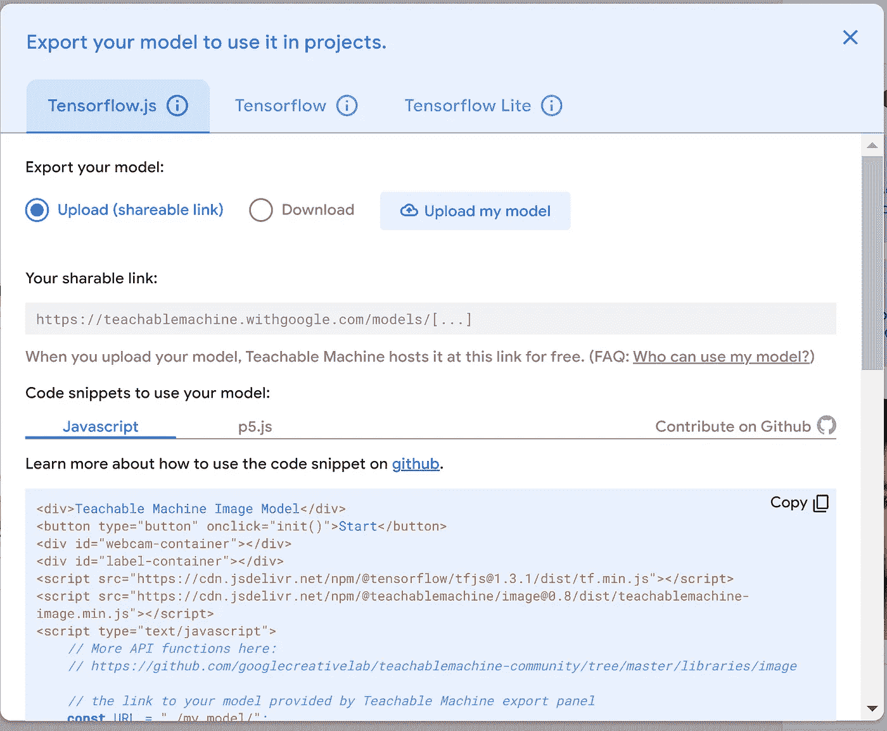
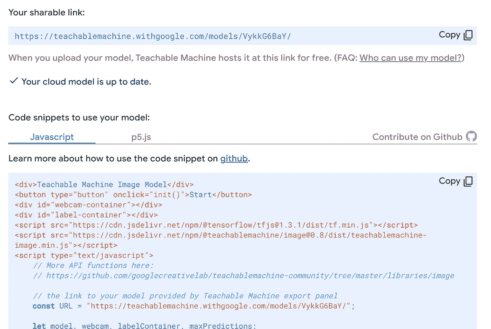
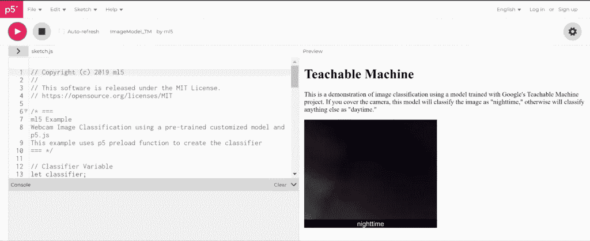
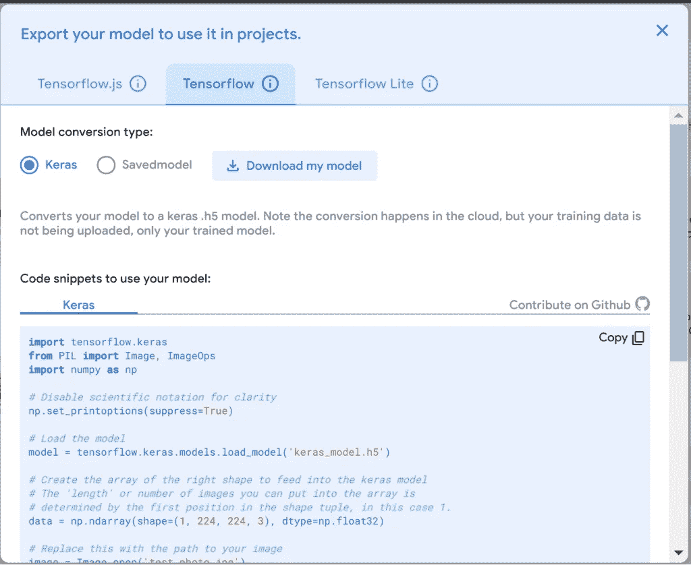

# 使用可示教机器训练图像分类模型

> 原文：<https://medium.com/geekculture/train-image-classification-model-using-teachable-machine-8b8501e17bb4?source=collection_archive---------5----------------------->

## (对于自定义对象)

**目标**:使用可教机器训练一个定制物体图像分类的深度学习模型，在线测试，最后导出成不同格式，用于你的项目。

## 路标

*   收集图像数据集。
*   开放式教学机器形象工程
*   训练模型。
*   评估模型。
*   导出模型。

图像分类或图像识别是这样一个概念，你向设备的摄像头传感器展示一幅图像，它会告诉你该图像中存在什么，或者告诉我们它属于哪一类。

在本教程中，我将带你通过自定义图像分类，在谷歌在线工具的帮助下训练一个简单的深度学习模型:[teacheble machine with Google，](https://teachablemachine.withgoogle.com/)，然后将模型导出到 TensorFlow 或其他格式，以便在你的项目中使用。

# 模型

用于训练我们的定制图像分类器的训练平台是带有谷歌的[可教机器](https://teachablemachine.withgoogle.com/)。这是一个令人兴奋的平台，只需点击几下就可以学习深度学习训练过程。首先，从你的系统上传不同种类的物体，或者使用网络摄像头，然后训练它。最后，经过训练，您可以导出您选择的模型。你可以选择任何你想要的格式并下载模型。我正在训练一个面具图像分类的模型。这将通过下一节中提到的 5 个步骤来完成:

1.  [**上传你的数据集**](#tm1)
2.  [**训练模型**](#tm2)
3.  [**预览模型**](#tm3)
4.  [**使用 javascript 测试模型**](#tm4)
5.  [**导出模型**](#tm5)

# 我们开始吧！！

(但首先✅Subscribe 到我的 YouTube 频道👉🏻[https://bit.ly/3Ap3sdi](https://bit.ly/3Ap3sdi)😁😜)

# 首先，进入[可示教机器](https://teachablemachine.withgoogle.com/)站点。

**目标**:使用可示教机器训练图像分类模型。
你会在那里找到 3 个视频，关于如何上传你的数据集，训练你的模型，并将其转换为 TFLite 模型。这个过程相当简单。点击主页上的“开始”并选择“图像项目”。您也可以使用 google drive 登录以保存您的模型文件，否则如果您关闭选项卡或刷新页面，您将会丢失所有图像和模型文件。

# 第一步。上传数据集

创建数据集并上传至[可示教机器](https://teachablemachine.withgoogle.com/)，并相应定义课程名称。在这里，我将训练一个模型使用教学机器的面具图像分类与 2 类即。、【带 _ 面具】&“不带 _ 面具”。

# 步骤 2)训练图像分类模型

在训练期间，您可以调整**超参数**，如下所示:

*   纪元数量
*   批量
*   学习率

设置超参数值后，点击列车模型。这个过程需要一段时间，取决于图像和时期的数量。

**重要提示:**在训练过程中，不要切换标签，因为这会停止训练过程。

# 步骤 3)预览你训练好的模型

训练结束后，您可以在预览窗口中预览已训练的模型。您可以上传图片进行测试，也可以使用网络摄像头进行测试。请参见下面的预览测试结果。

# 使用网络摄像头

# 使用图像

# 步骤 4)使用 javascript 测试模型

您可以使用 javascript 格式将您的模型用于基于浏览器的项目。

首先，点击 **tensorflow.js** 选项卡，点击**上传我的模型**。当你上传你的模型时，Teachable Machine 会把它放在给定的可共享链接上免费下载。如果您希望任何人使用您的模型，您可以与他们共享该链接——任何拥有该链接的人都可以在他们的项目中使用您的模型。请注意，您的模型已经发布到 Google 服务器上，但是您用来制作模型的示例却没有。只是你的模型——预测你展示的是哪个类的数学程序。

您也可以使用 **p5.js web 编辑器**工具在线测试您的模型。web 编辑器为 ***p5* 。js** ，是一个 JavaScript 库，目标是让艺术家、设计师、教育工作者和初学者能够使用编码。要将它用于您的定制模型，选择 p5.js 代码片段选项卡并复制代码。接下来，点击下图所示的 **p5.js 网页编辑器**链接。

打开 p5.js web 编辑器工具后，您将会在那里找到白天和夜间分类的默认代码。删除整个旧代码，粘贴从定制模型的 p5.js 代码片段中复制的新代码，然后按 play。现在，您可以使用 p5.js web 编辑器工具测试您的模型。

daytime-nighttime code

our mask classification code

# 步骤 5)导出模型

您可以导出不同格式的模型以用于您的项目，例如 **Keras** **格式** **(.h5)** 和 **SavedModel 格式** **(。pb)** 文件。选择 TensorFlow 选项卡并选择您想要的模型类型，然后点击**下载我的模型**。一旦您下载了模型，您就可以使用代码片段部分中的代码在您的项目中使用这些模型。见下图。

# 掩膜数据集

[般若 Github](https://github.com/prajnasb/observations)

# 看看我在 Youtube 上的视频

# 信用

## 文件/参考资料

*   [张量流简介](https://github.com/tensorflow/tensorflow)
*   [Tensorflow 模型 Git 库](https://github.com/tensorflow/models)
*   [TensorFlow 2 分类模型动物园](https://github.com/tensorflow/models/blob/master/research/object_detection/g3doc/tf2_classification_zoo.md)
*   [TensorFlow Lite 示例应用](https://github.com/techzizou/examples/tree/master/lite)
*   [TensorFlow Lite 图像分类 Android 示例应用](https://github.com/tensorflow/examples/blob/master/lite/examples/image_classification/android/README.md)
*   [张量流教程](https://www.tensorflow.org/tutorials)

# 下一个教程

## 如何使用可教机器构建应用程序

[使用可示教机器构建应用](https://techzizou.com/build-android-application-for-image-classification-using-teachable-machine/)

# ♕·特奇佐·♕