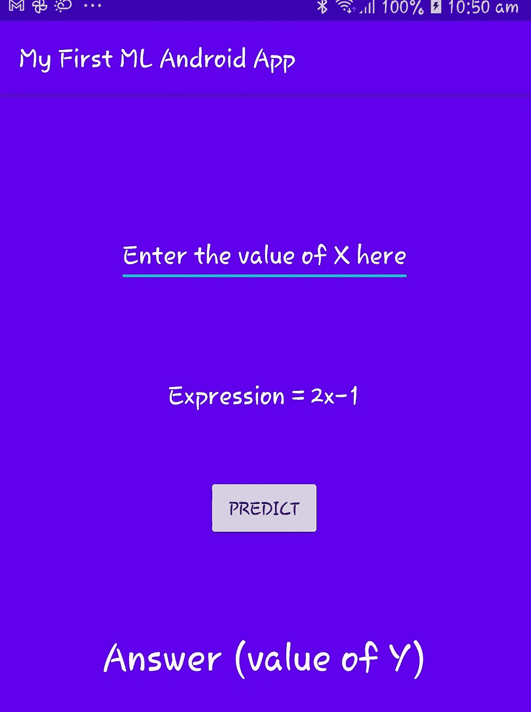
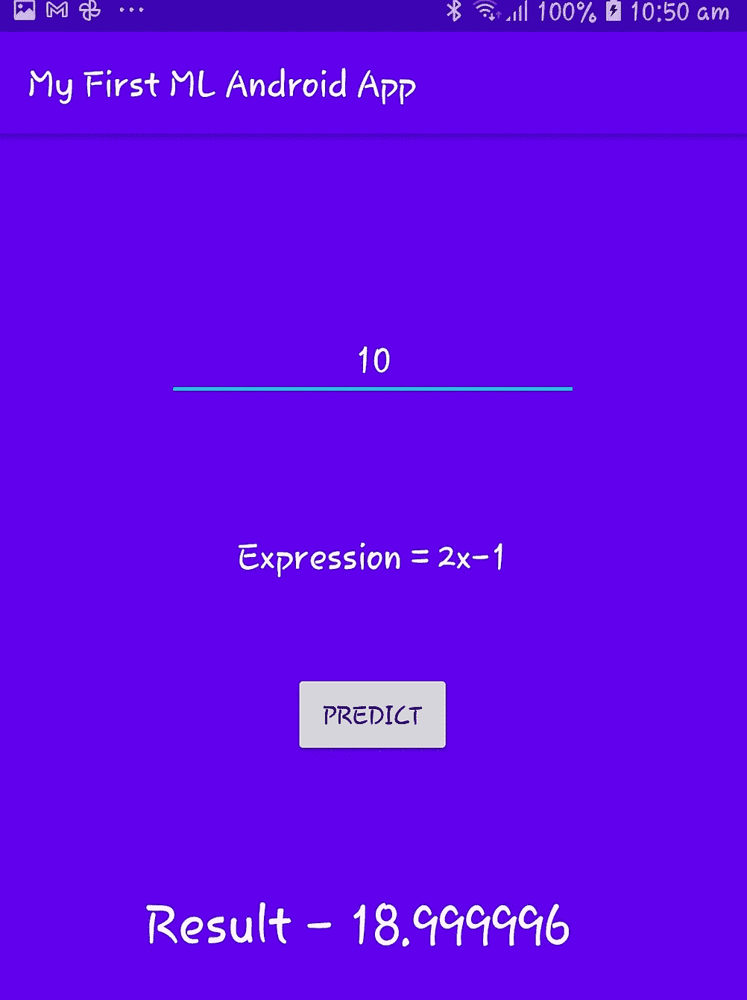

# 使用 TensorFlow Lite & Keras 训练 ML 模型并构建 Android 应用程序

> 原文：<https://medium.com/geekculture/train-ml-model-and-build-android-application-using-tensorflow-lite-keras-6bf23d07309a?source=collection_archive---------5----------------------->

ML + Android

在这篇博客中，我将使用 TensorFlow 和 Keras 训练一个非常基本的机器学习模型，然后我们将为这个训练好的模型开发一个 android 应用程序。

我们将使用 Anaconda 来训练我们的机器学习模型，然后我们将把这个模型转换成一种 **tflite** 格式。之后，我们将使用 Android studio 用 java 开发一个 Android 应用程序。因此，最终，您将拥有自己的基于机器学习的 Android 应用程序。

*大多数人不清楚 Tensorflow lite 在 Android 中的使用情况，但在这个示例中，我们将使用一个非常简单的示例进行解释。*

让我们开始…

**第一步**:导入需要的库

> *将 tensorflow 作为 tf 导入
> 将 numpy 作为 np 导入
> 从 tensorflow 导入 keras，lite*

Tensorflow 将用于训练我们的模型，numpy 将用于创建数据集。Keras 将用于生成神经网络模型。使用 lite，我们将把模型转换成 Android 的 tflite 格式。

**第二步:**创建一个数据集。

基本数据集将有两个变量 x 和 y。变量之间的关系模式将是 **y=2x-1。**这里 y 是标签，x 是特征。

> x = np.array([-1.0，0.0，1.0，2.0，3.0，4.0]，dtype=float)
> y = NP . array([-3.0，-1.0，1.0，3.0，5.0，7.0]，dtype = float)

**步骤 3:** 使用 Keras 训练模型

该包具有与神经网络包类似的行为。隐藏层是使用 Keras 创建的。层次。密集()。这个密集()将提供当前和先前神经元的连接。

> 型号= keras。sequential([keras.layers.Dense(units=1，input_shape=[1]))，keras . layers . dense(units = 1，input _ shape =[1]))
> model . compile(optimizer = ' SGD '，loss='mean_squared_error ')

units=1 将告诉您它将有 1 个神经元，并且前一层的 input_shape 为 1，因为我们仅使用 1 个特征(即 **x** )。然后，我们编译模型。参数优化器和损失值。损失定义了预测值和实际值之间的差异。由于这是监督 ML，我们已经标记了数据，我们将得到预测结果，我们将与实际值进行比较。

第四步:对模型进行训练

> model.fit(x，y，epochs = 500)
> print(model . predict([10])

x 和 y 值表示用 500 个历元训练模型的输入和输出值，这意味着我们要训练该数据集 500 次。

然后，预测 x=10 的值。

理想情况下，y 的值应该是 19。执行代码后的预测值是 18.9999。因此，该模型相当准确。

**第五步:**保存模型，创建 h5 和 tflite 文件格式

> keras _ file = " linear . H5 "
> TF . keras . models . save _ model(model，keras_file)
> converter = lite。tflitecoverter . from _ keras _ model(model)
> TF model = converter . convert()
> 
> open("linear.tflite "，" wb ")。写入(tfmodel)

**第六步**:创建安卓应用

转到 Android Studio ->创建新项目。

最初，您需要在代码中添加以下依赖项:

1.  将以下包添加到 build.gradle 文件的依赖项中-

> 实现' org . tensor flow:tensor flow-lite:+'

然后，我们需要在依赖项上方添加下面的代码

> 选项**{** no compress " TF lite "
> no compress " lite "
> **}**

这指定 tflite 文件不应该像其他文件一样被压缩。

同步项目，gradle 应该可以成功编译。

2.将 tflite 文件添加到 Android 项目的 assets 文件夹中。

3.在 Java 文件中添加以下函数

> private MappedByteBuffer loadModelFile()抛出 io exception
> {
> asset file descriptor asset file descriptor = this . getassets()。openFd(" linear . tflite ")；
> file inputstream file inputstream = new file inputstream(assetfile descriptor . getfile descriptor())；
> file channel file channel = file inputstream . get channel()；
> 
> long start offset = asset file descriptor . getstart offset()；
> long len = assetfile descriptor . getlength()；
> 
> 返回 file channel . map(file channel . map mode .*只读 _ 只读*，startOffset，len)；
> }

这将把 tflite 模型文件转换成 MappedByteBuffer 格式。这是一种优化的格式，有助于我们提高效率和速度。

4.添加一个解释器，它将使用模型解释数据的输入和输出。

> Interpreter = new Interpreter(loadModelFile()，null)；

5.在下面添加 doInference()函数来计算表达式，并在模型的帮助下获得输出。

> public float do inference(String val)
> {
> float[]input = new float[1]；
> 输入[0] =浮点。*parse float*(val)；
> float[][]output = new float[1][1]；
> 
> (输入，输出)；
> 返回输出[0][0]；
> }

参数 val 是用户给定的输入值。

由于模型是基于浮点值开发的，我们将输入字符串值转换为浮点值。然后，我们创建了一个 2D 输出数组(因为它只有一行和一列)。稍后，解释器将根据输入值产生输出，并将其保存在第 0 行第 0 列的输出变量中。

输出是…..

你可以在[***Github***](https://github.com/ShuklaAnuja/Python-ML---Android-Kit)***上找到完整的代码片段。***

我希望你喜欢这个博客！！！

请随时发表您的意见和反馈…

**此外，欢迎新的想法。**

**谢谢大家！:)**