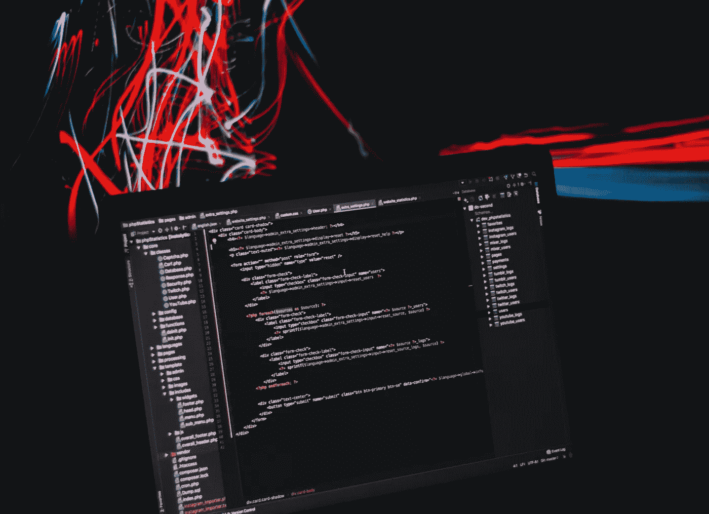
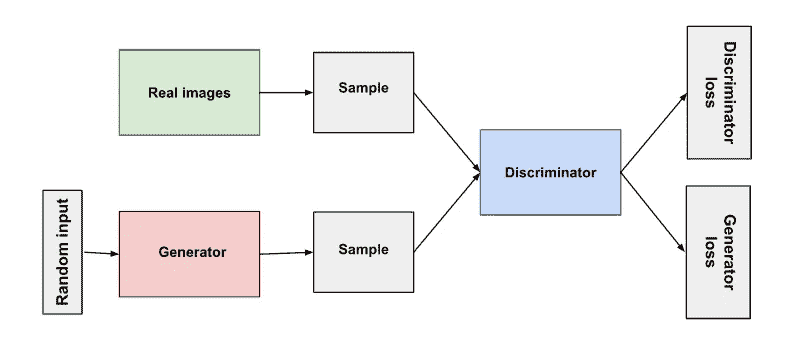
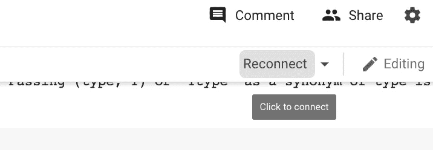
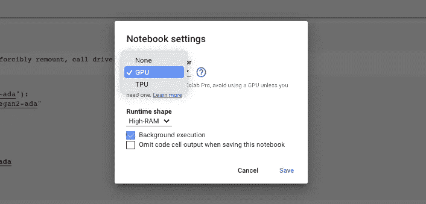
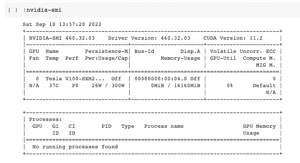
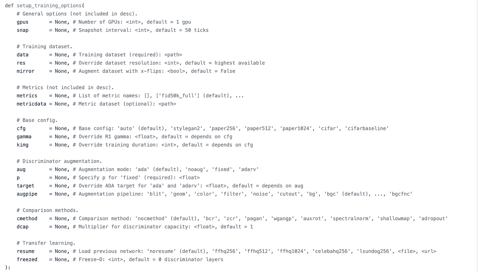
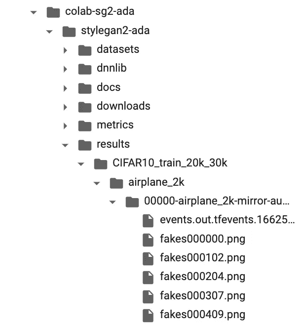

# 使用 Colab 中的自定义数据集训练 StyleGAN2-ADA

> 原文：<https://medium.com/geekculture/train-stylegan2-ada-with-custom-datasets-in-colab-11accf22ef9b?source=collection_archive---------0----------------------->

在本文中，我们将使用 TensorFlow 1.14 在 Google Colab 的自定义数据集上训练 NVIDIA 的 StyleGAN2-ADA

Photo by [AltumCode](https://unsplash.com/@altumcode) on [Unsplash](https://unsplash.com/)

# 目录

1.  甘斯速成班
2.  StyleGAN
3.  如何在 Google Colab 上训练 StyleGAN2-ADA
4.  张量流 1.x
5.  安装 Google Drive
6.  正在创建 TFRecords 数据集
7.  培养
8.  参考

**生成对抗网络(GANs)** 是近来计算机科学中最热门的话题之一。它们是一种训练生成模型(无监督学习)的聪明方法，通过将问题框定为一个**监督的**学习问题。

# 甘斯速成班

主要思想是通过**对抗** **过程**同时训练两个不同的模型。

Image from [Google Developer website](https://developers.google.com/machine-learning/gan/gan_structure), [Public Domain](https://creativecommons.org/licenses/by/4.0/)

> 生成敌对网络是基于博弈论的场景，其中生成网络必须与对手竞争。生成器网络直接生成样本。它的对手鉴别器网络试图区分从训练数据中提取的样本和从生成器中提取的样本。

第一个模型被称为**生成器**，它学习生成可信的数据。

生成器不会看到真实的数据，它只获得一个固定长度的随机向量(从高斯分布中随机抽取)作为输入，并在域中生成一个样本。

第二个是**鉴别器，**它将样本(真实的或生成的)作为输入，并学习区分生成器的假数据和真实数据。它惩罚了产生不可信结果的生成器。

在训练之后，鉴别器模型被丢弃(设置为不可训练的),因为我们只对训练生成器感兴趣。

在训练过程中，发生器逐渐变得更擅长创建看起来真实的图像，而鉴别器变得更擅长区分它们。当鉴别器不再能够区分真实图像和赝品时，该过程达到**平衡**。

Image from [TensorFlow website](https://www.tensorflow.org/tutorials/generative/dcgan), [Public Domain](https://creativecommons.org/licenses/by/4.0/)

# StyleGAN

甘人学会生成模仿真实照片外观的全新图像。然而，它们对生成的图像提供非常有限的控制。

有了 StyleGAN (NVIDIA)，一个基于**风格的生成器架构**，生成器自动学习分离图像的不同方面，无需任何人工监督。培训结束后，你可以按照我们喜欢的任何方式将这些方面结合起来。

生成器将图像视为“**样式**”的集合，其中每种样式控制特定比例的效果

使用这种类型的体系结构，您可以选择每种风格应用的强度，相对于“平均脸”(在脸数据集的情况下)

> 要了解关于 StyleGAN 的更多信息，请查看这篇文章:

 [## GAN — StyleGAN 和 StyleGAN2

### 你知道你的风格吗？大部分 GAN 型号没有。在普通 GAN 中，我们从潜在因素 z 生成图像。

jonathan-hui.medium.com](https://jonathan-hui.medium.com/gan-stylegan-stylegan2-479bdf256299) 

StyleGAN 是 NVIDIA 最受欢迎的生成模型之一。已经发布了几个版本的 StyleGAN。我们将使用最新版本的 **StyleGAN2-ADA** ，它更适合小数据集。

# 如何在 Google Colab 上训练 StyleGAN2-ADA

> *C* olaboratory，简称“ **Colab** ”，是谷歌研究院的产品。 **Colab** 允许任何人通过浏览器编写和执行任意 python 代码，特别适合机器学习、数据分析和教育。

Google Colab**是免费的**，但我强烈推荐每月支付额外的 10 美元购买 [Pro 版本](https://colab.research.google.com/signup)，它提供更快的 GPU、更多的 RAM 和磁盘，以及**更长的运行时间**，这对训练可以运行几个小时/几天的 GANs 来说**至关重要**。

为了在 Google Colab 上运行一个笔记本模型，你需要以这种方式**连接**到一个托管的运行时。

Screenshot of Google Colab, Image by author

如果您使用的是 Pro 版本，那么要使用额外的 GPU Google，您需要在*资源*和中点击*更改运行时类型*将 ***硬件加速器*** 设置为 **GPU**

Screenshot of Notebook settings in Google Colab, Image by author

## 张量流 1.x

StyleGAN2-ADA 使用 TensorFlow 1.14，它不支持 TensorFlow 2.x

然而，谷歌 Colab 在其最新版本中移除了对 TensorFlow 1 的支持，因此你不能再使用`%tensorflow_version 1.x`。

还是可以通过`pip`手动安装 TensorFlow 1.x。只需在 Google Colab 的第一个单元格中编写以下代码。

然后使用命令`import tensorflow`导入它

要检查你正在使用的 GPU，你可以输入`!nvidia-smi`

Screenshot of Google Colab, Image by author

## 安装 Google Drive

为了训练 StyleGAN2-ADA，我们使用了一个自定义数据集。jpg 存储在 Google Drive 上的一个文件夹中，所以我们需要将 Colab 与 Google Drive 连接起来。

> 自定义:自定义数据集可以通过将所有图像放在一个目录下来创建。这些图像必须是正方形，并且它们必须都具有相同的二维幂。

在 Google Colab 单元格中键入以下代码行

我们首先挂载 Google Drive，然后创建一个名为`colab-sg2-ada` 的目录，并在这个目录中创建另一个目录`stylegan2-ada`

完成后，我们从 Github 克隆 NVIDIA 的 StyleGAN2-ADA 库，并为`datasets`和`results`分别创建一个目录

## 正在创建 TFRecords 数据集

StyleGAN2-ADA 和所有其他 StyleGAN 将 TFRecords 数据集作为输入。

如果要使用自定义数据集，需要先将其转换为 TFRecords 数据集。

要将图像转换为多分辨率 TFRecords，我们必须使用 NVIDIA 文档中提供的代码:

## 培养

一旦创建了数据集，我们就可以开始训练。

> 培训会定期输出网络泡菜(`*network-snapshot-<KIMG>.pkl*`)和示例图片(`*fakes<KIMG>.png*`)(由`*--snap*`控制)。对于每个 pickle，它还会默认评估 FID(由`*--metrics*`控制)并将结果记录在`*metric-fid50k_full.txt*`中。

`snapshot_count`表示您希望您的模型多长时间生成一个样本图像和一个. pkl 文件。

这是**极其重要的**因为 Google Colab 可能会根据网络使用情况断开运行时，所以你需要偶尔保存一下模型的进度，否则你会丢失你所做的所有工作。

当 Colab 超时时，你可以拿走最后一个。保存 pkl 文件，并使用它从该模型恢复训练。只是复制最后的路径。pkl 文件并粘贴到`resume_from =`行。

您可以更改其他指标来个性化培训。在这个例子中，我也放了`mirror`和`metrics`，但是你可以在 Github 上的 NVIDIA 的 StyleGAN2-ADA 库中的`train.py`文件中找到完整的列表。

Screenshot of part of the code from train.py from StyleGAN2-ADA Github repository, Image by author

一旦开始培训，您将看到快照保存在 Google Drive 的`results`文件夹中

Screenshot of directories in Google Colab, Image by author

在这里，你会看到假货图像和。从不同快照的模型生成的 pkl 文件。

## 参考

[1] [伊恩·古德菲勒](https://www.amazon.com/Ian-Goodfellow/e/B01MQGN8N0/ref=dp_byline_cont_book_1)、[约舒阿·本吉奥](https://www.amazon.com/Yoshua-Bengio/e/B00IWC47MU/ref=dp_byline_cont_book_2)和[亚伦·库维尔](https://www.amazon.com/Aaron-Courville/e/B01N8XGWRL/ref=dp_byline_cont_book_3)、[深度学习](https://www.amazon.com/Deep-Learning-Adaptive-Computation-Machine/dp/0262035618/ref=sr_1_1?crid=1I2VKDBGNWO3G&keywords=Deep+Learning+%28Adaptive+Computation+and+Machine+Learning+series%29&qid=1662811685&s=books&sprefix=deep+learning+adaptive+computation+and+machine+learning+series+%2Cstripbooks-intl-ship%2C323&sr=1-1) (2016)，麻省理工学院出版社

[2]杰森·布朗利(Jason Brownlee)，[生成性对抗网络(GANs)的温和介绍](https://machinelearningmastery.com/what-are-generative-adversarial-networks-gans/) (2019)

[3] [深度卷积生成对抗网络](https://www.tensorflow.org/tutorials/generative/dcgan) (2022)，TensorFlow 教程

[4] [甘结构概述](https://developers.google.com/machine-learning/gan/gan_structure) (2022)，谷歌开发者

[5] Tero Karras FI，[基于风格的生成式对抗网络生成器架构](https://www.youtube.com/watch?v=kSLJriaOumA&ab_channel=TeroKarrasFI) (2019)，YouTube 视频

[6]乔纳森·惠，[甘—斯泰勒甘&斯泰勒甘 2](https://jonathan-hui.medium.com/gan-stylegan-stylegan2-479bdf256299) (2020)，中等

[7] Tero Karras，Miika Aittala，Janne Hellsten，Samuli Laine，Jaakko Lehtinen 和 Timo Aila