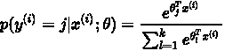
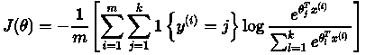
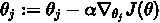

# 用纯 SQL 训练了一个机器学习模型

> 原文：<https://medium.com/geekculture/trained-a-machine-learning-model-in-pure-sql-cbb75e911f80?source=collection_archive---------12----------------------->

## 因为递归 cte 可以“迭代”,所以有可能用纯 SQL 实现机器学习模型训练——完全不用 Python

Photo by [Pietro Jeng](https://unsplash.com/@pietrozj?utm_source=medium&utm_medium=referral) on [Unsplash](https://unsplash.com?utm_source=medium&utm_medium=referral)

在文章[用纯 SQL 实现的深度神经网络 over BigQuery](https://towardsdatascience.com/deep-neural-network-implemented-in-pure-sql-over-bigquery-f3ed245814d3) 中，作者声称用*纯 SQL* 实现了一个深度神经网络模型。但我打开他的[回购](https://github.com/harisankarh/nn-sql-bq)后，发现他*用 Python 实现迭代训练*，并不是真正的 ***纯 SQL*** 。

在这篇文章中，我将分享我如何在开源分布式 SQL 数据库 [TiDB](https://docs.pingcap.com/tidb/stable) 上用纯 SQL 训练机器学习模型。主要步骤包括:

1.  选择[虹膜数据集](https://scikit-learn.org/stable/auto_examples/datasets/plot_iris_dataset.html)
2.  选择 softmax 逻辑回归模型进行训练
3.  编写 SQL 语句来实现模型推理
4.  训练模型

在我的测试中，我训练了一个 softmax 逻辑回归模型。在测试过程中，我发现 TiDB 不允许在递归公共表表达式(cte)中使用子查询和聚合函数。通过修改 TiDB 的代码，我绕过了这些限制，成功地训练了一个模型，并在 Iris 数据集上获得了 98%的准确率。

# 为什么我选择 TiDB 来实现机器学习模型

[TiDB 5.1](https://pingcap.com/blog/tidb-5.1-easily-build-your-mission-critical-applications-at-any-scale#common-table-expression-write-sql-statements-more-efficiently) 引入了许多新特性，包括 ANSI SQL 99 标准的通用表表达式(cte)。我们可以使用 CTE 作为临时视图的语句，以分离复杂的 SQL 语句并更有效地开发代码。此外，递归 CTE 可以引用自身。这对改进 SQL 功能很重要。而且， **CTEs 和 window 函数让 SQL 成为了一种** [**图灵-完全**](https://en.wikipedia.org/wiki/Turing_completeness) **语言。**

**因为递归 cte 可以“迭代”，所以我想试试看能不能用纯 SQL 在 TiDB 上实现机器学习模型训练和推理。**

# 虹膜数据集

我选择了 scikit-learn 上的虹膜数据集。该数据集包含 3 种类型的 150 条记录，每种类型有 50 条记录。每个记录有 4 个特征:萼片长度(sl)、萼片宽度(sw)、花瓣长度(pl)和花瓣宽度(pw)。我们可以使用这些特征来预测一个鸢尾是属于刚毛鸢尾、杂色鸢尾还是海滨鸢尾。

在我下载了 CSV 格式的数据后，我将其导入 TiDB。

# Softmax 逻辑回归

我选择了一个简单的机器学习模型:softmax logistic 回归进行多类分类。

在 softmax 回归中，将 x 归入 y 类的概率为:

成本函数是:

梯度为:

因此，我们可以使用梯度下降来升级梯度:

# 模型推理

我写了一个 SQL 语句来实现推理。基于上面定义的模型和数据，输入数据 x 具有五个维度(sl、sw、pl、pw 和常数 1.0)。输出使用了一键编码。

共有 15 个参数:3 种类型* 5 个维度。

我将输入数据初始化为 0.1，0.2，0.3。为了便于演示，我使用了不同的数字。将它们全部初始化为 0.1 是可以的。

接下来，我编写了一个 SQL 语句来统计数据推断的结果准确性。为了更好的理解，我用伪代码来描述这个过程:

在上面的代码中，我计算了每行数据中的元素。做出一个样本的推断:

1.  我得到了加权向量的指数。
2.  我得到了 softmax 值。
3.  我选择 p0、p1 和 p2 的最大值作为 1；我把剩下的设置为 0。

如果一个样本的推断结果与其原始分类一致，则是正确的预测。然后，我将所有样本的正确数字相加，得到最终的准确率。

以下代码显示了 SQL 语句的实现。我用一个权重连接每一行数据(只有一行数据)，计算每一行的推断结果，并合计出正确的样本数:

上面的 SQL 语句几乎是一步一步实现了伪代码的计算过程。我得到了结果:

接下来，我将学习模型参数。

# 模特培训

*注意:为了简化问题，我没有考虑“训练集”和“验证集”的问题，我使用的所有数据都只用于训练。*

我写了伪代码，然后基于它写了一个 SQL 语句:

因为我手动扩展了 sum 和 w 向量，所以这段代码看起来有点麻烦。

然后，我开始写 SQL 培训。首先，我编写了一个只有一次迭代的 SQL 语句。

我设置学习率和样本数:

代码迭代了一次:

一次迭代后的结果是模型参数:

以下是核心部分。我使用递归 cte 进行迭代训练:

核心思想是每次迭代的输入都是前一次迭代的结果，我增加了一个增量迭代变量来控制迭代次数。总体框架是:

接下来，我将一个迭代的 SQL 语句与这个迭代框架结合起来。为了提高计算精度，我向中间结果添加了类型转换:

这个代码块和上面一次迭代的代码块有两个不同之处。在这个代码块中:

*   在`data join weight`之后，我添加了`where iter <@num_iterations`来控制迭代次数和输出的`iter + 1 as iter`列。
*   我加了`having count(*)> 0`防止聚合在最后没有输入数据的情况下输出数据。此错误可能会导致迭代无法结束。

结果是:

这表明递归 cte 在递归部分不允许子查询。但是我可以合并上面所有的子查询。在我手动合并它们之后，我得到了这个:

它表明不允许使用聚合函数。

然后，我决定改变 TiDB 的实现。

根据[提案](https://github.com/pingcap/tidb/blob/master/docs/design/2021-04-18-common-table-expression.md)中的介绍，递归 cte 的实现遵循了 TiDB 的基本执行框架。在我咨询了 [PingCAP](https://pingcap.com/) 的 R&D[Wenjun Huang](https://github.com/wjhuang2016)之后，我了解到不允许使用子查询和聚合函数有两个原因:

*   MySQL 不允许它们。
*   如果允许的话，会有很多复杂的死角案例。

但我只是想测试一下功能。我在 [diff](https://github.com/pingcap/tidb/compare/master...francis0407:cte_ml?expand=1) 中临时删除了对子查询和聚合函数的检查。

我再次执行代码:

成功了！经过 1000 次迭代，我得到了参数。

接下来，我使用新的参数来重新计算正确的比率:

这一次，准确率达到了 98%。

# 结论

通过使用 TiDB 5.1 中的递归 cte，我成功地使用纯 SQL 在 TiDB 上训练了一个 softmax 逻辑回归模型。

在测试过程中，我发现 TiDB 的递归 cte 不允许子查询和聚合函数，所以我修改了 TiDB 的代码来绕过这些限制。最后，我成功地训练了一个模型，并在 Iris 数据集上获得了 98%的准确率。

我的工作也揭示了一些想法，我希望你能思考一下。如果你对这些话题感兴趣，请加入 Slack 上的 [TiDB 社区，和我一起讨论。](https://slack.tidb.io/invite?team=tidb-community&channel=everyone&ref=pingcap-blog)

*   在我做了一些测试之后，我发现 PostgreSQL 和 MySQL 都不支持递归 cte 中的聚合函数。可能会有难以处理的棘手情况。
*   在这个测试中，我手动扩展了向量的所有维度。其实我也写了一个不需要扩展所有维度的实现。例如，数据表的模式是(idx，dim，value)，但是在这个实现中，权重表需要连接两次。这意味着它需要在 CTE 中被访问两次。这也需要修改 TiDB 执行器的实现。所以，我在这篇文章里没有讲。但实际上，这个实现更通用，可以处理更多维度的模型，例如 MNIST 数据集。