# 在 Google colab 上使用 TensorFlow 1.x 训练用于自定义对象检测的深度学习模型

> 原文：<https://medium.com/geekculture/training-a-model-for-custom-object-detection-using-tensorflow-1-x-on-google-colab-564d3e62e9ef?source=collection_archive---------0----------------------->


## 使用 TensorFlow 对象检测 API

# 我在 Youtube 上的视频！

# 在本教程中，我将在 Google Colab 上使用 **TensorFlow 1.x** 训练一个深度学习模型，用于自定义对象检测。下面是它的路线图。

*   收集图像数据集，并对它们进行标记，以获得它们的 XML 文件。
*   安装 TensorFlow 对象检测 API。
*   生成培训所需的 TFRecord 文件。(为此需要生成 _tfrecord.py 脚本和 CSV 文件)
*   编辑模型管道配置文件，并下载预先训练的模型检查点。
*   训练和评估模型。

我正在训练一个面具检测模型。这是通过下一节提到的 17 个步骤完成的:

(但首先✅Subscribe 到我的 YouTube 频道👉🏻https://bit.ly/3Ap3sdi[😁😜)](https://bit.ly/3Ap3sdi)

1.  [安装 tensor flow 1 . x](#92f2)
2.  [**导入依赖关系**](#26bd)
3.  [**在 google drive 中创建 customTF1、training 和 data 文件夹**](#e7d3)
4.  [**创建并上传您的图像文件和 XML 文件**](#6cb9)
5.  [**将 generate_tfrecord.py 文件上传到您的驱动器**](#7f0c) 中的 customTF1 文件夹
6.  [**挂载驱动器并链接你的文件夹**](#2599)
7.  [**克隆 TensorFlow 模型 git 库&安装 TensorFlow 对象检测 API**](#9811)
8.  [**测试模型构建器**](#6c7d)
9.  [**导航到驱动器上的数据文件夹，将 images.zip 和 annotations.zip 文件解压缩到数据文件夹**](#461a)
10.  [**创建测试 _ 标签&训练 _ 标签**](#27cc)
11.  [**创建 CSV 和" label_map.pbtxt "文件** s](#d239)
12.  [**创建‘train . record’&【test . record】文件**](#a640)
13.  [**下载预训练模型检查点**](#f8ea)
14.  [**获取模型管道配置文件，对其进行** **修改，并放入**](#38af) 文件夹中
15.  [**负载张量板**](#c5ed)
16.  [**训练模型**](#7317)
17.  [**测试你训练好的模型**](#0abf)

# 如何开始？

*   在你的浏览器上打开我的 [Colab 笔记本](https://colab.research.google.com/drive/10IqIFEorsz2y0rDzuGje5dwsXXlZhqMK?usp=sharing)。
*   点击菜单栏中的**文件**并点击**在驱动器**中保存一份副本。这将在您的浏览器上打开我的 Colab 笔记本的副本，您现在可以使用它了。
*   接下来，一旦你打开了我的笔记本的副本并连接到 Google Colab VM，点击菜单栏中的**运行时**，并点击**更改运行时类型**。选择 **GPU** 并点击保存。

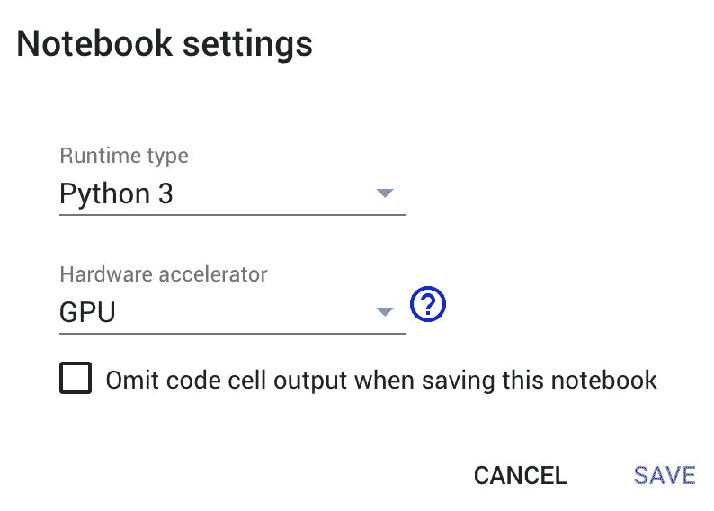

# 我们开始吧！！！

# 1)安装 TensorFlow 1.x

```
**#install tensorflow 1.15**
!pip install tensorflow==1.15**#Check tensorflow version**
import tensorflow as tf
print(tf.__version__)
```

# 2)导入依赖项

```
**import os
import glob
import xml.etree.ElementTree as ET
import pandas as pd**
```

# 3)在 google drive 中创建 customTF1、training 和 data 文件夹

首先，在你的 google drive 中创建一个名为 ***customTF1*** 的文件夹。

接下来，在 ***customTF1*** 文件夹内创建另一个名为 ***training*** 的文件夹( ***training*** 文件夹是训练时保存检查点的位置)。

最后，在 ***customTF1*** 文件夹内创建另一个名为 ***data*** 的文件夹。

# 4)创建并上传您的图像文件和 XML 文件。

为您的自定义数据集图像创建一个名为 ***images*** 的文件夹，并为其对应的 XML 文件创建另一个名为 ***annotations*** 的文件夹。

接下来，创建他们的 zip 文件并上传到你的驱动器中的 ***customTF1*** 文件夹。

> ***注意:*** *确保所有图像文件的扩展名为* ***。jpg"*** *只。其他格式如“* ***”。png*******。jpeg*** *“甚至”。***"会给出错误自* generate_tfrecord *和* xml_to_csv *脚本这里只有* ***。jpg"*** *在其中。如果您有其他格式的图像，则相应地在脚本中进行更改。***

**对于数据集，您可以在本文底部的致谢部分查看我的数据集来源。**

## **收集图像数据集并标记它们以获得它们的 PASCAL_VOC XML 注释。**

## **标注数据集**

**输入图像示例(**Image1.jpg**)**

****

**你可以使用任何软件来贴标签，比如 [**标签**](https://github.com/tzutalin/labelImg#labelimg) 工具。**

**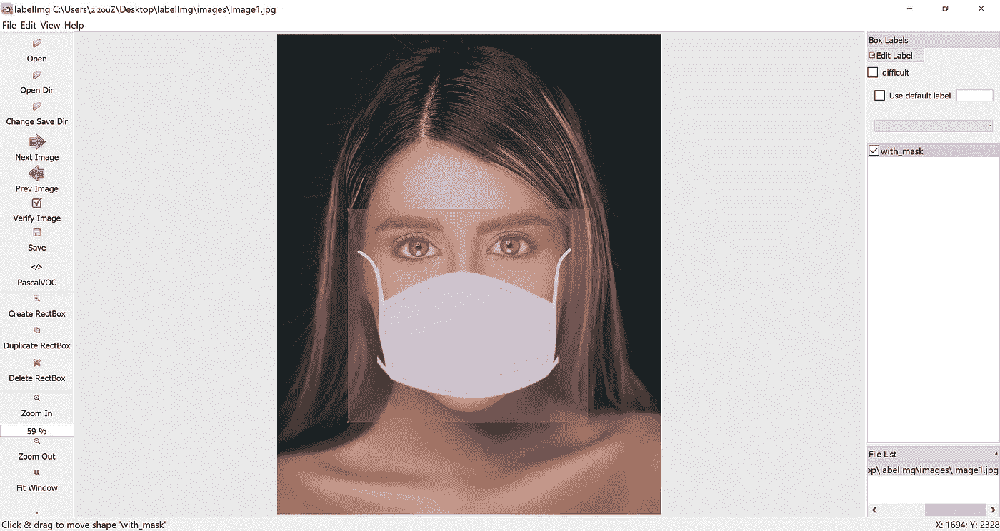**

**我使用一个名为 **OpenLabeling** 的开源标签工具，它有一个非常简单的 UI。**

**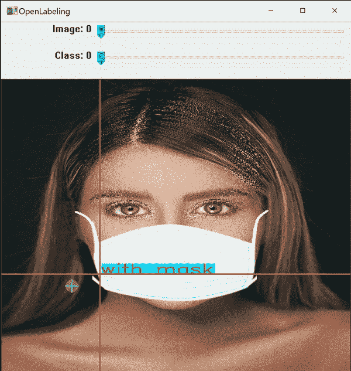**

**点击下面的链接，了解更多关于贴标过程和其他软件的信息:**

*   **[**影像数据集标注条**](https://techzizou.com/dataset-labeling-annotation-tutorial-for-beginners/)**

****注:**垃圾入=垃圾出。选择和标记图像是最重要的部分。尽量找质量好的图片。数据的质量在很大程度上决定了结果的质量。**

**输出的 PASCAL_VOC 标记的 XML 文件如下所示:**

**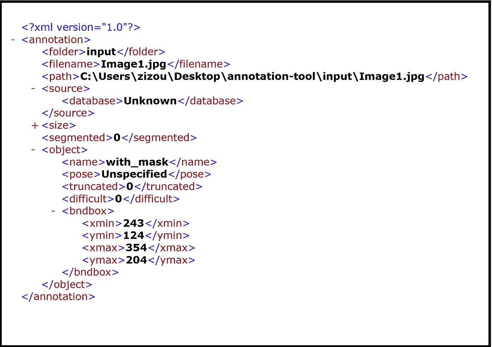**

# **5)将 generate_tfrecord.py 文件上传到驱动器中的 customTF1 文件夹**

**你可以在这里找到 generate_tfrecord.py 文件**

# **6)安装驱动器并链接您的文件夹**

```
****#mount drive**
from google.colab import drive
drive.mount('/content/gdrive')**# this creates a symbolic link so that now the path /content/gdrive/My Drive/ is equal to /mydrive**
!ln -s /content/gdrive/My Drive/ /mydrive**#list the contents in the drive**
!ls /mydrive**
```

# **7)克隆 TensorFlow 模型 git 存储库并安装 TensorFlow 对象检测 API**

**在 Colab 虚拟机中克隆 TensorFlow 模型的存储库**

```
****!git clone --q** [**https://github.com/tensorflow/models.git**](https://github.com/tensorflow/models.git)**
```

**按照 TensorFlow 官方文档页面[上的说明安装 TensorFlow 对象检测 API，此处](https://github.com/tensorflow/models/blob/master/research/object_detection/g3doc/tf1.md)**

```
****#navigate to /models/research folder to compile protos**
%cd models/research**# Compile protos.**
!protoc object_detection/protos/*.proto --python_out=.**# Install TensorFlow Object Detection API.**
!cp object_detection/packages/tf1/setup.py .
!python -m pip install .**#Dont have to use the --use-feature=2020-resolver as it is already the deafault now****
```

# **8)测试模型构建器**

```
****!python object_detection/builders/model_builder_tf1_test.py****
```

# **9)导航到驱动器上的数据文件夹，并将 images.zip 和 annotations.zip 文件解压缩到数据文件夹中**

**导航到/mydrive/customTF1/data/**

```
****%cd /mydrive/customTF1/data/****
```

**将 images.zip 和 annotations.zip 文件解压缩到 data 文件夹中**

```
****# unzip the datasets and their contents so that they are now in /mydrive/customTF1/data/ folder**!unzip /mydrive/customTF1/images.zip -d .
!unzip /mydrive/customTF1/annotations.zip -d .**
```

# **10)创建测试标签和训练标签**

**当前工作目录为***/my drive/custom tf1/data/*****

**将标注分为 test_labels(20%)和 train_labels(80%)。**

**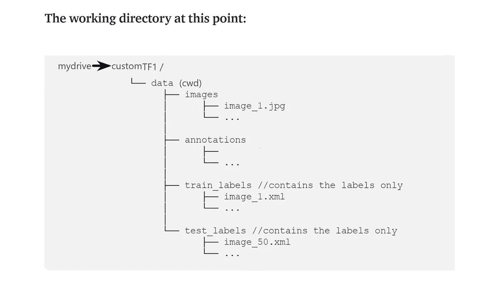**

# **11)创建 CSV 文件和“label_map.pbtxt”文件**

**当前工作目录为***/my drive/custom tf1/data/*****

**运行下面的 xml_to_csv 脚本来创建***test _ labels . CSV***和***train _ labels . CSV*****

**该脚本还使用 XML 文件中提到的类创建了***label _ map . Pb txt***文件。**

**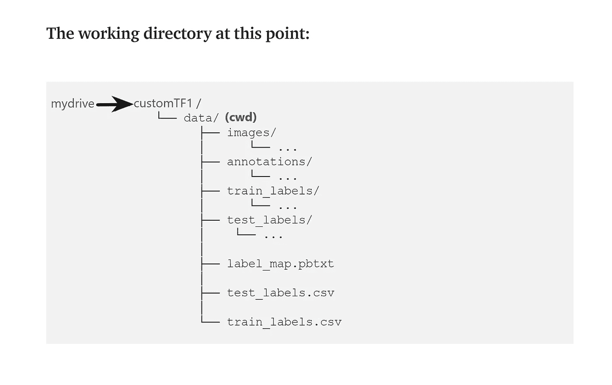**

**创建的 3 个文件即 **train_labels.csv** 、 **test_labels.csv** 和 **label_map.pbtxt** 如下图所示:**

**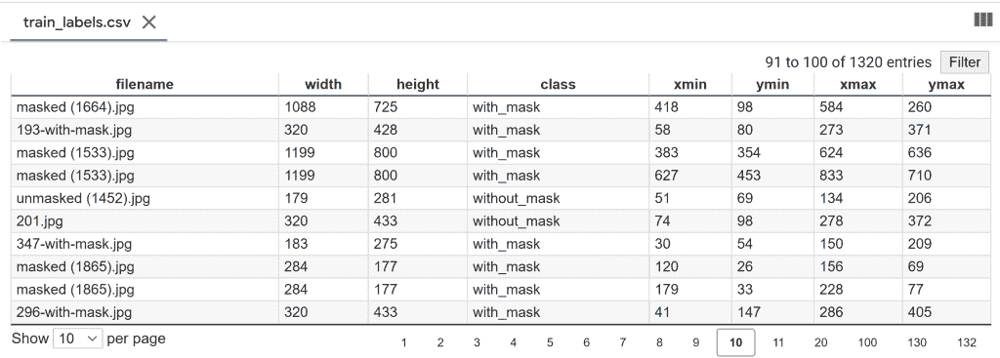****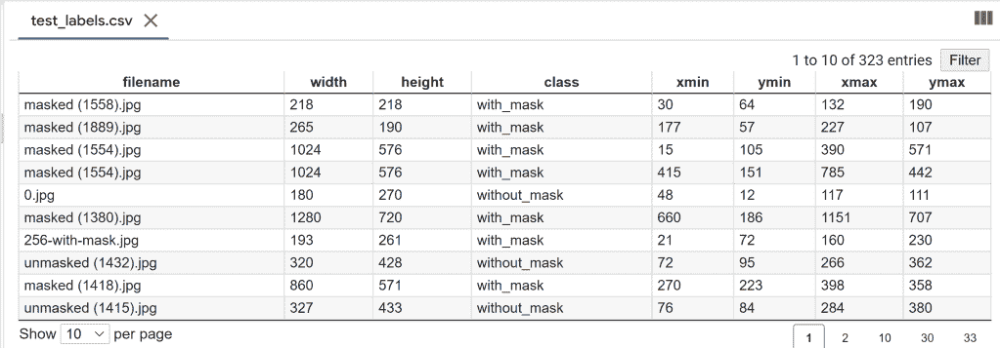****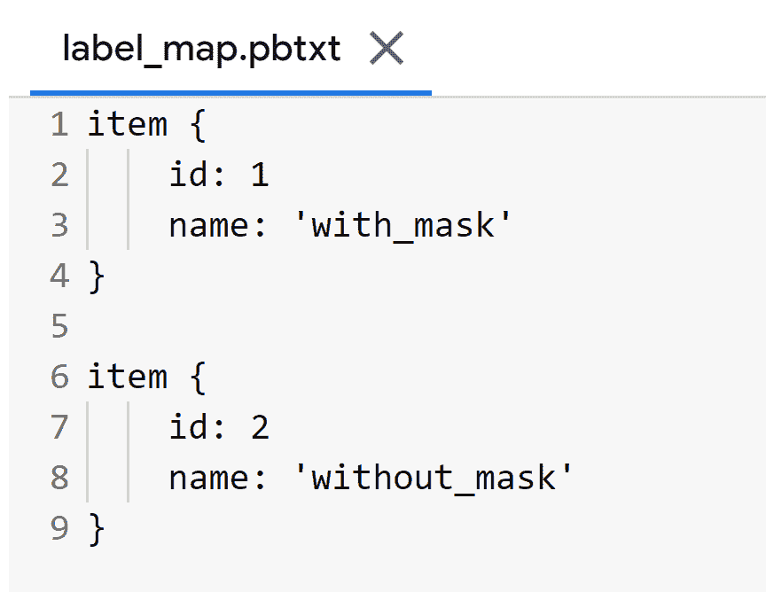**

****train_labels.csv** 包含所有列车图像的名称、这些图像中的类以及它们的注释。**

****test_labels.csv** 包含所有测试图像的名称、这些图像中的类以及它们的注释。**

****label_map.pbtxt** 文件包含来自您的带标签的 XML 文件的类名。**

****注:**我有两个类，即“带 _ 掩码”和“不带 _ 掩码”。**

> *****标签图 id 0 为背景标签预留。*****

# **12)创建训练记录和测试记录文件**

**当前工作目录为***/my drive/custom tf1/data/***。**

**运行***generate _ TF record . py***脚本创建 ***train.record*** 和 ***test.record*** 文件。**

```
****#Usage:**
#!python generate_tfrecord.py output.csv output_pb.txt /path/to/images output.tfrecords**#FOR train.record**
!python /mydrive/customTF1/generate_tfrecord.py train_labels.csv  label_map.pbtxt images/ train.record**#FOR test.record**
!python /mydrive/customTF1/generate_tfrecord.py test_labels.csv  label_map.pbtxt images/ test.record**
```

**如果一切顺利，您将看到以下输出:**

**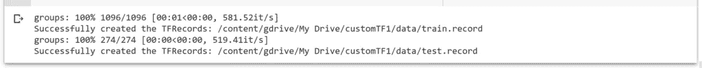**

**图像文件的总数是 1370。因为我们将标签分为两类，即。train_labels(80%)和 test_labels(20%)，“**train . record”**的文件数为 1096，“ **test.record** 的文件数为 274。**

# **13)下载预先训练的模型检查点**

**当前工作目录为***/my drive/custom tf1/data/*****

**根据您的数据和要求，您可以选择任何模型进行培训。阅读[这篇](https://serokell.io/blog/how-to-choose-ml-technique)博客，了解更多相关信息。**

**在本教程中，我将使用 **ssd_mobilenet_v2_coco** 模型。**

**TensorFlow 1.x 的检测检查点列表可以在[这里](https://github.com/tensorflow/models/blob/master/research/object_detection/g3doc/tf1_detection_zoo.md)找到。下面我们就来下载上面这款车型的**SSD _ mobilenet _ v2 _ coco _ 2018 _ 03 _ 29 . tar . gz**检查点。**

```
****#Download the pre-trained model ssd_mobilenet_v2_coco_2018_03_29.tar.gz into the *data* folder & unzip it**!wget http://download.tensorflow.org/models/object_detection/ssd_mobilenet_v2_coco_2018_03_29.tar.gz
!tar -xzvf ssd_mobilenet_v2_coco_2018_03_29.tar.gz**
```

# **14)获取模型管线配置文件，对其进行更改，并将其放入数据文件夹中**

**从***/content/models/research/object _ detection/samples/configs/***文件夹下载**SSD _ mobilenet _ v2 _ coco . config**。对其进行所需的更改，并将其上传到***/my drive/custom tf1/data***文件夹。**

****或****

**在 Colab VM 中编辑***/content/models/research/object _ detection/samples/configs/***中的配置文件，并将编辑后的配置文件复制到***/my drive/custom tf1/data***文件夹中。**

**您还可以在我们在上一步中刚刚下载的模型检查点文件夹中找到管道配置文件。**

****您需要做出以下更改:****

*   *****num_classes*** 给你的班级数。**
*   *****test . record***path，***train . record***path&***label map***path 到你创建这些文件的路径(训练时路径应该相对于你当前的工作目录)。**
*   *****微调检查点*** 到步骤 13 下载的检查点所在的路径。**
*   *****fine _ tune _ check point _ type***带值**分类**或**检测**视类型而定。**
*   *****batch_size*** 到 8 的任意倍数，取决于你的 GPU 能力。(例如:- 24，128，…，512)。GPU 能力越好，你能走的越高。我的设置为 24。**
*   *****num_steps*** 您希望探测器训练的步数。**

> **最大批量大小=可用 GPU 内存字节数/ 4 /(张量大小+可训练参数)**

****接下来，复制编辑好的配置文件**。**

```
****# copy the edited config file from the samples/configs/ directory to the data/ folder in your drive**!cp /content/models/research/object_detection/samples/configs/ssd_mobilenet_v2_coco.config /mydrive/customTF1/data/**
```

****此时的工作区:****

**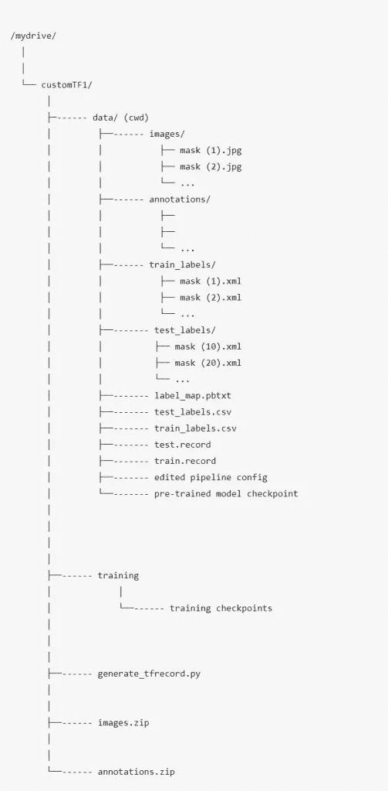**

> **您可以添加许多数据扩充选项。查看完整列表 [*此处*](https://github.com/tensorflow/models/blob/master/research/object_detection/protos/preprocessor.proto) 。对于新手来说，以上改动就足够了。**

## **数据扩充建议(可选)**

**首先，您应该使用带有上述基本更改的示例配置文件来训练模型，并看看它做得如何。如果你过拟合，那么你可能想做一些更多的图像放大。**

**在示例配置文件中:默认添加`**random_horizontal_flip**` & `**ssd_random_crop**`。您也可以尝试添加以下内容:**

**(**注**:每次图像增强都会大幅增加训练时间)**

1.  **来自**列车配置{}:****

```
****data_augmentation_options {
    random_adjust_contrast {
    }
  }
  data_augmentation_options {
    random_rgb_to_gray {
    }
  }
  data_augmentation_options {
    random_vertical_flip {
    }
  }
  data_augmentation_options {
    random_rotation90 {
    }
  }
  data_augmentation_options {
    random_patch_gaussian {
    }
  }****
```

**2.在**型号{ }>SSD { }>box _ predictor { }:**将`**use_dropout**`设置为`true`这将帮助您应对过度拟合。**

**3.在 **eval_config: {}** 设置`**num_examples**`中的**测试**图像的数量，并移除`**max_eval**`以无限期评估**

```
****eval_config: {
  num_examples: 274 # set this to the number of test images we divided earlier
  num_visualizations: 20 # the number of visualization to see in tensorboard
}****
```

# **15)加载张量板**

```
****%load_ext tensorboard
%tensorboard --logdir '/content/gdrive/MyDrive/customTF1/training'****
```

# **16)训练模型**

**导航到 Colab 虚拟机中的***object _ detection***文件夹**

```
****%cd /content/models/research/object_detection****
```

# **使用 model_main.py 进行培训和评估**

**从 object_detection 目录运行以下命令**

```
****!python model_main.py --pipeline_config_path=/mydrive/customTF1/data/ssd_mobilenet_v2_coco.config --model_dir=/mydrive/customTF1/training --num_train_steps=200000 --sample_1_of_n_eval_examples=1 --alsologtostderr****
```

**其中**管道配置路径**指向管道配置文件，而**模型目录**指向训练检查点和事件将被写入的目录。请注意，这个二进制将交错训练和评估。num_train_steps 是您希望模型训练的步数。在**mobilenet _ SSD _ v2 _ coco . config**文件中默认为 200000。您可以在命令中设置不同的值，也可以在配置文件中更改它。**

**为了获得最佳结果，如果可能的话，应该在损失小于 1 时停止训练，否则训练模型，直到损失暂时没有任何显著变化。你可以将步数减少到 50000 步，然后检查损失是否低于 1。如果没有，那么您可以用更多的步骤重新训练模型。**

****注:不同型号的损耗会有所不同。MobileNet-SSD 以大约 15 到 20 的损耗开始，并且应该被训练直到损耗始终低于 1。理想情况下，我们希望损失尽可能低，但我们希望确保模型不会过度拟合。介于 0.5 和 1 之间的损失似乎给出了好的结果。****

**运行上述命令后的输出通常看起来像是“冻结”了，但不要急于取消该过程。默认情况下，训练仅每 100 步输出一次日志，因此，如果您等待一段时间，您应该会在第 100 步看到一个丢失日志。您应该等待的时间可能会有很大的不同，这取决于您是否使用 GPU 以及在配置文件中为`**batch_size**`选择的值，所以请耐心等待。**

## **重新训练模型(以防断线)**

**如果您在 Colab VM 上断开连接或丢失会话，您可以从您停止的地方开始您的培训，因为检查点保存在您的驱动器上的 ***培训*** 文件夹中。要重新开始训练，只需运行**步骤 1、2、6、7、8、15 和 16。****

**请注意，由于我们拥有训练所需的所有文件，如记录文件、编辑过的管道配置文件、label_map.pbtxt 文件和模型检查点文件夹，因此我们不需要再次创建这些文件。**

> *****训练自动从最后一个训练过的检查点本身重新开始。*****

**但是，如果您发现它没有从最后一个检查点重新开始训练，您可以在管道配置文件中进行 1 处更改。将 **fine_tune_checkpoint** 更改为写入最新训练检查点的位置，并使其指向最新的检查点，如下所示:**

```
****fine_tune_checkpoint: "/mydrive/customTF1/training/model.ckpt-xxxx"** #(where model.ckpt-xxxx is the latest checkpoint)**
```

# **17)测试你训练好的模型**

# **导出推理图**

**当前工作目录为***/内容/模型/研究/对象 _ 检测*****

```
****!python export_inference_graph.py --input_type image_tensor --pipeline_config_path /mydrive/customTF1/data/ssd_mobilenet_v2_coco.config --trained_checkpoint_prefix /mydrive/customTF1/training/model.ckpt-141649 --output_directory /mydrive/customTF1/data/inference_graph****
```

# **在图像上测试您训练的对象检测模型**

**当前工作目录是***/内容/模型/研究/对象 _ 检测*****

## **这一步是可选的。**

```
**# **Different font-type and font-size for labels text**!wget https://freefontsdownload.net/download/160187/arial.zip
!unzip arial.zip -d .%cd utils/
!sed -i "s/font = ImageFont.truetype('arial.ttf', 24)/font = ImageFont.truetype('arial.ttf', 50)/" visualization_utils.py
%cd ..**
```

# **测试您训练过的对象检测模型**

**修改第 30 行和第 34 行。第 30 行是类的数量，第 34 行是测试图像文件夹的路径。**

**如果您已经根据本教程创建了所有文件夹和文件，那么您不需要更改第 41 行和第 42 行中的路径。**

# **注意:**

**我收集的用于遮罩检测的数据集主要包含特写图像。你可以在网上搜索更多的长镜头图片。有很多网站可以下载有标签和无标签的数据集。我在数据集来源下面给出了一些链接。我也给出了一些掩膜数据集的链接。其中一些有超过 10，000 张图片。**

**虽然我们可以对我们的训练配置文件进行某些调整和更改，或者通过增强为每种类型的对象类向数据集添加更多图像，但我们必须小心，以免导致影响模型准确性的过度拟合。**

**对于初学者，你可以简单地使用我上传到 GitHub **上的配置文件开始。**我还上传了我的掩模图像数据集以及 PASCAL_VOC 格式的文本文件，虽然这可能不是最好的，但将为您提供一个如何使用 SSD 模型训练您自己的自定义对象检测器的良好开端。你可以找到一个质量更好的带标签的数据集或者一个不带标签的数据集，以后自己标注。**

****

# **我的 GitHub**

**培训文件**

**[](https://github.com/techzizou/Train-Object-Detection-Model-TF-1.x) [## GitHub-techzizou/火车-物体-探测-模型-TF-1.x

### 此时您不能执行该操作。您已使用另一个标签页或窗口登录。您已在另一个选项卡中注销，或者…

github.com](https://github.com/techzizou/Train-Object-Detection-Model-TF-1.x) 

# 我的掩膜数据集

[](https://www.kaggle.com/techzizou/labeled-mask-dataset-pascal-voc-format) [## 带标签的掩膜数据集(PASCAL_VOC)

### PASCAL_VOC 格式 XML 注释

www.kaggle.com](https://www.kaggle.com/techzizou/labeled-mask-dataset-pascal-voc-format) 

# 我的 Colab 笔记本

[**谷歌合作实验室**](https://colab.research.google.com/drive/10IqIFEorsz2y0rDzuGje5dwsXXlZhqMK?usp=sharing)

# 信用

## 文件/参考资料

*   [张量流简介](https://github.com/tensorflow/tensorflow)
*   [Tensorflow 模型 Git 库](https://github.com/tensorflow/models)
*   [TensorFlow 对象检测 API 库](https://github.com/tensorflow/models/tree/master/research/object_detection)
*   [TF 对象检测文档](https://github.com/tensorflow/models/tree/master/research/object_detection/g3doc)
*   [TF1 安装指南](https://github.com/tensorflow/models/blob/master/research/object_detection/g3doc/tf1.md)
*   [TensorFlow 1 检测模型动物园](https://github.com/tensorflow/models/blob/master/research/object_detection/g3doc/tf1_detection_zoo.md)
*   [使用 TensorFlow 1 进行培训和评估](https://github.com/tensorflow/models/blob/master/research/object_detection/g3doc/tf1_training_and_evaluation.md)
*   [张量流教程](https://www.tensorflow.org/tutorials)
*   [张量流枢纽](https://tfhub.dev/)
*   [TensorFlow Hub 对象检测 Colab](https://github.com/tensorflow/hub/blob/master/examples/colab/tf2_object_detection.ipynb)
*   [物体探测器教程](https://towardsdatascience.com/detailed-tutorial-build-your-custom-real-time-object-detector-5ade1017fd2d)

## 数据集源

您可以从下面提到的网站下载许多对象的数据集。这些网站还包含许多种类的对象的图像以及它们的多种格式的注释/标签，例如 YOLO_DARKNET txt 文件和 PASCAL_VOC xml 文件。

*   [通过谷歌打开图像数据集](https://storage.googleapis.com/openimages/web/index.html)
*   [Kaggle 数据集](https://www.kaggle.com/datasets)
*   [Roboflow 公共数据集](https://public.roboflow.com/)
*   [可视化数据数据集](https://www.visualdata.io/discovery)

## 屏蔽数据集源

*   [般若 Github](https://github.com/prajnasb/observations)
*   [Andrewmvd Kaggle](https://www.kaggle.com/andrewmvd/face-mask-detection)
*   [X-张洋 Github](https://github.com/X-zhangyang/Real-World-Masked-Face-Dataset)

## 更多掩膜数据集

*   Prasoonkottarathil ka ggle(20000 张图片)
*   [ashishjangra 27 ka ggle](https://www.kaggle.com/ashishjangra27/face-mask-12k-images-dataset?select=Face+Mask+Dataset)(12000 张图片)

# 解决纷争

如果你得到一个类似“无法将一个符号张量(cond_2/strided_slice:0)转换成一个 numpy 数组”的 NumPy 错误，你可以通过降级你的 NumPy 版本，卸载并安装 pycocotools 来修复它。运行以下 3 个命令:

```
**!pip install numpy==1.19.5****!pip uninstall pycocotools
!pip install pycocotools**
```

# 别忘了留下👏

# 祝您愉快！！！✌

# ♕·特奇佐·♕**