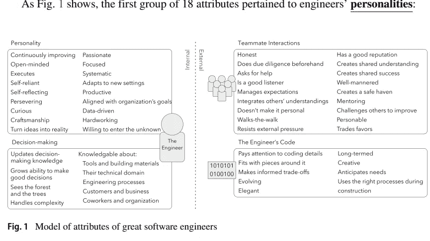
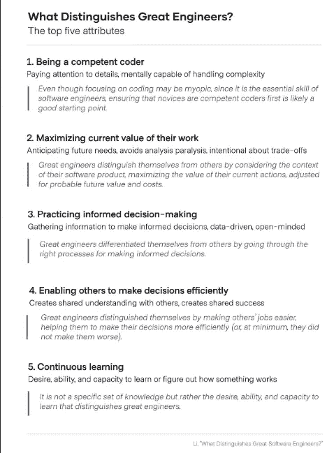
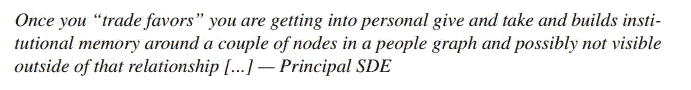
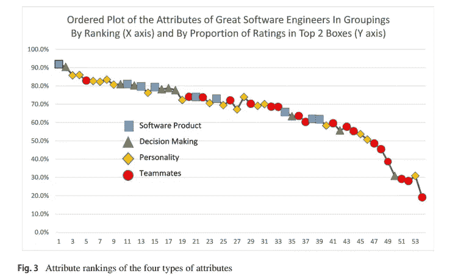

# 伟大软件工程师的特质——根据微软

> 原文：<https://medium.com/geekculture/traits-of-great-software-engineers-according-to-microsoft-761395f8b427?source=collection_archive---------1----------------------->

## 他们对伟大的软件工程师的性格特征进行了广泛的研究。这就是结果。

我谈到精通软件开发将如何带来惊人的职业收益，

每周，我都会讲述各种概念和想法，帮助你加深对技术的理解，成为一名出色的开发人员，并最终在像技术这样混乱的领域中茁壮成长。

最近偶然看到一篇微软的论文，题目是， [**伟大的软件工程师有哪些与众不同的地方？**](https://faculty.washington.edu/ajko/papers/Li2019WhatDistinguishesEngineers.pdf) 在这篇文章中，我将把它分解开来，给你一些额外的信息，告诉你如何在生活中以一种可行的、可持续的方式实施这些学习。

Of all these traits, which would you rank in your top 5? Let me know by replying to the comments/using my social media links.

在这封邮件/帖子中，我们将介绍伟大软件工程师的特质，如何最有效地培养这些兴趣，并成为软件开发的绝对恶魔。这篇论文还发现了一些糟糕的工程师犯下的大罪。我们将涵盖这些绝对邪恶的错误，你应该不惜一切代价避免。我希望你很兴奋，因为这将会是一场狂欢。无论你是一名希望变得更好的学生，一名希望跨越阶梯的入门级/中级开发人员，还是一名希望做出正确聘用的高级人员，这项研究都将与你密切相关。

# 主要亮点

1.  **优秀开发人员的 5 个特质-** 黄金 5 个特质是-写好代码，调整行为以适应未来，明智的决策，不增加别人的工作难度，不断学习。请注意，这些与我在内容中强调的几乎完全重叠。subs 取得的优异成绩不是巧合。
2.  **如何培养这些特质-** 阅读更多。它会影响所有这些特征。在这篇文章中，我们将讨论你想特别关注的每一个人的特质。但这一切都与多读书有关。探索你的兴趣。让自己接触新的想法和实现(技术的和非技术的)。最起码，来看看这份简讯吧。看看我分享的推荐来源。我没有得到任何报酬。我分享/推荐它们，因为它们有很多价值。
3.  **糟糕的工程师犯下的罪过-** 在前面提到的那些有负面评价的特质中有两个- *努力工作(愿意投入 8 小时以上的时间)*和*交换好处(以牙还牙)。*这些通常与积极的特质有关，但事情的发展方式——这些特质会导致消极的结果。我们将讨论您应该做什么。

让我们开始吧。这将是你职业生涯中最棒的周末之一。

# 五大黄金特质

看看下面这段话，直接从报纸上摘下来的-

> 综合这些发现后，我们认为伟大工程师的五大显著特征是编写优秀的代码，调整行为以考虑未来的价值和成本，实践明智的决策，避免给别人的工作增加难度，以及持续学习

研究人员是如何定义这些特征的？让我们来看看研究中定义的这些特征的含义

1.  **写好代码**——关注编码细节，心理上能够处理复杂性。这里没有什么太令人震惊的。如果不知道如何写出好的代码，其他的事情就无从谈起。
2.  **调整行为以考虑未来的价值和成本**——优秀的开发人员能够以一种考虑未来的方式，创造出最大化他们工作当前价值的解决方案。还记得我总是说开发者需要理解经济学才能变得令人惊叹吗？这篇文章还提到了对风险和回报等经济概念的理解。
3.  **实践明智的决策**-“*伟大的工程师通过正确的流程做出明智的决策，从而使自己与众不同*”这篇论文中的引文真正解释了你需要知道的一切。回想一下我写的关于[比例数学](https://codinginterviewsmadesimple.substack.com/p/the-mathematics-of-scale-math-mondays?r=4tnbw&s=w&utm_campaign=post&utm_medium=web)的文章。由于技术运作的规模，好的决策可以赚几百万。错误的决定会损失数百万。一个正确的决定要比 10 个普通的决定好得多。有关 IRL 的示例，请阅读下面的文章。

 [## 一个软件工程师如何在 4 年内从 SW2 到校长

### 如何快速升职？一名工程师如何在不到 4 年的时间里获得 4 次晋升

blog.devgenius.io](https://blog.devgenius.io/how-a-software-engineer-went-from-sw2-to-principal-in-4-years-4c708dbfae40) 

1.  不要让别人的工作变得更难- 记住，你所建立的一切都是一个更大系统的一部分。没有人付钱给你只是为了写代码。**你是为一个能赚钱的系统贡献力量而获得报酬的。如果我创建了一个惊人的 99%准确率的人工智能模型，因为它需要所有的数据处理和资源而关闭了整个系统，那么我只是创建了一个糟糕的模型。正如作者所言——“*伟大的工程师让别人的工作变得更容易，帮助他们更有效地做出决定(或者，至少，他们没有让决定变得更糟)，从而让自己与众不同***
2.  **不断学习-** 不在于你在哪里，而在于你愿意并且能够在哪里。坚持不懈地学习，你将成为传奇。既然你已经主动订阅了这份时事通讯，并且很可能在周末阅读，我想说你至少有正确的态度。

如果你是这里的常客，这些都不会让你太震惊。这些都是我在所有内容中一直强调的价值观。我的实现了这一点的潜艇已经成为更好的开发人员。他们惊人的职业成就只是他们新的、更精细的技能组合的副产品。如果你想让我为你制定最好的计划，请联系我。我们可以帮助您制定定制的行动计划。

A summary of the traits discussed. [Source](https://abinoda.substack.com/p/great-engineers)

既然我们已经就这些特征以及它们为何如此重要达成了一致，你该如何开发它们呢？让我们接下来做那件事。

# 培养这些特质

多读书。关于知识性话题的 YT 视频也算。

真的是这样。我可以编 20 个故事，但归根结底就是这个。

酷吗？我们意见一致吗？让我们来看下一部分——你应该读什么？

有三种类型的阅读材料对你有很大的帮助。我一直分享这三个不同的例子。猜猜它们是什么？

你确定，你没有猜测吗？

如果你答对了，我就给你一块饼干。

我们的神圣三位一体如下-

1.  **不同行业的经济学资料-** 不同的行业都有自己独特的挑战、机遇和限制。阅读人们是如何处理和解决这些问题的，将有助于你获得更多的视角。理解某些解决方案失败的原因也是有帮助的。
2.  **工程博客-** 世界各地的组织都在发布关于他们如何设计系统/应对挑战的特别内容。他们谈论他们面临的问题，他们使用的解决方案，以及一些有趣的见解。请务必通读。你最喜欢的大公司正在出版非常高质量的作品。阅读它以更好地理解它们。了解这个世界上的人们是如何行动的。
3.  研究论文/理论材料- 花些时间接触数学、计算机科学和软件工程方面的不同想法。遇到不同的想法和概念将帮助您理解各种解决方案的一些细微差别，以及如何有效地进行权衡。

在这个基础上，加入你感兴趣的东西。根据你的兴趣、目标和爱好，你会在这些方面花费不同的时间。那很好。最终，这将帮助你发展你独有的技能和想法。这将是你事业飞跃的地方。

多读书会帮助你做出更好的决定。它将帮助您预见您可能面临的一些挑战，了解不同的人如何在相关领域(或不同领域)解决这些挑战，以及什么工程决策将给您带来最高的 ROI。它还将向您展示各种最佳实践/设计决策，最终帮助您创建功能性的、高性能的、易于使用/修改的代码/解决方案。

Photo by [Zan](https://unsplash.com/@zanilic?utm_source=medium&utm_medium=referral) on [Unsplash](https://unsplash.com?utm_source=medium&utm_medium=referral)

现在让我们进入你应该避免的致命编程错误。

# 开发者的两大死罪

我们已经讨论了两大罪。让我们来谈谈为什么他们不好，你可以做些什么来代替。

# 繁重的工作

这可能会让你们大多数人感到震惊。喧嚣文化真的喜欢爱磨的西格玛。投入工作是很重要的。如果你想跑马拉松，你必须算出英里数。没办法回避。为什么这被认为是一件坏事-

然而，如果一个开发人员总是发现自己每天工作 8 小时以上，他们可能做错了什么。正如我多次说过的，不是做更多而是做正确的事情。这就是为什么我强调有时需要后退一步，从整体上分析事情。正如我们之前介绍的，1 个高影响决策> 10 个中等影响决策。

> 开发人员的工作量是发生在开发人员之上的管理和计划的功能。通常需要长时间的工作，因为计划不好，在项目生命周期中做出的决定不好，变更管理不够“敏捷”
> 
> *——摘自论文*

关键在于冷静下来。与其匆忙解决问题，不如花时间考虑细节(预测未来)。选择最有效、最简单的领域来解决。在你前进的时候，记住最终目标。少即是多。(相对而言)做很少的事就能取得很大的成果。

对于那些对机器学习感兴趣的人，我前段时间制作了一个视频，详细阐述了这一点。可以在下面看。

这并不是说你永远不用做这些漫长的日子。挑战总是会突然出现。只是不要让那些漫长的日子成为常态。你的大部分时间应该花在思考、计划和考虑细节上。研磨应该是一个非常罕见的事件。不是每月都会发生的事情。

接下来是第二宗罪。

# 交换人情

想象一下，你帮助别人修理东西。然后你请求他们帮助你？这有什么不好？

没什么。完全没有。

当人们开始形成集群时，问题就来了。你和你的船员去寻求帮助。主要是互相帮助。不是因为戏剧或者什么特别的原因。人类是部落生物，所以这很自然。我们会自然而然地被我们熟悉的人所吸引。那么，为什么这是一件坏事呢？

我不久前讲过康威定律。它表明团队结构中的偏差倾向于在整个系统中传播。在一个群体中进行人情交易会增加一层偏见，这种偏见会在解决方案中表现出来。

> 任何设计系统(广义定义)的组织都会产生一个设计，其结构是该组织沟通结构的复制。
> 
> *—梅尔文·e·康威*

有一个简单的方法可以解决这个问题。不要只帮助/去帮助少数人，而是去帮助更多的人。积极寻求更多可能帮助你的人。将你的挑战张贴在公司的公告栏/通讯频道上，与更多的人一起工作。这会让你避免这个问题，同时也让你认识更多的人。双赢。

我将用一个有趣的观察来结束这篇文章。看看所有特征的排名，按类型分组。

即使编码名列前茅，前 10 名也是由个性类主导的。你想怎么做就怎么做。

如果你喜欢这篇文章，你会喜欢我的每日电子邮件简讯[科技使事情变得简单](https://codinginterviewsmadesimple.substack.com/)。它涵盖了算法设计、数学、人工智能、数据科学、最近的技术事件、软件工程等主题，让你成为更好的开发人员。 [**我目前正在进行一整年的八折优惠，一定要去看看。**](https://codinginterviewsmadesimple.substack.com/subscribe?coupon=1e0532f2) 使用此折扣会降低价格-

***每月 800 卢比(10 美元)→ 533 卢比(8 美元)***

***每年 8000 印度卢比(100 美元)→6400 印度卢比(80 美元)***

你可以在这里了解更多关于时事通讯的信息

# 向我伸出手

使用下面的链接查看我的其他内容，了解更多关于辅导的信息，或者只是打个招呼。另外，查看免费的罗宾汉推荐链接。我们都得到一个免费的股票(你不用放任何钱)，对你没有任何风险。所以不使用它只是在损失免费的钱。

为了帮助我了解您[请填写此调查(匿名)](https://forms.gle/7MfQmKhEhyBTMDUD7)

查看我在 Medium 上的其他文章。https://rb.gy/zn1aiu

我的 YouTube:[https://rb.gy/88iwdd](https://rb.gy/88iwdd)

在 LinkedIn 上联系我。我们来连线:[https://rb.gy/m5ok2y](https://rb.gy/f7ltuj)

我的 insta gram:【https://rb.gy/gmvuy9 

我的推特:【https://twitter.com/Machine01776819 

如果你想在科技领域发展事业:[https://codinginterviewsmadesimple.substack.com/](https://codinginterviewsmadesimple.substack.com/)

获得罗宾汉的免费股票:[https://join.robinhood.com/fnud75](https://join.robinhood.com/fnud75/)