# C++中的轨迹生成

> 原文：<https://medium.com/geekculture/trajectory-generation-in-c-da36521128aa?source=collection_archive---------4----------------------->

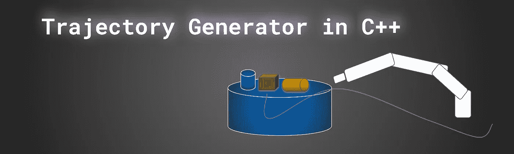

下面的文章展示了机器人(这里是工业机械手)轨迹生成的常用方法。在我以前的文章中，我描述了找到目标的算法。例如，我们可以看到[](/geekculture/3d-rrt-algorithm-for-robot-path-planner-in-c-222133509d28)**或 [**Dijkstra**](/geekculture/graph-algorithms-in-c-161d2d3c245) 算法在起作用。算法找到了到达目标的最短或最佳路径。我在 2D 和 3D 空间中描绘了解决方案。
在机器人控制系统中，路径规划器负责寻找无碰撞路径(请再次考虑下图)。**

**请不要忘记本文中的模拟是用 C++生成的。源代码你会在我的 [**GitHub**](https://github.com/markusbuchholz/trajectory_generation_in_cpp) 上找到。图由外部库生成，您可以下载并添加到项目中，如下所示:**

**[头文件](https://github.com/lava/matplotlib-cpp)(用于绘图库)必须与你的 cpp 在同一个文件夹中。**

```
//compile
g++ my_prog.cpp -o my_prog -I/usr/include/python3.8 -lpython3.8//run
./my_prog//folder tree
├── my_prog
├── my_prog.cpp
├── matplotlibcpp.h
```

**为了解代数方程，我还使用了特征库。为了下载并实现到您的代码讨论库中，请遵循以下步骤:**

**为了使用 [Eigen C++库](https://eigen.tuxfamily.org/index.php?title=Main_Page)，请访问网站。将 eigen repo 下载到机器上您最喜欢的位置，并(对于 Linux 用户)创建软链接。**

```
git clone [https://gitlab.com/libeigen/eigen.git](https://gitlab.com/libeigen/eigen.git)sudo ln -s /usr/include/eigen3/Eigen /usr/local/include//usr/include/eigen3/Eigen  -- location of your clone library
```

**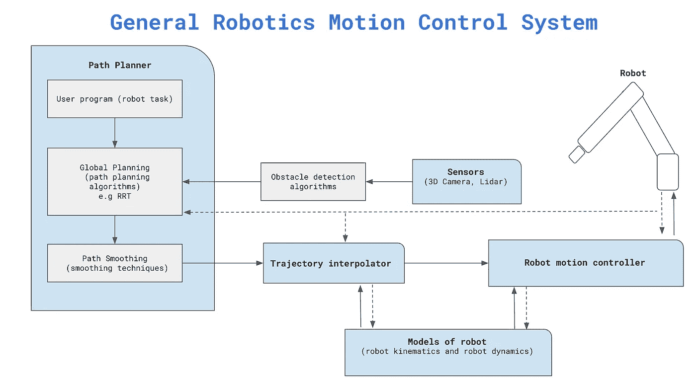**

**by author**

**路径规划器为机器人准备了地图，但是没有指定速度和加速度。在这一阶段，机器人没有关于在路径的每一步应该达到的时间、速度或加速度的信息。这里的时间步长与机器人控制器时间步长相关，即控制信号产生的频率。此时，我们无法预测机器人的运动(我们不指定机器人路径上的机器人速度或加速度)，因此机器人的运动可能是不平稳的。当物体以一定速度移动时，我们不能给机器人指令，机器人必须跟随物体。另外我们不能规定机器人过渡到目标的时间。**

**这些约束迫使寻找**机器人轨迹，**机器人轨迹从计算路径(在路径规划器中)导出，然后映射到时间函数中(机器人在时域中的位置、速度和加速度)。**

**请记住(简化)。当机器人需要到达某个点时，不管路径如何(当物体必须被拾取到某个随机位置时的拾取和放置应用，例如由摄像机感知)，第一个路径规划器计算路径(点到点)。有了无碰撞路径、时间和速度约束(通常还有加速度),就可以计算每个关节的轨迹。实现点对点的路径几乎有无限的可能性(轨迹)。当在**关节空间**中计算轨迹时，不需要计算逆运动学。**

**在机器人的末端执行器必须线性移动的情况下——**任务空间**(如喷漆机器人或焊接机器人)，因此在这种情况下，必须应用反向运动学来计算关节的位置。在这篇文章中，我不打算描述这种情况，悬停反向运动学求解器在 C++我在这篇文章中讨论。**

# **轨迹生成。点对点运动**

**当机器人从一点移动到另一点时(在关节空间配置中)，必须计算时标轨迹 **s(t)** 。轨迹的计算方式必须确保机器人的运动是平稳的，并且满足某些约束条件，如速度和加速度。**

**取决于机械手运动约束:机器人位置、速度和加速度，必须应用多项式的适当阶来计算关节轨迹。**

**通常应用**三阶(三次)**多项式(四个未知系数)允许考虑四个约束。初始位置，最终位置，初始速度和最终速度。
为了考虑初始和最终加速度，我们必须应用**五次多项式(五次)**。
此外，加加速度(初始和最终)也可作为运动约束进行评估。这种情况需要七阶多项式。请注意，在计算由四个点指定的轨迹运动时，同阶多项式(七阶)可以重复使用(后面的例子。**

**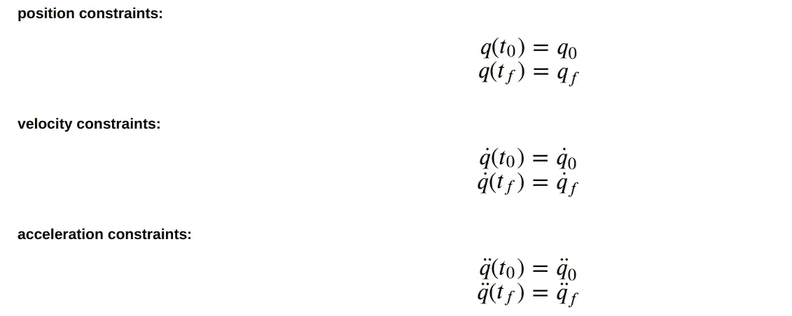**

# **三次多项式轨迹**

**三次多项式定义如下，**

**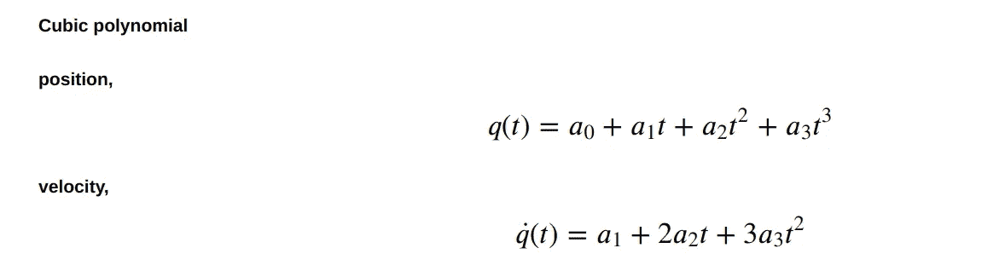**

**因为它包括四个未知系数，所以我们能够指定四个约束(两个用于位置，两个用于速度)。对于开始和结束时间，这些等式可以表示如下:**

**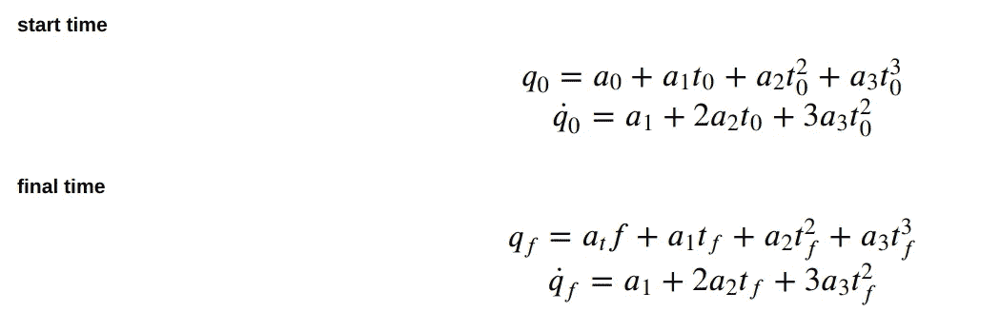**

**此外，给定的方程可以组合成矩阵方程，**

**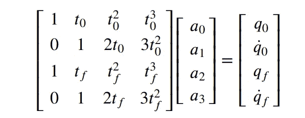**

**每个矩阵方程(用 C++描述和实现)已经使用特征库求解。**

**矩阵方程可以表示为:**

**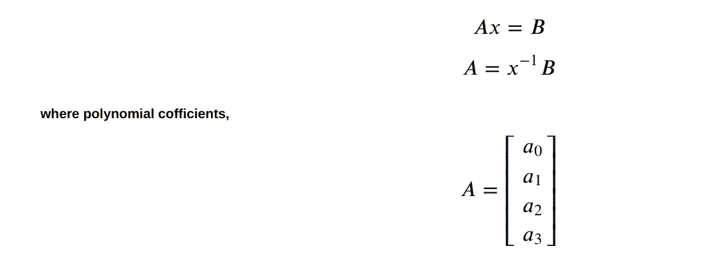**

**求解方法(对于三次多项式)也适用于下面文章中演示的其他阶多项式(五次和七次)。**

**有了多项式系数，我们就能够计算(在迭代过程中)轨迹(参见 C++代码)。**

**假设(见代码)一个机器人关节 t0 = 0；TF = 2；Q0 = 10 度，qf = 14 度，v 0 = 50 度/秒；vf =度/秒；我们可以计算运动轨迹:**

**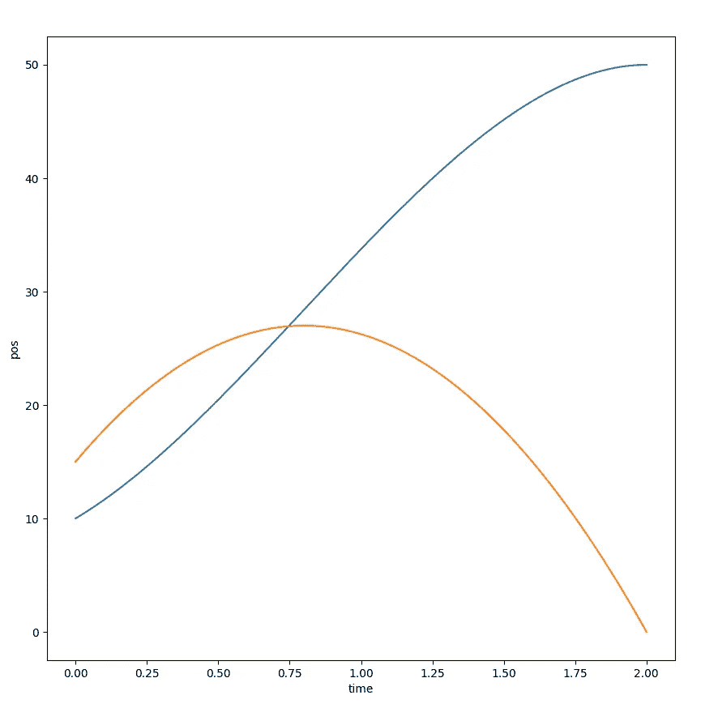**

**blue, orange means respectively: joint position and velocity**

# ****五次多项式****

**类似于三次多项式，我们可以为五次多项式指定方程。这种类型的多项式由六个未知系数指定，因此加速度作为约束可以包括在机器人运动的规范中。**

**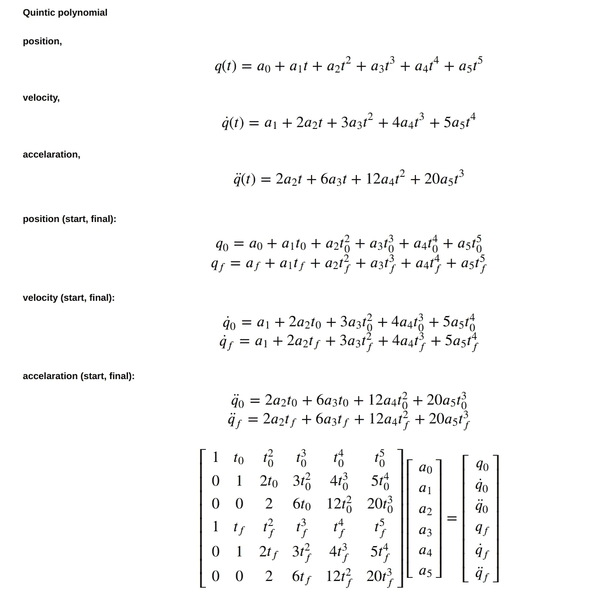**

**假设(见代码)一个机器人关节 t0 = 0；TF = 2；Q0 = 0 度，qf = 40 度，v 0 = 50 度/秒；vf =度/秒；acc0 =度/S2；accf = 0 deg/S2；我们可以计算运动轨迹:**

****

**blue, orange, green means respectively: joint position, velocity and acceleration**

# **7 阶多项式**

**这种类型的多项式由八个未知系数指定，因此加速度的导数(加加速度)作为约束可以包括在机器人运动的规范中。如前所述，我在计算由四个点指定轨迹运动时使用了这种类型的多项式(见下面的例子和 C++代码)。**

**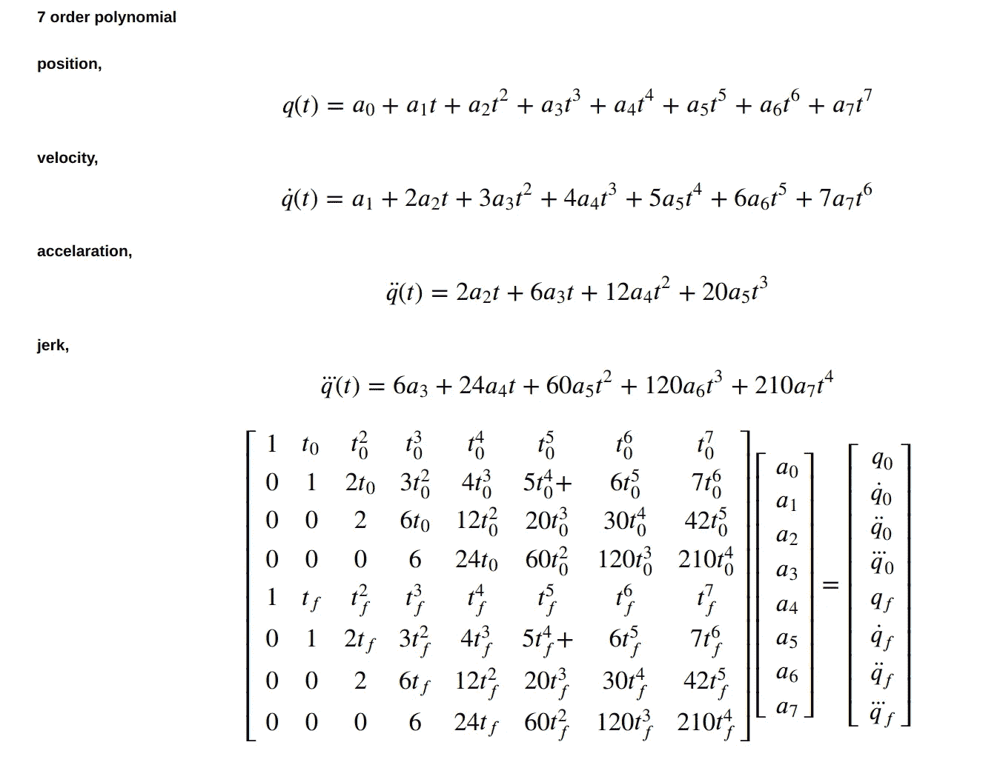**

**假设(见代码)一个机器人关节 t0 = 0；TF = 1；q0 =度，qf = 45 度，v 0 = 50 度/秒；vf =度/秒；acc0 =度/S2；accf = 0 deg/S2；Q1(0.4s)= 20 度；Q1(0.7s)= 30 度我们可以计算运动轨迹:**

**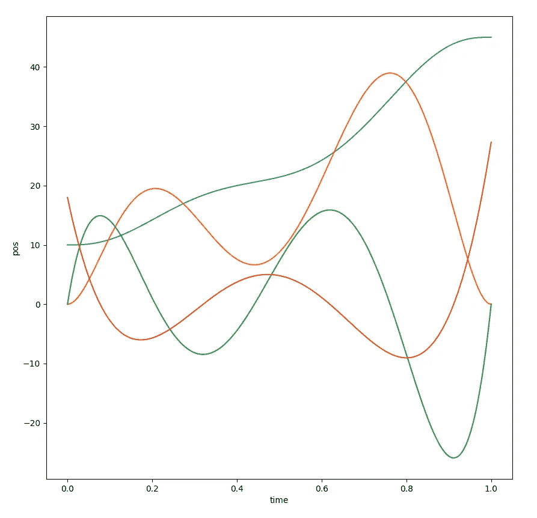**

**blue, orange, green, red means respectively: joint position, velocity, acceleration and jerk. Note : curves are scaled -> see code.**

**感谢您的阅读。**