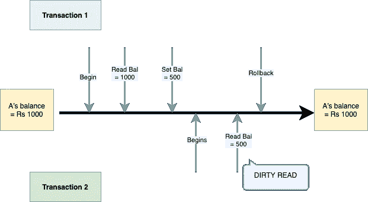
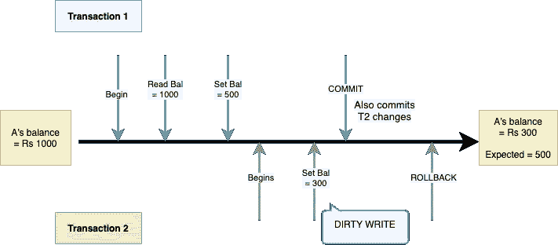
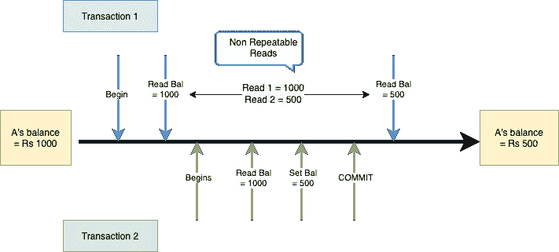
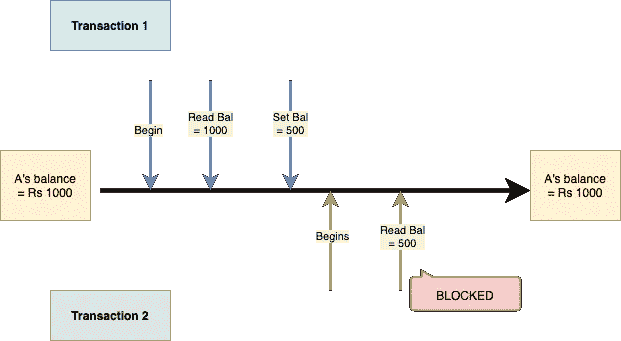
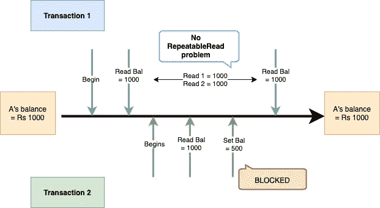
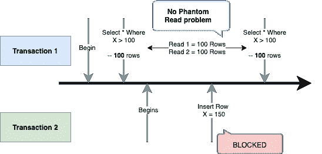
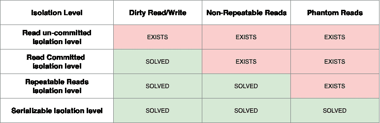

# 数据库事务隔离级别

> 原文：<https://medium.com/geekculture/transaction-isolation-levels-f438f861e48a?source=collection_archive---------3----------------------->

隔离级别基本上是针对 ACID 中的“I”属性起作用的，即隔离。

让我们快速回顾一下酸的性质。

**A —原子性**:它说一个事务中的所有指令都应该以原子的方式发生。原子性仅仅意味着它不能被分解，所以事务执行起来就像是一个单独的步骤。
例如，A 想转账(Rs。500)到 b .称之为交易。
原子性保证了 A 的余额将被 Rs 扣除。500，B 的余额将被 Rs 记入贷方。500.因此，这种信贷和扣除恰好是一个单一的步骤。
想象一下，如果不是原子性的，例如 A 的钱被扣除，然后交易失败，B 从未被贷记，那会有多混乱。

**C —一致性**:这确保数据库总是处于一致或有效的状态。
使用与上面相同的例子，假设在交易之前，A 的余额是卢比。1000 和 B 的余额是卢比。2000.
交易后(Rs。500 从 A → B)，我们期望 A 的余额=500Rs，B 的余额=Rs.2500
如果想想，这两种状态都有效。不能让 A 的余额更新到 Rs。500 但是 B 的余额不是卢比。2500.
所以在这里，它们的余额之和可以被认为是一种状态，并且它应该在交易前后保持一致。

**I —隔离**:该属性通过确保多个事务互不影响来防止并发运行时出现问题。即结果应该与事务顺序运行时获得的结果相同。
举个例子，假设有 2 个并发交易正在进行:
A → B 和 A → C 转移 Rs。每笔交易 500 英镑。
可能有多种并发可能导致问题的场景，例如 T1 将 A 的余额读取为 1000，同时 T2 也将 A 的余额读取为 1000。都扣了 500 分别发给 B 和 C。这导致了问题，因为现在两者都将 A 的余额更新为 500。
既然 A 的余额现在是 Rs。500，这与一致性相矛盾，因为在这 2 笔交易之后，A 的预期余额应该是 0。
我们有几个隔离级别，具体取决于我们希望它们有多严格，这也是本文的重点。

**D —持久性**:它确保一旦事务被提交，我们不应该丢失它的状态，并且必须被持久化。例如一个 had Rs。1000，而且它转了 Rs。500 到 b，现在每次下一次查询 A 的余额，都应该得到最新的值，一定不能丢失这些细节。

让我们讨论一下隔离级别，以及为什么在并发环境中首先需要隔离级别。

# 并行环境中的问题:

## **1。脏读:**

脏数据是指数据库中可能从未存在过的错误或无意的数据。

假设我们有两个事务 T1 和 T2 同时运行。现在，如果 T1 插入/更新了一些行，而 T2 在 T1 提交之前读取了这些行。
T2 在这里进行了脏读，因为 T1 可能决定回滚/中止，并且从不提交，所以 T2 读取的内容从来不存在。

> 例如
> A 在任何交易前的余额= Rs。1000.
> 
> T1 开始
> T1 读取 A 的余额=Rs。1000
> T1 设定 A 的余额=Rs。500(也许是为了发给 B 等。)
> T2 开始
> T2 读 A 的余额=Rs。500 [ **脏读** ]
> T1 回滚。

在这里，T2 读到 A 的平衡=Rs。500，这是脏读，作为 T1 事务发送 Rs。A → B 的 500 被中止，同时，T2 读到了 A 的余额的这个错误值。考虑一下混乱的局面，如果 T2 打算派 Rs。800 对 c，它会看到 A 只有 Rs。500，并将返回“余额不足”错误，即使实际上 A 有 Rs。1000(因为 T1 从未发生/回滚)。

## **2。脏写:**

与脏读同义，脏写可以在 T1 运行时发生，T2 写入一些值。这意味着当 T1 提交时，它也将提交 T2 的更改，T2 将回滚这些更改。
这将导致对数据库的无意写入。

> 例如
> T1 开始
> T1 读取 A 的余额=Rs。1000
> T1 设置 A 的余额=Rs。500(也许是为了发给 B 等。)
> T2 开始
> T2 读 A 的余额=Rs。500(因为 T1 已经更新过了)
> T2 设定 A 的余额=Rs。300(可能要送 200 给 C 等等。)[ **脏写** ]
> T1 提交。(提交 A 的余额= 300)
> T2 回滚。(意思是 Rs 的 A → C。200 从没发生过)。

所以在这里，既然 A → C 从未发生，那就只是 Rs 的 A → B。500，所以预期 A 的余额= 500，但是由于脏写，A 的余额被错误地设置为 Rs。300.

## **3。不可重复读取:**

当事务尝试多次读取数据库行并且每次都获得不同的结果时，就会发生这种情况，例如，如果 T1 在两个不同的时间读取数据库行，并且在这两次读取之间，t 2 会更新该行。

> 考虑一个例子:
> T1 开始
> T1 读取 A 的余额=Rs。1000【读 1】
> T2 开始
> T2 读 A 的平衡=Rs。1000
> T2 写 A 的余额=Rs。500(比方说 A → B Rs。500)
> T2Commit。
> T1 读 A 的余额=Rs。500.【阅读 2】—**发布**。

所以顾名思义，当一个事务进行可重复读取时，它会得到不同的值。

## **4。幻影念道:**

顾名思义，这意味着完成了一些幻影/幽灵般的读取。如果 T1 查询某个范围的行(比如 N 行)，同时 T2 插入一个额外的行来匹配 T1 的相同查询条件，就会发生这种情况。
然后，如果 T1 再次搜索，它将获得一个额外的行(幻像读取)。

> 例如
> T1 开始
> T1 查询:select * from Table where X > 2 →假设返回 100 行。
> T2 开始
> T2 插入一行 X=150
> T1 搜索同样的查询，这次会得到 101 行。

如上所述，我们可能会遇到上述类型的并发问题，有 4 个隔离级别来处理这些问题。

在进入隔离级别之前，让我们理解数据库上的锁。

1.  **读(共享)锁**:如果 T1 持有某一行的读锁，那么 T2 仍然可以读取该行。
    意味着 T1 和 T2 都可以读取同一行上的(共享锁)。
    此外，由于 T1 持有读锁，并且“**读者不阻止写者**”，T2 仍然可以通过获取写锁来更新该行。
2.  **写(独占)锁**:如果 T1 持有某行的写锁，那么 T2**不能**读取或写入该行。(**作者屏蔽读者**)。
    意味着如果在行上设置了写锁，则没有其他测试可以读/写该行。

# 隔离级别:

## **1。读取未提交的**隔离级别 **:**

这提供了 0%的隔离，因为它也允许读取未提交的数据。
在这样的隔离级别，上述所有并发问题都存在。

## **2。读取提交的隔离级别:**

它提供隔离，只允许读取提交的数据。让我们看看它能解决哪些问题。

**脏读:解决了。**

> T1 开始
> T1 读取 A 的余额=Rs。1000
> T1 设置 A 的余额=Rs。500(也许是为了发给 B 等。)
> T2 开始
> T2 读 A 的平衡=？**【阻塞】**(T1 完成后才执行)

因此，由于事务只能读取提交的数据，它可以防止脏读。

***这是怎么回事？***
T1 读取 A 的余额时，获取共享/读锁。
然后 T1 写/更新 A 的余额，得到写锁。

现在，当另一个事务试图读取写锁下保存的值时，它将不会被允许，它将一直等到写锁被释放或 T1 完成。

因此，一旦 T1 提交或回滚，写锁将被释放，T2 将被解除锁定，并将读取 A 的余额=500，这是正确的，并且不是脏的。

类似地，T2 无法更新 A 的余额，直到 T1 提交/回滚，因此它也可以防止脏写。

**不可重复读取？还在。**

> T1 开始
> T1 读取 A 的余额=Rs。1000【Read-1】
> T2 开始
> T2 读 A 的余额= Rs。1000(可以读为 Row= Read Locked)
> (T1 读取并尽快释放读锁，该行现在解锁)
> 
> T2 更新 A 的余额= Rs。500(可以写，因为该行的写锁是空闲的)
> T2 提交。(释放写锁，现在行可以自由读/写)
> T1 读取 A 的余额=Rs。500[读取-2][不同结果] [ **不可重复** ]

如图所示，虽然 T1 确保它总是读取提交的值，但其他事务仍然可以更新该行，这意味着如果 T1 再次读取同一行，它将获得不同的结果。

***工作原理:*** T1 获取读锁，进行读操作，一旦读操作完成，**尽快释放读锁**。
T2 可以执行并更新该行，因为它现在已被解锁。
所以当 T1 尝试重新读取同一行时，会得到不同的结果。

**幻念？还在。**

> T1 开始
> t1 查询 select * from Tbl where X > 100 → 3 行
> T2 开始
> T2 插入 1 个附加行，X=150。
> T2 提交。
> T1 查询 select * from Tbl where X>100→4 rows[**Phantom Read**]。

因此，如图所示，虽然 T1 确保它总是读取提交的值，但是其他事务可以插入**其他**行，这可能会影响 T1 的读取计数。

***工作原理:***
T1 再次对它正在更新的行进行写锁定。
然而，如上所述，其他事务仍然可以更新未锁定的其他行。

## **3。可重复读取隔离级别:**

这在提交读取的基础上又增加了一层隔离，进一步防止了可重复读取的问题。
这是通过“**读者可以阻止作者**”原则实现的，这与一般的读锁行为相反。

***工作原理:***
正如上面讨论的提交读隔离级别，一旦读操作完成，T1 会获取读锁并尽快释放它，然后 T2 可以来获取写锁以更新它。
如果 T1 持有的读锁没有尽快释放，同时也阻止了其他事务获取写锁怎么办？
然后，当 T1 正在读取(任何次数)时，没有其他事务可以更新该行，因此防止了不可重复的读取问题。

> T1 开始
> T1 读取 A 的余额=Rs。1000[Read-1]{ R Lock hold on this row }
> T2 开始
> T2 读 A 的余额= Rs。1000(可读为行=读锁定)
> T2 更新 A 的余额= Rs。500 **【封锁】【waiting forlock】**
> T1 读取 A 的余额=Rs。1000[Read-2][相同结果]

请注意，
T1 读取→获取读取锁定。
T2 读取→允许，as 读取=共享锁。允许多次读取。
T2 写道→此处不允许，因为这一行被锁定，T2 将处于 X 等待状态。
X 表示写(或互斥锁)— Wait 表示等待写锁。
所以 T2 不能获得锁来更新这一行，因此当 T1 再次读取同一行时，它仍然会得到相同的结果。一旦 T1 完成，锁被释放，然后 T2 可以更新这个锁。

**幻念？还在。** 它不允许对它感兴趣的行进行任何更新。然而，它不能防止任何幻像读取，其他事务仍然可以插入新行。

> T1 开始
> T1 查询 select * from Tbl where X > 100 → 3 行(3 行上持有 R 锁)
> T2 开始
> T2 插入 1 个附加行，X=150
> T2 提交。
> T1 查询 select * from Tbl 其中 X>100→4 rows**幻影读取**。

如上所述，虽然 T2 不能更新 T1 查询的任何行，但是因为它可以插入新行，所以幻影读取的问题仍然存在。

## **4。可序列化读取隔离级别:**

这是最严格的隔离级别，也防止了幻像读取的问题。

***工作原理:***
当 T1 查询一个范围或记录时，它获得一个不同类型的锁，表示它属于这个范围。
这个锁叫做**范围锁**，(范围 S-S 是它的状态)，而不是读锁的 S 和写锁的 X。
所以当 T1 查询一个范围时，所有的行都是范围锁定的。如果 T2 试图插入一个新行，这可能会影响这个范围，那么 T2 将被阻塞，直到 T1 完成并释放范围锁。
但是，T2 可以读取这些行，因为范围锁允许共享读取，但阻止某些写入。

> T1 开始
> T1 查询 select * from Tbl where X>100→100 行
> (范围 S-S 锁保持在 3 行上)
> T2 开始
> T2 插入 1 个附加行，X=150 [ **阻塞】**
> T1 查询 select * from Tbl where X>100→100 行[ **相同结果**。

所以我们可以由此推断，它解决了上述所有的并发问题。

# 总结:

*感觉大方？* [*给我买杯咖啡*](https://www.buymeacoffee.com/anmolsehgal) *附个人笔记:)*