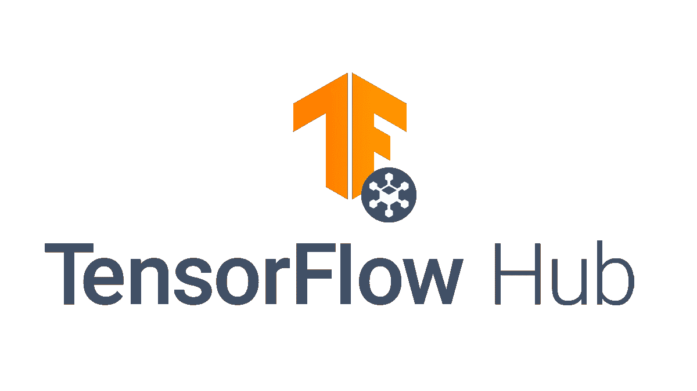
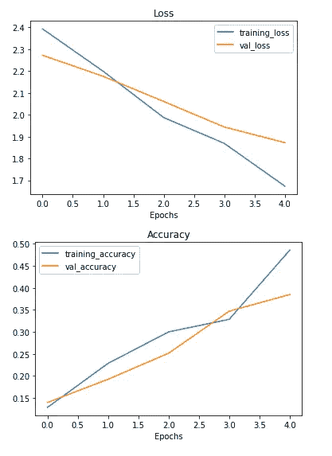
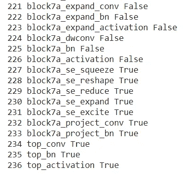

# 张量流迁移学习

> 原文：<https://medium.com/geekculture/transfer-learning-with-tensorflow-cac0719f4870?source=collection_archive---------21----------------------->


Photo by [Erik Mclean](https://www.pexels.com/@introspectivedsgn?utm_content=attributionCopyText&utm_medium=referral&utm_source=pexels) from [Pexels](https://www.pexels.com/photo/superhero-tree-receiving-tiny-sneakers-4061662/?utm_content=attributionCopyText&utm_medium=referral&utm_source=pexels)

机器学习、深度学习、机器人、人工智能是当今世界的热门话题。在过去的科学家和高科技的帮助下，热情的人们花费数小时并尽全力简化人们的生活方式。大型科技公司花费数百万美元来改进这些技术，并从世界各地雇佣有技能的人。这些技术的结果是，现在人们能够做任何你可以想象的事情，并且每天都在进化。人们可以为他们的项目使用开源训练模型，并根据他们的问题来设置它们。我们知道，在考虑模型的性能时，数据量是一个巨大的因素。因此，大型科技公司可以提供大量数据来训练、评估和测试模型。所以模特在工作中才能表现出色。所以这些公司为我们做了培训和测试。因此，我们只需要选择一个合适的模型，并根据我们的问题对模型进行改进和添加更改。

众所周知，IT 行业一直在快速发展。所以时间影响很大。所以没有时间从零开始建立模型。但是一些特殊的问题需要你从头开始创建模型。否则，无需重新发明轮子，您可以直接应用预构建构建模型并尝试改进它。这就是迁移学习的主要思想。

主要有三种方法可以使用迁移学习。下面就来分别说一下。

# 使用上面的模型



[https://www.tensorflow.org/site-assets/images/project-logos/tensorflow-hub-logo-social.png](https://www.tensorflow.org/site-assets/images/project-logos/tensorflow-hub-logo-social.png)

在深度学习中，TensorFlow 是最受欢迎的技术之一。因为 TensorFlow hub 根据问题有许多预建模型。所以你可以根据你的问题来选择型号。在 TensorFlow hub 中，您可以根据文本问题域、图像检测域、音频检测问题或视频问题域来选择模型。因此您可以浏览模型的文档并选择合适的模型。但是在这里，您需要遵循正确的数据预处理方法来处理数据，并向模型提供输入。否则，你会从模型中得到意想不到的结果。在某些模型中，您需要在将数据提供给模型之前对其进行规范化和缩放。例如， [**EfficientNet**](https://paperswithcode.com/method/efficientnet#:~:text=EfficientNet%20is%20a%20convolutional%20neural,resolution%20using%20a%20compound%20coefficient.&text=EfficientNet%20uses%20a%20compound%20coefficient%20to%20uniformly%20scales%20network%20width,resolution%20in%20a%20principled%20way.) 内置了归一化和缩放层。但是 [**ResNet**](https://paperswithcode.com/method/resnet) 没有按比例内置图层。所以你需要做缩放。所以你需要阅读模型的文档，应该对模型的架构有一个清晰的概念。您可以将模型下载到您的计算机中并导入它，或者只需提供模型的链接即可导入它。

```
#Install tensorflow hub
pip install --upgrade tensorflow_hub import tensorflow_hub as hub

model = hub.KerasLayer("https://tfhub.dev/google/nnlm-en-dim128/2")
embeddings = model(["The rain in Spain.", "falls",
                      "mainly", "In the plain!"])

print(embeddings.shape)  #(4,128)
```

在这里，我用 Google Colab 编写了我的代码。所以我简单地使用模型链接来导入模型。在模型创建中，可以使用顺序或函数。

```
#two models urlresnet_url="https://tfhub.dev/google/imagenet/resnet_v2_50/feature_vector/4"
efficinet_url="https://tfhub.dev/tensorflow/efficientnet/b0/feature-vector/1"#create_model fucntion
def create_model(model_url,num_classes=10):
"""
Takes tensorflow hub url and create sequnetial model with itArgs:
model_url =Tensorflow hub model url
num_clasese=Number of outputsreturns:
an uncomplied model with model_url as feature extraction
"""#download the pre trainded modelfeature_extractor_layer =hub.KerasLayer(
                           model_url,
                           trainable =False,
                           name="feature_extraction_layer",
                           input_shape=IMAGE_SHAPE+(3,))#create the model
model=tf.keras.Sequential([
                           feature_extractor_layer,
                           layers.Dense(num_classes,
                                        activation="softmax",
                                        name="output_layer")])
return model
```

# 特征提取转移学习并针对问题调整输出层

在特征提取中，您需要扩充数据，并尝试在更改数据的同时提高性能。您可以尝试对数据进行缩放、旋转、缩放(在图像分类模型中)。

```
import tensorflow as tf
from tensorflow import keras
from tensorflow.keras import layers
from tensorflow.keras.layers.experimental import preprocessing#craete data augmentation with horizontal flipping,rotation,zoomsdata_augmentation=keras.Sequential([
preprocessing.RandomFlip("horizontal"),
preprocessing.RandomRotation(0.2),
preprocessing.RandomZoom(0.2),
preprocessing.RandomHeight(0.2),                     preprocessing.RandomWidth(0.2)
],name="data_augmentation")
```

开始时，您需要从少量(10%)的数据开始，因为模型需要时间来训练模型。可能是因为电脑的硬件性能。所以你需要对此有一个清晰的认识。在迁移学习中，使用少量数据是可以接受的，因为这些模型已经在数据上训练好了。所以我们可以减少数据量。这里，您需要为输入层和输出层提供基本模型。开始时，您需要为少量时期训练模型。因为有时大量的历元会导致模型的过拟合。你可以通过查看模型的损耗曲线来识别过度拟合。



Loss curves for the Model

# 微调迁移学习模型

在微调中，你可以从基础模型(已经建立的模型)中解冻一些层，用训练数据训练它们。将选定层的可训练参数更改为“true”后，您需要重新编译模型。通常，您可以在几层(5-10 层)中更改可训练参数。

```
#Check for the layers
int(len(model.layers[2].trainable_variables))
for i, layer in enumerate( model.layers[2].layers):
  print(i,layer.name,layer.trainable)
```



here I set the trainable parameter as “True” for last 10 layers

然后就可以训练模型，评估模型了。在这里有些时候你会失去以前的表现。因此，您需要在微调模型之前创建一个检查点。在这里，当你编译模型时，你需要使用一个比默认值更低的学习率(learning_rate=0.0001)。因为有时候模型会走向过度拟合。Adam 和 SGD 通常用作优化器。所以你可以根据你的问题来选择。在检查点的帮助下，您可以开始用数据拟合模型。所以你可以从表现好的重量开始。总是需要维护每个模型创建的日志。

在创建模型并最终确定模型后，您可以将检查点数据导入张量板，以便对其进行可视化和分析。但是当将数据导入[张量板](https://tensorboard.dev/experiment/fpMlzd10S82MBjqOGOjyqQ/)时，你需要知道数据在导入张量板后**是公开可用的**。所以在把它们上传到张量板之前，你需要考虑一下适合性。

## 结论

在这篇文章中，我试图给你一个简单的关于 TensorFlow 迁移学习的想法。我没有写那么多代码。我认为 TensorFlow 有很好的文档，其中有一个示例，您可以运行并试验它。但我认为，首先你需要对机器学习有一个清晰的理解，并在尝试迁移学习之前，尝试使用神经网络从零开始创建几个几层的模型。否则你会遇到一些问题，由于缺乏基本概念的知识而无法解决。所以在尝试了一些模型之后，你可以尝试迁移学习。在本文中，我不会深入讨论数据预处理、回调、检查点创建和可视化。我希望将来能写一篇关于这些概念的详细文章。

在迁移学习开始时，你需要选择少量的数据。因为模型训练是一项耗时的工作，对硬件的要求也很高。在特征提取和微调之后，您可以对整个数据训练模型并对其进行评估。如果需要回滚，可以使用检查点。

我认为学习深度学习在一开始并不是一件容易的事情。但是根据我的个人经验，我是从初学者开始的，随着时间、练习和努力，你可以慢慢提高你的知识。所以你需要自学，投入一些努力和承诺。现在你可以参考互联网进行进一步的研究。我也通过阅读文章、观看 youtube 上的视频和关注 Udemy 上的视频(丹尼尔·布尔克/安德烈·尼戈伊)来了解这些事情。

本文探讨了使用 TensorFlow 进行迁移学习的方法，希望能帮助您更准确地完成工作。我想感谢你阅读我的文章，我希望在未来写更多关于新趋势话题的文章，以关注我的帐户，如果你喜欢你今天所读的！

参考资料:

[](https://www.tensorflow.org/hub) [## 张量流集线器

### TensorFlow Hub 是一个经过训练的机器学习模型库，可随时进行微调，并可部署在任何地方。重复使用…

www.tensorflow.org](https://www.tensorflow.org/hub) [](https://www.tensorflow.org/tensorboard) [## 张量板|张量流

### TensorBoard 提供机器学习实验所需的可视化和工具:跟踪和…

www.tensorflow.org](https://www.tensorflow.org/tensorboard)