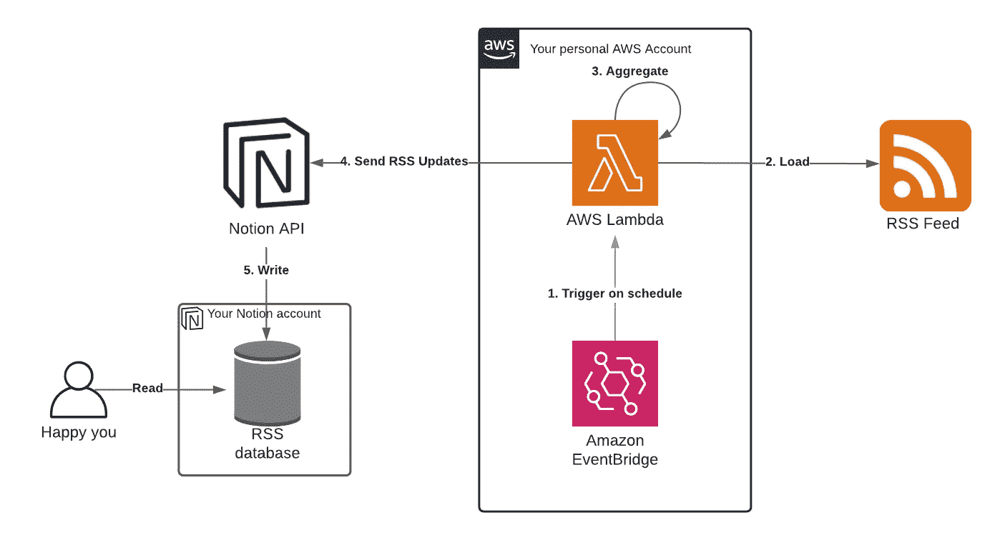
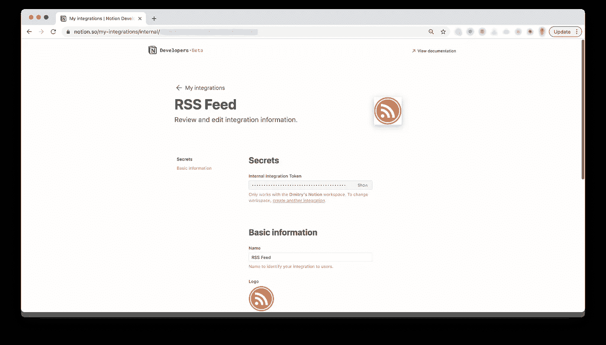
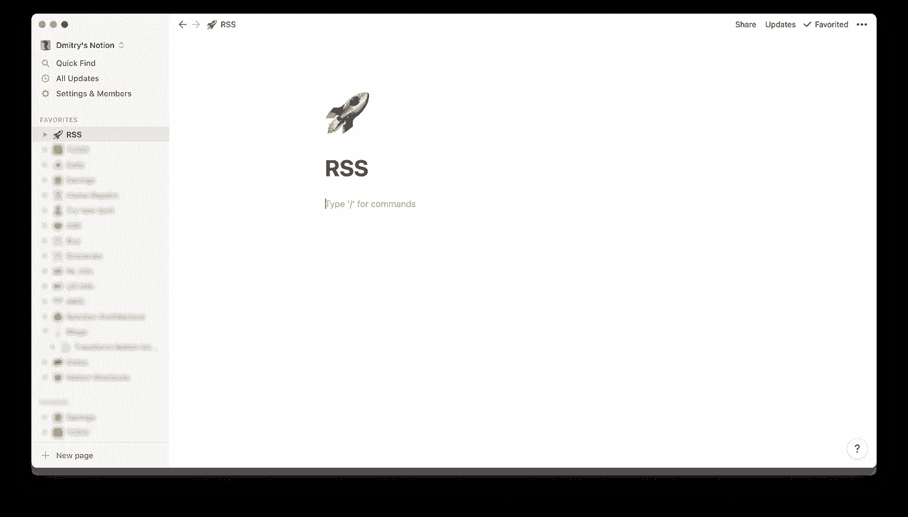
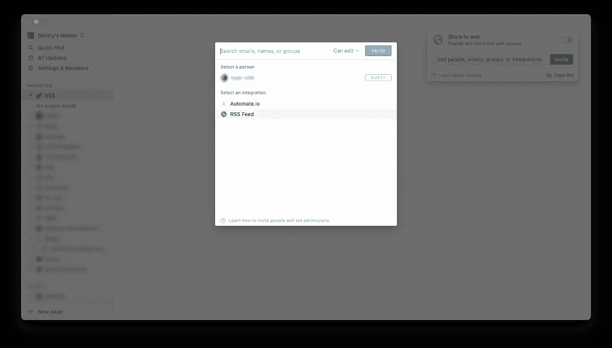
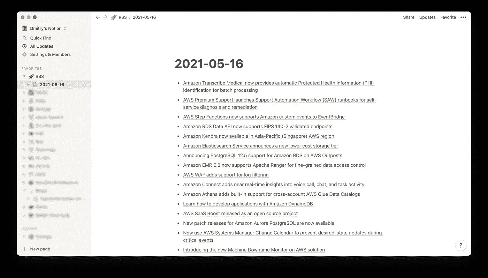

# 使用 AWS Lambda 和 AWS CDK 将概念转化为 RSS 阅读器

> 原文：<https://medium.com/geekculture/transform-notion-into-rss-reader-with-aws-lambda-and-aws-cdk-bc91c5fdc8d3?source=collection_archive---------10----------------------->

## 探索新发布的概念应用编程接口测试版及其功能

**TL；DR:** 我们将使用概念图 API beta 和 AWS Lambda，在概念图的基础上构建一个定制的 RSS 阅读器。参见这里的[源代码](https://github.com/dzmitry-kankalovich/notion-rss-feed/tree/v1)。

> **更新**:请看本系列第二部分:[第二部分](https://blog.dmitrykankalovich.com/transform-notion-into-rss-reader-part-2-multiple-rss-endpoints-de3406786845)



High-level architecture of what we are about to do

截至 5 月 13 日，[概念车](https://medium.com/u/efd97a1c507b?source=post_page-----bc91c5fdc8d3--------------------------------)已经发布了他们 API 的公开测试预览。这是一个期待已久的功能，它使您能够在一个工具中进一步整合您的活动。我一直希望概念提供的一个特别的东西是我每天的 RSS 提要的集成。

虽然概念本身没有现成的东西来吸引你的 RSS 订阅源，但概念应用编程接口的发布为我们提供了一个机会，可以利用各种自动化平台以及云提供商的无服务器解决方案来实现我们想要的任何集成。

# 开始之前

你应该知道有几个不错的 RSS 阅读器，比如 [Feedly](https://feedly.com/) 在聚合你的 RSS 源方面做得很好，所以在开始之前，我建议你去看看它们。

# 选择自动化平台

您可能想了解的另一件事是[automation . io](https://automate.io)。这是众多自动化平台之一，承诺您只需点击几下鼠标就能完成所需任务。

的确有一个关于 RSS 与 idea 集成的广告，我去测试了一下——结果发现它对我来说还不够好。似乎缺乏可配置性，比如设置多个 RSS 源的能力，以及调整触发逻辑的能力。

然而，我们仍然可以使用一个更低层次的抽象来构建我们需要的东西——像 AWS Lambda 或 Azure Functions 这样的无服务器功能平台。

我个人与 AWS 合作多年，经常将它用作我个人项目的平台，所以我选择了这个选项。然而，在我们即将解决的问题中，没有 AWS 独有的细节，所以任何无服务器的功能平台对您来说都很适用。

# 先决条件

以下是前进之前需要完成的工作:

*   **14+版的 NodeJS** (附带我们稍后会用到的包管理器 **NPM**
*   活跃的 AWS 账户。
*   拥有足够权限通过 CDK 进行部署并使用 AWS Lambda—**administrator access**策略的 AWS IAM 用户就足够了。查看本指南了解更多详情。
*   AWS CLI 配置了该用户凭证— **访问密钥 ID** 和**访问密钥机密。**参见[本指南](https://docs.aws.amazon.com/cli/latest/userguide/cli-configure-files.html)中如何操作的示例。

确保您已经使用这些凭证显式导出了 AWS 概要文件:

```
% export AWS_PROFILE=your-profile
```

默认情况下，AWS CDK 将检查这个变量，以确定它使用哪个帐户以及应该利用什么 IAM 用户权限。

# AWS 部分

虽然您可以通过手动点击 AWS 控制台来完成所有需要的 AWS 更改和配置，但我通常会使用 infra-as-a-code (IaaC)方法，所以在这里我将坚持使用这种方法。

AWS CDK 是一种相对较新的方式，它遵循 IaaC，甚至比 Cloudformation / Terraform 以前更直接地供应您的基础设施——使用类似 Typescript 的编程语言来创建 AWS 资源。

我将在这里使用 AWS CDK，但你也可以使用其他 IaaC 选项，如 Cloudformation、Terraform 等，获得相同的结果。

> *你可以在这里* 找到最终的源代码[](https://github.com/dzmitry-kankalovich/notion-rss-feed/tree/v1)

## *部署您的 AWS CDK 应用程序*

*如果你以前从未与 AWS CDK 合作过——没关系，这一切都相当简单。我建议查看[这份文件](https://github.com/aws/aws-cdk#getting-started)。假设您已经安装了至少版本为 **14+** 的`node`,运行以下代码片段:*

```
*% npm i -g aws-cdk*
```

*接下来，创建您的项目目录并初始化 CDK 项目:*

```
*% mkdir notion-rss-feed && cd $_
% cdk init sample-app --language=typescript*
```

*如您所见——我们明确地将语言指定为`typescript`。CDK 支持许多其他语言，但是，使用 Typescript，您可以找到大多数的示例，并且它是 CDK 的一级公民语言，因为所有其他语言都只是包装器。*

*假设`cdk init`运行没有问题，你应该得到下面的结构:*

```
*notion-rss-feed % tree -L 1
.
├── README.md
├── bin
├── cdk.json
├── jest.config.js
├── lib
├── node_modules
├── package-lock.json
├── package.json
├── test
└── tsconfig.json*
```

*正如您所看到的，有相当多的文件，但是不要担心——您不需要处理其中的大部分。您要查看的部分在`lib`文件夹中——所有的资源栈定义都在那里。按照惯例，CDK 将在那里创建一个名为`notion-rss-feed-stack.ts`的文件。*

*因此，让我们继续修改我们在`notion-rss-feed/lib/notion-rss-feed-stack.ts`的堆栈:*

*如您所见，目前还没有定义任何资源。没关系，我们稍后会添加它们，现在，让我们部署这个堆栈来验证我们可以为您的 AWS 帐户执行这样的操作。*

*首先，引导环境(每个 AWS 帐户只需要做一次，如果您以前使用过 CDK，可能不需要这样做):*

```
*notion-rss-feed % cdk bootstrap --profile your-aws-profile*
```

*然后—部署我们的资源堆栈:*

```
*notion-rss-feed % cdk deploy*
```

*输出应该如下所示:*

```
*NotionRssFeedStack: deploying...
NotionRssFeedStack: creating CloudFormation changeset...
[██████████████████████████████████████████████████████████] (2/2) ✅  NotionRssFeedStackStack ARN:
arn:aws:cloudformation:us-east-1:69924*******:stack/NotionRssFeedStack/f6b61890-b4a3-11eb-a371-1266a0dd9289*
```

*您现在已经为实际开发做好了准备！*

> **如果您看到* `*Unable to resolve AWS account to use.*` *，请查看* [*本文档*](https://docs.aws.amazon.com/cdk/latest/guide/getting_started.html#getting_started_prerequisites) *，了解如何配置部署目标帐户以及相关的* `*Access Key ID*` */* `*Access Key Secret*`*

## *创建 Lambda 函数*

*让我们创建一个 Lambda 函数，它将提取指定的 RSS 提要并将其推送到概念。我们将把 lambda 代码放在一个单独的文件夹中:*

```
*notion-rss-feed % mkdir -p resources/lambda
notion-rss-feed % cd resources/lambda*
```

*初始化 **NPM** 项目:*

```
*lambda % npm init -y*
```

*然后添加所有需要的依赖项:*

```
*lambda % npm install --save rss-parser @notionhq/client dotenv*
```

*最后，添加一个 Lambda 处理程序代码。用以下内容创建`index.js`:*

*显然，这不是 Lambda 函数的最终版本，但我们现在可以用它来实现一个概念验证解决方案，然后逐步改进。*

*让我们回到资源栈，在 AWS 中创建一个实际的 Lambda 函数资源。*

*编辑`lib/notion-rss-feed-stack.ts`并添加 Lambda 供应代码:*

*如果`@aws-cdk/aws-lambda`无法解决——明确添加各自的 NPM 包:*

```
*notion-rss-feed % npm install --save @aws-cdk/aws-lambda*
```

*现在我们应该可以部署我们的 Lambda:*

```
*notion-rss-feed % cdk deploy*
```

*CDK 会要求您确认 Lambda 执行所需的 IAM 角色的创建。继续使用 **y** 作为您的答案，并查看堆栈更新进度。最后，一旦部署完成，您应该能够看到我们的 Lambda 函数的 ARN:*

```
*Outputs:
NotionRssFeedStack.NotionRssFeedHandlerName = NotionRssFeedStack-NotionRssFeedHandler4C3C1ED2-WD0IieIRVroG*
```

*您确切的 Lambda 名称总是特定于帐户的，并且会与我的名称略有不同，所以请确保复制您在 CDK 部署输出中实际看到的名称。*

*让我们使用提供函数名来测试 Lambda 函数:*

```
*notion-rss-feed % aws lambda invoke \
--function-name NotionRssFeedStack-NotionRssFeedHandler4C3C1ED2-WD0IieIRVroG \
--payload '{}' lambda_output.json && cat lambda_output.json*
```

*输出应该如下所示:*

```
*{
    "StatusCode": 200,
    "ExecutedVersion": "$LATEST"
}
"The AWS Cloud platform expands daily. Learn about announcements, launches, news, innovation and more from Amazon Web Services."*
```

*这最后一行表示我们的 Lambda 已经成功执行，并获取了 AWS 最新新闻的 RSS 提要。随着这个输出的验证，我们现在正式通过了一半。*

# *概念部分*

*在开始发送 RSS 内容之前，我们需要准备一些概念。本质上，我们需要做到以下几点:*

1.  *创建所谓的**私人整合***
2.  *创建一个父页面或数据库来保存我们所有的日常 RSS 条目*
3.  *与我们的集成共享页面或数据库*

> **上面的步骤在* [*这里*](https://developers.notion.com/docs/getting-started) *也有更详细的描述，所以如果你理解上下文有困难的话——去看看吧。**

*但是在此之前——让我们弄清楚我们到底要做些什么来显示 idea 中的 RSS 内容。我知道有三种方法可以实现我们的需求，我将一一介绍。*

***选项 1。数据库***

*我们可以创建一个概念数据库，为属性定义一些模式，并添加项目作为子页面——每个 RSS 项目一个页面。这种方法将允许我们为每个页面提供丰富的内容(即 RSS 条目)，就像提要条目的文本预览一样。*

*然而，目前一些相当大的缺点源于概念 API 的限制。这些问题是无法清理数据库或删除特定页面。由于无法在每次集成运行之前进行清理，这意味着数据库可能会堆积重复的页面。*

***选项 2。带有嵌套表格的页面***

*这里的想法是建立一个带有嵌套表的常规概念页面，我们可以在每次集成开始时简单地删除它，然后用 RSS 条目重新创建。然而，目前的观念 API 测试版不允许你使用表格。*

***选项 3。带有 RSS 项目链接的列表***

*最后，我们可以建立一个根页面作为目录，并为每次集成运行创建一个子页面(带有当前日期的页面标题)，并为给定的子页面创建一个带项目符号的链接列表。除了链接名——RSS 条目标题，我们没有任何预览，但是在很多情况下这就足够了。**这是我们在这里使用的变体**。*

## *创建集成*

*假设您是工作区的所有者或管理员，只需点击**设置&成员** **→集成→开发您自己的集成→新集成**。*

*给它取一个有意义的名字，上传一个 RSS 图标，最后点击**提交。***

*现在打开我们刚刚创建的集成，并获取**内部集成令牌**——我们稍后会用到它。*

**

*Integration page*

## *创建 RSS 页面*

*下一步—在 idea 中创建一个存储 RSS 项目的地方。对于创建一个新页面，设置标题 **RSS** ，这就是页面布局。稍后，我们的集成将在这里创建包含 RSS 内容的子页面，并且 RSS 页面——只要它是空的——将以一种目录的形式显示所有子页面。*

**

*Simple page to ingest RSS feed*

## *集成共享 RSS 页面*

*概念部分的最后一件事——允许我们的集成实际访问我们刚刚创建的页面。所以继续选择我们的 RSS 页面，点击**分享** → **邀请** → **选择你的整合**。*

**

*Share screen*

# *将 RSS 提要转发给概念 API*

*切换回代码回购。我们即将开始向概念 API 发送 RSS 条目。为此，我们需要将集成令牌传递给 Lambda。我强烈建议不要硬编码它，而是建议把它放在`.env`文件中。只需在项目的根目录下创建`.env`文件，并用以下条目填充它:*

```
*NOTION_INTEGRATION_TOKEN=<your notion integration token value>
NOTION_PAGE_NAME=RSS
RSS_FEED_URL=https://aws.amazon.com/about-aws/whats-new/recent/feed/*
```

*您可以用自己选择的值来替换页面名称和 RSS 提要 URL，但是，请记住，`NOTION_PAGE_NAME`应该具有与您在上一步中创建的*完全相同的*页面名称。稍后，我们将使用概念 API 搜索端点来查找您的页面惟一 ID。*

*现在让我们用这些配置值更新`lib/notion-rss-feed-stack.ts`:*

*您可以看到，我们只是通过环境变量传递这些值。*

*最后，Lambda 处理程序代码:*

*这就是 Lambda 部分的大致内容。部署它:*

```
*notion-rss-feed % cdk deploy*
```

*并检查它:*

```
*notion-rss-feed % aws lambda invoke \
--function-name NotionRssFeedStack-NotionRssFeedHandler4C3C1ED2-WD0IieIRVroG \
--payload '{}' lambda_output.json && cat lambda_output.json*
```

> *同样，不要忘记提供您自己在 CDK 部署输出中找到的特定`function-name`。*

*如果一切正常，您应该能够看到您的每日 RSS 源:*

**

*RSS feed example*

*所以每次调用 Lambda 时，都会创建一个带有当前日期的页面，并列出其中所有的 RSS 条目，链接到相应的页面。*

# *安排 RSS 源*

*我们已经有了我们的 RSS 订阅源！然而，我们不想每天都手动使用 AWS CLI，所以让我们继续安排我们的 Lambda 每天自动执行。*

*为此，我们将使用 AWS EventBridge，它提供了定义触发 Lambda 的 CRON 表达式的能力。*

*首先，需要添加一些相关的依赖项。切换到项目根目录，运行以下命令:*

```
*notion-rss-feed % npm install --save @aws-cdk/aws-events @aws-cdk/aws-events-targets*
```

*下一步—创建一个事件规则，并让它按计划调用 Lambda。编辑`lib/notion-rss-feed-stack.ts`如下:*

*注意 cron 表达式——您应该将它设置为适合您的值。在我的例子中，我已经将它设置为在世界协调时每天早上 5:30 触发 Lambda。你可以在这里阅读更多关于 AWS cron 表达式[的内容。](https://docs.aws.amazon.com/lambda/latest/dg/services-cloudwatchevents-expressions.html)*

*部署我们的变更:*

```
*notion-rss-feed % cdk deploy*
```

*我们的示例实现到此结束。*

> **正如我在开头所说的，你可以在这里找到最终版本的来源*[](https://github.com/dzmitry-kankalovich/notion-rss-feed/tree/v1)*
> 
> ***也来看看这个系列的第二部:* [*第二部*](https://blog.dmitrykankalovich.com/transform-notion-into-rss-reader-part-2-multiple-rss-endpoints-de3406786845)**

# **还剩下什么**

**为了简单起见，我没有在这里介绍许多需要改进的地方，但是欢迎您参与进来:**

*   **由于我们使用的只是一个测试版的概念 API，随着时间的推移，预计会有更多的功能出现:删除、表格，甚至可能是 HTML 或 Markdown 支持。这将为构建更复杂的解决方案创造机会，理想情况下允许实际预览内容。**
*   **该解决方案的安全性并不理想——集成令牌以纯文本形式存储在 Lambda 环境变量中。如果其他任何人使用此 AWS 帐户，您应该使用 AWS Secrets Manager 保护令牌。**
*   **这里我们只使用了一个 RSS 端点。我们可以扩展解决方案来聚合几个端点。**
*   **AWS 对于个人项目来说不是一个特别友好的地方，所以我通常会建立一些监控和警报，以确保部署中的一些错误(比如说 cron 表达式中的错误导致更频繁的 Lambda 调用)不会让我损失惨重。**
*   **将 RSS 配置提交给 repo，尽管是作为配置文件的一部分，这很好，但不如能够用某种简单的 UI 动态配置它好。**

**目前——就是这样！**

**我希望你喜欢这个指南，如果有足够的兴趣，我将做第二部分，我们将解决一些提到的问题。**