# Transformer:最先进的自然语言处理

> 原文：<https://medium.com/geekculture/transformer-state-of-the-art-natural-language-processing-ad9bef141a9e?source=collection_archive---------2----------------------->

自然语言处理任务，如问答、机器翻译、阅读理解和摘要，通常通过在特定任务数据集上的监督学习来处理。

那么，让我们来谈谈变形金刚，我最喜欢的变形金刚是大黄蜂，你最喜欢的是谁？

我开玩笑的，不要担心，我们将只讨论 NLP 中的变压器。因此，我们已经看到了许多变压器，如电子变压器，电影中的机器人，我们很快就会看到 NLP 中的变压器，它们的一个共同点是，它们将某些东西转换为特定的输出(可转换)。

> 一个 **Transformer** 是一个深度学习模型，它采用了注意力的机制，对输入数据的每一部分的重要性进行不同的加权。它主要用于自然语言处理(NLP)和计算机视觉(CV)领域。

一种深度学习模型，其中每个输出都连接到每个元素，它们之间的权重是根据它们的连接动态计算的。

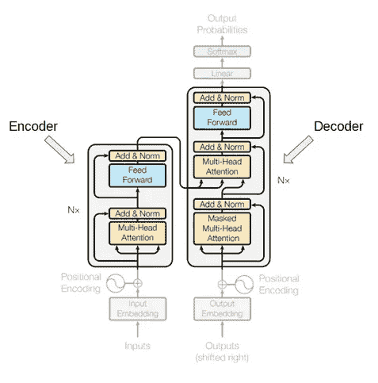

首先，我们看看为什么我们在 NLP 中使用变压器？

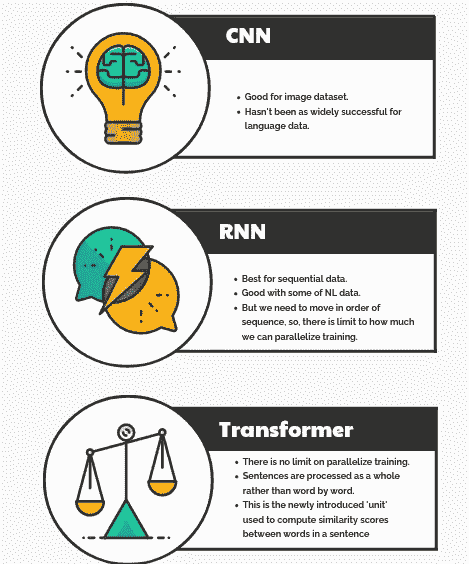

如上图，我们可以看到 CNN，RNN 和变形金刚之间的对比。我们可以得出结论，变压器是在自然语言处理大序列的最佳模型。RNN 和 CNN 可以处理短序列，但在处理大序列时效率不高。

> 你需要的只是关注。

在转向 transformer 的架构之前，我们应该了解一下自我关注。

**注意:**变压器学会权衡各输入项和各输出项之间的关系

**自我关注:** Transformer 学习加权输入序列中每一项到输出序列中所有项之间的关系。*(一对多关系)*

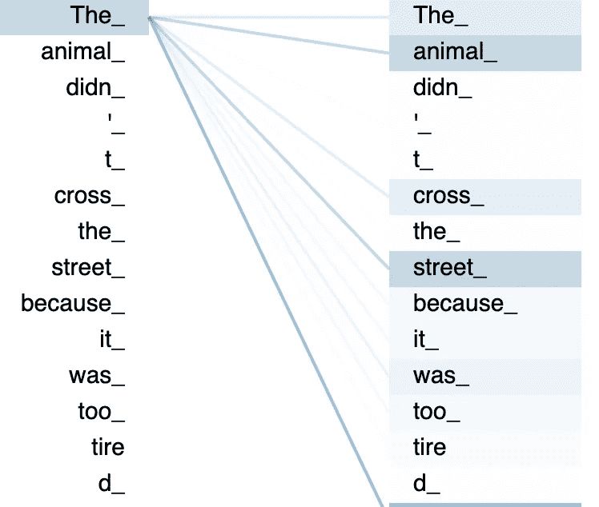

**多头自我关注:** Transformer 学习多种方法来加权输入序列中每个项目与输入中所有其他项目的关系。*(多对多关系)*

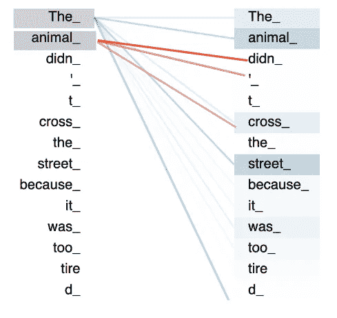

# 变压器的高级图片

让我们看看变压器的高层次画面，我们将变压器视为黑盒。这个黑匣子拿着印地语输入一句话，把那句话翻译成英语。这是机器翻译的例子。

# 变压器架构

在这一节中，我们来看一个单独的变压器模块。如同在 GPT-2 中一样，存在大量变压器组。但是为了更好地理解，我们将看到变压器的单块结构。

变压器由 3 个主要部分组成:

1.  **编码器:**编码器结构相同。它由多个自关注层和前馈网络组成。编码器的输入首先流经一个*自我关注层*——这个层帮助编码器在编码一个特定单词时查看输入句子中的其他单词。自关注层的输出被馈送到*前馈神经网络*。完全相同的前馈网络独立地应用于每个位置。

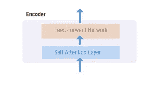

**2。解码器:**解码器在结构上也是一样的。它由自关注层、编解码关注层和前馈层组成。这些将由每个解码器在其“编码器-解码器关注”层中使用，这有助于解码器关注输入序列中的适当位置。

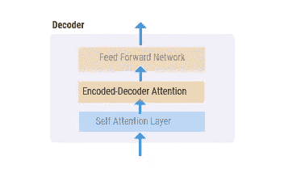

**3。嵌入:**嵌入是单词的数字表示，通常以向量的形式出现。除了每个单词的一个唯一索引之外，该向量将全为零。

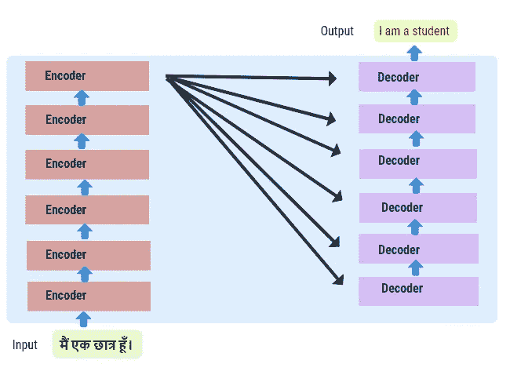

# 变压器语言模型的分类

1.  **自回归模型:**这些模型依赖于原始变换器的解码器部分，并使用注意掩码，使得在每个位置，模型只能查看注意头之前的记号。

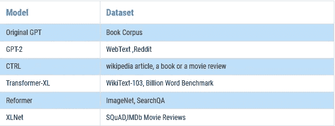

2.**自动编码模型**:这些模型依赖于原始转换器的编码器部分，不使用遮罩，因此模型可以查看注意力头中的所有标记。对于预训练，目标是原始句子，输入是它们被破坏的版本。

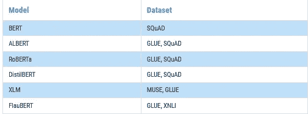

**3。序列到序列模型**:这些模型保留了原始变压器的编码器和解码器。

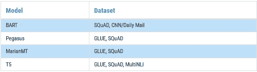

**4。多模态模型:**库中有一个多模态模型没有像其他模型一样以自我监督的方式进行预处理。

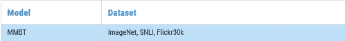

**5。基于检索的模型:**例如，一些模型在(预)训练和推理期间使用文档检索来进行开放领域的问题回答。

## 参考

1.  [抱紧脸变形金刚](https://huggingface.co/transformers/v3.1.0/model_summary.html#xlm-roberta)
2.  [Arxiv.org](https://arxiv.org/)
3.  [《图解变形金刚》杰伊·阿拉姆玛·吉图布](https://www.youtube.com/redirect?event=video_description&redir_token=QUFFLUhqbWVMNnRpQVFMY1VZOWJoOWd3eEh3NXhTYmIxZ3xBQ3Jtc0ttczNzOWpZVFoxRkM2bVhLR2F4NmhnRTZFTTlLQ0ZydWZOZkstRkNFTkZ5WGlyNWtubkJaeThSeVl5eDhIYUlMWS12X1VXYnlhWHp5Z3hublB6TXpac2c5amtEaTN0Wi1iS0RJd1Zib18xRm9PNFlfNA&q=http%3A%2F%2Fjalammar.github.io%2Fillustrated-transformer%2F)
4.  RASA 的开发者 Rachael Tatman