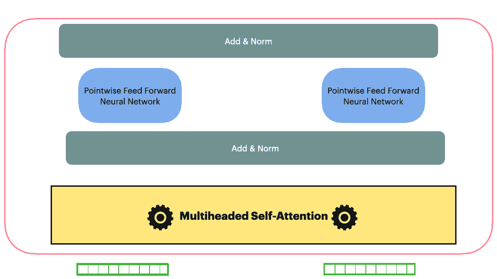
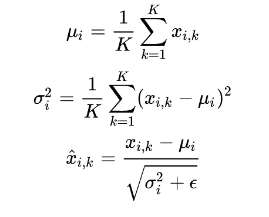
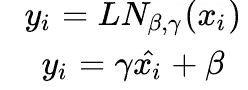
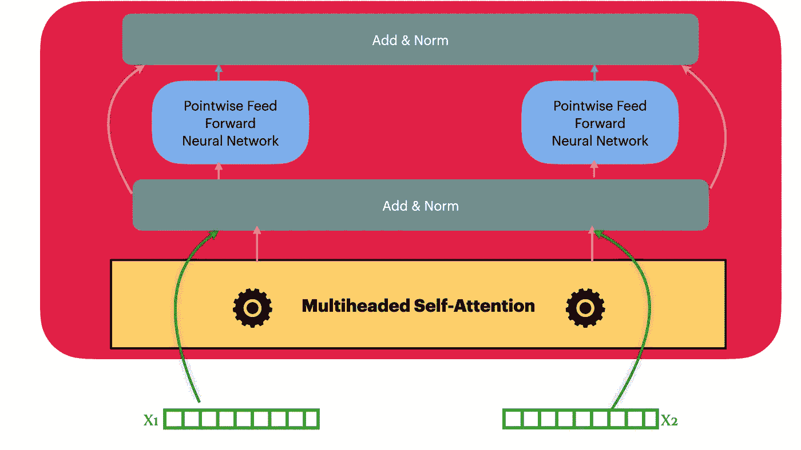
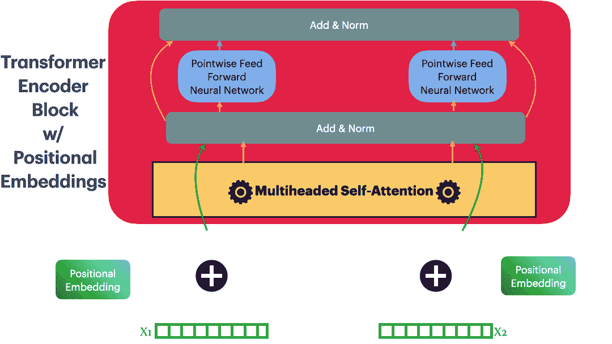
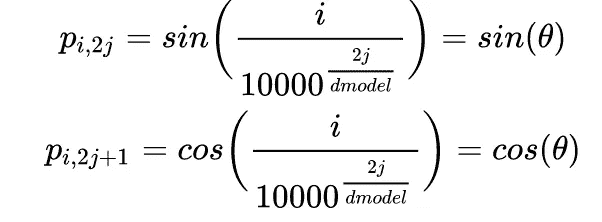
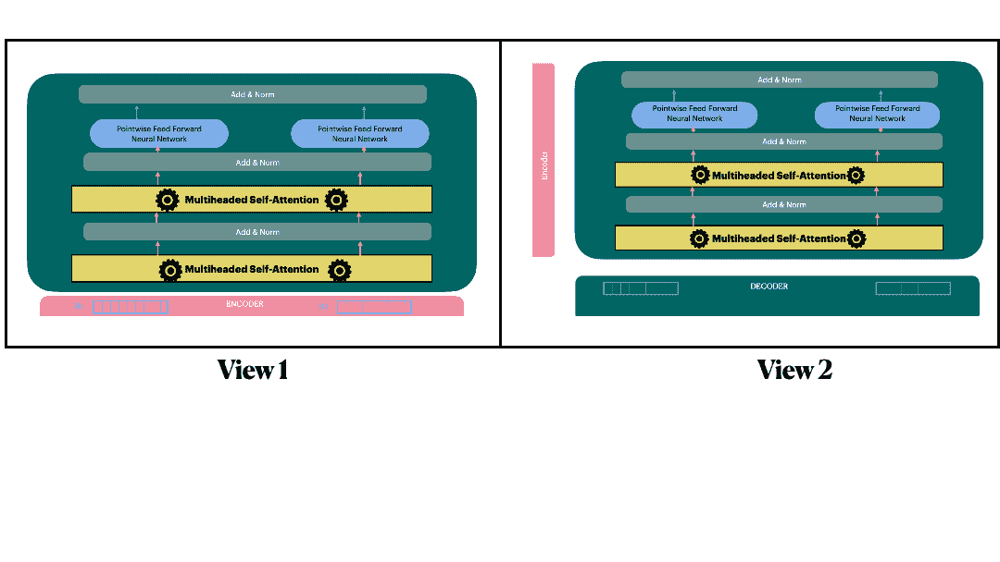
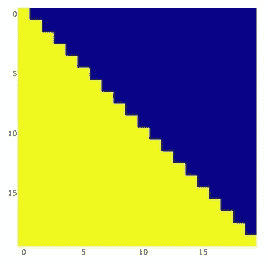
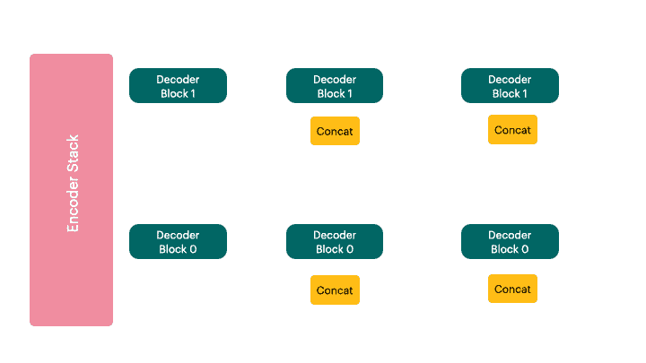
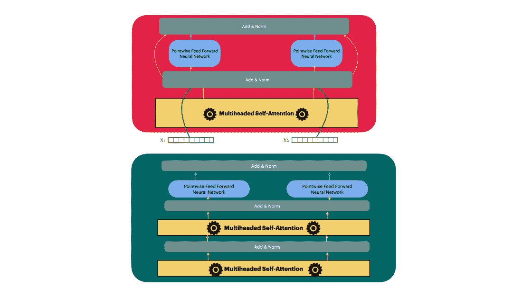

# 化学信息学中的变压器第二部分

> 原文：<https://medium.com/geekculture/transformers-in-cheminformatics-f569ad302033?source=collection_archive---------59----------------------->



**Fig 1\.** The entire transformer block/layer (as used in the encoder) (Image by author)

在本系列的第 1 部分中，我们看了变压器层的构建模块，即。多头注意力和逐点前馈网络。我们几乎没有完成整个变形层。注意，我们互换使用术语*【块】*和*【层】*。在这一部分，我们将简要介绍变压器层的其他移动部分，即层规范化和残差连接。因为这些概念对 transformer 来说并不陌生，所以我尽量简短地讨论它们。一旦我们准备好了我们的 transformer 层，我们就发现了位置嵌入，并因此探索了 transformer 网络的编码器。然后，我们来看看解码器的细微差别，尽管它与编码器明显相似，但也有细微的差别。我们最终将所有这些整合在一起，形成了我们的变压器网络。

正如承诺的那样，所有的动画和代码都被编译到一个 jupyter 笔记本中，可以在这里访问。

让我们开始吧！！！

transformer 层使用一个 *AddandNorm* 模块，跟随其中的两个子层(多头自关注、逐点前馈 N/w)。图层归一化和残差连接建立了 *AddandNorm* 图层。我们一个一个来看。

# 图层规范化

图层规范化不是变形金刚引入的新概念。它已经在自然语言处理任务中广泛流行。它通过所有特征对每个数据点进行标准化。给定一个数据集
X ={x1，x2，…..xm}，其中每个 xᵢ是由 k 维向量表示的序列，使得 xᵢ = {xᵢ,ₒ……xᵢ,ₖ}.



最后是图层图层𝑦ᵢ的输出



让我们把它转换成代码。

# 剩余连接

本文在 Add&Norm 块中使用了一个残差连接，后跟 layerNorm。

```
AddandNorm(Sublayer(x)) = LayerNorm(x+Dropout(Sublayer(x)))
```

# 编码器模块



**Figure**: An Encoder Block/Layer. These layers are the building block to the Encoder Stack

有了多头关注、层名和剩余连接，我们现在已经有了实现编码器层所需的一切。编码器层的输入或者是嵌入(在第一编码器层的情况下)
或者是来自前一层的表示(对于第一层之后的编码器层)。我们使用`key=query=value = input (x)`来馈入编码器层中的多头注意力块。

按照上图，实现这个并不太复杂。让我们看看如何

# 位置编码

设计的递归神经网络在学习其参数的同时结合了序列的排序。即使卷积神经网络也可以在其固定大小的内核中捕获一些排序信息。另一方面，自我注意作用于集合，使其排列不变。它对{键，查询，值}集进行操作。在当前状态下，我们的转换器无法区分序列中的随机记号分类和有意义的记号顺序。为此，Vaswani 等人通过使用附加的*位置嵌入*向量来丰富令牌的嵌入，从而将这样的位置信息传递给令牌。这些位置嵌入不是作为网络训练的一部分学习的。它们是序列中记号位置的固定函数。



Updated embeddings with positional information

这些位置嵌入是嵌入向量中元素位置的正弦和余弦的函数。iᵗʰ令牌嵌入向量中的偶数( *2j* )和奇数( *2j+1* )位置如下



# 解码器块

详细了解编码器模块后，我们可以开始研究解码器模块了。在架构上，除了一个额外的*“编码器-解码器”*多头关注和一个*“添加&范数”*块，两者非常相似。



解码器层看起来只是编码器层的一个微小修改。毕竟，我们已经有了多头注意力和 Add&Norm 的实现。虽然这种多头关注模块在功能上类似于变压器网络中其他地方使用的任何其他多头关注模块，但它的特殊之处在于它从之前的解码器层获取查询，从编码器获取<key value="">。为此，我们把这个*“编解码多头关注”*。请注意，变压器网络中的所有其他多头注意力模块摄取`key=query=value`</key>

## 为什么截然不同的查询，<key-value>是合理的事情？</key-value>

> 假设你正试图通过观看 youtube 上的视频来了解变形金刚。你现在已经观看了关于自我关注机制的视频，并对其有所了解。最初的多头注意力块对应于这种学习。它处理“自我关注”视频中的所有信息，并生成一个查询信号，指示接下来要观看和学习什么。它引导你接下来看《多头关注》。
> 
> 在这种情况下，Youtube 本身就是一个编码器。编码器输出是复杂特征的学习丰富编码，结合数据库中的相似视频、具有相同兴趣的其他人(变形金刚)观看的内容等。通过使用这些特征作为关键字和值，并使用“多头注意力”作为查询，编码器-解码器注意力块能够搜索最相似和最相关的关键字(可能是名为*“具有多头注意力的变形金刚”*并具有许多 upvotes 的视频)并返回与其对应的值(视频本身)。
> 
> 同样，对于序列转换任务，这种方法有助于解码器产生更好的转换，因为它现在可以关注整个数据集上学习到的编码(来自编码器)的相关特征。

继续我们关于解码器层的讨论…

讨论了编码器和解码器之间的架构差异后，我们将注意力集中在实现上。将解码器与编码器区分开来的一个实现差异是在解码器中实施自回归。自回归是一种建模范例，其中模型的输入是当前时间步长之前的令牌。例如，当解码令牌 *j* 时，模型的输入必须是令牌 *0……j-1* ，而不是超过 *j.* 的任何东西。这是有意义的，因为解码器在做出推断时将无法访问未来事件。

这种自回归可以通过屏蔽(将所有未来输入归零)来实现。当处理 *j=1 时，*只有 j=0 暴露给解码器。



Masking for a sequence of length 20.

除此之外的一切都被掩盖了。类似地，在 *j=2 处，*元素在 *j=0，1* 处被暴露，以此类推。

此外，与验证时相比，解码器层在训练时表现不同。

训练时，解码器可以访问整个输出(地面实况)序列。这可能是机器翻译应用程序中目标语言的一个句子，或者是我们打算将源序列映射到的任何其他标记序列。另一方面，当进行推断(从源序列预测目标序列)时，解码器一次一步地预测记号。为了简洁起见，我跳过了这方面的详细描述。我计划单独写一篇关于*“使用变压器解码器的顺序推理”的文章。*同时，下图有助于解释推断过程中解码器每个时间步发生的情况。



**Figure:** Transformer Decoder performing inference (Image by Author)

有了这些知识，让我们试着实现解码器层。

# 变压器编码器和解码器

我们现在可以将编码器和解码器模块堆叠起来，分别得到 transformer 编码器和解码器。原始论文在编码器和解码器中都使用了 6 层。



**Figure:** Transformer Encoder and Decoder are stacks of encoder and decoder blocks. (Image by author)

## 编码器

## 解码器

# 将这一切结合在一起

变压器网络已经成型。我们只需要把编码器和解码器放在一起。

# 结论

我们成功地从零开始建立了强大的变压器网络。接下来，我们将对它进行测试，并欣赏它在序列建模任务中的威力。特别是，我们将应用 transformer 来解决药物发现中的一个关键问题，即预测药物样化合物的溶解度。