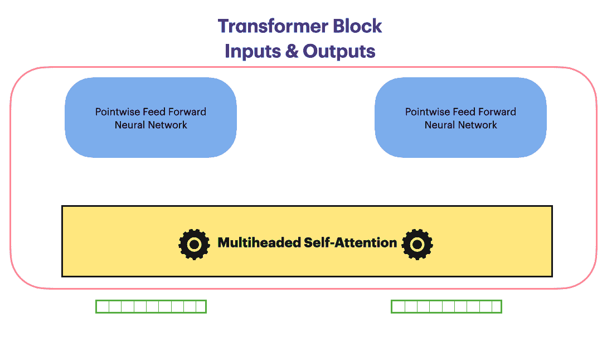
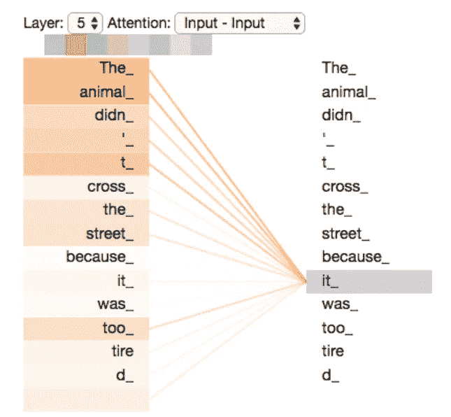
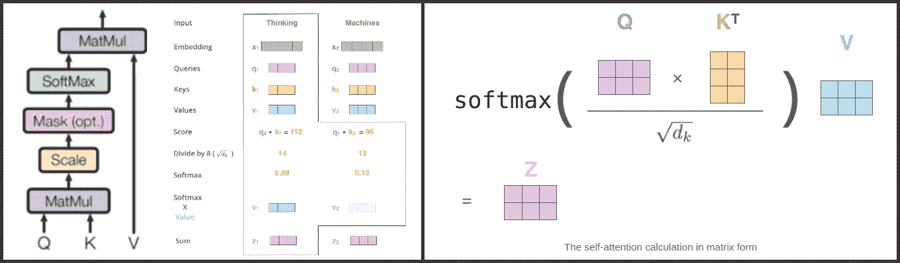
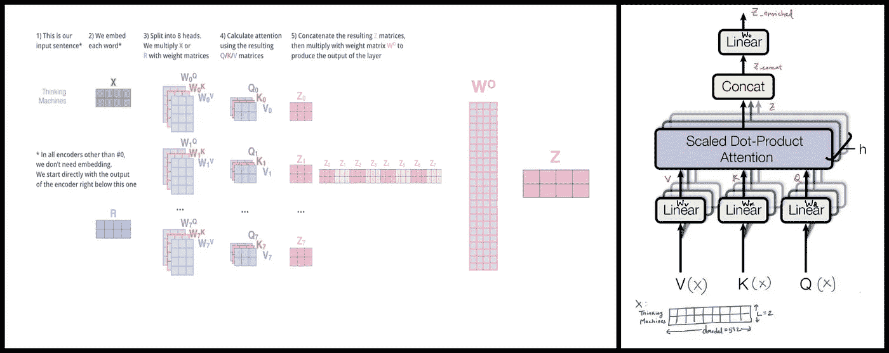
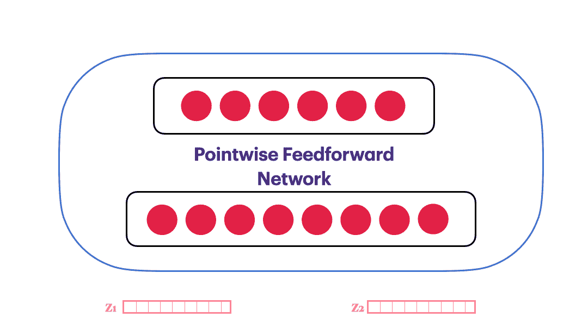
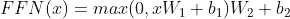

# 化学信息学中的变压器第一部分

> 原文：<https://medium.com/geekculture/transformers-in-cheminformatics-part-1-6ebda8f2781c?source=collection_archive---------44----------------------->

Bird’s eye view of the central piece of a Transformer Network i.e. “A Transformer Block” comprising of **Multiheaded Self-Attention** and **Position wise feed-forward network**

更新:该系列的第二部分在这里发布。

自从神经机器翻译出现以来，转换网络(“你所需要的只是注意力”)已经变得非常流行。在自然语言处理中，许多下游任务的最新性能是通过转换器及其变体实现的。化学信息学和药物发现也没有幸免于这次起义。从预测模型到预测分子特性，再到学习连续的分子表示和生成药物设计，变形金刚取得了显著的成功。

虽然变压器功能强大，但理解起来也很复杂。由于它们的流行，人们试图用图表和动画来解释复杂的架构。一个流行的解释是由[杰伊·阿拉玛](http://jalammar.github.io/illustrated-transformer/)提出的。在这 3 个部分的系列中，我在*中分解了各种移动的部分*并与杰伦的解释保持一致。我进一步编写与解释相对应的易理解的代码。最后，我通过展示 Transformers 如何能够学习药物样化合物的鲁棒和有意义的分子表示来结束本系列，并且学习的表示在直接从分子结构预测水溶性方面优于 Morgan 指纹表示。

在这一部分中，我们将介绍变形金刚的核心部分，即**自我关注**和**多头关注。**变压器试图学习用于输入令牌的上下文感知的丰富嵌入。

> *我游到了对岸* ***岸边*** *。*

像 Word2vec 这样的上下文无关的嵌入方案向银行(金融机构)和银行(沿着水体的陆地)分配相同的矢量表示。然而，Transformer 在句子中的所有 2 个标记的集合之间学习加权的成对分数，以生成丰富的嵌入。因此，银行(金融机构)和银行(水体沿岸的土地)被投影到表示空间中的不同位置。Jay 通过一个词性标注的例子证明了这一点。为了理解单词“it”与句子中其他标记的对应关系，Transformer 计算 O(n)相关性(注意力)分数。变压器的这种 O(n)时间和空间复杂度是该架构的显著限制。Tay 等人对各种改进的 X-former 模型进行了调查。

> 作为一个迂回，我想知道“变形金刚”这个名字的起源和意义。我能想到的两个理由是。它*“转换”一个简单的编码为丰富的编码。
> 2。*跟上最近为来自漫画/电视世界(ELMO、伯特等)的自然语言处理架构提供命名的实践。)

# 单头点量表自我注意

最初的 Transformers 论文将输入嵌入拆分为“nheads”个更小的嵌入，并将它们抽象为“key”、“query”和“value”向量。作为本帖中的一个运行示例，我们将考虑一个简短的 2 令牌序列“*思维机器”。*在化学信息学的上下文中，这可能是一些带有 2 个字符的假想微笑字符串。

Figure 1: Creating key, value, query abstract vectors from input embedding. q,k and v share the same copy of a section of input X

自我关注机制通过获取查询向量与我们正在评分的相应单词的关键向量的点积来计算关注分数，从而计算关注加权丰富嵌入(Z)。因此，如果我们在#1(X₁(思考)位置处理对单词的自我关注，第一个分数将是 q1 和 k1 的点积。第二个分数是 q1 和 k2 的点积。

**Left** (a) Self attention steps from “Attention is all you need” (b) Vector operations performed to get enriched vectors Zᵢ **Right** Stacking vectors in left (b) to perform the same self-attention calculation in matrix form

比例因子√dₖ有助于稳定梯度。托马斯·库尔比尔对此有一个很好的解释。计算自我注意的步骤可以通过将向量(qᵢ's、vᵢ's、kᵢ's)堆积成矩阵并转向矩阵运算来实现。矩阵运算高度并行化，适合 GPU 执行。自我关注可以在 Pytorch 中实现，如下所示

Self-attention in pytorch

# 多头注意力

多头注意力通过以下步骤进行。

1.  变换器将输入嵌入分成“nheads”个较小的相同大小的嵌入。这如图 1 所示。这些更小的代表子空间中的每一个都让注意力机制聚焦于序列的不同部分。上面的动画显示了将输入嵌入到更小的查询、键和值中的分解。

2.为来自每个头部的每个<q>三元组计算注意力富集 Zᵢ。这使用了上面显示的 self_attention 函数。</q>

3.相应的 Zᵢ's 都连接在一起。

4.通过线性层投影级联的 Zᵢ's 矩阵，生成与输入嵌入维数相同的最终富集嵌入 Z_enriched。

让我们看看 pytorch 代码来实现这一点

Multiheaded attention in pytorch

# 位置式前馈网络

对应于序列中每个标记的富集 Z，由多头张力模块返回，通过单独的前馈神经网络馈送。由于每个令牌都有自己的前馈神经网络，因此本文称之为位置式前馈网络。他们将其定义为

这对于编码来说很简单

# 结论

在这一部分，我们研究了变压器网络的关键，即构成变压器模块的多头自我关注网络。在下一部分，我们将看看其他辅助模块。特别是，我们将查看位置嵌入和图层规范化。我们将进一步将所有这些结合到一个用于语言模型预训练任务的功能编码器-解码器中。

本系列的文章以及所有代码、动画和数据集将很快在我的[网站](http://mohitkpandey.github.io)上提供下载。

回头见！

# 参考

1.  [你需要的只是关注](https://arxiv.org/abs/1706.03762)
2.  [图解变压器](http://jalammar.github.io/illustrated-transformer/)
3.  [高效变压器](https://arxiv.org/abs/2009.06732)