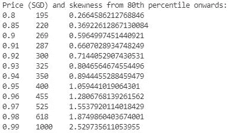
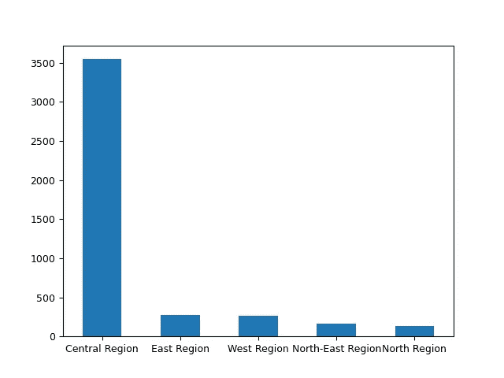
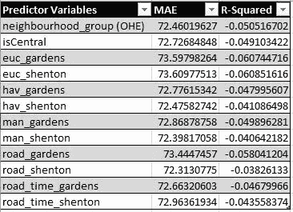

# 转换地理空间数据以提高模型性能

> 原文：<https://medium.com/geekculture/transforming-geospatial-data-for-better-model-performance-ff07ddf2a0db?source=collection_archive---------18----------------------->

## 特征工程经纬度的实验方法


Photo by [Denys Nevozhai](https://unsplash.com/@dnevozhai?utm_source=unsplash&utm_medium=referral&utm_content=creditCopyText) on [Unsplash](https://unsplash.com/s/photos/google-maps?utm_source=unsplash&utm_medium=referral&utm_content=creditCopyText)

# 介绍

我记得在我大学期间，当给我一个包含经度[和纬度](https://en.wikipedia.org/wiki/Longitude)[的数据集时，我完全被难住了。我年轻的大脑根本无法理解坐标的用途。也许是堆积如山的作业和评估遮蔽了我的心灵。快进几年，我现在准备榨干这些变量所能提供的每一滴价值。](https://en.wikipedia.org/wiki/Latitude)

# 实验方法

消除混淆因素以保护实验准确性。

## 数据

我从 Airbnb 里面的[下载了 Airbnb 房源数据集。我做的第一件事是将数据导入到一个](http://insideairbnb.com/get-the-data.html) [Pandas dataframe](https://pandas.pydata.org/docs/reference/api/pandas.DataFrame.html) 中，并删除除了 *price* (目标变量)、 *latitude/longitude* (正在审查的预测变量)和*neighborhood _ group*(用于比较的预测变量)之外的所有列。

坐标是固有的依赖于域的属性。我的意思是，我能够进行特征工程的程度受到我对它所涉及的位置的了解程度的限制。因此，我选择了新加坡 Airbnb 房源数据集，因为与其他可用国家相比，这是我最熟悉的国家。

## 探索性数据分析(EDA)和数据清理

我做的下一件事是检查变量*价格*的分布。使用下面的代码给了我如图所示的报告。

```
# Define the quantiles for analysis.
quantile_range = [0.8,0.85,0.9,0.91,0.92,0.93,0.94, 0.95, 0.96,0.97,0.98,0.99]print("Price (SGD) and skewness from 80th percentile onwards:")# Each iteration prints the price (rounded) and skewness for the 
# given quantile, q.
for q in quantile_range:
    listings_q = listings.loc[(listings['price'] < listings['price'].quantile(q)) & (listings['price'] != 0)]
    quantile = str(q)
    skewness = str(listings_q['price'].skew())
    price_quantile = str(round(listings['price'].quantile(q)))
    print("\t".join([quantile,price_quantile,skewness]))
```



Distribution report for price (made by the author)

我想剔除那些明显比其他商品贵的商品，同时尽可能保留更多的数据。我决定只保留价格达到第 98 个百分位数的列表，作为数据数量和质量之间的一个很好的平衡。所有三列都没有缺失值。

最后，我想使用*neighborhood _ group*作为比较点。如柱状图所示，大部分上市公司位于新加坡中部地区。这并不奇怪，因为它坐落着 [**中央商务区**](https://en.wikipedia.org/wiki/Central_Area,_Singapore) 。作为测试的一部分，我创建了一个派生变量*neighborhood _ group*分为两类:中心区域和其他。这些名义分类变量被一次性编码，为建模做准备。



Bar Chart depicting distribution of listings by region (made by the author)

## 识别兴趣点(POI)

我没有使用*纬度*和*经度*作为独立属性，而是使用它们来测量列表和某个兴趣点( [POI](https://en.wikipedia.org/wiki/Point_of_interest) )之间的距离。选择正确的兴趣点是距离指标帮助预测准确价格的一个关键因素。我的一个想法是，我可以利用消费者的逗留原因来确定兴趣点。

我做了一些阅读，总结出消费者使用 Airbnb 的两个一般原因:

1.  假期
2.  [出差](https://www.airbnb.com/work)

热门旅游网站 [Tripadvisor](https://www.tripadvisor.com.my/) [根据多项指标将海湾花园评为新加坡最佳旅游景点](https://www.tripadvisor.com.my/Attractions-g294265-Activities-a_allAttractions.true-Singapore.html)(在“要做的事情”下面)。这形成了我们的第一个 POI，它具有以下坐标:(1.2815737，103.8614245)。

> 使用 Tripadvisor 数据对待办事项进行排名，包括评论、评分、照片和受欢迎程度。

申顿路是新加坡的金融和商业中心。这个位置作为我们的第二个 POI，坐标为(1.2760995，103.8460012)。然而，这两个地点相距仅 9 分钟车程。当使用其中一种模型时，观察两者在模型精度上是否有显著差异将会很有趣。

## 算法和评估指标

我使用了[简单线性回归](https://online.stat.psu.edu/stat462/node/91/)算法来模拟距离/邻居组和价格之间的关系。

对于模型评估，我使用了平均绝对误差(MAE)和决定系数(R 平方)。将使用具有 5 个分割的 [k 倍交叉验证](https://machinelearningmastery.com/k-fold-cross-validation/)对训练数据进行采样。

```
from sklearn.model_selection import KFold
from sklearn.linear_model import LinearRegression
from sklearn.model_selection import cross_validateX = df[[<predictor>]]
y = df[[<target>]]kf = KFold(n_splits = 5, random_state = None
model = LinearRegression()scores = cross_validate(model, X, y, scoring=['neg_mean_absolute_error','r2'], cv=kf)print('Average MAE: ',sum(-1*scores['test_neg_mean_absolute_error'])/5)
print('Average R-squared',sum(scores['test_r2'])/5)
```

# 预测变量的特征工程

基于代码的特征转换解释。

## 一键编码和分组

我使用熊猫的 get_dummies()方法对*邻居组*进行了一次热编码。

```
# One-hot-encoding neighbourhood_group then dropping the column.# use concat to join the new columns with your original dataframe.
listings = pd.concat([listings,pd.get_dummies(listings['neighbourhood_group'], prefix='ng_')],axis=1)listings = listings.drop(columns=['neighbourhood_group'])
```

如前所示，*neighborhood _ group*中的类别“中心区域”显然在数据集中占主导地位。我创建了一个派生变量“isCentral ”,它的值为 1(列表在中心区域)和 0(列表不在中心区域)。

## 推导位置之间的距离

我对测试两种距离感兴趣。数学距离是测量两个地理位置的最简单方法，因为您需要的只是现成的统计 Python 库。然而，从 A 点到 B 点很少走直线路线。相反，两个位置之间的实际道路距离可能与其数学距离相差很大。那么为什么逻辑上要用数学距离而不是道路距离呢？嗯，道路距离需要调用作为服务提供的 API(*例如* [谷歌地图距离 API](https://developers.google.com/maps/documentation/distance-matrix/overview) 或[距离矩阵 API](https://distancematrix.ai/product) )。根据您需要提出的请求数量，这可能会产生费用。

我从坐标中得出的第一个距离度量是**欧几里德距离**，它就是向量空间中两点之间的直线距离。实现如下所示:

```
import numpy as np# Coordinate points for the listing, Gardens and Shenton.
point_listing = np.array((row['ls_lat'], row['ls_long']))
point_gardens = np.array((1.2815737, 103.8614245))
point_shenton = np.array((1.2760995,103.8460012))# Calculate Euclidean Distance.
euc_dist_gardens = np.linalg.norm(point_listing - point_gardens)
euc_dist_shenton = np.linalg.norm(point_listing - point_shenton)
```

[**哈弗线距离**](https://scikit-learn.org/stable/modules/generated/sklearn.metrics.pairwise.haversine_distances.html#:~:text=The%20Haversine%20(or%20great%20circle,the%20data%20must%20be%202.) 是球面上两个位置之间距离的度量。我的代码改编自[这篇文章](https://www.kdnuggets.com/2018/12/feature-building-techniques-tricks-kaggle.html)。

```
# Calculating Haversine Distance.
def haversine_array(lat1, lng1, lat2, lng2):   
    # Convert coordinates to radians.
    lat1,lng1,lat2,lng2 = map(np.radians, (lat1, lng1, lat2, lng2))
    avg_earth_radius = 6371  # in km lat = lat2 - lat1
    lng = lng2 - lng1 # Compute distance.
    d = np.sin(lat*0.5)**2+np.cos(lat1)*np.cos(lat2)*np.sin(lng*0.5) **2
    h = 2 * avg_earth_radius * np.arcsin(np.sqrt(d))
    return h
```

**曼哈顿距离**是机器学习中另一种流行的距离度量。与欧几里德距离相反，它测量两点之间的距离，作为它们的笛卡尔坐标的绝对差的[和。这个](https://en.wikipedia.org/wiki/Taxicab_geometry)[资源](https://dataaspirant.com/five-most-popular-similarity-measures-implementation-in-python/#:~:text=Manhattan%20distance%3A,%2Dcoordinates%20and%20y%2Dcoordinates.)展示了如何使用数学库中的方法实现公式。

```
# Calculate Manhattan Distance.
def manhattan_distance(coord_ori,coord_dest):
    return sum(abs(a-b) for a,b in zip(coord_ori,coord_dest))
```

最后，我使用[距离矩阵 API](https://distancematrix.ai/product) 服务来计算位置之间的**道路距离**。他们有企业级和个人级订阅选项。订阅后，我得到了我的令牌密钥，我把它保存在一个文本文件中。要发送 GET 请求，可以用您的值填充下面的代码。

```
import requests# Retrieve distance matrix token key.
api_file = open(<path to token key text file>,"r")
api_key = api_file.read()# Define API endpoint.
url = 'https://api.distancematrix.ai/maps/api/distancematrix/json?'
param_1 = 'origins='
ori = ','.join([<latitude>,<longitude>])
param_2 = '&destinations='
param_3 = '&key='
dest = ','.join([<latitude>,<longitude>])
endpoint = ''.join([url,param_1,ori,param_2,dest,param_3,api_key])# Send GET request and retrieve response.
response = requests.get(endpoint)
response= response.text
```

响应的 JSON 结构如下所示。API 以米为单位计算道路距离，以秒为单位计算持续时间。

```
{
   "destination_addresses":[
      "Central Area, Singapore"
   ],
   "origin_addresses":[
      "Block 745, 745 Woodlands Cir, Singapore 730745"
   ],
   "rows":[
      {
         "elements":[
            {
               "distance":{
                  "text":"30 km",
                  "value":30032
               },
               "duration":{
                  "text":"33 min",
                  "value":1985
               },
               "status":"OK"
            }
         ]
      }
   ],
   "status":"OK"
}
```

相同距离的两条路径可能不总是具有相同的行驶持续时间。交通信号灯的数量、道路类型和其他物理因素可能会影响出行持续时间。因此，我创建了一个派生变量 *distance_over_time* ，它就是一个列表和一个 POI 之间的距离(以米为单位)除以旅行持续时间(以秒为单位)。

# 实验结果



Experimental results (by the author)

令人惊讶的是，没有一个地理空间预测变量有助于预测 Airbnb 的价格，正如它们的负 R 平方值所示。当模型不遵循数据趋势时，r 平方为负(*即*比水平线更不适合)。

以*neighborhood _ group*为基准，没有一个数学距离提供任何显著的改进(或恶化)。同样，随着时间的推移，道路距离和道路距离的模型性能没有改善。道路距离测量并没有比数学距离测量提供任何显著的优势。最后，*是中心*没有提高模型性能。

# 结论

一种可以解释这一结果的理论是，由于新加坡是一个很小的国家，而且大多数的上市公司都位于市中心(这里是金融中心和旅游景点的所在地)，距离只是一个可以忽略的因素。

另一种可能是我选择了错误的 poi。如果我要测量到其他兴趣点，如火车站或公交车站，距离**可能**会有用。新加坡人非常依赖公共交通，所以这可能是一个值得尝试的实验。

总之，这篇文章提供了一些关于如何在坐标上进行特征工程的想法。消极的结果仍然是结果，所以我希望你在某种程度上发现了它的洞察力。对于精通机器学习的，留些评论吧！