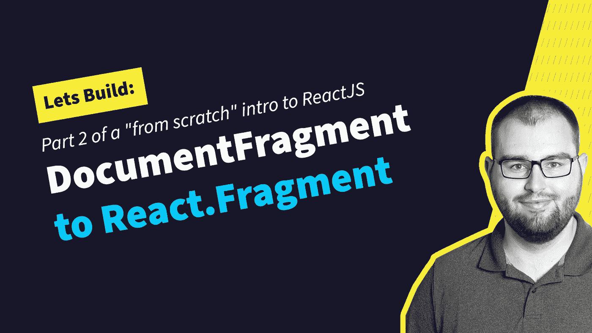

# 将 DocumentFragment 转换为 React。碎片

> 原文：<https://medium.com/geekculture/transitioning-documentfragment-to-react-fragment-4817a1c77acf?source=collection_archive---------9----------------------->

## 事实真相

## 关闭普通 JavaScript 的引擎盖，打开乘客门，了解 ReactJS 的基础知识

上一次，我们完成了 React 的工作过程——从创建所需的基本文件到创建节点，将该节点附加到…