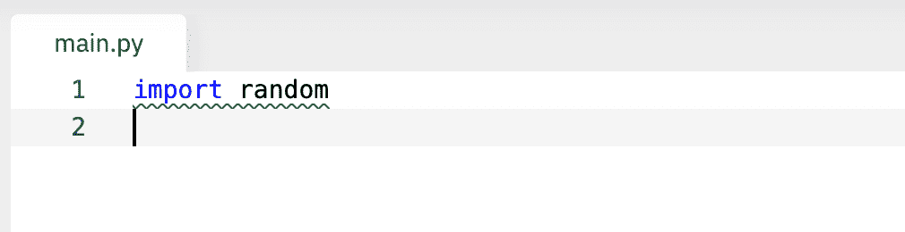
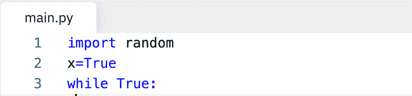
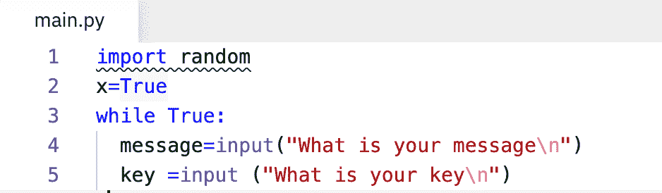
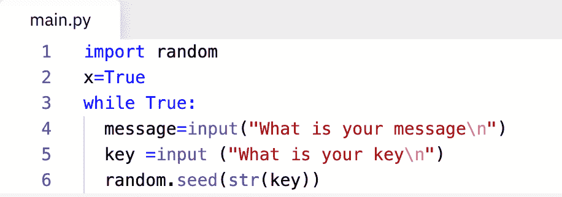
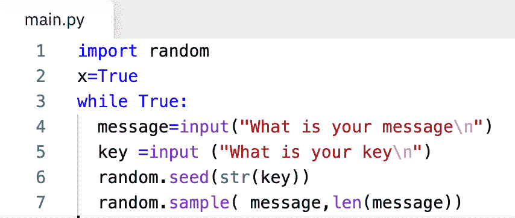
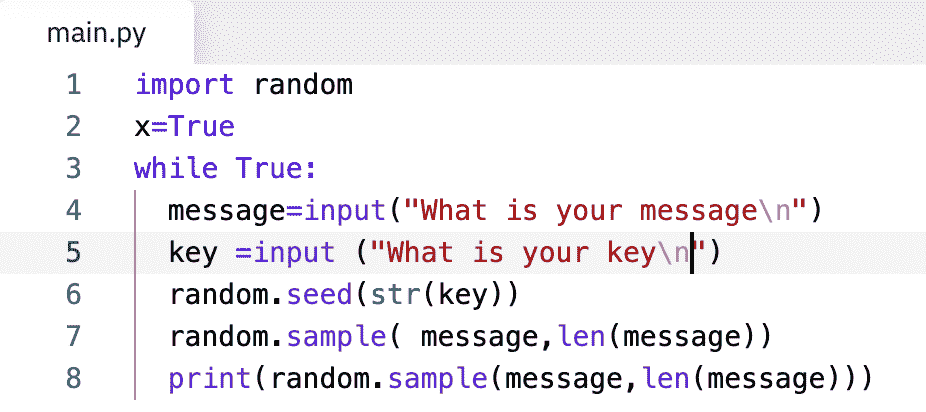
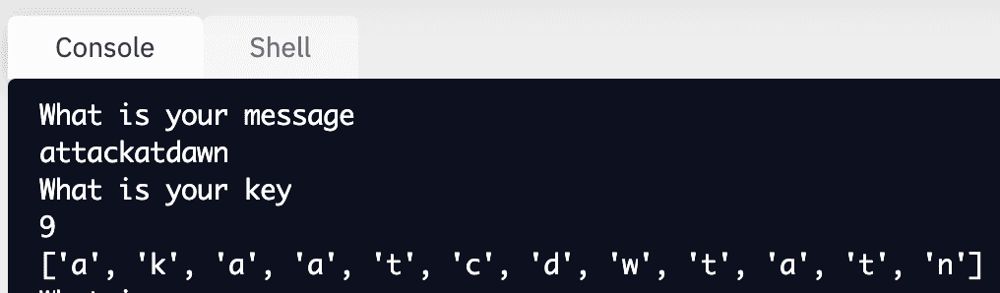
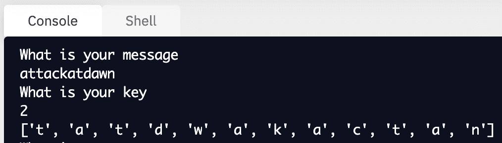

# 使用 Python 随机模块的换位密码

> 原文：<https://medium.com/geekculture/transposition-cipher-using-python-random-module-c0126df1105f?source=collection_archive---------10----------------------->

**在传统的加密技术中，我们有两种操作贯穿于隐藏消息和将纯文本转换成密码消息的历史**

# **替换和换位**

在**替换算法**(如在凯撒密码和维格纳密码中使用的)中，我们通过将一个字符在字母表中的位置移动一个预定义的位数来用另一个字符替换它

# **在换位算法中，顾名思义，明文是重新排序的，我们改变元素的顺序。但是角色保持不变**

让我们使用 **python 伪随机数发生器模块**来获取纯文本并使用转置操作，密钥是 **random** **seed** (初始值，随机数发生器在此开始其数学运算)

我们将启动并导入随机模块。我们将只使用随机的。样本函数，因为它允许我们随机化字符串

现在创建一个变量，它是一个**布尔值**。让我们使用一个 **while 循环**。这样我们就可以一次又一次地继续我们的代码。

我们将需要用户输入，一次是消息本身，第二次是密钥

# 让我们来创造它

第一个输入**“你的信息是什么”**第二个**“你的钥匙是什么”**

# 现在键是最有趣的部分，因为我们的键实际上是种子值，

如前所述，种子值是我们的随机模型在数学运算开始时使用的初始值，在数学运算中它实际上生成伪数字。

现在让我们设置我们的**随机种子**，键的用户输入被保存为一个变量，我们将放置这个变量来使用我们的键

接下来，我们将使用 random.sample()函数本身，它有两个参数。第一个是列表或字符串，在我们的例子中是消息。我们刚刚进去的那个。第二个是我们想要的样本的长度，我们需要和字符串一样多的样本。同样数量的字母。这就是为什么我们将使用消息的长度— **len(message)** 。

最后一行代码是打印加密的消息，

现在运行您的脚本。

你的信息是什么？

该消息将**“attack at dawn”**

关键是什么？

密钥将是 9。

我们的加密信息是**“akaatcdwtatn”**

让我们使用另一个随机种子密钥

