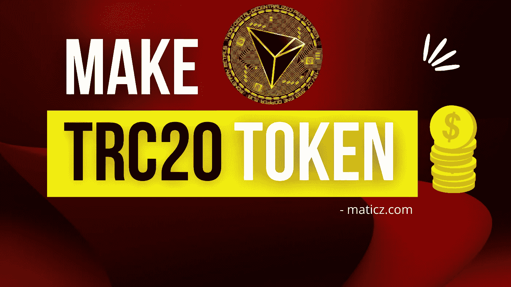

# TRC20 令牌开发—创建您自己的分散令牌

> 原文：<https://medium.com/geekculture/trc20-token-development-create-your-own-decentralized-token-6cb67744e3d9?source=collection_archive---------8----------------------->

Tron 是一个致力于去中心化的表现良好的区块链。它由 Justin Sun 阁下于 2017 年 9 月创立，他也是 Bit Torrent 的首席执行官。自 2018 年 5 月推出 Maninnet 以来，不断取得优异成绩。Tron 是提供最佳分散服务的先驱，拥有近 526 万日活跃用户。Tron 在全球最大的稳定硬币流通供应中创造了破纪录的历史，于 2021 年 4 月在以太坊超越了 USDT，除此之外，Tron 还在密码市场中创造了更多记录

Tron 区块链的一个部分是令牌开发，它允许您在对等网络中完美地进行支付。创区块链类似于以太坊，EOS，和，其他类型。相比之下，其他区块链网络 it 设施以极快的速度完成您的交易。Tron 令牌衍生物有三种类型:TRC10、TRC20 和 TRC721。创区块链用于解锁各种区块链应用，如加密钱包、加密令牌和其他 Defi 应用。

# TRC20 令牌的基本要素

TRC20 令牌是 Tron 区块链网络支持的技术标准令牌。TRC20 令牌是 TRC10 令牌的更新版本，因此您可以在此令牌中执行更多功能。TRC20 令牌用作 Tron 虚拟机(TVM)。同样，该类型的变体也用于以太坊区块链的以太坊虚拟机(EVM)。这两个虚拟机已经运行互操作。它还具有高度安全性，结合了智能合约，可在成熟的分散式生态系统中实际使用。TRC20 和 ERC20 标记都很容易压缩。大多数用户可以在公司的 ICO 众包销售中使用此令牌，在 DApp，用户可以在支付方法上使用此令牌，并根据特定的需求功能开发自己的项目。这种令牌消耗高能量水平和带宽容量来随机处理您的交易，每秒处理 2000 笔交易，并优化了燃气费。

# 突出的 feaṁtures

## 对等交易

所有 Tron 令牌标准都嵌入了对等交易，最终消除了中间人或任何中间人的窥探。所有交易都可以通过公共分类账轻松追踪

## 不变的建筑结构

TRC20 令牌与智能合约代码相结合，因此您不会有任何安全缺陷。

## 优化费用结构

与其他同行相比，Tron network 因其高度优化的天然气费用而对观众具有吸引力。

## 跨平台支持

Tron 令牌的设计和开发旨在提供与市场趋势中其他连锁店的兼容性。这一方面从其他可运营的连锁带来了更多的目标受众。

## 更快的付款

它通过简化的交易协议使您的交易更快。

# 构建 TRC20 令牌的技术要求

*   罗塞塔 API
*   PHP SDK-Tron-api
*   Python SDK-Tronpy
*   Python SDK-Tron-api-python
*   Tronlink 浏览器扩展
*   创支付 NPM 公司
*   TronStation
*   Go SDK-gotron-sdk

# 创建 TRC20 令牌的过程

*   只是，安装“创链接”插件。如果你有一个不同的浏览器，比如 chrome，和，Firefox 也有这个扩展
*   准备好您的帐户，准备发放令牌。然后选择令牌名称、符号和令牌的总供应量。
*   选择创建钱包选项。在此阶段，您的帐户中至少需要 10TRX。
*   上传您的代币详细信息，如代币名称、代币符号和合同代码中的总供应量。
*   部署 Tron 扫描工具以安装 TRC20 令牌合同，同时上传合同代码并使用该合同进行编译。然后选择确认提示按钮，使用 Tron Box 部署合同。
*   Tron 链接对话框将出现在屏幕上，记录提到的合同地址，并将令牌添加到 Tron 链接中。
*   提交详细信息后，合同将被成功验证
*   将弹出一个窗口，要求确认令牌发放。然后点击接受按钮，并通过 Tron 链接输入您的签名
*   终于成功记录了您的令牌。
*   将令牌注册到 Tron 扫描中

## 转换您的 TRC 20 令牌的过程

*   为了安装第一个信托票据，这是市场上最流行的分布式账本。
*   将 genius 单元的一些地址从 Mainnet 改为 Testnet。
*   从信任笔记令牌目录中找到 constant.js，然后等待大约 15 分钟的数据同步时间，这取决于您的网络基础。
*   将生成一个 apt wallet，并将其保存在您的 Trust Note 令牌目录中名为 address.json 的文件中。
*   然后复制该地址并将其粘贴到地址输入表单中，然后发送。同时从 testnet explorer 检查您的余额
*   来自 TrustNote 令牌目录的 Create _asset.js。当系统提示您输入地址时，选择输入按钮。
*   从 Testnet explorer 中搜索您的令牌 ID，并填写目的地地址和将要传输的单位数
*   如果您检查您的令牌传输以在测试网络资源管理器上输入目标地址。查看您的结果

# 定论

随着大部分的贡献被 Defi 获得，加密产业日益繁荣。在 Defi 协议对于这一代人进行支付、贷款、赌博、ICO/IDO 等非常重要，因为它在未来几年有着广泛的应用范围。其中之一是 [TRC20 令牌开发](https://maticz.com/trc20-tron-token-development)来满足他们的需求。TRC20 令牌用于不同的行业，如金融服务、医疗保健、游戏、房地产、教育以及更多正在将其系统转换为分散平台的行业。