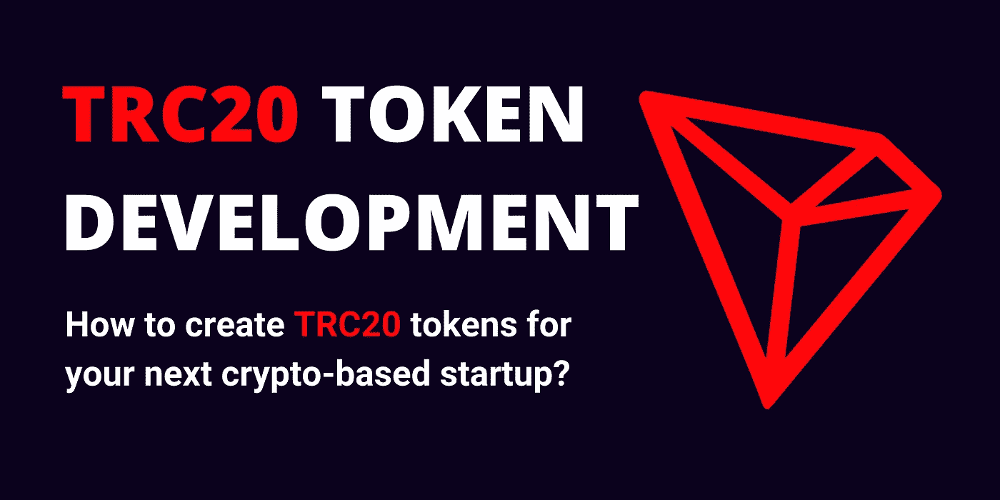

# TRC20 令牌开发——如何为下一次基于加密的启动创建 TRC20 令牌？

> 原文：<https://medium.com/geekculture/trc20-token-development-how-to-create-trc20-tokens-for-your-next-crypto-based-startup-527d91406c01?source=collection_archive---------12----------------------->

TRC10 令牌和 TRC20 令牌是目前网上搜索频率最高的词汇。这是因为它的优势和在区块链地区的应用。像以太坊、瑞波和 EOS 一样，创是一种区块链。创有自己的协议和自己的区块链探索者，就像其他区块链网络。此外，它还向市场发布了一种加密货币令牌。

1.  **什么是 TRC20 令牌？**

TRON 区块链的一种本地令牌是 TRC20 令牌。它是当今最知名的加密货币代币之一。此外，它开始吸引区块链爱好者的注意。简单地说，当使用 TRON 网络创建令牌时，TRC20 令牌是一种完全基于智能合约应用的技术标准。但是 ERC20 令牌也完全兼容它。借助 TRC20 令牌，用户可以轻松地进行安全交易。要创造一个独特的 TRC20 硬币，需要一个带有智能合约的创区块链网络。

然而，TRC20 和 ERC20 标准非常相似。使用 TRON 虚拟机创建的令牌可以使用 TRC20 令牌来创建。ERC20 也可以配合使用。当智能合约提供无限选择时，TRC20 令牌可以提供 TRC10 令牌中不存在的额外逻辑。的确，与 TRC10 代币相比，TRC20 硬币拥有巨大的能量和带宽。总而言之，TRC20 令牌比 TRC10 令牌更强大。因此，许多创业公司和企业主转向 TRC20 代币开发公司，生产超精细的 TRC20 代币。

# 如何创建 TRC20 令牌？

每个区块链爱好者的梦想是在 Tron 平台上建立一个 TRC20 硬币。考虑到它给区块链工业带来的所有积极方面。可以快速且容易地制作 TRC20 代币。可以用两种不同的方法制作 TRC20 令牌。要么选择最可靠和有效的 Tron 令牌开发业务。WeAlwin Technologies 就是这样一家合法的令牌开发公司。我们有熟练的令牌开发人员，我们将在 TRC20 令牌开发和部署流程的每一步为您提供帮助。否则，如果你对编程非常了解，并且是区块链技术的专家。然后，按照下面的说明创建 TRC20 令牌。

1.如果您希望创建 TRC20 令牌，则必须使用智能合约创建地址。在生成 TRC10 令牌时，不要求拥有智能协定的地址。

2.在谷歌 chrome 这样的知名网络浏览器上点击添加 Chrome 扩展按钮，是安装 Tron link wallet 插件的第一步。

3.接下来，您必须创建一个用于创建 TRC20 令牌的帐户，并更新 Shasta testnet。

4.在创建 TRC20 代币之前，您必须选择独特的代币名称、代币符号以及将在市场上出售的 TRC20 代币数量。

5.接下来，选择创建 Tron 令牌 Wallet。但是，您的帐户上必须至少有 10 个 TRX 币。

6.仔细检查您是否提供了创建 TRC20 令牌所需的所有信息。例如令牌名称、符号以及合同代码中可用的 TRC20 令牌总数。此外，确保你是在创区块链生产 TRC20 硬币。

7.您还必须包含有关 TRC20 令牌要求的更多信息。如令牌的需求、价值、冻结和发布时间，以及其他关键细节，如白皮书和智能合同的地址等。

8.要安装 TRC20 合同，请将您的钱包链接到 TRONScan 平台。然后，必须组装合同并上传合同代码。提交合同代码后，只需单击确认按钮即可使用 TRON Box 部署合同。

9.单击确认按钮后，TRON 链接签名对话框将打开；然后你必须写下合同地址。然后，您的 TRC20 令牌必须添加到 TRON 链接。

10.TRONScan 还提供对合同代码的访问。因此，在提交所有必需的信息后，合同代码将被成功确认。例如许可证、编译器版本、合同地址和合同名称。

11.你输入的资料必须符合 TRC20 合约的条款。输入必要数据后，屏幕上将出现一个简短的弹出对话框，用于确认令牌发放。为了签署 TRONLink 弹出菜单，您必须单击确认按钮。

12.你输入的资料必须符合 TRC20 合约的条款。输入必要数据后，屏幕上将出现一个简短的弹出对话框，用于确认令牌发放。为了签署 TRONLink 弹出菜单，您必须单击确认按钮。

13.您的 TRC20 代币将会成功注册。现在可以向 TRONScan 注册令牌。安装 TRONWeb 平台，然后整合 TRC20 代币合约并开始 TRC20 代币转账。

14.从区块链下拉菜单中选择令牌跟踪器选项。您可以使用菜单项“创建令牌”来创建 TRC20 令牌

如果精确遵循每个步骤，您的 TRC20 令牌就可以部署了。但是，如果你犯了一个小小的编码错误。结果将是失败。为了以合理的价格创建具有所有高级功能的 TRC20 令牌，请联系 Zab Technologies。

**Tron 令牌开发的特点**

以下是 Tron 令牌开发的主要特征:

*   低成本
*   TRON 钱包的开发和集成
*   支持 Windows、Mac、Android 和 iOS
*   适应性用户界面
*   网络 P2P 分散化
*   硬币互换
*   支持各种加密货币令牌(TRX、BTT、USDT 和 JST)
*   公共分类帐的无限数据管理和存储
*   易于追踪的替代品
*   高级安全和安全机制

**创建 TRC20 代币的成本**

即使您对 TRC20 令牌开发感兴趣，您也可能首先意识到其价格。大多数人倾向于认为 TRC20 令牌的开发成本会很高，但这是不正确的。与其他令牌相比，TRC20 令牌的开发成本非常低廉。一般来说，在制定令牌开发成本时，会考虑一些因素。是他们，

*   企业类型
*   TRC20 令牌的独有功能
*   令牌的设计
*   代币的总供应量。
*   你的项目的复杂性
*   分配
*   持续支持和维护

根据这些变量，生产 TRC20 代币的成本可能会发生变化。创建一个 TRC20 令牌的价格是不固定的。然而，创建一个 TRC20 令牌的价格可能从 4000 美元开始。除此之外，开发一个 TRC20 令牌的价格根据您的需求和时间框架而有所不同。

**谁提供最好的 Tron token 开发服务？**

WeAlwin Technologies 是开发 Tron 令牌的顶级区块链初创公司。我们是提供各种代币开发服务的专家，将尖端技术和功能融入其中，因为我们是区块链的先驱。由于我们的 TRON 令牌开发服务，市场上可以获得最棒的 TRC10 和[TRC 20 令牌开发](https://www.alwin.io/trc20-token-development-company) 服务。我们有一个专业团队，可以帮助企业和初创公司基于 TRON 网络创建令牌。

我们的团队在创建具有顶级安全功能的 TRON 令牌方面拥有丰富的经验。WeAlwin Technologies 的 TRON 令牌符合所有基本的安全标准。我们将立即修复您可能遇到的任何故障或错误。此外，我们的团队专门提供各种区块链开发服务，包括开发 ERC20 令牌、ico、ieo 等。因此，通过我们的 TRON 令牌开发服务，您可以快速、经济地创建独特的 TRC20 或 TRC10 令牌。