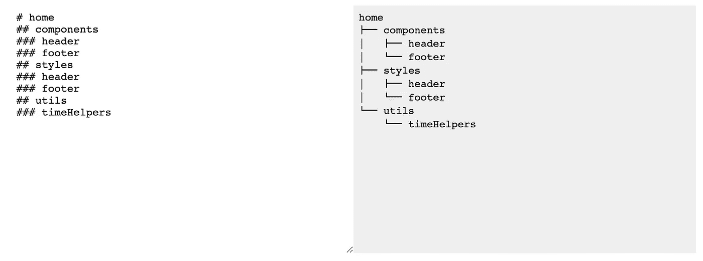

# JavaScript 中的树数据+递归

> 原文：<https://medium.com/geekculture/tree-data-recursion-ef271eb3a976?source=collection_archive---------9----------------------->

## 构建 ASCII 树文件夹生成器的经验教训

我最近写了一个脚本，它基于一个项目符号列表生成一个基于文本的 ASCII 文件夹结构。这是我以前在写文档时寻找的东西，但是我找不到，所以我想我应该自己写。因为一张图胜过千言万语，所以下面是最终产品的样子:

link: [https://xqgvz.csb.app/](https://xqgvz.csb.app/)