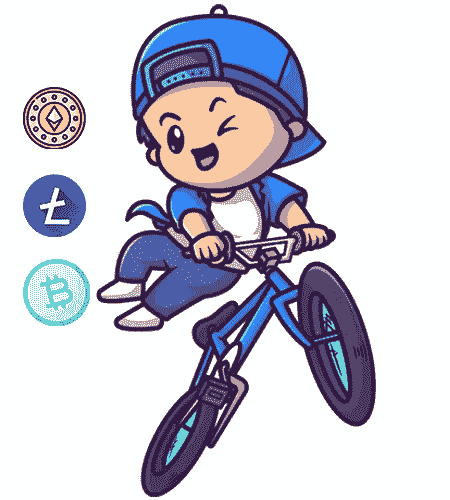
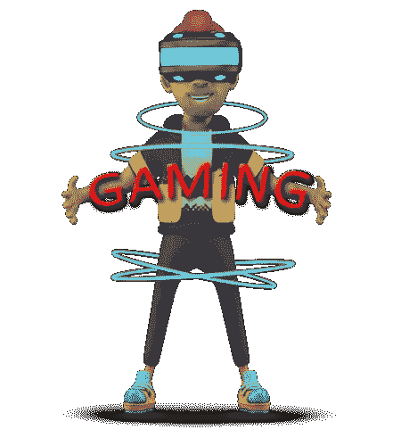
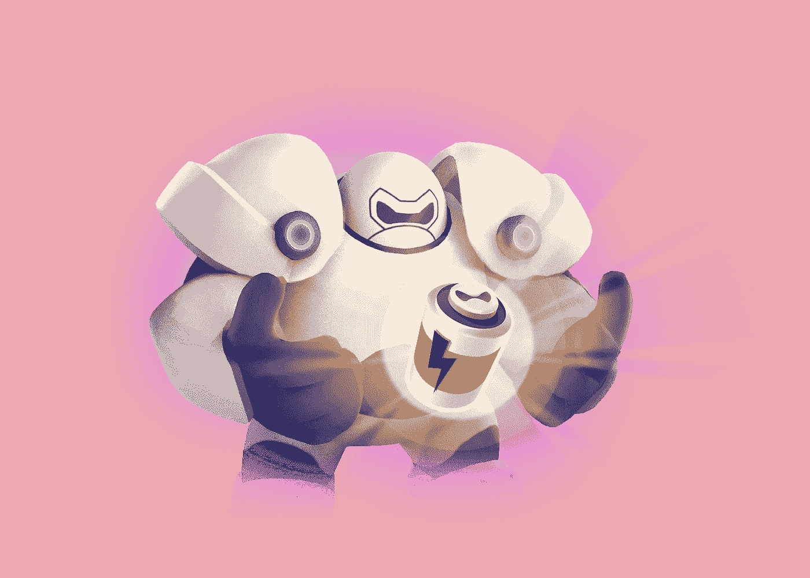

# NFT 游戏发展的趋势类型

> 原文：<https://medium.com/geekculture/trending-genres-in-nft-game-development-726371b148e?source=collection_archive---------8----------------------->

NFT 游戏是这个行业出现的最新趋势。它们是最新的潮流，每个人都喜欢这个新概念。这种类型允许玩家赚取奖励，并将这些奖励货币化。玩家通过完成目标或在游戏中达到更高的等级来获得这些奖励。这些奖励从游戏内资产的 NFT 到玩家可以在市场上交易的加密货币不等。

这些游戏充分利用了 NFTs 和加密货币的有效性。在这些游戏中，非战斗单位以化身、武器和可兑换奖励的形式出现。[玩赚游戏](https://www.blockchainappfactory.com/nft-gaming-platform-development?utm_source=Medium&utm_medium=Guest+Publication+-+06%2F01%2F2022&utm_campaign=vignesh)在 2021 年流行起来，许多人推测这个平台对玩家和开发者都有利。NFT 游戏为游戏开发商提供了一个有利可图的机会，并吸引玩家不断回来。

## **游戏中对 NFT 的需求**

NFT 以其不可思议的特性和鲜明的特点在密码市场上树立了一个新的趋势。NFT 的独特性和稀缺性是其受欢迎程度上升和市场趋势背后的决定性因素。游戏行业是一个庞大的行业，是测试新技术和创新技术的理想平台。人们对游戏的兴趣支持了这些游戏整合最新技术的需求。

引入 NFT 为[创造游戏资产和收藏品](https://www.blockchainappfactory.com/nft-gaming-platform-development?utm_source=Medium&utm_medium=Guest+Publication+-+06%2F01%2F2022&utm_campaign=vignesh)奠定了基础。NFT 在这里创造了机会，以经济的价格开发、销售和购买这些独特的代币。它还能让玩家轻松适应这一新趋势，并了解他们如何从中受益。

由于其分散的环境和卓越的特性，NFT 为各行各业提供了动力。区块链提供的复杂网络及其分散的特性确保了该技术的兼容性和安全性。

## **NFT 融入游戏的主要优势**

 [## NFT 游戏平台-加密领域的独立生态系统。

### 游戏行业一直被认为是一个有趣和娱乐的地方，人们在这里与虚拟角色互动…

www.blockchainappfactory.com](https://www.blockchainappfactory.com/blog/nft-gaming-platform-an-independent-ecosystem-in-the-crypto-space/?utm_source=Medium&utm_medium=Guest+Publication+-+06%2F01%2F2022&utm_campaign=vignesh) 

## 1️⃣ **流动性**

流动性是 NFT 景观的一大优势。在 NFT 游戏中，玩家可以立即在二级市场上出售代币。当特定的 NFT 需求很高时，NFT 的流动性也是有利的。

## 2️⃣ **不变性**

NFT 的不可改变性允许用户在游戏内外访问他们的资产。在这里，游戏将资产存储在一个分散的服务器上，并确保没有数据丢失或删除的机会。

## 3️⃣ **可编程性**

这一优势使开发人员可以完全控制他们的资产创建和启动。NFT 的可编程性使得开发者可以轻松地创建资产并将其集成到 NFT 游戏中。

## 4️⃣ **跨链合规性**

NFT 游戏的另一个显著优势是它们的跨链兼容性。任何支持一个以上区块链网络的游戏都受益于每个网络提供的设施。

## 5️⃣ **稀缺**

创收的最大来源之一是稀缺虚拟资产创造的收入。持有稀有资产的玩家可以将其出售给其他玩家，从而获得收入。一些玩家可以通过获得稀有的 NFT 游戏资产并出售获利来建立职业生涯。

## 6️⃣ **可验证性**

开发者和游戏玩家之间的区块链交易是可验证的。区块链技术的透明性确保了双方的公平利益并产生信任。这种信任有助于游戏在竞争中脱颖而出。

## **游戏中 NFTs 的好处**

▪️ NFTs 在这里提供定制虚拟资产的独家游戏

️▪️对特定 NFT 资产需求的增加提高了其价值和售价

▪️ NFT 游戏平台提供了巨大的创收机会

nft 本质上是可互操作的，通过开发团队的支持，NFT 游戏资产可以在多个游戏中运行

▪️ NFT 游戏平台提供了几种赚钱的可能性

游戏中产生的▪️收入在玩家中是透明的

▪️在市场上列出独家资产会产生对该资产的兴趣，并驱使受众关注 NFT 和市场

## **现代 NFT 游戏解决方案**

🎮**动作游戏的 NFT**

动作游戏总是畅销，每个人都喜欢好的动作游戏。这里的非战斗单位有各种各样的形式，比如角色、特殊能力、装备和角色皮肤。

🎮 **NFT 进行冒险游戏**

冒险游戏为玩家提供了虚拟的环境和真实的体验。在这里，NFT 可以在一个专门的在线市场上以专属服装、能力、升级和地图的形式出现。

🎮 **NFT 进行 PvP 对战游戏**

PvP 游戏是玩家展示他们独有的服装、技能和力量的理想平台。在这里，玩家可以将他们的虚拟资产令牌化成有价值的 NFT 并出售。

🎮 **NFT 赌场游戏**

赌场游戏是 NFTs 的另一个理想平台。在这里，NFT 可以代表代币，玩家可以使用它们而不是玩法定货币。此外，NFT 允许表示现有赌场的资产价值。

🎮 **NFT 赛车游戏**

赛车游戏是游戏行业增长最快的领域之一。这些游戏吸引了大量的观众，不管他们的年龄。这里的 NFT 可以代表汽车、自行车、配件和升级，为玩家创造独特的体验。

## **结论**

上面列出的解决方案是 NFTs 可以带来变化的一些平台。其他流派受益于 NFT 的包容性，这是没有人考虑到的。游戏社区每天都在成长，并对新的想法和创新保持开放。因此，现在是时候开发和推出一个 NFT 游戏，并获得不可避免的回报。

 [## 2022 年 NFT 加密游戏排行榜前五名

### 只要 NFT 的概念是上升的，玩赚 NFT 项目的概念有望达到令人咋舌…

medium.datadriveninvestor.com](https://medium.datadriveninvestor.com/top-5-play-to-earn-crypto-nft-games-2022-53ccbb751668)