# 纯 JavaScript 中高效阴影效果的技巧

> 原文：<https://medium.com/geekculture/tricks-for-efficient-shadow-effect-in-pure-javascript-8064c0506728?source=collection_archive---------9----------------------->

## 如何处理 2.5D 浏览器游戏中光源重叠的问题

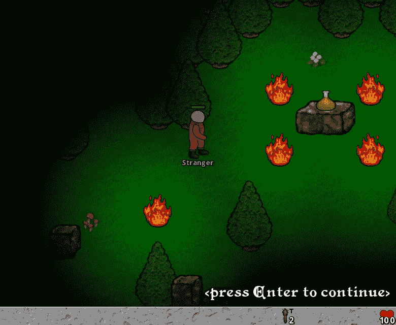

Lost In Maze (browser game)

在这篇文章中，我们将看到浏览器游戏《迷失在迷宫中》的灯光效果是如何用普通 JavaScript 制作的，没有使用任何库或 WebGL。

## 一般性能

在浏览器画布上绘制精灵(图像)是一个非常高效的过程。只要我们不滥用它，我们就可以依赖它。

由于《迷失迷宫》的 2.5D 性质(视角)，不可能只画出画布的一部分:例如，总有一些导弹在树林中飞行。在每一次循环中，我们必须按照场景的透视顺序用精灵重画整个画布。

在每个循环中绘制所有内容可能对系统要求过高。考虑到这一点，《迷失迷宫》被设计为以 30 FPS(每秒帧数)的速度运行，并使用一些智能算法来避免给系统带来压力。

其实跑起来很流畅。游戏的每个循环只需要一两毫秒就能运行(在 Chrome 中)。电脑处理器不会发热(它们保持在低于 60 摄氏度的 T2 温度下)，玩家体验与旧版本以 60 FPS 运行时相同。

查看[浏览器真的能以 60 FPS 运行吗？](https://javascript.plainenglish.io/can-browsers-actually-run-at-60-fps-1abb343879a8)如果你想了解更多关于游戏的浏览器性能。

## 照明设备

在《迷失迷宫》中，有三种照明模式。我们可以称它们为日光模式、火炬模式和篝火模式。

## 日光模式

在日光模式下，没有灯光效果。即使画面中有篝火。它只是在画精灵。

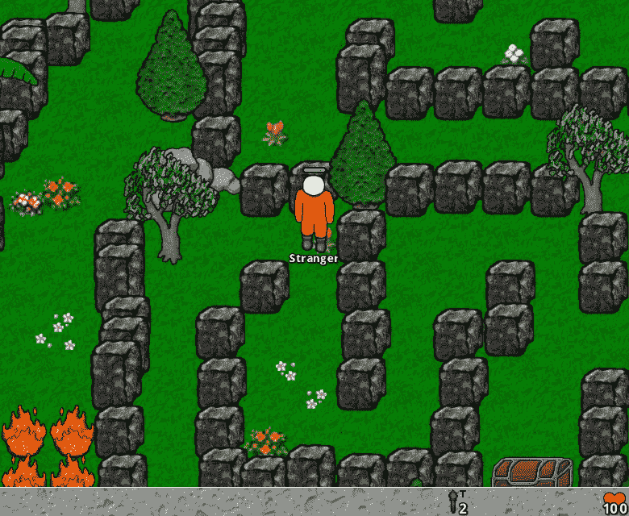

Daylight mode

## 火炬模式

在手电筒模式下，环境是黑暗的。只有一个光源。这是神通携带的火炬。由于化身总是被放置在游戏画布的中心，所以光的中心也总是在游戏画布的中心；头像是站着还是“动着”并不重要。

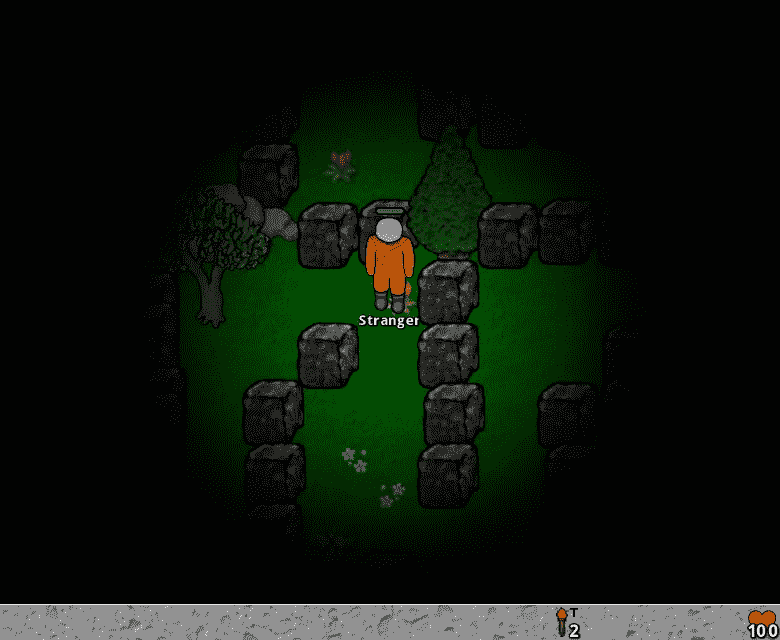

Torch mode

我打赌你知道怎么做。它只是绘制游戏画布，就像在日光模式下一样，然后在上面绘制一个阴影层(半透明径向暗渐变)。

> 这是一个小小的悖论。使用光线意味着使画面变暗。事实上，我们应用阴影，而不是光。

阴影层可以在客户端(浏览器)上使用公式**创建，该公式类似于用于创建篝火阴影的公式**:

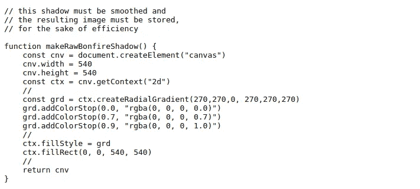

Making the raw shadow for a bonfire

这是小菜一碟。我们只需要确保黑暗覆盖游戏画布的所有边界，并且最清晰的部分在它的中心。

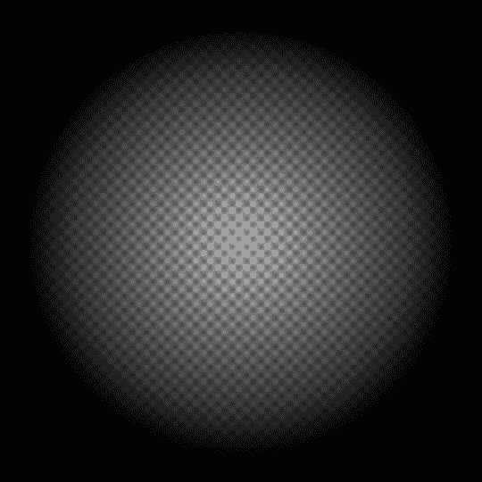

Raw shadow of a bonfire

## 篝火模式

在篝火模式下，环境是黑暗的，现场至少有一个篝火。因此它的光可能与化身的火炬的光和其他篝火的光重叠。请注意，篝火灯光附着在环境上；当虚拟角色“移动”时，它会在游戏画布中移动。即使篝火不是场景的一部分，如果它的位置在场景旁边，也必须考虑它的光线。

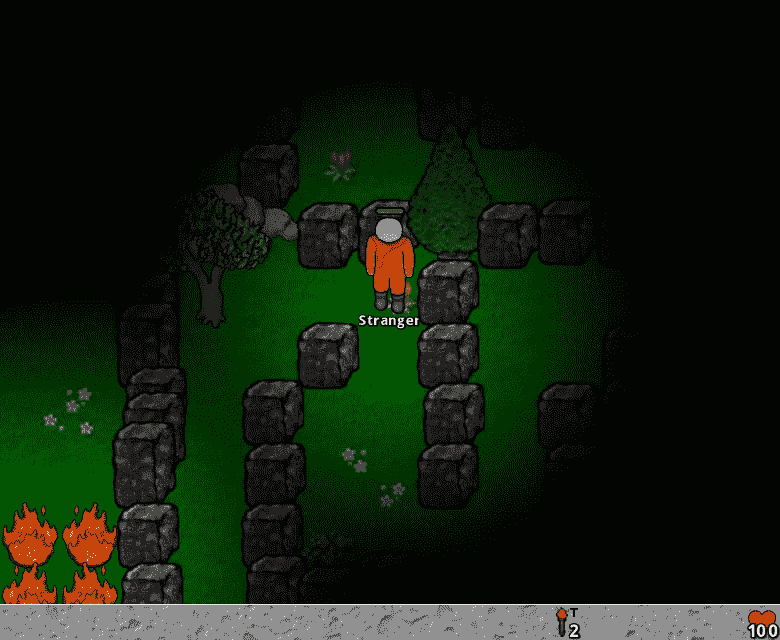

Bonfire mode (with burning torch)

篝火模式的问题在于(有效地)处理灯光的重叠。

> 是时候开个小会了:从现在开始，我们将只讨论**应用阴影**和**重叠阴影**，因为这是我们真正在游戏画布上做的事情。**我们没有给游戏** **画布**打光，而是让它变暗。

# 重叠阴影

遵循[循序渐进](/swlh/what-about-bob-how-this-old-movie-changed-my-code-67febcb5ac8)的原则，让我们从扎实简单的基础开始学习，这个 raw 场景:

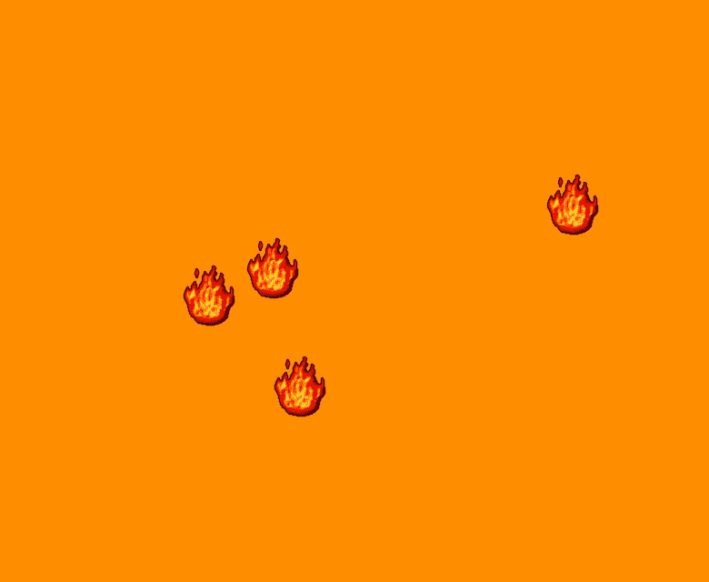

Raw scene

然后我们简单地为每个篝火画一个阴影。我们将使用*较小的篝火阴影* (270 x 270 像素)，因为这样更好理解。

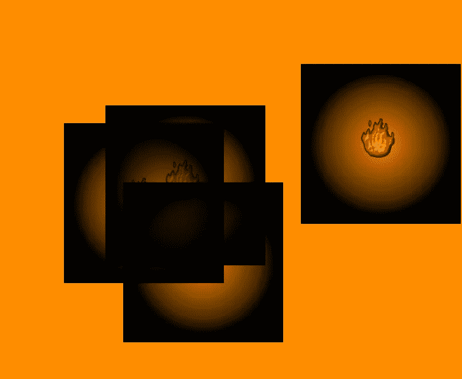

Naive shadow overlapping

我们现在的重点是在纯 JavaScript 的 中找出重叠阴影的 ***高效算法。因此，我们将暂时忽略裸露区域(没有被任何阴影覆盖)。***

单独一个影子就可以了。但是阴影的重叠很乱。三堆篝火中间的中心应该是绝对清晰的，但却是绝对黑暗的。

这不是程序的错误。程序正确地重叠了阴影。问题是**我们需要的是重叠光**，不是阴影！**使用阴影只是一种变通方法**！

那么，我们现在做什么？试试用 JavaScript 对 780 x 640 像素的画布进行像素操作？效率不高！

就效率而言，我们目前最好的方法是画布方法 **drawImage** 。但是单独使用它会产生我们看到的天真的阴影重叠。

我绞尽脑汁，找到了两个解决办法。第一种简单搞笑。第二个是更快的，并为迷失迷宫产生更理想的照明效果。

## 阴影层

两种解决方案都需要一个阴影层。这是所有阴影合成(重叠)的画布。合成阴影后，我们在游戏画布上绘制阴影层。

阴影层必须匹配游戏画布的尺寸。或者，为了优化，是它的成比例的精确减少。

# 重叠阴影——第一种解决方案

由于第二个解决方案更好，这次我们将不会看到该解决方案的优化版本，而只会看到其基本概念。

## 红色、绿色、蓝色和阿尔法

你知道这个题目，但我必须提出来。

任何数字图像都是像素矩阵。但是，粗略地说，它在 **内存**(也就是我们处理的)中的**表示是**而不是**像素矩阵。它是一个类型为**uint 8**(0 到 255 范围内的任意整数)**的值的**数组**。****

我们将数组中的数字“打包”，四个一组，创建一个假想的像素序列。包中的第一个数字是红色的值，第二个是绿色的值，第三个是蓝色的值。第四个数字是透明度的值，称为 Alpha。

当 Alpha 为零时，像素是绝对透明的。当 Alpha 为 255 时，像素是不透明的。

如果你想用这个主题做实验，有一些有用的网站，像 [BobSprite](https://www.bobsprite.com) 。

## 反转阴影

我们的阴影图像的像素遵循这种模式:红色、绿色和蓝色总是为零。阿尔法是统治者。当 Alpha 为 255 时，像素完全为黑色。当 Alpha 为零时，像素是绝对半透明的(完全没有阴影)。

drawImage 方法是如此的好(简单而快速),以至于我们拒绝在外面的冷雨中抛弃它。所以…还是用吧:)

我们需要调用这个函数来反转阴影图像的每个像素的 Alpha(值):

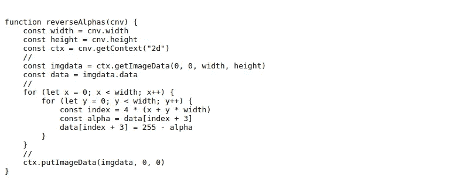

Reversing Alpha of pixels

下面我们看到阿尔法逆转的行动。像素越暗，Alpha 反转后就变得越亮。

例如，像素[0，0，0，230](暗)变成[0，0，0，25](明)。

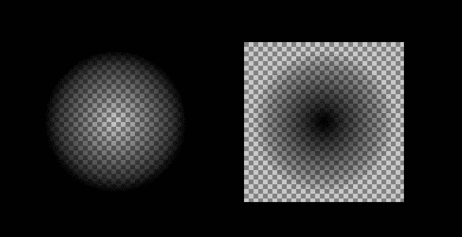

Bonfire shadow before and after Alpha reversing

## 合成反向阴影并完成

阴影层必须从空白开始(没有阴影)。我们通过调用 draw image(canvas 的方法)在篝火上绘制反转的阴影。

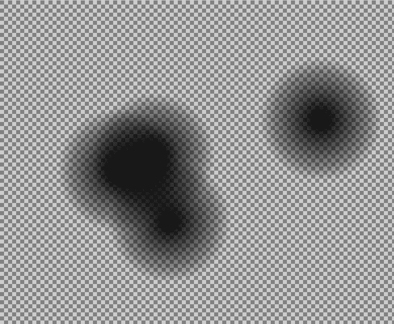

Shadow layer before being Alpha reversed

上面我们看到的是篝火后的阴影层。但是阴影层还没有准备好。我们必须逆转它的阿尔法机！下面我们看到阴影层准备在游戏画布上绘制。

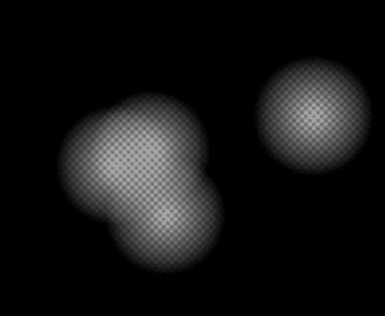

Shadow layer after being Alpha reversed

这是最后的结果:

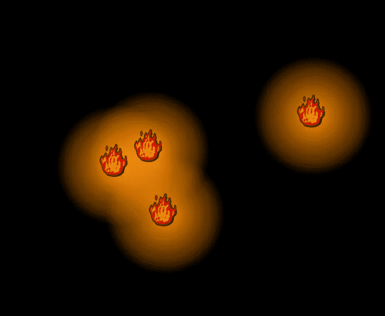

First solution

作为一个特别的奖励，第一个解决方案会自动处理裸露区域(还记得吗？).当我们颠倒阿尔法值时，这是魔法的一部分！

你怎么想呢?小菜一碟。

# 重叠阴影——第二个解决方案

第二种解决方案是第一种解决方案的自然演变。如果没有大量的优化，仅仅反转阴影层的 Alpha 值每个循环就要花费大约 15 毫秒。显然这是不可行的。

具有讽刺意味的是，通过大量的优化，我们不需要依赖 drawImage 方法*在阴影层*上合成阴影。事实上，现在调用 drawImage *会混淆和减慢处理*。我们将在 99%的时间里处理像素。

## (阴影的)重叠半透明像素

在第一个解决方案中，drawImage 方法计算并应用重叠的阴影(半透明)像素的最终 Alpha。我们的工作只是逆转阿尔法狼。

现在我们的工作是定义产生的 Alpha。因此，我们首先要做的是定义要使用的公式。

我们要对阿尔法进行求和吗？考虑平均阿尔法值？平均阿尔法值的倒数？

> 重叠的两个阴影像素的最终 alpha 值应为两者中较小的 alpha 值。

注意:我不是计算机图形工程师。上面的规则只是一个简单实用的公式，效果很好。

## 解决大瓶颈

像素操作的最大瓶颈是图像的大小、读取图像像素和程序的重复。

我们通过记忆所有需要记忆的东西来处理程序的重复:

1.  真的减轻了处理过程
2.  不消耗太多内存
3.  记忆起来并不笨拙

我们通过将每个图像的尺寸缩小 100 倍来处理图像的尺寸。你读得很好。我说小一百倍。我们通过将图像的宽度和高度缩小 10 倍来做到这一点。

你可能会想，这种减少不可能是好事；它太咄咄逼人了；一定会产生一些副作用。我会回答说，我们不是在贬低老虎的形象。我们正在减少一个黑暗，半透明的梯度将被平滑(这是可取的)的过程中减少和扩大。但是你对副作用的看法是对的。我们将看到细节:问题和修复！

我们通过在整个游戏中很少使用 getImageData 方法来处理它的缓慢。

## 一些随意的笔记

我希望你了解高效 JavaScript 的一般规则。有关于它的文章、书籍和视频。您必须记住的一件事是，尽管 JavaScript 是一种动态、自由的语言，但在本质上，值的类型对于运行时来说是极其重要的(just in time compiler，对于 Chrome 来说是 V8)。

每次运行时必须猜测某个值的类型时，程序都会损失性能。

操作像素数据的数组开销很大。我告诉运行时**哪一个是数组**的类型的实用方法(不需要猜测)是使用运行时已经知道的数组，比如画布 ImageData 的数据。

getImageData 方法很慢，比 putImageData 方法慢得多。

如果你要对很多像素使用 getImageData，千万不要通过从某个循环中调用 getImageData 来逐个读取像素。它非常慢。最快的方法是一次读取所有的 ImageData，然后对结果数据(数组)进行迭代。

# 第二个解决方案——详细说明

《迷失迷宫》的灯光源代码包含在两个文件中，每个文件有 170 行 JavaScript 代码。我们将看到一个更简洁的版本，更容易理解。

首先，我们将看到化身站立时的阴影代码。之后我们会看到阴影层的减少所带来的副作用，那只发生在化身“移动”的时候。

注意:正如我们看到的代码片段，“使用严格”并没有出现，尽管它出现在源代码文件的顶部。

## 准备的

我们创建阴影层:一个 78 x 64 像素的画布。每一个尺寸都比迷失迷宫游戏画布的相应尺寸(780 x 640 像素)小 10 倍。

我们将阴影层本身、它的 2D 上下文、它的图像数据和它的像素值(图像数据)的**数组存储为全局变量。**数据**。**

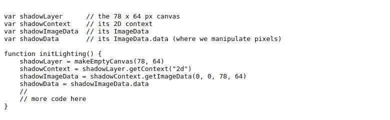

Creating the shadow layer

我们使用火炬的阴影来创建阴影层的默认状态。我们只需要数据(像素值数组)。

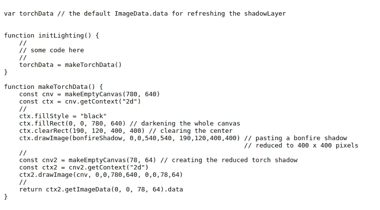

Creating the torch shadow data

最后一个准备步骤是创建减少篝火阴影的数据。原始篝火阴影为 540 x 540 像素。缩小后的篝火阴影为 54 x 54 像素。

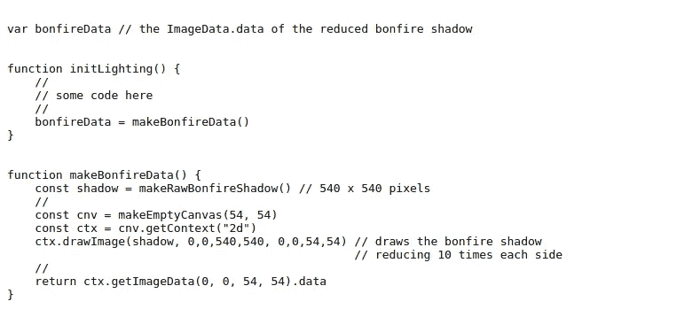

Creating the bonfire shadow data

## 运转

如果游戏的当前循环不是在日光模式下，程序调用 drawLighting 函数。

注意:我们绘制阴影来表现灯光效果是灯光模块的一个私人细节，程序的其余部分不需要涉及到这个主题。这就是为什么照明模块的接口函数被称为 initLighting 和 drawLighting。

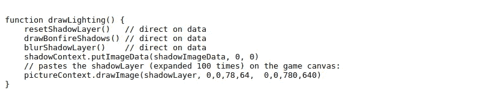

Drawing the lighting

我们使用火炬阴影的数据重置阴影层(它总是在游戏画布的中心——很容易)。注意，我们没有使用 canvas 方法 clearRect 或 drawImage，因为我们没有完全在阴影层的 2D 上下文中工作。我们直接操作它的像素值数组。

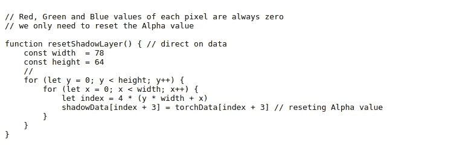

Resetting the shadow layer

绘制篝火阴影意味着创建一个篝火列表(和各自的坐标),这些篝火位于场景中或足够近以照亮场景。这部分有点复杂，和迷失的迷宫力学有关。我们将跳过对 drawBonfireShadows 函数的分析，我们将重点分析 pasteBonfireShadow 函数，它负责**在阴影层**(我们的研究对象)上粘贴篝火阴影。

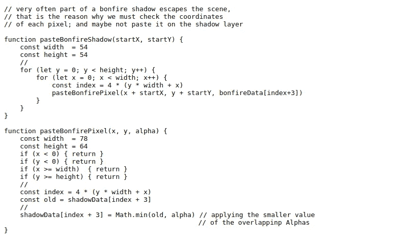

Pasting a bonfire shadow on the shadow layer

我们不需要模糊阴影层。但是模糊它会产生更好的灯光效果。另一个讽刺是:不太重要的过程占用了最大的代码片段。

使用画布方法“模糊”是不可接受的，因为它会在边缘附近创建空白像素。

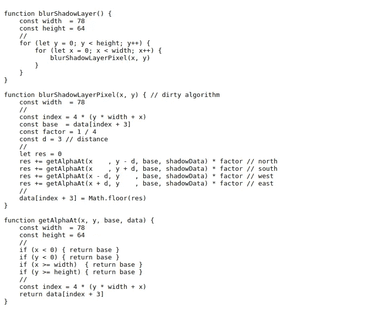

Blurring the shadow layer

这个模糊算法是肮脏的，不计后果的。它应该由两个数组构成。一个带原像素，只是为了阅读。一个空白的用来存储模糊的像素。

我做了很多尝试，并选择了这个，因为它更快，而且令我惊讶的是，产生了更好的阴影。

# 第二个解决方案——副作用和修复

正如我之前所说，减少阴影层有一个副作用。任何减少都会引起这种副作用，但是减少得越彻底，副作用就越大。副作用只发生在化身移动的时候。

这一部分并不复杂，但需要我们集中注意力。

我们知道篝火的影子必须和篝火相配。当头像向左“移动”一个像素时，在游戏画布上，是环境向右移动了一个像素。所以，篝火的阴影必须向右移动一个像素(匹配篝火的新位置)。很简单，对吧？

因此，我们需要做的就是将阴影层(火炬和篝火阴影组成的画布)放置在游戏画布右侧一个像素处，对吗？

不对。阴影层展开后，与游戏画布大小相同。它必须与游戏画布相匹配。它不应该被替换！！

应该向右移动一个像素的是阴影层中的篝火阴影。火炬阴影必须在阴影层中保持居中，就像头像在游戏画布中居中一样。

很好。因此，当化身向左移动一个像素时，我们将火炬阴影放在阴影层的中心(一如既往)，并将每个篝火阴影向右移动一个像素。没什么大不了的。有什么问题？—你问我。

问题是这样的:我们(出于效率的原因)正在处理简化的图像。我们将一个减少的篝火阴影放在减少的阴影层的右边一个像素处。目前一切都很好。但是当阴影图层**每边扩展十倍**覆盖游戏画布的时候， ***那向右一个像素就变成了向右十个像素*** ！！！因此，每个篝火阴影将会偏离其相对于相应篝火的正确位置九(十减一)个水平像素。

为了解决这个问题，我们只在虚拟角色向左移动十个像素(在普通游戏画布上)时，在减少阴影层上将减少的篝火阴影向右移动一个像素，保持比例不变。好的。现在好多了，但还不好:

1.  环境开始移动，但是每个篝火的影子停留在同一个地方
2.  当环境完成十个像素的置换时，每个篝火阴影突然跳跃十个像素，并与其篝火完全匹配
3.  转到第 1 步

修复很简单:减少的阴影层只有一层(并且永远都是),但是我们需要一些减少的篝火阴影来匹配在 0 到 9 个像素范围内的移动化身位移。考虑水平、垂直和对角线位移。

根据我们的示例，这些(兄弟)篝火阴影之一必须向右移动一个像素。

> 诀窍是在减少每个篝火阴影之前先把它移走。
> 当然，这几十个还原的篝火影子也值得背下来。

## 修复的简要细节

1.  我们将标准的 540 x 540 像素原始篝火阴影存储为图像。
2.  篝火阴影将真正使用的都是 560 x 560 像素。这个尺寸意味着我们可以把标准的篝火阴影放在中间，每边有 10 个像素的空白。
3.  边缘附近的空白用于匹配化身位移。当他向左走一个像素时，这里我们将标准篝火向右画一个像素，然后再缩小！！！
4.  此外，减少篝火阴影将是 56 x 56 像素。
5.  当头像位移是 10 个像素的整数倍(比如 0，10，20，30 等等)时，我们没有问题。).问题是 3，5，11，16…
6.  当化身向左走 13 个像素时我们需要的篝火阴影和他向左走 3 个像素时完全一样，或者 23，33，43，53…
7.  我们不需要也不应该预先存储所有可能的阴影，我们根据需求提供篝火阴影。

注意:原始的 540 x 540 篝火阴影我们存储为图像，因为我们将绘制它来创建 560 x 560 篝火阴影。所有(减少的)其他我们只存储为像素值数组(ImageData.data)。

# 最后

一旦你知道窍门，这些算法相对容易实现。

关于效率:在一个体面的桌面上(不是游戏玩家),《迷失迷宫》在白天模式下执行每个循环需要 1 或 2 毫秒。并且在篝火模式(最重的模式)下需要 2 或 3 毫秒来执行。我很满意。

如果你有任何疑问，请告诉我。