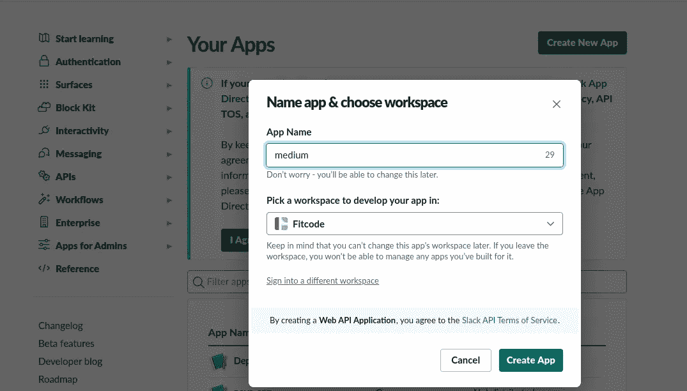
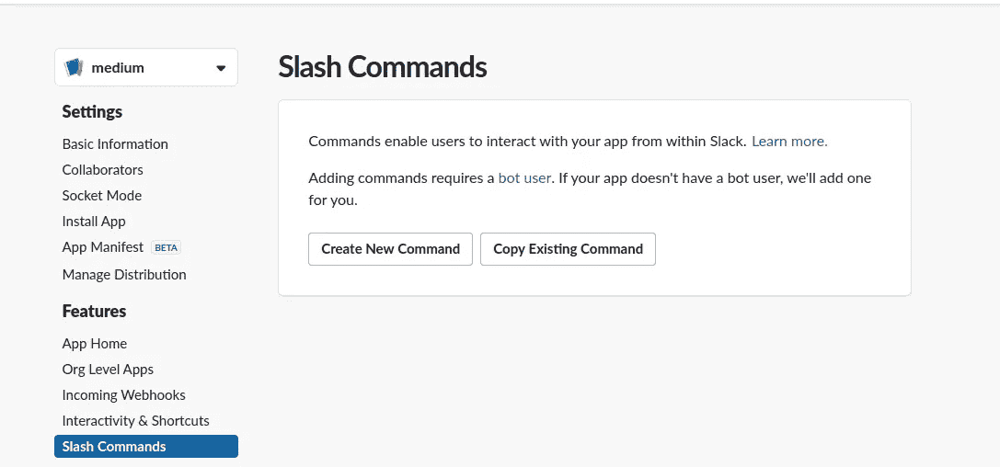
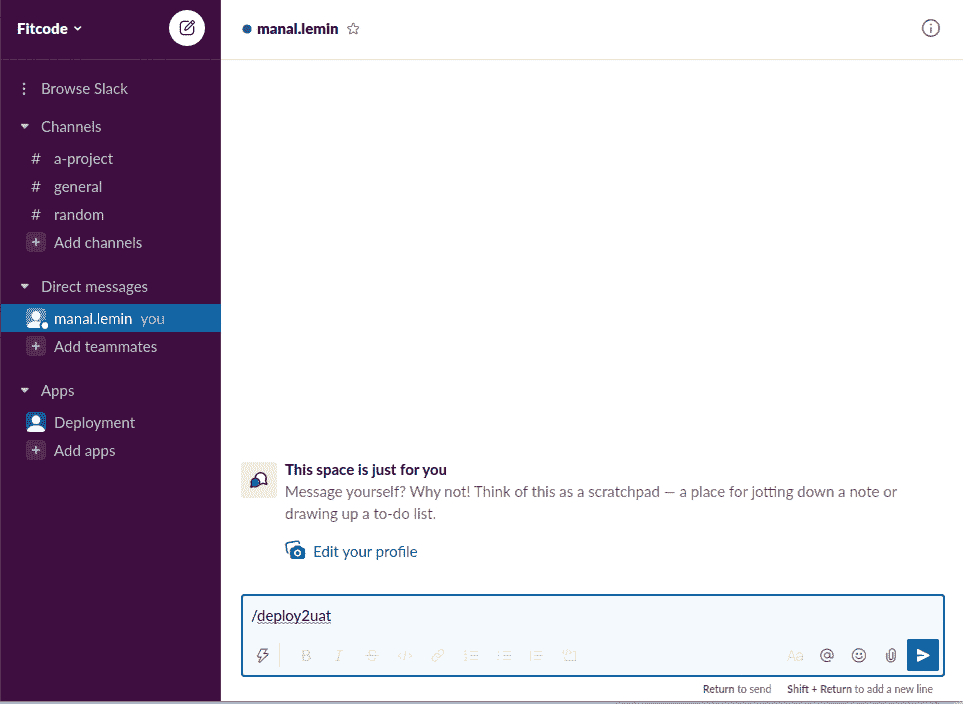

# 通过松弛命令触发管道

> 原文：<https://medium.com/geekculture/trigger-pipe-via-slack-command-8990fe707609?source=collection_archive---------41----------------------->


因此，这将是我的有趣文章列表的开始，因为我处于部分失业状态🍻

今天我们将制作一个快速斜杠命令，它将触发一个自定义管道并运行它。

# 为什么？

老实说，当我没有心情时，我喜欢玩这样的东西，而且在我的工作中，似乎开发人员太懒了，以至于无法在 bitbucket 中运行自定义管道或手动管道

# **如何？**

这是非常简单的 pips，我想在 slack 上键入/deploy2uat，它会在 bitbucket 管道中触发一个自定义管道

> /deploy2uat:表示松弛 API
> 
> 触发位桶管道:表示位桶 API

第一块拼图是松弛的

**让我们创建一个 slack 应用程序**

1.  到这里【https://api.slack.com/apps/ 并输入你的应用程序名和你想要命令执行的工作空间



create slack application

2.单击斜杠命令并创建一个



Slash commands interface


3.Create slash command

只需键入命令的名称，请求 URL 是您的后端 API 正在运行的地方，这意味着 IP 地址或端点名称...剩下的就是你的命令要做什么了。

拼图的第二块是 bitbucket API

**让我们看看 bitbucket API**

我们将打开 [API 文档](https://developer.atlassian.com/bitbucket/api/2/reference/resource/repositories/%7Bworkspace%7D/%7Brepo_slug%7D/pipelines/)，如你所见，curl 命令操作起来非常简单

```
curl -X POST -is -u username:apppassword \
  -H 'Content-Type: application/json' \
 https://api.bitbucket.org/2.0/repositories/usernameororg/repo/pipelines/ \
  -d '
  {
    "target": {
      "ref_type": "branch",
      "type": "pipeline_ref_target",
      "ref_name": "master"
    }
  }'
```

我将把这个命令翻译成一个原始的 python flask 应用程序(😜不尽然)

```
import requestsimport osfrom flask import Flask, jsonifyapp = Flask(__name__)# The route of the application @app.route('/deploy-2-uat', methods=['POST'])def testmedium():# pattern is the name of your custom pipedata = ' { "target": { "ref_type": "branch", "type": "pipeline_ref_target", "ref_name": "master", "selector": { "type": "custom", "pattern": patternName } } }'response = requests.post('https://api.bitbucket.org/2.0/repositories/username/reponame/pipelines/', headers={'Content-Type': 'application/json',}, data=data, auth=(username, appapssword))return jsonify(text='It is deployed',)if __name__ == '__main__':app.run()
```

我们可以将用户名、应用程序密码(可以在 bitbucket 上生成)和 repo name 作为环境变量传递，对于更标准的命令，我建议您将这些变量作为 slack 命令的参数传递。(我只是在这里玩得开心，所以我保持简单)

最后一步是在某个无服务器选项上部署这个小脚本，因为我说过我只是玩玩，我运行 flask 应用程序，我使用 ngrok 获得一个公共 URL，我们将在图 3 中输入它作为请求 URL，结果是



这是一个非常基本的例子，但只是想一想，像这样小小的第一步，你能做什么，例如，一个完整的 CI/CD，为什么不呢😃

来自突尼西亚的和平和原谅我的英语✌️