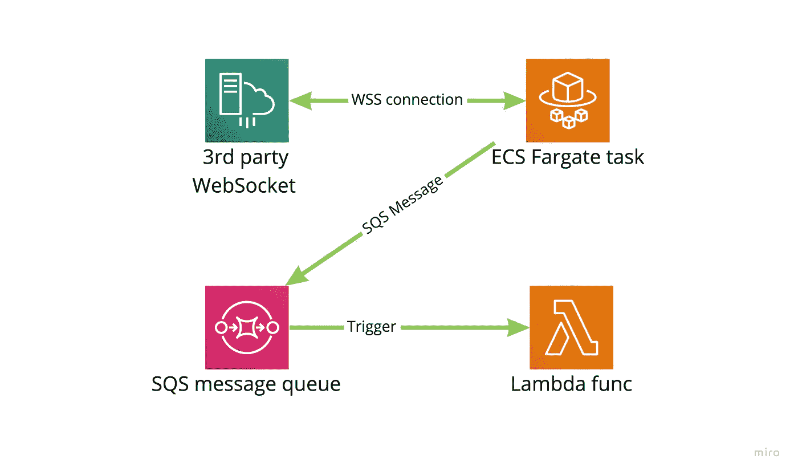
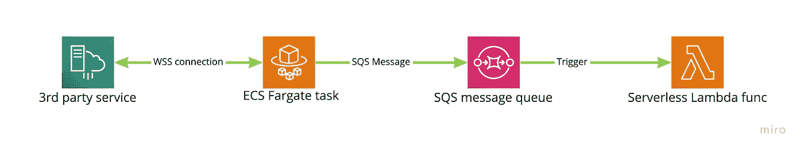

# 通过第三方 WebSocket 事件触发 Lambda 函数

> 原文：<https://medium.com/geekculture/triggering-a-lambda-function-by-a-3rd-party-websocket-event-5fc7d0ee56f3?source=collection_archive---------12----------------------->



在开始之前，我想补充几个问题，我将尝试通过本文来回答:
*“我如何从我的无服务器项目后端连接到第三方 Websocket 服务？”
“如何在无服务器设置中处理事件驱动的后台任务？”
“如何在无服务器项目中拥有一个持续运行的后台进程？”*

“但是为什么呢？”，你会问。嗯，无服务器基础设施在很多方面都很棒，但有时您确实需要一个应该在后台不间断运行的任务。在我们的例子中，这是因为我们需要通过 WebSocket stream 从第三方供应商那里接收实时更新。

在这篇文章中，我将展示我们是如何做到的。

## 首先，简单介绍一下我们的设置。

我们有一个非常简单的 REST API 后端，通过 AWS 网关 API 服务提供，并使用无服务器框架构建。我们称之为“中间件”。

我们通过中间件提供给前端应用的数据分布在几个不同的第三方服务和我们的 MySQL 数据库中。

主要是我们拥有来自中间件的数据更改过程，并通过推送通知向应用程序发送更新。

但是其中一部分逻辑是基于第三方的，第三方会更新他们这边的数据，我们想知道一旦数据更新，会不会将更改传播到我们的系统和应用程序。

通常在无服务器项目中，你可以通过 webhooks 来完成。但是在这种情况下，供应商认为它不如通过 WebSocket 连接分发更改有效(一个 https 连接可以实时交付许多事件，没有批处理和网络延迟)。

## 那么，如何做到这一点呢？

我们显然不能为此使用 Lambda 函数，因为它有执行时间限制(默认为 15 分钟)。当然，我们可以每 14 分钟重启一次，但是让 lambda 资源为这样一个简单的进程运行是非常昂贵的，因为大多数时候它除了等待什么也不做。兰姆达斯毕竟不是为这种任务设计的。

仅仅为这个简单的应用程序提供一个独立的 EC2 实例似乎也有些矫枉过正，而且会增加我们系统业务逻辑的复杂性，因为我们需要将无服务器功能中的代码复制/粘贴到该应用程序中，管理断开的连接、过期的令牌……您明白了这一点。

但是后来，我们把目光转向了 AWS 弹性容器服务和 Fargate。

事实是，它仍然是一个独立的 EC2 实例，但你可以将简单的应用程序隔离到一个任务中，让 AWS Fargate 为你管理它的部署和可用性。

因此，这似乎是一个不错的尝试解决方案(剧透警告——效果相当不错)。

## 我们最终的解决方案看起来像这样



在我们的 ECS 任务中，我们运行一个简单的应用程序，它连接到 WebSocket，除了将传入事件转发到 SQS 队列中之外，基本上什么也不做。

在我们的主中间件中，我们有一个以 SQS 为事件源的函数。

我们使用 Terraform Cloud 来管理我们的基础设施，下面是我们的设置。

## 第一步。创建一个连接到 Websocket 的应用程序。

在我们的例子中，它在 NodeJs 中。就像这样简单:

正如你所注意到的，我们使用了一个 npm 包 [websocket](https://www.npmjs.com/package/websocket) ，不要忘记安装它

## 第二步。将其转换成 Docker 图像。

还有，非常简单的一个:

## 第三步。创建一个 ECR repo 并将映像推送到那里

你总是可以在 AWS 中手动创建资源，但是自从我发现了 Terraform，我就成了一个懒惰的家伙，只有当我需要查看我们的账单时才会去 AWS 控制台。

所以我将把基础设施部分作为 TF 代码片段来分享。这是 ECR 回购。

请注意，除 ECR 回购外，附加一个回购政策以允许对其进行读取访问也很重要。当您稍后为您的设置配置 CI/CD 管道时，它将为您省去一些麻烦。

建立你的形象并将其推入回购的步骤非常简单:

```
aws ecr get-login-password | docker login --username AWS --password-stdin *******.dkr.ecr.eu-west-1.amazonaws.comdocker build -t ******.dkr.ecr.eu-west-1.amazonaws.com/wss_streaming_proxy -f ./wss_proxy.Dockerfile .docker push ******.dkr.ecr.eu-west-1.amazonaws.com/da_streaming_proxy
```

## 第四步。配置 ECS Fargate 设置

Fargate 设置的主要部分包括:

*   ECR Repo，您的图像所在的位置
*   任务定义，定义您想要使用什么资源来运行 docker 容器
*   集群，你可以在一个孤立的集群中有许多任务，它们将共享网络、安全组等
*   服务，在这里您定义什么任务和在什么集群中运行，多少任务，基于哪个任务定义，如何检查它们的可用性，如何编排等

上面的片段不是一个独立的工作示例，因为它没有显示我们基础架构的其他部分，如 VPC、数据库、环境变量等，但它应该会让您了解如何在您的基础架构中实现这一点。

任务定义资源使用下一个模板来配置 EC2 实例的细节，并将环境变量传递给它

## 第五步。为您的事件配置 SQS，并使您的应用程序在那里转发事件

您可能已经注意到，我们已经创建了一个 SQS 队列，并将其 URL 传递给任务环境变量 WSS _ 流 _SQS_URL。在这一步中，我们将更新我们的应用程序以实际使用它。

很简单，不是吗？

## 第六步。添加无服务器功能，以接收来自 SQS 的事件

我们需要实际处理我们的信息，这最后一步可能是最容易的一步。

无服务器配置:

功能实现:

那就是，乡亲们。

像往常一样，在最后我会留下几个关键短语，在我决定自己做之前，我试图为我们的案例找到一个解决方案。希望它能为其他人节省一些时间，他们会用它来做好事。

“在哪里可以获得 terraform 中的 AWS SQS 队列 URL”提示:它是 aws_sqs_queue.my_queue.id

“使用 Terraform 在 AWS 中创建 Fargate ECS 任务”这篇文章很棒[https://www . chakray . com/Creating-Fargate-ECS-Task-AWS-using-terra form/](https://www.chakray.com/creating-fargate-ecs-task-aws-using-terraform/)

ecs 任务 fargate iam 角色平台

缺陷:ECS 任务无法初始化 AWS sdk，并出现以下错误:

" EC2 元数据角色名请求返回错误"

或者“无法从任何提供者加载凭证”

我的问题是在 AWS ECS 任务定义中，我忘记了分配任务角色。这是` task_role_arn` **不要与** `execution_role_arn `混淆

如何在节点 AWS SDK 代码中使用 AWS ECS 任务角色[https://stack overflow . com/questions/52392028/how-to-use-AWS-ECS-Task-Role-in-Node-AWS-SDK-code](https://stackoverflow.com/questions/52392028/how-to-use-aws-ecs-task-role-in-node-aws-sdk-code)

“代码管道 ecs ecr aws 部署”和“aws 代码构建构建和推送 ecr 映像”