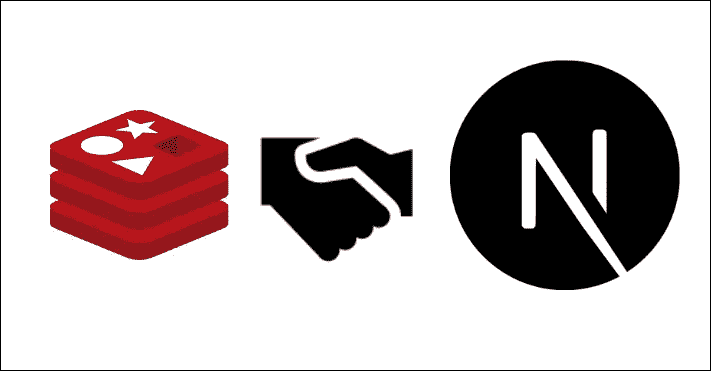
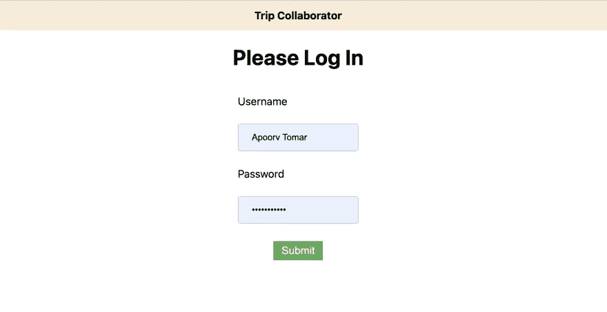
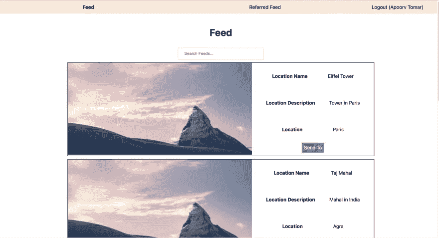
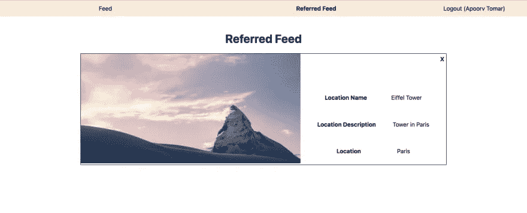
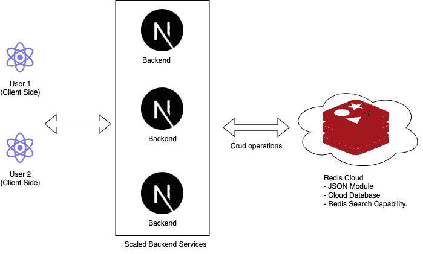
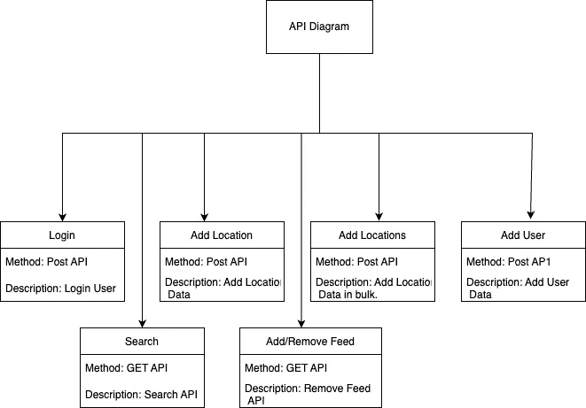
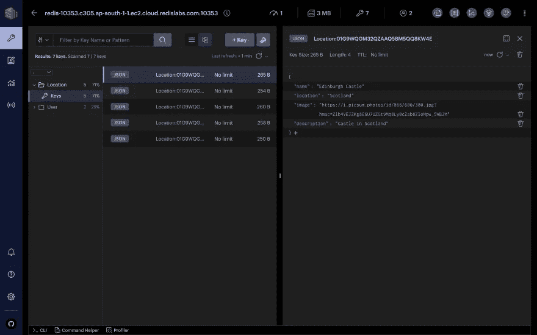
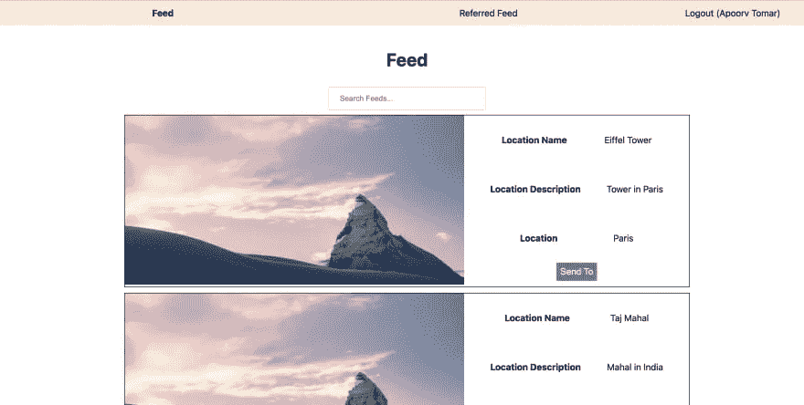

# Trip Collaborator |技术博客。

> 原文：<https://medium.com/geekculture/trip-collaborator-technical-blog-681ef8ac8ae0?source=collection_archive---------16----------------------->

使用 Nextjs 和 Redis 构建产品。

# 关于项目。

Trip Collaborator 是一个应用程序，它将帮助解决朋友、家人和亲戚之间预订旅行的最大问题。



# 问题陈述。

当我们计划下一次旅行时，通常我们脑海中会有很多地方。我们可以从各种平台上得到这些建议，但是管理这些建议有点让人担心。

Trip Collaborator 背后思想是使拥挤变得更容易，两个用户应该能够容易地共享位置。除此之外，还有各种功能可以实现。

我将在范围部分添加这个项目可以扩展的范围。如果有人感兴趣，可以提交拉请求。

# 应用程序的屏幕截图

## 登录页面



## 订阅源主页



## 推荐源主页



# 提交类别

平均/MERN 小牛队

# 使用的语言

## 前端:

JavaScript，React，fetch(ajax)，Redis-OM，sass，lodash

## 后端:

JavaScript，Next.js，Redis-OM

## 实用工具

Redis-insight

# 部署的链接

## 使用的部署服务: [Vercel](https://vercel.com/)

[行程合作者](https://collaborator-two.vercel.app/internal/Feeds)

## **用户登录/密码:**

**用户 1** : Apoorv(用户名)/Apoorv(密码)
**用户 2** : Apoorv Tomar(用户名)/ ApoorvTomar(密码)

# 架构图

## 整体架构图


## 流程图



## API 图



# 我的项目的视频讲解

# 链接到代码

[](https://github.com/apoorvtomar2222/trip-collaborator) [## GitHub-apoorvtomar 2222/trip-collaborator:这个项目是一个原型，用于制作一个系统…

### 这个项目是一个原型，制作一个系统，用于同行决定他们的下一次旅行。- GitHub …

github.com](https://github.com/apoorvtomar2222/trip-collaborator) 

# 它是如何工作的？

## 存储数据

我们用 Redis 作为我们的数据库。Redis 支持各种数据类型，但是我们将把数据存储为 JSON。这将帮助我们复制当今最常见的非 SQL 数据库，即 MongoDB。

Redis 中的数据有两种模式，如下所示。一个用于位置，另一个用于用户。

## 位置模式

```
Location,
    {
        name: { type: 'string' },
        location: { type: 'string' },
        image: { type: 'string' },
        description: { type: 'text', textSearch: true },
    }
```

## 用户模式

```
User,
    {
        name: { type: 'string' },
        password: { type: 'string' },
        relatedItems: { type: 'string[]' }
    }
```

因为我们使用 Redis-om 来存储数据，所以我们必须创建一个存储库来帮助我们创建用于存储数据的实体。
以下是将数据保存在一个位置的方法

```
export async function addLocation(data) {
    await connect();
    const repository = client.fetchRepository(schema)
    const car = repository.createEntity(data);
    const id = await repository.save(car);
    return id;
}
```

下面是 Redis Insight 的截图，这是一个 UI 工具，提供了跟踪存储数据的界面。



# 读取数据

现在，一旦我们成功地将数据存储在 Redis 云数据库中。是时候查询数据了。

我们已经使用以下命令获取了数据。我们将要讨论的是搜索功能，它可以在 feed 页面上找到，如下图所示。



```
export async function searchLocation(q) {
    await connect(); const repository = new Repository(schema, client);
    let locations;
    if (q) {
        locations = await repository.search()
            .where('name').eq(q)
            .or('location').eq(q)
            .or('description').matches(q)
            .return.all(); } else {
        locations = await repository.search().return.all();
    } return locations;
}
```

在这里，您会发现我们使用了提供的搜索功能。为了过滤数据，我们有 where 和 or 函数，我们可以在其中提供我们的条件。

# 关于作者

Apoorv Tomar 是一名软件开发人员，也是 Mindroast 的一员。你可以在[推特](https://twitter.com/apoorvtomar_)、 [Linkedin](https://www.linkedin.com/in/apoorvtomar/) 、[电报](https://t.me/ApoorvTomar)和 [Instagram](https://www.instagram.com/apoorvsinghtomar/) 上和他联系。订阅[简讯](https://www.mindroast.com/newsletter)获取最新策划内容。不要犹豫在任何平台上说“你好”,只需说明你在哪里找到我的资料