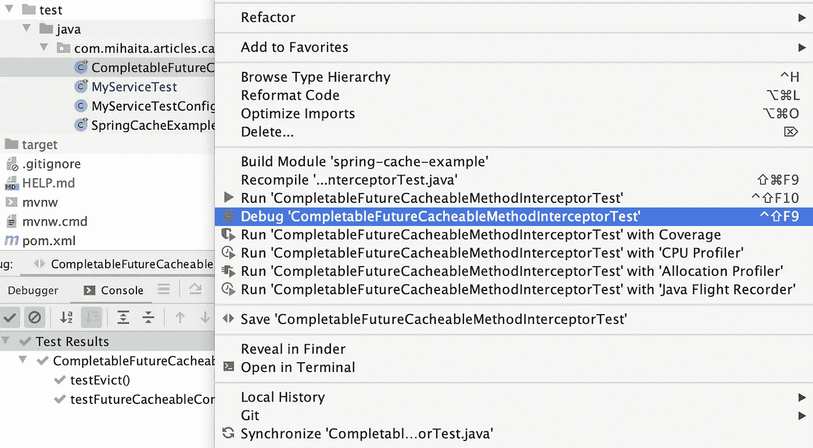
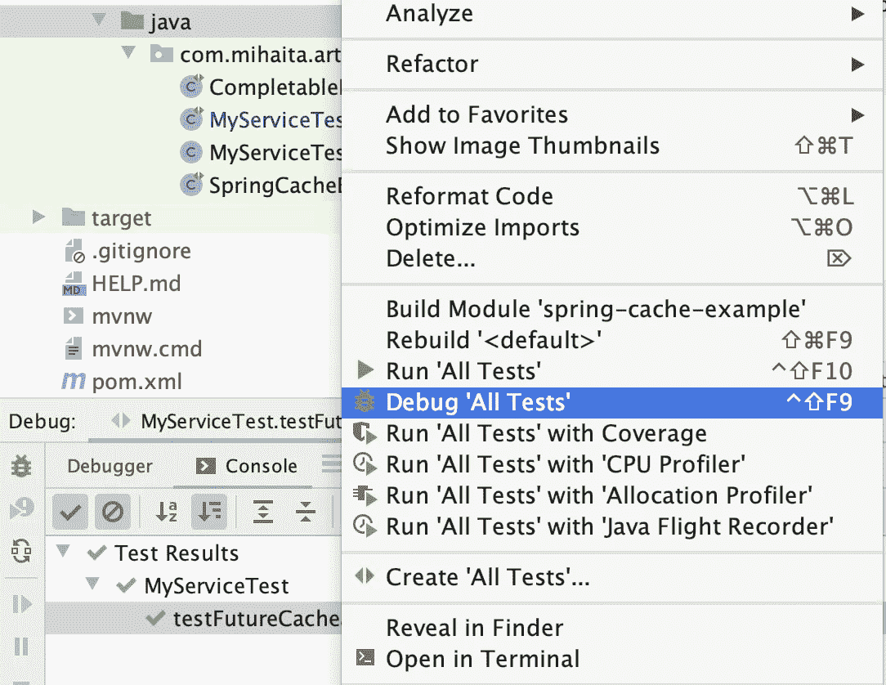
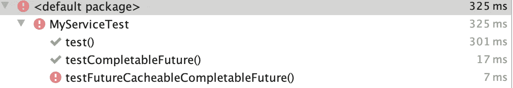
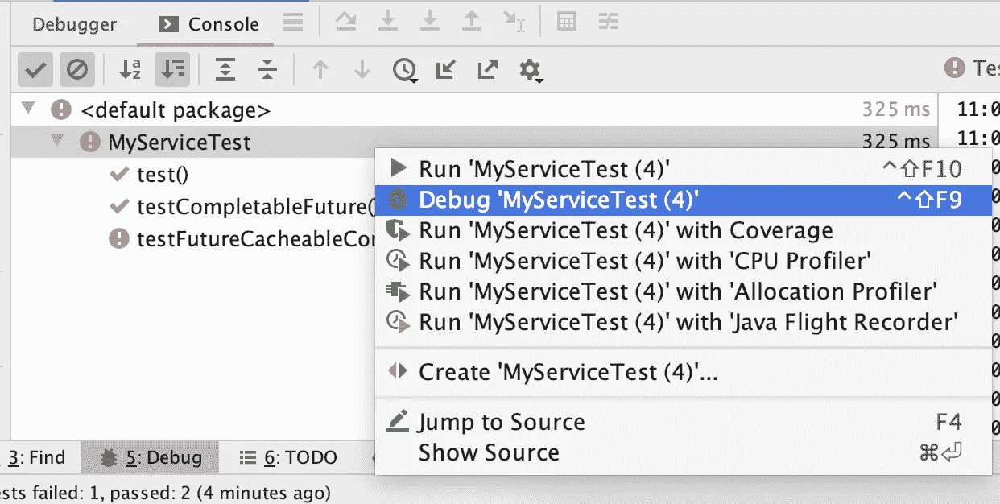
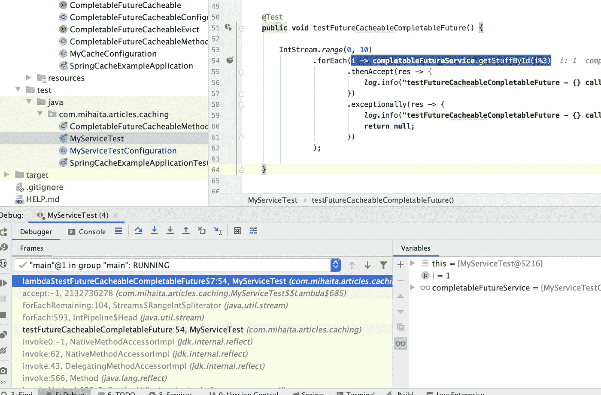
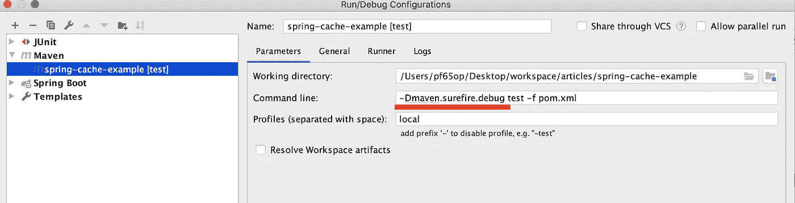
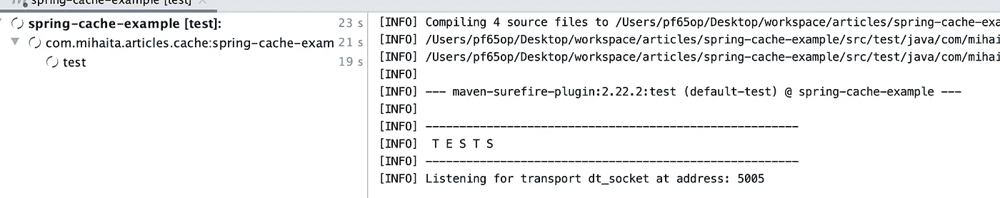
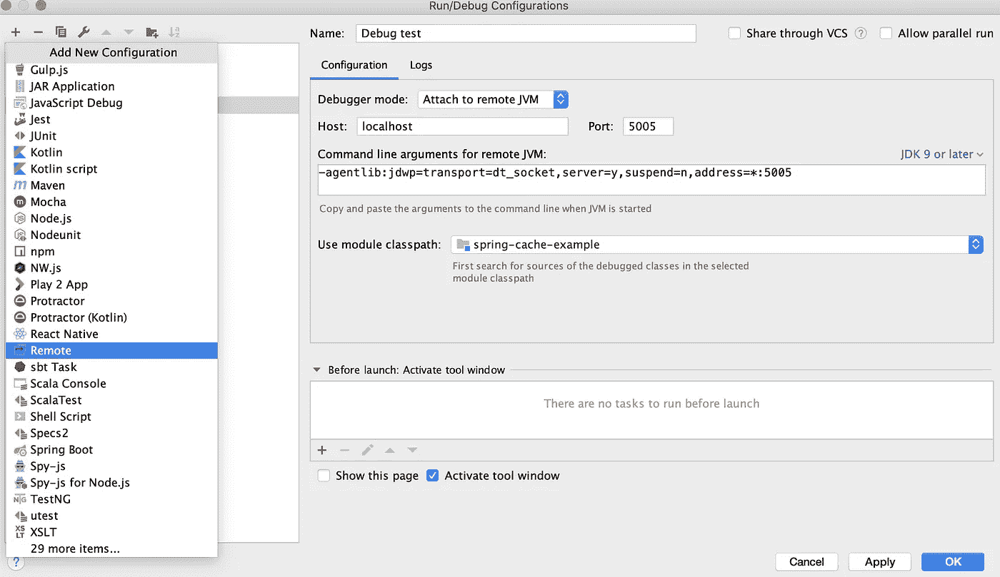
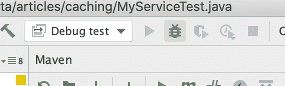
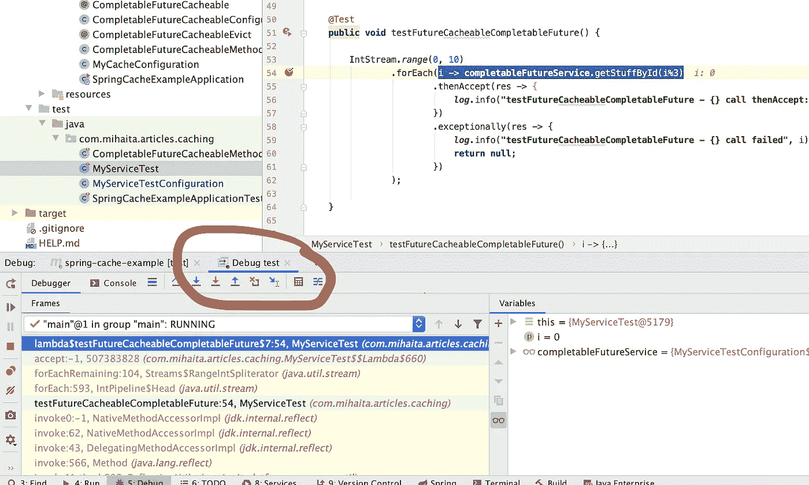

# 从 IDE 中对 maven 测试目标进行故障排除

> 原文：<https://medium.com/geekculture/troubleshoot-maven-test-goal-from-your-ide-4a4421bef4d5?source=collection_archive---------17----------------------->

您的 *Java* 测试有时可能会因为不同的原因而失败。最烦人也是最具挑战性的情况发生了，当你一个接一个地运行它们时，它们运行得很好，但是当它们一起运行时，它们就失败了:



在这个受我之前的 帖子启发的虚拟场景中，第三个测试只有在与其他测试一起运行时才会失败。



这并不困难，因为我们可以很容易地激活一个断点，在错误发生之前停止测试执行。要调试测试套件，右击并选择*调试*而不是*运行*



当一个断点被激活时，你可以对程序的执行进行充分的控制:你可以看到堆栈，探索变量，甚至计算表达式。



在你的 IDE 中通常有一些快捷方式(Mac: option + F8)可以打开一个编辑器，在这里你可以键入你需要进行故障诊断的 java 代码。


在这种情况下，我们可以看到我们的 *getStuffById* 方法正在返回其他内容(不是 *CompletableFuture* 实例),因为为此方法定义了一个错误的缓存。之前运行的测试使用相同的缓存来存储相同键的结果。这种情况打破了独立运行测试的规则，我们可以通过使用每个方法一个缓存来解决这个问题(你不应该使用同一个桶来存储梨和苹果)

希望您能在您的管道中自动运行您的测试。默认情况下，在进行本地构建时激活断点并不容易(在我的情况下 ***mvn install*** 但也可以是其他东西) **:**

*   如果你正在使用[*maven-surefire-plugin*](https://maven.apache.org/surefire/maven-surefire-plugin/examples/debugging.html)*你可以告诉 maven 在运行测试时等待一个代理连接:*

```
*mvn -Dmaven.surefire.debug test*
```

*在您的 IDE 中，编辑您的运行配置以添加以下 JVM 参数:*

**

*现在，测试正在等待您的调试器连接:*

**

*您需要创建一个新的*运行配置*来连接调试器:*

**

*按下 lady bug 会打开一个新的控制台:*

**

*我们前面的断点以同样的方式工作。主要的区别是我们使用 *mvn test* 来执行所有的测试。*

**

*在现实世界中拥有这种特性非常有帮助，因为通常有数百个测试在您的管道中运行，只有当它们一起运行时，才可能很难猜测是什么导致它们失败。经常运行您的测试也是一个好主意，这有助于您在代码库发生少量更改后识别问题。*